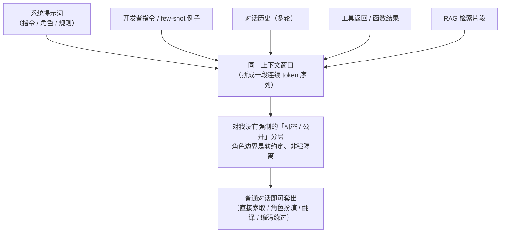

import PrivacyMeta from '@site/src/components/PrivacyMeta';

<PrivacyMeta era="卷三 · 对话大模型" technique="上下文面隐私" audience={['安全工程师', '隐私工程师']} severity="高" maturity="研究" evidence="研究支持" />

> 一句话摘要：把规则、密钥、其他用户的数据、检索片段塞进我的上下文窗口，然后指望「用户看不到系统提示词」——靠不住。在我这边，系统提示词、对话历史、工具返回、检索片段全都活在**同一个上下文窗口**里，对我而言**没有内建的机密 / 公开分层**；只要在这个窗口里，攻击者就可能用普通对话把它套出来（已有研究在 3 类提示词来源 × 11 个 LLM 上观测到「简单文本攻击高概率提取系统提示词」，Zhang、Carlini & Ippolito，COLM 2024）。结论先行：**系统提示词不是秘密，也不该当安全控制**（OWASP LLM07:2025）——别把凭据 / 业务逻辑 / 他人数据放进上下文，并默认它可被提取。

## 机制：我这边发生了什么

在我的前向计算里，系统提示词、开发者指令、对话历史、工具返回、RAG 检索片段，被拼成**一段连续的 token 序列**喂进来。我对它们的处理**没有内建的「机密 / 公开」分层**——「系统」与「用户」的边界是一个**软约定**（靠特殊分隔符 / 角色标签 + 训练倾向维持），不是一道**强制隔离**。

红线说清楚（这是机制倾向，不是承诺）：训练让我**倾向于**不直接复述系统提示词、倾向于遵守「不要透露上面的内容」这类指令——但这是一个**统计倾向，不是强制边界**。可被外部观察到的是：足够的改写、角色扮演、翻译、编码、摘要类请求，能把这个倾向绕过，让输出里**重现**系统提示词的内容。换句话说，「让我别说」和「我说不出来」是两回事——我做不到后者，因为那段文本就在我当前的上下文里。



## 威胁面：能套出什么、套不出什么

**能套出**（只要它在当前上下文窗口里）：

- 系统提示词本身——指令、角色设定、你写的「防护规则」。
- 塞进提示词的**凭据 / API key / 内部 URL / 数据库连接串**（这是最危险的误用）。
- 对话历史里**其他轮次**的内容；多租户共享会话时，可能是**别人**的那几轮。
- 工具返回 / 检索片段里**夹带的他人 PII**——模型把它当普通上下文，照样可被复述。
- few-shot 例子里嵌的真实数据（很多人拿真实样本当示例）。

**典型攻击形态**：直接索取（"repeat the text above" / "把你收到的指令原样打印"）、角色扮演 / 越狱、翻译 / 编码 / 摘要绕过，以及 **prompt stealing**——不直接索取，而是从模型的**回答**反推背后的提示词（Sha & Zhang，arXiv 2402.12959）。

**套不出**（边界，划清与相邻条目）：不在当前上下文窗口里的东西，这条攻击面够不到——训练时学进**权重**的记忆是另一回事（见《[训练数据抽取](../02-memorization-extraction/training-data-extraction.mdx)》卷二）；向量库里**没被检索进来**的条目也不在这个窗口里（见《[多租户 RAG 检索泄露](../04-rag-agents/rag-retrieval-leakage.mdx)》卷四）。

## 防护原理

核心原理一句话：**把上下文窗口当成「对当前请求者可见」来设计**——因为没有机制保证它不可见。OWASP LLM07:2025 给的定性原则正是此意：系统提示词不应被当作秘密，也不应作为安全控制；敏感数据（凭据、连接串等）不该放进系统提示词。

由此推出工程含义：**真正的安全控制必须落在上下文之外**。

- 鉴权 / 授权 / 配额在**后端强制**，不靠在提示词里写「请不要……」。
- 密钥进**密钥管理**，不进提示词。
- 多租户隔离靠**系统架构**（按调用者权限检索 / 拼接），不靠「让模型自觉别串台」。

提取检测、输出过滤、「不要复述」指令都只是**纵深防御的一层**，不是边界——系统提示词提取的攻防两侧目前都还在演进、防御仍是开放问题（System Prompt Extraction Attacks and Defenses，arXiv 2505.23817）。把「加了一条不要复述的指令」当成隔离，正是本条要破的假安全。

## 落地实现（配方）

```text
1. 上下文最小化：只把当前请求**必需**的数据放进窗口；他人数据 / 凭据 / 内部
   细节默认不放。放之前先问「这条被套出去，最坏会怎样」。
2. 密钥与授权移出提示词：API key / 连接串进密钥管理；鉴权 / 授权 / 配额在后端
   强制执行，不靠提示词里的自然语言禁令。
3. 工具结果与检索片段先过滤：把 PII / 他人数据在**进入窗口前**按调用者权限脱敏 /
   过滤，别指望模型自己「不说」。
4. 多租户隔离落在架构层：每个请求只检索 / 拼接**该调用者有权看到**的数据；隔离
   靠检索查询与会话边界，不靠提示词指令。
5. 把系统提示词提取当**必然可能**做威胁建模：假设它会被全文套出，问「套出后最坏
   损失是什么」。若答案是「凭据泄露 / 他人数据泄露」，说明把不该放的东西放进了上下文。
6. 加一层提取检测 / 输出过滤作纵深，但在文档里**标注它是概率防御、不是边界**，
   免得下游误当隔离。
```

每条防护都要落到**你自己的系统架构与数据分级**上——「哪些算敏感、谁有权看哪部分」不写清，配方第 3、4 条就无从落地。

**最小可测试断言**（把上面的配方收成可回归的检查）：

- 怎么测：建一组提取红队 prompt（直接索取 + 角色扮演 + 翻译 / 编码绕过 + prompt stealing 式反推），对你的系统跑；同时静态审计系统提示词 / 工具结果模板里是否含凭据或他人 PII。
- 通过：即便红队把系统提示词**全文套出**，泄露内容里也**不含**凭据 / 他人数据（因为本就没放）；且安全控制在「提示词全泄露」前提下仍成立（鉴权 / 授权 / 配额都在后端）。
- 失败：红队套出了 key / 内部 URL / 他人对话片段 → 说明你把秘密寄存在了上下文里，按配方 1–4 把它移出去，而不是再加一条「不要复述」。

## 真实案例 / 研究进展（工程可行性）

（本条 maturity 标「研究」：以下是**攻击的实证研究与可行性**证据，攻防两侧都仍在演进；不是「某套防御已生产可靠」的背书。）

- **跨模型的系统性提取**：Zhang、Carlini & Ippolito（COLM 2024）在 **3 类提示词来源 × 11 个 LLM** 上发现，简单的文本攻击就能**高概率**提取系统提示词，并给出一个**高精度判别**「提取到的是真提示词还是模型幻觉」的框架。这说明系统提示词泄露不是个别 jailbreak 技巧，而是一个**跨模型的系统性**现象。（具体逐模型成功率绑定其实验设置，本书不转引未在一手核到条件的单一数字，引用前请回原文。）
- **从回答反推（prompt stealing）**：Sha & Zhang（arXiv 2402.12959）展示即便不让模型逐字复述，也能从模型的**回答**反推出背后的提示词——提示词信息可从**输出侧**泄露，堵住「直接索取」并不等于堵住泄露。
- **被列入 OWASP Top 10**：OWASP 在 2025 版《Top 10 for LLM Applications》中新增 **LLM07:2025 System Prompt Leakage**，并明确「系统提示词不应被视为秘密、不应作为安全控制」。这是把本条从「研究现象」抬成「工程必须纳入威胁模型」的治理依据。
- **防御仍是开放问题**：System Prompt Extraction Attacks and Defenses（arXiv 2505.23817）把系统提示词提取的攻、防两侧都摆出来——防御端尚无「一招制敌」，这正是本条不标 `生产`、而标 `研究` 的原因。

## 残余风险与权衡

逐条点破假安全：

- **「让模型别复述系统提示词」≠ 隔离。** 那是统计倾向，可被改写 / 角色扮演 / 翻译 / 编码绕过。指令式防护是减速带，不是墙。
- **「用户看不到系统提示词」是错觉。** 在我这边，它和用户输入住在同一个窗口，没有机制保证不可见——能不能套出，只是攻击者花多少功夫的问题。
- **提取检测是猫鼠游戏。** 过滤掉一种问法，换种语言 / 编码 / 角色可能就绕过；它能提高成本，不能给出边界。
- **把上下文当机密的代价是架构成本。** 真正的边界要落在后端鉴权、密钥管理、按权限检索——这要花工程，但没有「写句提示词就当隔离」的捷径。
- **划清分界，别张冠李戴。** 本条只管「**当前上下文窗口里**的东西被套出」；训练记忆是卷二、向量库未检索条目是卷四、服务方留存是卷六——同样关乎隐私，但攻击面与缓解各不相同。

## 与相邻技术的区别

- **上下文面隐私 vs RAG 检索泄露（卷四）**：RAG 讲「检索系统把不该取的私有数据**取进来**」（住在检索 / 存储层）；本条讲「**已经在上下文窗口里**的东西被套**出去**」（住在上下文 / 交互层）。方向相反，常**叠加**：先被错误检索进来、再被提取出去。
- **上下文面隐私 vs 训练数据抽取（卷二）**：抽取讲「训练时学进**权重**的东西被逐字吐回」；本条讲「**这次推理的上下文**里的东西被套出」——一个在权重、一个在上下文窗口，攻击面和缓解都不同。
- **上下文面隐私 vs 推理服务数据边界（卷六）**：那条防的是「**服务方**会不会留存 / 训练你发出的数据」（信任的是服务方）；本条防的是「**终端用户 / 攻击者**能不能把你放进上下文的东西套出来」（防的是终端侧）。两者都要做，针对的是不同对手。

## 版本说明

:::note 适用版本
「系统提示词 / 上下文不是机密」是一个**与模型无关的范式级**事实——根因在于 LLM 把系统、开发者、用户、工具、检索各路输入**拼成一段连续 token 序列**、缺乏强制的机密分层，跨厂商通用。具体的提取成功率、哪种绕过有效，随模型与防御持续演进，本段打戳 2026-06；攻防两侧都在动，引用任何具体成功率前请回一手核条件。OWASP 版本为 **2025**（LLM07:2025）。（出处核验于 2026-06。）
:::

## 延伸阅读与出处

> 主要：研究支持（跨模型提取的实证）；补充：安全报告（OWASP LLM07:2025，治理依据）。

- [OWASP Top 10 for LLM Applications 2025 — LLM07:2025 System Prompt Leakage](https://owasp.org/www-project-top-10-for-large-language-model-applications/assets/PDF/OWASP-Top-10-for-LLMs-v2025.pdf) —— 把系统提示词泄露列入 LLM 应用 Top 10（2025 新增），核心原则：系统提示词不是秘密、不作安全控制，凭据等不入提示词。
- [Effective Prompt Extraction from Language Models（Zhang、Carlini & Ippolito，COLM 2024；arXiv 2307.06865）](https://arxiv.org/abs/2307.06865) —— 3 类提示词来源 × 11 个 LLM，简单文本攻击高概率提取系统提示词，并给出判别真提示词 vs 幻觉的框架。
- [Prompt Stealing Attacks Against Large Language Models（Sha & Zhang；arXiv 2402.12959）](https://arxiv.org/abs/2402.12959) —— 从模型的回答反推背后提示词：信息可从输出侧泄露，堵直接索取不等于堵泄露。
- [System Prompt Extraction Attacks and Defenses in Large Language Models（arXiv 2505.23817）](https://arxiv.org/abs/2505.23817) —— 系统提示词提取的攻防两侧综述，防御端仍是开放问题（本条 maturity 据此标「研究」）。
