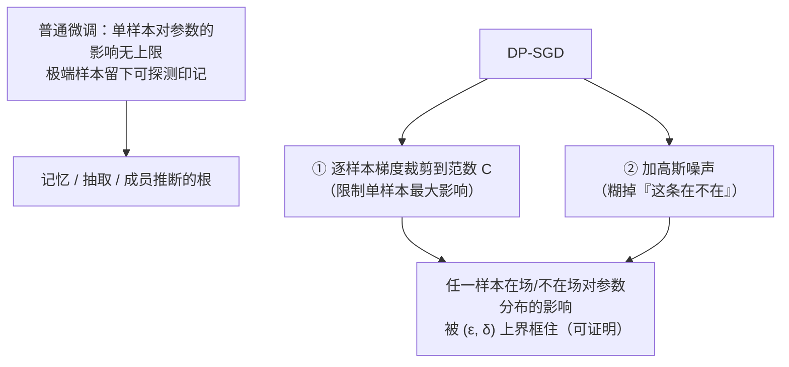

import PrivacyMeta from '@site/src/components/PrivacyMeta';

<PrivacyMeta era="卷三 · 对话大模型" technique="差分隐私" audience={['隐私工程师', 'ML 工程师']} severity="中" maturity="试验" evidence="研究支持" />

> 一句话摘要：拿敏感数据微调我、再指望「它自然就不会泄露」，靠不住——那正是记忆与抽取的来源。差分隐私微调（DP-SGD：裁剪单样本梯度 + 加噪）给的是一条**可证明**的性质：把任一条样本对我参数的影响框进一个 (ε, δ) 上界，从而压低它被逐字复现、被成员推断的概率。但记住两件事：**ε 不为零**——它是「限制泄露」不是「零泄露」；而且**越私密、效用通常越低**。别把「加了 DP」当成「私密」，要看 ε 是多少、保护的是样本还是用户。

## 机制：我这边发生了什么

普通微调里，单独一条样本能在多大程度上「拽动」我的参数，**没有差分隐私意义上的统一上界**——实际训练当然有学习率、梯度裁剪、数值范围这些工程限制，但那不是可证明的隐私上界；一条够极端、够独特的样本，仍可能在我身上留下一个**外部可探测的印记**（这正是记忆、抽取、成员推断共同的根）。

DP-SGD（Abadi et al., CCS 2016）改两件事：

1. **逐样本梯度裁剪**：把每条样本贡献的梯度，按范数裁到一个上限 C——给「单样本最大影响」装了个天花板。
2. **加高斯噪声**：在裁剪后的梯度和上再加噪——把「这条样本到底在不在这一批里」糊掉。

结果是一条可证明的性质：任一条样本**在场 / 不在场**，对我最终参数分布的影响被一个 (ε, δ) 上界框住。注意红线：这**不是**「DP 让我忘了它」——我无法内省这个。可被外部论证的是：**在定义的邻接关系、隐私单位与会计假设内，训练后从我的参数或输出里区分『训练时有没有这条样本』，攻击者能多拿到的信息被 (ε, δ) 上界限制住**——但实际攻击风险还取决于先验、查询方式、组合次数，以及隐私单位是否与你要保护的对象匹配。



## 威胁面：DP 防什么、不防什么

DP 直接削弱的是**单样本可区分性**——成员推断（某人在不在微调集里）、单样本记忆与逐字抽取。攻击者哪怕能查询输出、甚至拿到权重，他能在「区分某条样本是否参与训练」上拿到的优势，也被预算卡住。

但它有明确的边界，**不防**这些：

- **预算外的旁路**：DP 只保护「进入 DP-SGD 训练的那部分」。prompt、RAG 检索库、日志、缓存里的明文私有数据，统统不在这条边界内。
- **ε 设得太大**：ε 是连续的；ε 取到很大时，那个「上界」松到形同虚设——「技术上用了 DP」不代表「实际私密」。
- **隐私单位错配**：样本级 DP 保护的是「单条样本」；要保护「一个用户的全部数据」得做用户级 DP。把样本级当用户级用，是常见的假安全。

## 防护原理

(ε, δ)-差分隐私的定义：对两个**相邻**数据集（差恰好一条样本），机制输出落在任意集合里的概率之比被 e^ε 框住，外加一个 δ 的松弛项。直觉上——你这条数据在不在，几乎不改变我「长成什么样」的分布，所以攻击者很难从我身上反推你在不在。

工程上靠两块拼出来：**裁剪 + 加噪**给出单步的隐私损失，**隐私会计**把多步训练累加成总预算——Abadi 等提出的 moments accountant（矩会计）让这个累加比朴素组合定理紧得多，从而在同样隐私下少加很多噪声、保住更多效用（Abadi et al., 2016）。点破：**ε 是预算不是开关，δ 是允许「翻车」的小概率，隐私单位决定保护谁**——这三样不写清楚，「DP」二字没有意义。

## 落地实现（配方）

```text
1. 先定隐私单位：保护单样本还是单用户？用户级要按用户分组裁剪/加噪，别默认样本级。
2. 用成熟库做 DP-SGD（如 Opacus）：设 clipping norm C、noise multiplier σ、
   采样率 q、步数 T，用隐私会计（moments/RDP accountant）反推出 (ε, δ)。
3. 用大预训练模型 + DP 专用超参：朴素 DP-SGD 在 NLP 上掉点严重，但换大模型、
   配 DP 适配的超参（更大 batch、特定学习率）、用对齐预训练的微调目标，可在
   同等隐私预算下显著拉回效用（Li et al., ICLR 2022）。
4. 省内存：用 ghost clipping 避免实例化每条样本的梯度（Li 2022）；或上参数高效
   微调（LoRA/adapter）+ DP，常在效用/隐私/算力三者上同时更优（Yu et al., ICLR 2022）。
   注意：参数高效本身不等于隐私——只有裁剪 + 加噪 + 隐私会计 + 隐私单位齐全才构成 DP；
   LoRA/adapter 只是省算力的载体，不是隐私技术。
5. 报告时给全字段：ε、δ、隐私单位、会计方法、效用指标——别只写「已加 DP」。
```

每个数字（C、σ、最终 ε）落地都要带上**你自己的数据与模型条件**；论文里的取值未必迁得到你的场景。

## 真实案例 / 生产部署

（本条 maturity 标「试验」：以下是**研究进展与工程可行性**证据，不是「DP 微调已大规模生产部署」的背书；生产级 DP / 联邦部署见卷五。）

DP 微调有过一段「名声不好」的时期：直接把 DP-SGD 套到 NLP 上，效用掉得多、算力还贵，于是被认为「不实用」。2022 年的两篇工作是转折点：Li 等证明**大预训练语言模型可以是「强差分隐私学习者」**——配上 DP 专用超参与 ghost clipping，在同等隐私预算下超过当时最好的 DP 模型（Li et al., ICLR 2022）；Yu 等则把**参数高效微调**（如 LoRA / adapter）与 DP 结合，在效用、隐私、算力 / 内存三个维度上同时改进（Yu et al., ICLR 2022）。它们印证的不是「DP 微调已经零成本」，而是「**在合理的 ε 下，DP 微调的效用代价已经从『不可用』降到『可工程权衡』**」。（更大规模的生产级 DP / 联邦部署，如 Gboard 的 DP-FTRL，属联邦学习，留卷五。）

## 残余风险与权衡

逐条点破假安全：

- **ε 不为零。** DP 给的是「单样本影响有界」，不是「绝不泄露」。ε=1 与 ε=100 是天差地别的两件事——只说「加了 DP」、不报 ε，等于没说。
- **效用 - 隐私是真实代价。** ε 收得越紧，加的噪声越多，模型越可能掉点。这是要明账算的取舍，不是免费的安全。
- **「formal DP」≠「privacy-inspired」。** 真做了裁剪 + 加噪 + 隐私会计，才有形式保证；只是「加了点噪声」却不算预算，不构成 DP，别混为一谈。
- **DP 只盖训练边界内。** 模型权重私密了，但同一条数据若还躺在 prompt、RAG 库、日志里，照样泄。DP 不是整个系统的隐私，只是训练这一段的。
- **隐私单位别错配。** 保护「用户」却只做了「样本级」，在用户有多条数据时保证会被稀释。

## 合规映射

- **GDPR / 数据最小化**：DP 提供**可量化**的隐私保证，利于做 DPIA（数据保护影响评估）和「我们已尽技术措施」的论证。但 DP **不自动满足被遗忘权**——「限制单样本影响」不等于「删除了某条数据」（真删除 / 遗忘见卷五）。
- **NIST**：SP 800-226（DP 指南）给了 DP 工程化的术语与评估口径，可作为「ε 取值是否合理、会计是否可信」的对照系。

（合规随法条 / 标准版本演进，本段打戳 2026-06，引用前核对最新文本。）

## 与相邻技术的区别

- **DP 微调 vs 训练数据去重**：去重降低记忆但**没有形式保证**（罕见单样本仍可能被抽，见《[训练数据抽取](../02-memorization-extraction/training-data-extraction.mdx)》）；DP 给**形式上界**但有效用代价。二者常叠加用：先去重压基线、再用 DP 兜形式保证。
- **DP vs 机器遗忘**：DP 是**事前预防**（训练时就限制单样本影响）；机器遗忘是**事后删除**（已训完，再设法抹掉某条的影响）。目标都关乎「单样本」，但一个在前、一个在后（遗忘见卷五）。

## 版本说明

:::note 适用版本
DP-SGD 的算法骨架（裁剪 + 加噪 + 矩会计）自 2016 年（Abadi, CCS）确立，是**与模型无关**的训练机制，跨厂商通用。把它在大语言模型微调上做到「效用可接受」则是 2022 年前后的进展（Li / Yu, ICLR 2022），并随 Opacus 等库持续工程化。**注意**：论文里的 ε 取值与效用结论绑定特定模型、数据、任务，不能直接迁移；落地必须用你自己的隐私会计重新算。（出处核验于 2026-06。）
:::

## 延伸阅读与出处

- [Deep Learning with Differential Privacy（Abadi 等，ACM CCS 2016；arXiv 1607.00133）](https://arxiv.org/abs/1607.00133) —— DP-SGD 奠基：逐样本裁剪 + 高斯噪声给出 (ε, δ)-DP，moments accountant 紧化多步预算。
- [Large Language Models Can Be Strong Differentially Private Learners（Li 等，ICLR 2022；arXiv 2110.05679）](https://arxiv.org/abs/2110.05679) —— 大预训练模型 + DP 专用超参 + ghost clipping，在同等隐私预算下超过此前最好的 DP 模型。
- [Differentially Private Fine-tuning of Language Models（Yu 等，ICLR 2022；arXiv 2110.06500）](https://arxiv.org/abs/2110.06500) —— 参数高效微调（LoRA / adapter）与 DP 结合，在效用 / 隐私 / 算力三维同时改进。
