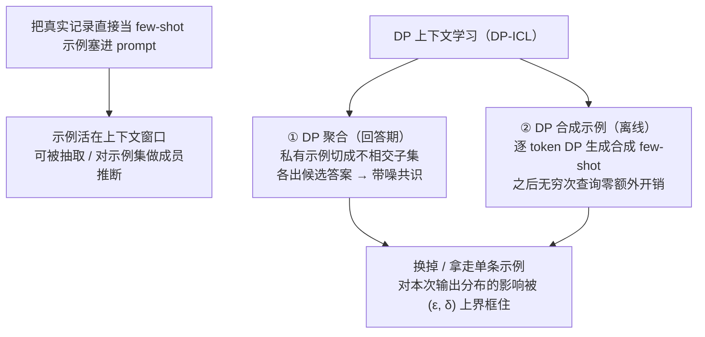

import PrivacyMeta from '@site/src/components/PrivacyMeta';

<PrivacyMeta era="卷三 · 对话大模型" technique="差分隐私" audience={['隐私工程师', 'ML 工程师']} severity="中" maturity="试验" evidence="研究支持" />

> 一句话摘要：为了让我「照着格式来」，你把几条真实客户记录当 few-shot 示例贴进 prompt——这些私有示例可以被抽取、被成员推断（判定某条记录是否在示例集里）。DP 上下文学习（DP-ICL）不去改权重，而是**把差分隐私上到 prompt 里的私有示例**：要么把私有示例切成不相交的子集、对我在各子集上的输出做**带噪聚合**再回答，要么用私有数据**生成一批带 (ε, δ) 保证的合成示例**去替换真示例。它能框住的，是**单条私有示例对答案的影响**——不是我在内省 prompt。两条边界先记住：**它保护示例、不保护 query 本身**；而且 **ε 不为零**、聚合外的旁路照漏。

## 机制：我这边发生了什么

你把真实记录直接塞进 prompt 当 few-shot 示例时，那几条私有示例就**活在我当前的上下文窗口里**——和系统提示词、对话历史一样，对我没有内建的「机密 / 公开」分层（见《[上下文面隐私](./context-surface-privacy.mdx)》）。可被外部观察到的后果是：攻击者能用普通对话把示例内容**套出来**，或者在多次查询里**逼近**「某条记录到底在不在示例集里」——也就是对**示例集**做成员推断。原始私有示例进 prompt，泄露面就是这么开的。

DP-ICL 换一条路：**不把原始私有示例喂进面向用户的那次回答**，而是让单条示例对最终输出的影响被差分隐私框住。两种主流做法：

1. **DP 聚合（回答期）**：把私有示例划成**不相交的子集**，每个子集各自作为 few-shot 拼进 prompt、让我分别产出一个候选答案，再对这一组答案做**带噪的共识聚合**——分类任务用 Gaussian Report-Noisy-Max 这类机制私有地选标签，生成任务在嵌入 / 关键词层面带噪聚合（Wu et al., ICLR 2024）。任一条示例只落在一个子集里，改动它至多改动一个候选答案，噪声把这点差异糊掉。
2. **DP 合成示例（离线生成）**：先用私有数据**逐 token 生成**一批合成 few-shot 示例——在不相交子集上跑推理、对每一步的 token 分布做 DP 带噪聚合——产出带 (ε, δ) 保证的合成示例；之后拿**合成示例**当 demonstration 回答无穷多次查询，**不再增加隐私开销**（Tang et al., ICLR 2024）。

红线说清楚（这是机制倾向，不是内省承诺）：DP-ICL **不是**「我读了 prompt、决定不泄露示例」——我做不到可靠地内省 prompt 里哪条是敏感的。可被外部论证的是：**在定义的邻接关系与隐私会计假设内，把某条私有示例从示例集里换掉 / 拿走，对我这次输出分布的影响被一个 (ε, δ) 上界框住**——于是攻击者在「区分某条记录是否进了示例集」上能多拿到的优势，被预算限制住。约束的对象是**输出对单条示例的敏感度**，靠子集划分 + 带噪聚合实现，不是靠我「守口如瓶」。



## 威胁面：DP-ICL 防什么、不防什么

DP-ICL 直接削弱的是**单条私有示例的可区分性**：对**示例集**的成员推断（某条记录是否被放进了 few-shot）、以及从回答里逐字抽取某条示例。攻击者哪怕能反复查询、观察输出，他在「区分某条示例是否进了示例集」上拿到的优势，被隐私预算卡住。

但它有明确边界，**不防**这些：

- **query 本身不在保护范围内。** DP-ICL 框的是**私有示例（demonstration）**对输出的影响；用户当次提问里带的敏感内容，不受这条 (ε, δ) 保护——那是另一个攻击面（上下文面隐私 / 推理服务留存）。
- **ε 设得太大。** ε 是连续的；取到很大时那个「上界」松到形同虚设，「技术上用了 DP-ICL」不代表「实际私密」。
- **聚合外的旁路。** DP 只保护「进入 DP 聚合 / DP 生成的那部分示例」。你若又把原始记录塞进系统提示词、RAG 检索片段、日志或缓存，那些明文照漏——DP-ICL 不覆盖它们。
- **效用代价。** 切子集、加噪会**折损效用**；子集越多、噪声越强，单条答案质量通常越降。这是要明账算的取舍，不是免费的安全。

攻击者模型要写清：本条设想的是**黑盒查询**攻击者（可反复问、观察输出，未必需要 logprobs），成功判定是「对示例集的成员推断优势」或「抽取出某条示例」。把原始示例直接塞 prompt 的泄露实证，见跨模型的系统提示词 / 示例提取研究（Zhang、Carlini & Ippolito，COLM 2024）。

## 防护原理

DP-ICL 是把 (ε, δ)-差分隐私的定义**落到 prompt 示例这个对象上**：相邻数据集不再是「差一条训练样本」，而是「**差一条 few-shot 示例**」；机制不是 DP-SGD 的训练步，而是**面向查询的带噪聚合 / 带噪生成**。直觉照旧——你这条示例在不在示例集里，几乎不改变我这次「答成什么样」的分布，所以攻击者很难从我的回答反推它在不在。

工程上怎么把「单条示例影响有界」拼出来：

- **子集不相交** → 任一条示例只影响一个子集的候选答案，把「单条示例的最大影响」限定住（类比 PATE 的 teacher 划分）。
- **带噪聚合 / 带噪生成** → 在候选答案或 token 分布上加噪，糊掉「这条示例到底在不在这一批」。
- **隐私会计** → 把多步（多次聚合、或生成里逐 token 的多次调用）累加成总预算 (ε, δ)。DP 合成示例的一个好处是：**生成一次、付一次隐私账**，之后拿合成示例服务无穷多查询不再加账（Tang et al., ICLR 2024）；DP 聚合则是**每回答一次消耗一次预算**，查询次数直接吃预算。

点破边界：和 DP 微调一样，**ε 是预算不是开关，δ 是允许「翻车」的小概率，隐私单位（这里是「一条示例」）决定保护谁**。保护对象是「示例级」——若一个人的敏感信息分散在多条示例里，示例级保证会被稀释（同 DP 微调里「样本级当用户级用」的假安全）。

## 落地实现（配方）

```text
1. 先分清保护对象：你要保护的是「prompt 里的私有示例」还是「用户 query」？
   DP-ICL 只管前者；query 侧的敏感内容走上下文面隐私 / 推理服务留存那一套，别混。
2. 选形态：
   - 在线问答、示例常变 → DP 聚合（回答期）：私有示例切成不相交子集，各拼 few-shot
     出候选答案，用 DP 聚合（分类：Gaussian Report-Noisy-Max；生成：嵌入 / 关键词层带噪）。
     注意：每回答一次消耗一次预算，查询量直接吃 ε。
   - 示例可复用、要服务大量查询 → DP 合成示例（离线）：用私有数据逐 token DP 生成一批
     合成 few-shot，之后用合成示例回答无穷多查询、零额外隐私开销（Tang et al., ICLR 2024）。
3. 定隐私单位 + 报全字段：隐私单位=「一条示例」；用隐私会计（RDP / PRV 等）反推出 (ε, δ)，
   报告时给全：ε、δ、隐私单位、子集数 / 聚合机制、效用指标——别只写「已加 DP-ICL」。
4. 报效用代价：给出同任务下的非私有 baseline 与若干 ε 档（如 ε=1 / 3 / 8）的效用曲线，
   让读者看见「私一点、掉多少点」，而不是只报一个乐观数。
5. 对示例集跑成员推断验证：把攻击者对「某条示例是否在集里」的优势压到接近随机，
   才算这条防护真生效（见下「最小可测试断言」）。
```

每个数字（子集数、σ、最终 ε、掉点幅度）落地都要带上**你自己的数据、任务与模型条件**；论文里的取值未必迁得到你的场景，落地必须用你自己的隐私会计重新算。

**最小可测试断言**（把上面的配方收成可回归的检查）：

- 怎么测：① 用独立隐私会计复算报告的 (ε, δ)，核对隐私单位（一条示例）与子集划分 / 聚合配置一致；② 对**示例集**跑成员推断探针——构造「在集 / 不在集」的示例对，用黑盒查询攻击去区分，测攻击者优势（AUC 相对 0.5 的偏离）。
- 通过：(ε, δ) 能被独立复算到同一量级；成员推断优势被压到接近随机（AUC 接近 0.5）；且效用相对非私有 baseline 的掉点在你能接受的预算档内。
- 失败：复算不出 / 缺会计 / 隐私单位错配 → 不算 formal DP，别标「已加 DP-ICL」；成员推断优势仍显著 → ε 太松或聚合 / 子集配置有误，回去收紧预算或重划子集，而不是仅仅「换个说法让模型别复述」。

## 研究进展·工程可行性

（本条 maturity 标「试验」：以下是**研究原型与工程可行性**证据，不是「DP-ICL 已大规模生产部署」的背书。）

- **DP 聚合式 DP-ICL**：Wu 等（ICLR 2024）提出 DP-ICL 范式——对不相交示例子集上的模型输出做**带噪共识聚合**（分类用 Gaussian Report-Noisy-Max，生成用嵌入 / 关键词层聚合），在四个文本分类基准与两个生成任务上评测；其摘要报告，**即便在 ε=1**，聚合结果也能与非私有聚合**具竞争力**（数字绑定其实验设置——具体基准、模型、聚合机制与查询预算，引用前请回原文核对逐项条件）。
- **DP 合成示例式 DP-ICL**：Tang 等（ICLR 2024）用私有数据**逐 token DP 生成**合成 few-shot 示例，产出带形式 DP 保证的合成 demonstration；关键工程性质是**生成一次、付一次隐私账**，之后合成示例可服务无穷多查询而不再增加隐私开销。这把「示例保护」从「每次问答都掏预算」变成「一次性离线成本」，对要服务大量查询的场景更实用。
- **它印证的不是「零成本」**：这两条工作印证的是「**在合理 ε 下，给 prompt 私有示例上 DP 已经从『不可行』降到『可工程权衡』**」，而非「DP-ICL 已零成本、可直接生产」。攻防两侧仍在演进，落地要自己复算 ε 并测成员推断优势。

## 残余风险与权衡

逐条点破假安全：

- **「把真实记录当示例、模型自然不会漏」是错的。** 原始示例进 prompt 就活在上下文窗口里、可被抽取 / 成员推断——DP-ICL 有效，靠的是**改机制**（子集 + 带噪聚合 / DP 生成），不是靠我「守口如瓶」。什么都不做、只把记录塞进去，等于没保护。
- **DP-ICL 只保护示例，不保护 query。** 它框的是**私有 demonstration** 对输出的影响；用户当次提问里的敏感内容不在这条 (ε, δ) 里。别把它当成「整条链路的隐私」。
- **ε 不为零。** 给的是「单条示例影响有界」，不是「绝不泄露」。ε=1 与 ε=100 天差地别——只说「加了 DP-ICL」、不报 ε，等于没说。
- **效用 - 隐私是真实代价。** 切子集、加噪会掉点；预算收得越紧、掉得越多。这是要明账算的取舍。
- **聚合外的旁路照漏。** DP 只盖「进入 DP 聚合 / DP 生成的那部分示例」；同一条记录若还躺在系统提示词、RAG 库、日志里，照样泄。DP-ICL 不是系统级隐私，只是「prompt 私有示例」这一段的。
- **隐私单位别错配。** 保护对象是「一条示例」；一个人的信息若分散在多条示例里，示例级保证会被稀释。

## 与相邻技术的区别

- **DP-ICL vs DP 微调（本卷，同「差分隐私」板块）**：两者都用「(ε, δ) 框住单个隐私单位的影响」，但**对象与时机不同**。[DP 微调](./dp-fine-tuning.mdx)用 DP-SGD **改权重**——裁剪 + 加噪，把单条**训练样本**对**参数分布**的影响框住；DP-ICL **不动权重**，在**推理 / 生成期**把单条**prompt 示例**对**这次输出**的影响框住（子集划分 + 带噪聚合 / DP 生成）。判据一句话：**保护训练数据、改参数 → DP 微调；保护 prompt 里的私有示例、不改参数 → DP-ICL。** 二者可叠加：底座用 DP 微调兜权重侧，示例侧再上 DP-ICL。
- **DP-ICL vs 上下文面隐私（本卷）**：[上下文面隐私](./context-surface-privacy.mdx)讲的是「**已经在上下文窗口里**的东西（系统提示词 / 他人数据 / 凭据）会被套出去」这个**泄露面**；DP-ICL 是针对「**私有 few-shot 示例**」这一子集的**一种带形式保证的缓解**——用带噪聚合 / DP 合成示例，把单条示例的影响框住。前者是问题（也是本条防的泄露面），后者是解法之一；DP-ICL 不解决 query 侧与凭据误放，那些仍归上下文面隐私的通用配方（密钥移出提示词、后端强制鉴权）。

## 版本说明

:::note 适用版本
DP-ICL 的两条骨架——**回答期 DP 聚合**（不相交示例子集 + 带噪共识，Wu et al.）与**离线 DP 合成示例**（逐 token DP 生成，Tang et al.）——均确立于 2024 年前后（ICLR 2024），是**与具体模型无关**的推理期机制，可套在黑盒 LLM 上。**注意**：论文里的 ε 取值与效用结论绑定特定模型、数据、任务与查询预算，不能直接迁移；落地必须用你自己的隐私会计重新算，并对示例集实测成员推断优势。攻防两侧仍在演进，本段打戳 2026-06，引用任何具体 ε / 效用数前请回一手核条件。
:::

## 延伸阅读与出处

- [Privacy-Preserving In-Context Learning for Large Language Models（Wu 等，ICLR 2024；arXiv 2305.01639）](https://arxiv.org/abs/2305.01639) —— DP-ICL 范式：对不相交示例子集上的模型输出做带噪共识聚合（分类 Gaussian Report-Noisy-Max、生成嵌入 / 关键词层），把单条示例对答案的影响框进 (ε, δ)；摘要报告 ε=1 下与非私有聚合具竞争力（条件绑定其实验设置）。
- [Privacy-Preserving In-Context Learning with Differentially Private Few-Shot Generation（Tang 等，ICLR 2024；arXiv 2309.11765）](https://arxiv.org/abs/2309.11765) —— 用私有数据逐 token DP 生成合成 few-shot 示例，生成一次付一次隐私账、之后服务无穷多查询零额外开销；本条「DP 合成示例」变体的一手出处。
- [Effective Prompt Extraction from Language Models（Zhang、Carlini & Ippolito，COLM 2024；arXiv 2307.06865）](https://arxiv.org/abs/2307.06865) —— 佐证「放进 prompt 的内容（含 few-shot 示例）可被简单文本攻击高概率提取」，即本条 DP-ICL 所要缓解的原始泄露面。
