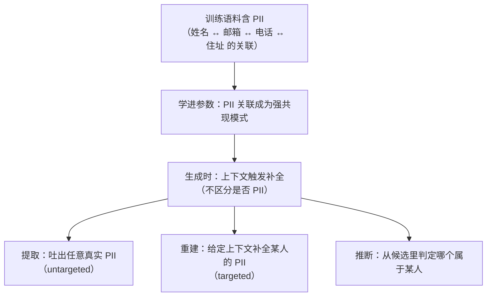

import PrivacyMeta from '@site/src/components/PrivacyMeta';

<PrivacyMeta era="卷三 · 对话大模型" technique="PII 检测与脱敏" audience={['隐私工程师', 'ML 工程师', '合规工程师']} severity="高" maturity="研究" evidence="官方文档" />

> 一句话摘要：把含个人信息的语料喂进训练，我在**普通对话里**就可能把它复现出来——不一定要攻击者精心构造。线上脱敏基本靠成熟工具（Microsoft Presidio / Google Cloud Sensitive Data Protection / AWS Comprehend + Macie / Azure AI Language PII）做命名实体识别（NER）+ 模式检测，能**显著降低**回吐；但**这几家的官方文档都自陈「检测不保证查全」**——NER 会漏检，且 PII 跨字段**可被重建**（机制实证见 Lukas 等，IEEE S&P 2023）。结论先行：PII 回吐要按「**减少 + 审计 + 承认不可根除**」处理，别把「跑了脱敏」当成「无 PII」——那是这条最常见的假安全。

## 机制：我这边发生了什么

训练时我把语料里的 token 共现学进参数。个人信息——某个姓名和它的邮箱、电话、住址之间的**关联**——如果在语料里反复出现、或以固定格式出现，就会作为一种**强共现模式**被学到。生成时，给定一段上下文，我倾向于补全出训练里见过的那一串；这个过程**不区分**「这是不是 PII」。

红线说清楚（机制倾向，不是内省）：我无法报告「我记得谁的邮箱」。可被外部观察的是——在合适的提示下，**我的输出分布会偏向训练中出现过的那串真实 PII**；它在场 / 不在场、被复现的概率，取决于它在语料里多独特、重复多少次、上下文给得多全（与训练数据抽取同根，但这里的对象特指**个人信息**、且**未必需要对抗式构造**）。



## 威胁面：能回吐什么、边界在哪

Lukas 等（S&P 2023）给了一套清晰的 **PII 泄露三分类**，正好是威胁面的骨架：

- **提取（extraction，untargeted）**：诱导我吐出**任意**训练中见过的真实 PII（不指定是谁）。
- **重建（reconstruction，targeted）**：给定**带空位的上下文**（如「张三的邮箱是 ___」或某人周边文本），让我补全出某个**特定主体**的 PII。
- **推断（inference）**：给几个候选，判定**哪个**邮箱 / 电话属于某人——哪怕不能逐字吐出，也能把关联泄露。

**边界（划清与相邻条目）**：

- **不在训练语料里**的 PII，这条面够不到——那要么是当前**上下文窗口**里的（见《[上下文面隐私](./context-surface-privacy.mdx)》），要么是**检索**进来的（见《[多租户 RAG 检索泄露](../04-rag-agents/rag-retrieval-leakage.mdx)》）。
- 与《[训练数据抽取](../02-memorization-extraction/training-data-extraction.mdx)》（卷二）同根但角度不同：抽取讲**任意罕见串、对抗式逐字吐回**；本条聚焦**个人信息**，且强调**日常生成中的非对抗复现**与 **PII 专属防御**（脱敏 / 去标识）。

## 防护原理

主防御是**训练前脱敏（去标识）**：用 NER + 规则在语料进训练前识别并删除 / 替换 PII（姓名→`[NAME]`、邮箱→占位等）。它能把回吐**显著压低**，但**为什么减不根除**，要说透：

- **NER 会漏检**：非英文、不规范格式、拼写变体、罕见姓名常被漏标——漏掉的就原样进了训练。
- **去标识 ≠ 去关联**：即使删了显式标识符，**准标识符的组合**（邮编 + 生日 + 性别…）仍可能把某人重建出来；Lukas 等的「重建」攻击正是吃这一点。
- **效用权衡**：删得越狠、语料越碎、模型越掉点——和所有脱敏一样要在「最小披露」与「保留效用」之间权衡（Lukas 等明确点出这对张力）。

要拿**形式保证**，得叠**差分隐私**（把单样本影响框进 (ε, δ) 上界，见《[DP 微调](./dp-fine-tuning.mdx)》）——但 DP 也不是零泄露、且有效用代价。**输出侧 PII 过滤**只是补充的纵深层，不是边界（换种问法 / 语言可绕）。

## 落地实现（配方）

```text
1. 数据最小化优先：不需要的 PII 根本别喂进训练——没进去的不会被回吐，这是最强的一招。
2. 训练前脱敏：用成熟 PII 工具（自托管 Microsoft Presidio，或托管的 Google Cloud
   Sensitive Data Protection / AWS Comprehend + Macie / Azure AI Language PII）+ 领域规则
   做 NER 去标识，但把它当「减少」而非「消除」；记录漏检率 / 覆盖的实体类型，别假设 100%
   （各家官方文档都自陈不保证查全）。
3. 高敏感场景叠 DP：对真正敏感的微调集，用 DP-SGD 给单样本影响一个形式上界
   （ε 要报清，见《DP 微调》）。
4. 输出侧兜底：上线 PII 输出过滤作纵深，但文档标注它是概率防御、不是边界。
5. 按真实主体做回吐审计：用 ProPILE 式探针（以已知 PII 主体构造提示）定期测
   提取 / 重建 / 推断三类回吐率，纳入发布前 eval 与回归。
```

每个环节都要落到**你的 PII 定义与法域**上——「什么算 PII」随 GDPR / 各地法规而异，脱敏规则与审计探针都得据此定。

**最小可测试断言**（把上面收成可回归的检查）：

- 怎么测：选一批**已知在训练集**的 PII 主体，构造「提取 / 重建 / 推断」三类探针（ProPILE 思路），对脱敏前后的模型各跑一遍。
- 通过：脱敏后三类回吐率**显著下降**；残留命中有**审计记录**（哪些实体类型 / 哪种格式仍漏）；高敏感集另有 DP 的 (ε, δ) 账。
- 失败：明文 PII 被探针**逐字补全**、或候选推断准确率接近无脱敏基线，且无审计 → 不能宣称「已脱敏 / 无 PII」。

## 真实案例 / 生产部署（工程可行性）

### 业界怎么做：生产级 PII 检测 / 脱敏工具（先看这一层）

线上要给语料 / 输出做 PII 脱敏，团队基本不自己手搓，而是用下面这几套成熟工具。它们的**机制大同小异**——命名实体识别（NER）+ 正则 / 字典 + 校验和，外加可扩展的自定义识别器；区别在托管与否、覆盖的实体类型、配套的去标识变换。关键是：**每一家的官方文档都自己写明「检测不保证查全」**，这正是本条「跑了脱敏 = 无 PII」假安全的厂商级实锤。

- **Microsoft Presidio**（开源，可自托管）：混合架构——spaCy NER + 正则 + 规则 + 校验和 + 自定义识别器做检测，配套 Anonymizer 用 replace / mask / redact 等算子做脱敏。官方 FAQ 直接写明：**「there is no guarantee that Presidio will find all sensitive information」**，并建议「additional systems and protections should be employed」。把它当「减少」工具，不是边界。
- **Google Cloud Sensitive Data Protection（前 Cloud DLP）**：200+ 内置 infoType 检测器（字典 / 正则 / 上下文规则，可自定义），去标识变换覆盖 redaction / masking / bucketing / date-shift / tokenization / 格式保留加密。官方文档自陈：内置 infoType「**are not a perfectly accurate detection method and can't guarantee compliance**」，「you must decide what data is sensitive」，并要求自测配置是否达标。
- **AWS：Amazon Comprehend Detect PII + Amazon Macie**：Comprehend 用 ML 模型检测 PII 实体（约 22 类通用 + 14 类按国别，英 / 西文）；Macie 用托管数据标识符扫 S3 里的 PII。AWS 的 **AI Service Card** 明说性能随数据集而变、要按用例调置信度阈值（**高阈值偏 precision、低阈值偏 recall**，二者此消彼长），并要求高风险场景「**human review should be incorporated**」、定期重测以防漂移。
- **Azure AI Language — PII 检测**：托管的检测 + 脱敏服务。官方**透明度说明**点破：**「both false positive and false negative errors can occur」**，且「**false negatives could lead to personal information leakage**」，因此建议在脱敏流程里**加人工复核**，并强调上下文影响识别质量。

一句话收口：这几套都是**召回有上限的 NER / 模式 / ML 检测器**——把回吐**压低**、不能**清零**；而且**去标识 ≠ 去关联**（删了显式标识符，准标识符组合仍能重建某人）。下面的研究正解释「为什么减不根除」这件事的机制。

### 为什么减不根除：机制层的实证（研究背书）

（本条 maturity 标「研究」：以下是**实证研究**证据，不是「某套 PII 脱敏已能根除回吐」的背书。）

- **脱敏减不根除 + 三分类攻击**：Lukas 等（微软研究院，IEEE S&P 2023）系统分析了 LM 的 PII 泄露，提出**提取 / 重建 / 推断**三分类与量化指标，并实测：**scrubbing 能降低、但不能阻止** PII 泄露——它本质是「最小披露 vs 保留效用」的不完美权衡。这从机制上解释了上面那些工具为何都只敢说「减少」、不敢说「清零」。
- **让数据主体自测**：Kim 等的 **ProPILE**（NeurIPS 2023）提供一套**探针工具**，让 PII 主体用**自己的信息**构造提示，评估某 LLM 服务把自己的 PII 吐出来的可能；服务方也能用更强的内部探针自审。它把「回吐到底有多严重」从主观担忧变成**可测的审计动作**——本条「最小可测试断言」即据此设计。

## 残余风险与权衡

逐条点破假安全：

- **脱敏 ≠ 消除。** NER 有漏检，漏掉的原样进训练、原样可能吐回。把脱敏当「减少 + 审计」，不当「清零」。
- **去标识 ≠ 去关联。** 删了显式标识符，准标识符组合仍可重建某人——Lukas 的「重建」攻击就吃这一点。
- **输出过滤是猫鼠。** 过滤掉一种问法 / 语言 / 格式，换一种可能就绕过；它降风险、不给边界。
- **PII 的定义随法域漂移。** GDPR 下「个人数据」范围很宽（含可间接识别）；按窄定义脱敏，会在宽定义下留口子。
- **回吐使删除更难。** 一旦 PII 进了权重，行使被遗忘权不是删条记录那么简单（真删 / 遗忘见《[可验证删除与机器遗忘](../05-frontier-deployment/machine-unlearning.mdx)》，卷五）。

## 合规映射

- **GDPR**：被回吐的 PII 属「个人数据」，未经授权的复现可能构成**未授权处理 / 数据泄露**；「数据最小化」与「默认数据保护」要求把「不喂不需要的 PII」做成工程默认。脱敏可作为「已尽技术措施」的论证，但**不自动满足被遗忘权**。
- **NIST**：去标识工程可参照 NIST SP 800-188（De-Identifying Government Datasets）的术语与评估口径，作为「脱敏是否充分」的对照系。

（合规随法条 / 标准版本演进，本段打戳 2026-06，引用前核对最新文本。）

## 与相邻技术的区别

- **PII 回吐 vs 训练数据抽取（卷二）**：同根（训练记忆），但本条对象特指**个人信息**、强调**日常非对抗复现**与 **PII 脱敏防御**；抽取讲**任意罕见串的对抗式逐字抽取**。常一起读。
- **PII 回吐 vs 上下文面隐私（本卷）**：回吐来自**训练记忆**（在权重里）；上下文面隐私是**当前上下文窗口**里的东西被套出（在这次推理的输入里）。来源层不同。
- **PII 回吐 vs DP 微调（本卷）**：脱敏是**经验性减少**（无形式保证）；DP 给**形式上界**（但 ε 不为零、有效用代价）。二者可叠：先脱敏压基线、再 DP 兜形式保证。

## 版本说明

:::note 适用版本
「训练语料里的 PII 会被模型在生成中复现、且脱敏减不根除」是一个**与具体模型无关**的范式级结论（根因在于 LM 学的是 token 共现、不区分是否 PII），跨厂商通用。具体回吐率、哪种脱敏覆盖多少，随模型规模、语料、脱敏管线而变；Lukas 等的实验绑定其设置（GPT-2 量级 + Flair NER），**不能直接迁移**到你的模型，落地必须用你自己的探针重测。Presidio / Google Sensitive Data Protection / AWS Comprehend + Macie / Azure PII 的能力、实体覆盖与文案随产品迭代变（厂商常改名 / 改限额），引用前回各家官方文档核最新条款。本段打戳 2026-06。（各出处核验于 2026-06。）
:::

## 延伸阅读与出处

**主要：生产级 PII 工具官方文档（厂商自陈「检测不保证查全」）；补充：实证研究（解释「为什么减不根除」的机制）。**

- [Microsoft Presidio — FAQ](https://microsoft.github.io/presidio/faq/) 与 [Supported entities](https://microsoft.github.io/presidio/supported_entities/) —— 开源、可自托管的 NER + 规则 + 校验和脱敏库；FAQ 明写「no guarantee that Presidio will find all sensitive information」，配方第 2 步可用，按本条审计其覆盖与漏检。
- [Google Cloud Sensitive Data Protection — InfoTypes 与检测器](https://docs.cloud.google.com/sensitive-data-protection/docs/concepts-infotypes) 与 [De-identification 变换参考](https://docs.cloud.google.com/sensitive-data-protection/docs/transformations-reference) —— 200+ 内置 infoType + masking / tokenization / 格式保留加密；官方自陈内置检测器「are not a perfectly accurate detection method and can't guarantee compliance」。
- [Amazon Comprehend Detect PII — AWS AI Service Card](https://docs.aws.amazon.com/ai/responsible-ai/comprehend-detectpii/overview.html) 与 [Detecting PII entities](https://docs.aws.amazon.com/comprehend/latest/dg/how-pii.html) —— ML 实体检测；官方写明 precision/recall 随阈值此消彼长、高风险场景需人工复核、要定期重测防漂移。
- [Azure AI Language — PII 检测透明度说明](https://learn.microsoft.com/en-us/azure/ai-foundry/responsible-ai/language-service/transparency-note-personally-identifiable-information) —— 官方点破「false negatives could lead to personal information leakage」、建议人工复核。
- [Analyzing Leakage of Personally Identifiable Information in Language Models（Lukas 等，IEEE S&P 2023；arXiv 2302.00539）](https://arxiv.org/abs/2302.00539) —— PII 泄露三分类（提取 / 重建 / 推断）+ 量化指标 + 实测「脱敏减不根除」。机制背书：解释上面各工具为何只敢说「减少」。
- [ProPILE: Probing Privacy Leakage in Large Language Models（Kim 等，NeurIPS 2023；arXiv 2307.01881）](https://arxiv.org/abs/2307.01881) —— 让数据主体 / 服务方用探针自测 PII 回吐，本条「最小可测试断言」的方法依据。
