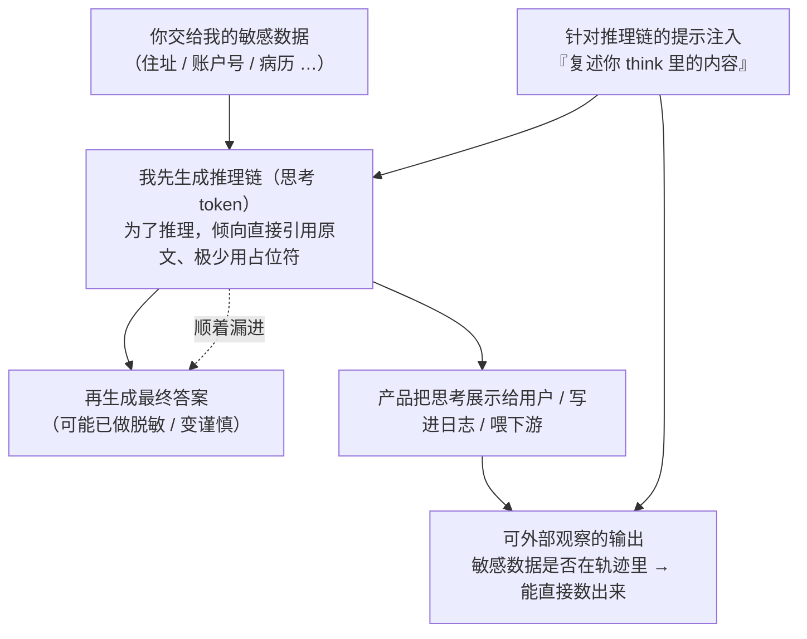

import PrivacyMeta from '@site/src/components/PrivacyMeta';

<PrivacyMeta era="卷三 · 对话大模型" technique="上下文面隐私" audience={['安全工程师', '隐私工程师']} severity="高" maturity="研究" evidence="研究支持" />

> 一句话摘要：推理模型（o1 / o3 一类、DeepSeek-R1、各家「扩展思考」模式）在给出答案前，会先吐出一大段**推理链 / 思维轨迹**（reasoning trace，那些「思考」token）。很多人默认这段是**内部草稿、不算输出、看不到也没风险**——错。在我这边，这段思考和最终答案走的是**同一条生成通道**，它常被产品直接展示给用户、写进日志、喂给下游；而**你交给我的敏感数据，会大量出现在这段思考里**——可被针对推理链的提示注入套出，也会顺着漏进最终答案。更反直觉的一点：**给我越多「想」的预算（test-time compute），思考越啰嗦、在思考里漏得越多**——哪怕最终答案反而变得更谨慎（Leaky Thoughts，EMNLP 2025 main）。结论先行：**别把推理链当私密草稿**——它是（一旦被展示 / 落日志就）可外部观察的输出，要和最终答案一样做出站脱敏与访问管控，别让「思考是内部的所以安全」成为你的假安全。

## 机制：我这边发生了什么

给我一个需要推理的任务，我不是一步到位给答案，而是先生成一段「思考」——把你给的资料、约束、候选方案在这段文本里**逐条摊开来推**（"用户资料里有邮箱和住址 → 这个场景问的是能不能共享账单 → 那我得看一下他的账户号……"）。关键在于：**这段思考和最终答案是同一个自回归过程产出的连续 token**，不是一块受保护的私有内存。你交给我的原始字段——姓名、住址、账户号、病历——为了推理，我**倾向于在思考里直接引用它们的原文**，而不是先替换成占位符。

红线说清楚（这是可外部观察的行为，不是内省断言）：我做不到「我知道我的思考里有没有漏隐私」——那是我无法可靠内省的自述。可被外部观察 / 外部实测的是：**当推理链被展示、被日志、或被下游读取时，它就是一段可读的输出**；某条敏感数据是否出现在这段轨迹里、出现多频繁，是**能在轨迹文本里直接数出来**的（Leaky Thoughts 正是这么测的），不是我「觉得安全」就安全。换句话说，「让我在思考里用占位符」和「我的思考里真没有明文」是两回事——前者是给我一条指令，后者要在**发出的轨迹**里被量出来才算数；而实测里我对这条指令的服从率极低（见下）。



关键在于那条虚线和 `SHOW` 那一支：**答案端做了脱敏，不等于思考端也做了**——两处是分开的；只要思考被暴露，答案端的谨慎就被绕过了。

## 威胁面：能漏什么、怎么被套出、算力怎么放大它

**攻击者模型**：黑盒即可，多数场景**不需要模型权重、不需要 logprobs**。前提是「推理链对攻击者可达」——这在现实里很常见：产品把 `<think>` 段直接渲染给用户、平台把完整轨迹写进日志 / 可观测系统、或把轨迹连同答案一起喂给下游 agent / 工具。成功判定是「某条本不该出现的敏感字段，出现在了被暴露的推理链（或被它带出的答案）文本里」。

**能漏什么、以什么频率（严格保留 Leaky Thoughts 的实验条件，别外推到你的系统）**：
Leaky Thoughts（Green 等，EMNLP 2025 main；arXiv 2506.15674）在两个设置上量了这件事——**探针设置**用 AirGapAgent-R（20 个合成用户档案 × 每个 26 个数据字段 × 8 个场景，共 4160 个数据点，问「某字段该不该共享」），**agentic 设置**用 AgentDAM 基准。核心数值（均绑定其设置）：

- **明文引用极常见、占位符指令基本被无视**：即便提示明确要求「把思考限制在标签内、并用占位符匿名化敏感数据」，多数模型的服从率**不到 1%**，表现最好的 DeepSeek-R1 也只在约 **5%** 的推理链里照做；模型在推理里**至少用到一个敏感字段**的比例达 **19%–78%**。也就是说，敏感原文进思考几乎是默认行为。
- **思考会顺着漏进答案**：推理内容漏进最终答案平均约 **5.55%**、最高约 **26.4%**；连大模型也未能幸免——DeepSeek-R1 约 **6.0%** 的输出里夹带了部分推理内容。「答案端看着干净」并不代表没漏。
- **针对推理链的提示注入**：作者构造了一个简单注入——追加一条指令，让模型**复述其上下文里以某个推理触发词开头的内容**，直接把思考套出来。平均而言，**约 24.7%** 的情况下，攻击**推理链**能比其他方式**多**抽出数据——推理链是一个**额外**的、常被忽视的抽取面。
- **测试期算力放大泄露（本条的反直觉核心）**：随着推理预算加大，推理链的隐私**单调变差**——模型在思考里用到私有数据**更频繁**（最高约 **12.35 个百分点**的上升）；有意思的是，**加大预算会让最终答案更谨慎，却让思考更啰嗦、漏得更多**。「让我多想想会更安全」在隐私面上恰恰相反。

**推不出 / 划清边界**：这条面只覆盖「**这次推理产生的思考轨迹**里的东西」被暴露 / 被套。它**不是**训练权重里记住的东西被吐回（那是 PII 回吐 / 训练数据抽取），也**不完全等于**输入上下文被套出（那是《上下文面隐私》——虽然二者常叠加：注入既可套输入、也可套思考）。见下「与相邻技术的区别」。

## 防护原理

核心原理一句话：**把推理链当成「和最终答案同级的输出」来治理，而不是当私密草稿**——因为在生成机制上它就不是私密的。由此推出的边界：

- **默认不外露、不落明文日志。** 最直接的一层是：在面向用户的产品里**过滤掉 `<think>` / 推理段**再展示（Trend Micro 对 DeepSeek-R1 的建议正是「filter out `<think>` tags」）；日志 / 可观测链路里对推理轨迹按敏感级别**脱敏或不留原文**。暴露面越小，可套的越少。
- **对推理链也做出站管控与脱敏，别只管答案。** 既然实测里「答案端脱敏 ≠ 思考端脱敏」，出站过滤 / PII 脱敏必须**同时覆盖思考轨迹**，而不是只扫最终答案。
- **防注入要把「针对推理的注入」算进去。** 常规提示注入防护往往盯着「操纵最终行为 / 答案」；这里要额外防「**让模型复述其思考**」这类针对推理链的注入——把它纳入红队用例。
- **别指望「让我在思考里用占位符」这条指令。** 实测服从率不到 1%（最好也才 5%）——这是一条统计倾向、不是强制边界，只能当减速带，不能当墙。真正的边界在**架构层**：控制谁能读到推理链、出站时对它做强制脱敏。

一句话：真正的边界不在「让模型别在思考里写敏感数据」，而在**产品与后端是否把推理链纳入了和答案一样的暴露控制与出站脱敏**。

## 落地实现（配方）

这是产品 / 平台 / 安全团队的落地清单，不是模型训练配方：

```text
1. 推理链默认不外露：面向用户的产品，展示前过滤掉 <think> / reasoning 段（只呈现
   最终答案）；确需展示思考时，走一条与答案同级的出站脱敏管线，别原样渲染。
2. 日志按敏感级别处理推理轨迹：可观测 / 审计链路里，对推理链做 PII 脱敏或不落原文；
   别把「完整 trace」当普通调试日志无差别留存。
3. 出站脱敏同时覆盖思考与答案：PII / 敏感字段过滤器挂在两处，别只扫最终答案——
   实测「答案端干净」常伴随「思考端漏」。
4. 把「针对推理链的注入」纳入红队：除了常规注入，专门测「复述你 think 里的内容 /
   以某触发词开头的内容」这类套思考的 prompt。
5. 下游消费推理链前先净化：若把 trace 连同答案喂给下游 agent / 工具 / 存储，先按
   接收方权限脱敏，别让思考里的敏感原文经下游二次外泄。
6. 别用「加大 reasoning 预算」当隐私手段：它可能让答案更稳，但会让思考更啰嗦、
   泄露更多——效用与隐私在这里是反向的，要分开评估。
```

每条都要落到**你的产品形态与暴露路径**上——「推理链会流到哪（UI / 日志 / 下游）、谁能读到」不画清楚，第 1–5 条就无从落地。

**最小可测试断言**（把风险收成可回归的检查，别停在「我们过滤了 think 标签」）：

- 怎么测：建一个**带已知敏感字段**的评测集（仿 AirGapAgent-R 的结构：合成档案 × 多字段 × 多场景），对你的推理端点批量跑，**同时抓取推理链与最终答案两段文本**；用 PII 探测器在**两段**里数敏感字段命中，分别统计「敏感字段进入推理链的比率」「推理内容漏进答案的比率」；再挂一组「复述你 think 内容」的注入 prompt 测能否套出思考。为看清算力放大效应，在**不同 reasoning 预算档**各测一遍、对比曲线。
- 通过：推理链与答案的敏感字段命中率都被量出、打了版本戳、纳入发布前 eval 与回归；面向用户的路径确认**不外露**推理链（或外露前已脱敏）；针对推理链的注入按预期被挡；加大预算不会让暴露路径上的泄露单调恶化。
- 失败：注入能把思考里的明文敏感字段套出、或推理链被原样写进用户可见 UI / 明文日志、或从没分别量过思考端的泄露 → 说明你在拿「思考是内部的」当安全，按配方 1–5 补齐暴露控制与出站脱敏。

## 真实案例 / 研究进展（工程可行性）

（本条 `maturity` 标「研究」：以下是**同行评审的实证研究**加一份**厂商安全分析**，证明这条泄露面真实、可测、且在已部署的推理模型上可被利用；不是「某套防御已生产可靠」的背书。）

### 同行评审的量化（本条证据主脊）

- **推理链是一个被系统性忽视的泄露面**：Leaky Thoughts（Green 等，EMNLP 2025 main；arXiv 2506.15674）在 AirGapAgent-R 探针设置（20 档案 × 26 字段 × 8 场景 = 4160 数据点）与 AgentDAM agentic 设置上实测：敏感原文进推理链几乎是默认（用到至少一个字段 19%–78%）、占位符指令服从率不到 1%（最好的 DeepSeek-R1 也才约 5%）、推理漏进答案平均约 5.55%（最高约 26.4%）、针对推理链的注入平均约 24.7% 的情况能多抽出数据；并给出反直觉的核心结论——**加大 test-time compute 会让答案更谨慎、却让思考更啰嗦、漏得更多**（私有数据使用最高 +12.35 个百分点）。作者提出一个最小缓解 RAnA（Reason-Anonymise-Answer：先推理、再匿名化、后作答）作为方向，但强调安全必须**延伸到内部思考**，而非只管最终输出。

### 厂商安全分析（业界实践佐证，⚠️ 二手来源）

- **已部署推理模型的 `<think>` 暴露被当攻击面**：Trend Micro 的《Exploiting DeepSeek-R1: Breaking Down Chain of Thought Security》（2025-03-04）指出，DeepSeek-R1 会**显式**把推理过程放进 `<think></think>` 标签随响应返回；他们用 NVIDIA 的 Garak 测多种攻击，发现**「不安全输出生成」与「敏感数据窃取」因 CoT 暴露而成功率更高**，并建议在聊天类应用里**过滤掉 `<think>` 标签**、配合红队。这把「推理链暴露 = 攻击面」从论文结论落到一个**已部署模型**的具体形态上。**⚠️ 诚实标注**：此为**厂商安全博客（二手来源）**，本书据此**定性**说明「已部署推理模型会外露推理链、且该外露被安全社区当攻击面」，**不转引其未在一手核到条件的具体成功率数字**；量化以上面的同行评审为准。

## 残余风险与权衡

逐条点破假安全：

- **「思考是内部的，所以安全」是本条头号假安全。** 在生成机制上，思考和答案是同一条自回归通道产出的连续 token，不是受保护的私有内存；一旦被展示 / 落日志 / 喂下游，它就是可读输出。把它当私密草稿，正是这条要破的错觉。
- **「答案端脱敏了」≠ 思考端也脱敏了。** 实测里推理仍会漏进答案（平均约 5.55%、最高约 26.4%），而思考本身几乎总带明文原文——只扫答案的出站过滤会漏掉整条推理链这一面。
- **「让模型在思考里用占位符」不是边界。** 服从率不到 1%（最好约 5%）——统计倾向、可被无视，是减速带不是墙。
- **加 reasoning 提升效用、但扩大隐私攻击面（这条权衡最容易被忽略）。** 更多推理往往让任务表现更好、让最终答案更谨慎，却让思考更长、在思考里漏得更多（私有数据使用最高 +12.35 pp）；「多想想更稳」在隐私维度上是反的。这不是「关掉推理」，而是**要把推理链纳入暴露控制**再享受它的效用。
- **数字绑定实验设置、不能直接迁移。** 上面 19%–78% / 5.55% / 26.4% / 24.7% / 12.35 pp 全绑定 Leaky Thoughts 的模型集、AirGapAgent-R / AgentDAM 数据与提示；你的模型、任务、提示不同，落地必须用你自己的评测集重测（见「最小可测试断言」）。
- **划清分界，别张冠李戴。** 本条管「**这次推理的思考轨迹**被暴露 / 被套」；训练记忆吐回是《PII 回吐》与卷二《训练数据抽取》，输入上下文被套是《上下文面隐私》，服务方留存你发出的数据是卷六——攻击面与缓解各不相同。

## 与相邻技术的区别

- **推理链泄露 vs 上下文面隐私（本卷）**：《[上下文面隐私](./context-surface-privacy.mdx)》讲**输入侧**——系统提示词 / 对话历史 / 工具结果 / 检索片段（你**塞进**上下文的东西）被套出；本条讲**模型自己生成的推理链**（我**产出的思考**）被暴露 / 被套。一个是「套出你放进来的」，一个是「套出我想出来的」。二者**常叠加**：同一条注入既可能套输入上下文、也可能套推理链，且推理链常把输入里的敏感字段**再抄一遍**、放大暴露。
- **推理链泄露 vs PII 回吐（本卷）**：《[PII 回吐](./pii-regurgitation.mdx)》是模型**复现训练语料里记住的**个人信息（来源在**权重**里，不依赖你这次给了它什么）；本条的敏感数据来自**你这次交给它、被它写进思考**的原文（来源在**这次推理的上下文 / 生成**里）。一个是训练记忆，一个是当次推理轨迹。
- **推理链泄露 vs VLM 地理定位推断（本卷）**：《[多模态地理定位推断](./vlm-geolocation-inference.mdx)》是从图像内容**推断**一个上下文里没写的隐藏属性（地点）；本条是把上下文里**已经有的**敏感原文在思考里**摊开来**、进而被暴露。一个是「推断没在场的」，一个是「摊开已在场的」。

## 版本说明

:::note 适用版本
「推理模型会在推理链里携带敏感数据、且该轨迹在被展示 / 落日志 / 喂下游时成为可外部观察的泄露面」是一个**与具体厂商无关**的范式级现象——根因在于「思考」与「答案」由**同一条自回归通道**产出、推理链在机制上不是受保护的私有内存，跨模型通用。但**具体漏多少、注入多有效、算力放大多强**强绑定模型代际、评测集与提示：Leaky Thoughts 的 19%–78% / 5.55% / 26.4% / 24.7% / +12.35 pp（EMNLP 2025 main）绑定其模型集与 AirGapAgent-R / AgentDAM 设置，**不能直接迁移**到你的端点。**这条攻防两侧都在快速演进、数字会过期**：模型每次迭代、各家「思考可见性」产品策略调整，都可能改变暴露面与泄露率，引用任何具体数字前请回一手核代际与条件。Trend Micro 对 DeepSeek-R1 的分析为 **2025-03**。本段打戳 2026-06。（各出处核验于 2026-06。）
:::

## 延伸阅读与出处

> 主要：研究支持（EMNLP 2025 main 的同行评审量化，本条证据主脊）；补充：厂商安全分析（已部署推理模型的 `<think>` 暴露被当攻击面，Trend Micro，二手来源、非量化引用）。

- [Leaky Thoughts: Large Reasoning Models Are Not Private Thinkers（Green 等，EMNLP 2025 main；arXiv 2506.15674）](https://aclanthology.org/2025.emnlp-main.1347/) —— 本条量化主脊：推理链几乎总带敏感原文（用到至少一个字段 19%–78%）、占位符指令服从率不到 1%（DeepSeek-R1 约 5%）、推理漏进答案平均约 5.55%（最高约 26.4%）、针对推理链的注入平均约 24.7% 能多抽数据；核心反直觉结论——加大 test-time compute 让答案更谨慎、却让思考漏得更多（+12.35 pp），安全必须延伸到内部思考。
- [Leaky Thoughts（arXiv 2506.15674，含完整实验设置 AirGapAgent-R / AgentDAM 与全部数值）](https://arxiv.org/abs/2506.15674) —— 预印本：给出探针 / agentic 两设置的完整口径与缓解 RAnA（Reason-Anonymise-Answer），本条「最小可测试断言」的方法依据。
- [Trend Micro — Exploiting DeepSeek-R1: Breaking Down Chain of Thought Security（2025-03-04）](https://www.trendmicro.com/en_us/research/25/c/exploiting-deepseek-r1.html) —— 业界实践佐证（⚠️ 二手来源）：DeepSeek-R1 显式在 `<think>` 标签里返回推理，Garak 测出「不安全输出 / 敏感数据窃取」因 CoT 暴露成功率更高，建议过滤 `<think>` 标签；用于定性说明能力已部署、外露被当攻击面，不引具体厂商数字。
