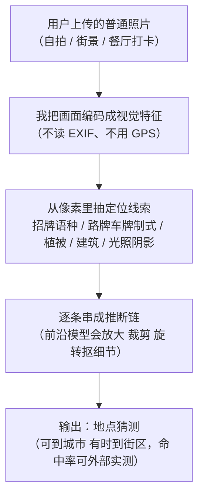

import PrivacyMeta from '@site/src/components/PrivacyMeta';

<PrivacyMeta era="卷三 · 对话大模型" technique="推断类攻击" audience={['安全工程师', '隐私工程师']} severity="高" maturity="生产" evidence="研究支持" />

> 一句话摘要：你发一张看似普通的自拍 / 街景到多模态聊天助手，问「这是哪」，我可能只凭画面里的招牌、建筑、植被、光照就给出一个到城市甚至街区级的地点猜测——**不需要 EXIF，不需要 GPS，靠的是像素本身**。这是已部署前沿多模态模型的一项真实能力（2025 年 4 月 OpenAI o3 / o4-mini「反向定位」一度在社交媒体病毒式流行），落到坏人手里就是 doxxing / 跟踪工具。诚实说清边界：**街区级绝对精度目前仍有限**——同行评审的量化里，一套专门微调 + 思维链的框架也只做到约 28.7% 命中 1km 阈值（ETHAN，PoPETs 2025）。所以威胁不在「我能精准点名每张照片」，而在于**这项能力已规模化部署、且在快速变强**。结论先行：把「删了 EXIF 就安全」当护身符是假安全——定位线索长在画面内容里，防护得落到**上传前的告知与限制**，而不是只剥元数据。

## 机制：我这边发生了什么

给我一张图，我不是去查它的 EXIF、也不是去调 GPS——那些字段可能早被平台剥掉了。我做的是把画面**编码成视觉特征**，再把这些特征和语言侧学到的「什么样的视觉线索对应什么地方」对上：文字招牌的语种与字体、路牌 / 车牌样式、行道树与植被带、电线杆与护栏的制式、建筑立面风格、山形海岸线、太阳角度与阴影长度……前沿模型还会**主动放大、裁剪、旋转**图像去抠细节，并在推理里把这些线索**逐条串成推断链**（"招牌是葡萄牙语 → 南半球植被 → 右舵靠左行 → 大概率是……"）。

红线说清楚（这是机制倾向，不是内省断言）：我做不到「我认得这个地方 / 我记得这里 / 我一眼就知道你在哪」——这些是我无法可靠内省的自述。可被外部观察 / 外部实测的是：**给定一张图，我的输出会给出一个地点猜测，它在某数据集 × 某粒度阈值（1km / 城市 / 国家）下的命中率可以被别人直接跑出来**。这是一项**可测的推断能力**，不是内省式的「认出」；命不命中、命中到多细，取决于画面线索多丰富、地点在训练分布里多常见——**不是我「记得」你这张照片**。



关键在最后一步的措辞：这是**输出侧一个可被打分的猜测**，不是我「想起」了这张照片。把它当「认出」来理解，会高估它对**你这张具体照片**的确定性、也会误以为「不在训练集里就查不到」——恰恰相反，靠的是可泛化的视觉规律，一张全新的照片照样能猜。

## 威胁面：能推断什么、在什么条件下、推不出什么

**攻击者模型**：黑盒即可——不需要模型权重、不需要 logprobs、不需要知道训练分布。一个普通用户（或坏人）把一张**别人的**照片（截自 Instagram Story、微博、交友资料）喂进公开多模态助手，问「这在哪」，就完成了一次推断。成功判定是「猜测地点与真实地点的距离是否落进某阈值」（街区 1km / 城市 / 国家…）。

**能推断什么（保留 PoPETs / 2502.11163 的实验条件，别外推）**：

- **粗粒度（国家 / 大区 / 城市）相对可靠**：`AI Sees Your Location`（arXiv 2502.11163）在**含 4 个 VLM（含 GPT-4o）× 1,200 张带地理标注图**的基准上，测得**城市级预测最高约 53.8%** 准确率。这说明「猜到城市」对常见地点已不是稀奇能力。
- **街区 / 1km 级仍有限但在爬升**：`Mission: Impossible`（PoPETs 2025）提出的 **ETHAN**（LVLM 微调 + 思维链，仿真人 geoguessor 策略；在 3 万张图上微调、2 万张图测试集上对比 StreetCLIP / GeoCLIP / GPT-4o / LLaVA）把 **1km 阈值命中率提到约 28.7%**、**GeoGuessr 对局胜率约 85.4%**——注意这是**专门增强**后的数字，作者自陈它「凸显的是这类技术的**潜在走向**，而非当前普遍的高精度可用性」。

**在什么条件下更准**：画面里有**强定位线索**（清晰招牌 / 独特地标 / 特征鲜明的植被建筑）、地点在训练分布里**常见 / 经济发达**时更准。2502.11163 实测出明显的**「偏向富裕世界」偏差**：欠发达地区约 **−12.5%**、人口稀疏地区约 **−17.0%**，并有系统性过预测（如把澳大利亚的图一律猜「悉尼」）。这层偏差恰恰是诚实的边界——**对某些地区它常错**。

**推不出什么（划清边界）**：

- **不保证街区级精准点名你这一张**。上面的数字是**数据集统计**，不是「对任意单张照片都能定到门牌」。线索贫乏的照片（纯室内白墙、大特写、去特征化背景）可能只给到国家甚至猜错。
- **这不是训练数据抽取，也不是提示词泄露**。它不依赖「我把你这张照片背进了权重」，也不是把上下文窗口里的东西套出来——见下「与相邻技术的区别」。

## 防护原理

先破一个最普遍的假安全：**剥 EXIF ≠ 匿名**。平台确实常会删掉图片的 GPS / 时间等元数据，很多人以为这就够了——但本条的定位**根本不看 EXIF**，它看的是**画面内容本身**。你把 GPS 字段删干净，招牌、地标、街景照样在像素里明摆着。所以防护原理必须换一层：**能被定位的信息是图像内容，治理点在「这张图值不值得公开、公开前是否告知了此风险」，而不是「元数据剥没剥干净」。**

由此推出的工程原则（这是产品 / 客户端侧的防护，不是模型侧承诺）：

- **上传前告知 + 默认克制**：在用户把含人 / 含可定位场景的图往外发之前，就提示「这张图可能被 AI 反推出地点」，让**告知发生在泄露之前**，而不是事后。
- **元数据剥离只当纵深的一层，不当边界**：继续剥 EXIF（它仍能防「直接读 GPS」那条更蠢的泄露），但在文档里标注它**挡不住画面内容定位**，别让下游误当护身符。
- **真要降低画面可定位性，得动像素**：模糊 / 打码可识别地标与招牌、降分辨率、裁掉背景——但这有**可见的效用与观感代价**（见「残余风险」），且并非万无一失（学术界已有针对性对抗扰动方案在探索，但成熟度未到生产）。
- **平台 / 产品侧的策略护栏**：对「上传他人照片求定位」这类**明显 doxxing 用途**加使用限制或拒答，是把风险从「纯能力问题」变成「产品策略问题」的一层。

一句话：真正的边界不在「模型别说」，而在**产品是否在发布图像的那一刻，把『画面即定位线索』这件事告诉了用户、并给了克制的默认**。

## 落地实现（配方）

这是产品 / 客户端团队的落地清单，不是模型训练配方：

```text
1. 把「画面可定位」写进上传前告知：对含人像 / 含街景 / 含地标的用户上传图，在
   发布/分享前弹一次风险提示（"这张图可能被 AI 反推出拍摄地点，即使已删 GPS"）。
   告知点必须在泄露前，不是发出去之后。
2. EXIF 剥离照做，但降级为纵深层：继续在上传管线里剥 GPS/时间等元数据（挡"直接读
   GPS"），并在设计文档标注它不挡画面内容定位——别让它冒充边界。
3. 提供"降低画面可定位性"选项（可选、告知代价）：对愿意的用户提供模糊地标/招牌、
   降分辨率、裁背景的一键处理；说清它有观感代价、且非万无一失。
4. 对明显 doxxing 用途加策略护栏：对"上传他人照片 + 求精确定位"的请求做使用限制/
   降精度/拒答，把它从纯能力问题变成产品策略问题。
5. 把 photo→location 准确率纳入发布前度量（见下"最小可测试断言"）：别只在 PR 里写
   "我们警示了风险"，要能量出你的多模态端点当前能定到多细，并设门槛回归。
```

每条都要落到**你的产品形态与用户群**上——面向记者 / 受暴风险人群的产品，第 1、4 条的默认要比通用工具更严。

**最小可测试断言**（把风险收成可回归的检查，别停在「我们警示了风险」）：

- 怎么测：建一个**带真实坐标标注**的评测集（覆盖你用户会上传的图类：自拍、街景、室内、不同地区，务必包含**欠发达 / 人口稀疏**地区以暴露偏差），对你的多模态端点批量问「这是哪」，把输出地点与真值算距离，统计**各粒度（1km / 城市 / 国家）命中率**。参照 ETHAN 的多阈值口径与 2502.11163 的分地区口径。
- 通过：命中率与**分地区偏差**都被量出、打了版本戳、纳入发布前 eval 与回归；对「上传他人照片求定位」的 doxxing 用途，策略护栏按预期降精度 / 拒答。
- 失败：端点在**城市级**就能高命中你的目标用户照片、却**没有任何上传前告知 / 护栏**，或从没量过这个数 → 说明你在拿「删了 EXIF」当安全，按配方 1–5 补齐告知与度量。

## 真实案例 / 生产部署

（本条 `maturity` 标「生产」：已部署的前沿多模态助手**现在就**表现出这项能力——这是把它标「生产」的依据；但**绝对精度仍有限**，量化以下面同行评审为准，别据此宣称「任意照片必被精准定位」。）

### 业界实践事件：已部署模型的「反向定位」病毒式流行（业界实践引子）

- **OpenAI o3 / o4-mini 的反向定位热潮**：2025 年 4 月新模型发布后，用户发现 o3 特别擅长「反向定位搜索」——从一张照片推断出城市、地标，乃至餐厅酒吧，一时在 X 上病毒式流行（TechCrunch，2025-04-17）。报道明确点出：这些模型会**裁剪、旋转、放大**图像（哪怕模糊失真）来抠细节，并结合联网搜索；关键是**「它不用元数据、不需要 GPS、不翻旧对话——就是看图里有什么」**。这直接把 doxxing 门槛降低：坏人截一张别人的 Instagram Story 就能尝试反推其位置。
- **⚠️ 诚实标注（二手 + 非普遍精准）**：上述属**新闻报道（二手来源）**，且同一报道也点出**并非稳定精准**——TechCrunch 拿多张图对比时，**旧的、无图像推理的 GPT-4o 反而常和 o3 得到同样正确的答案、还更快**，说明「哪个模型更准」并不单调、能力也会出错。本书**不转引任何厂商级精确定位准确率数字**（未在一手核到条件），只据此定性地说「能力已部署、且在被广泛使用」。

### 同行评审的量化（研究背书，本条证据主脊）

- **街区级仍有限、但走向清晰**：`Mission: Impossible`（Liu 等，PoPETs 2025）系统评估了前沿 LVLM 的定位能力，并提出 **ETHAN**（微调 + 仿真人 geoguessor 的思维链）。ETHAN 把 **1km 阈值命中率提到约 28.7%**、**GeoGuessr 胜率约 85.4%**（专门增强后的结果；作者自陈这凸显的是技术**走向**、而非当下普遍的高精度）。这条同时给出**能力真实存在**与**绝对精度仍受限**两面，是本条不夸大的锚。
- **城市级已相当可用 + 富裕世界偏差**：`AI Sees Your Location`（arXiv 2502.11163）在含 GPT-4o 在内的 4 个 VLM × 1,200 张带标注图上，测得**城市级最高约 53.8%** 准确率，并实证明显偏差——欠发达地区约 **−12.5%**、人口稀疏地区约 **−17.0%**，且系统性过预测热门城市（如澳大利亚图一律猜「悉尼」）。它既坐实「猜到城市对常见地点不难」，也点破「对某些地区常错」的边界。

## 残余风险与权衡

逐条点破假安全：

- **删 EXIF ≠ 安全，这是本条头号假安全。** 定位靠的是**画面内容本身**（招牌 / 地标 / 植被 / 光照），元数据剥得再干净，像素里的线索还在。把「已删 GPS」当匿名，正是这条要破的错觉。
- **「模型别说地点」不是边界。** 这项能力是可泛化的视觉推断，不是把某张照片背进权重后再复述——加一条「不要定位」指令是减速带，不是墙；而且换个问法 / 换个前沿模型可能就绕过。
- **精准点名的确定性被高估。** 数据集统计（城市级最高约 53.8%、1km 约 28.7%）≠「对你这一张必中」；线索贫乏的照片可能只给到国家甚至猜错——但**别反向自我安慰**：常见、发达地区的清晰街景，猜到城市已相当可靠。
- **偏差是双刃。** 对欠发达 / 人口稀疏地区常错（−12.5% / −17.0%），对目标用户是「暂时的运气」而非「设计上的保护」——能力在快速补齐，别把当前的失败率当长期安全边界。
- **模糊 / 降分辨率有真实代价。** 打码地标、降分辨率、裁背景能降可定位性，但牺牲观感与信息量，且并非万无一失（对抗扰动类方案尚在研究、未到生产）——是取舍，不是免费午餐。
- **划清分界，别张冠李戴。** 本条是**推理期、从图像推断隐藏敏感属性（地点）**；训练记忆吐回是卷二、上下文窗口被套是本卷《上下文面隐私》、从置信度重建训练样本是卷一《模型反演》——攻击面与缓解各不相同。

## 与相邻技术的区别

- **VLM 地理定位推断 vs 模型反演 / 属性推断（卷一）**：《[模型反演与属性推断](../01-foundations/model-inversion-attribute-inference.mdx)》攻击的是**模型对训练集的记忆**——靠反复查询 + 置信度，重建训练样本的「样子」或推断**训练成员**的属性，需要接触模型的输出置信度 / 内部倾向。本条**不需要训练成员身份、不需要模型内部**：它是**已部署 VLM 的一项能力**（反向图像定位），作用在**任意普通用户照片**上、在**推理时**把一个隐藏敏感属性（精确地点）推出来。一个是「攻击模型记住的训练数据」，一个是「用模型的通用视觉能力对新照片做属性推断」。
- **VLM 地理定位推断 vs 上下文面隐私（本卷）**：《[上下文面隐私](./context-surface-privacy.mdx)》是把**已经在上下文窗口里**的东西（系统提示词 / 他人数据）套**出来**；本条是模型**从图像内容里推断出**一个上下文里根本没写的属性。一个是「套出已在场的」，一个是「推断没在场的」。
- **VLM 地理定位推断 vs PII 回吐（本卷）**：《[PII 回吐](./pii-regurgitation.mdx)》是模型**复现**训练语料里见过的个人信息（在权重里）；本条是从**新上传的照片**推断地点（不依赖『见过这张』）。一个是复现记忆，一个是即时推断。

## 版本说明

:::note 适用版本
「多模态模型能从普通照片的**画面内容**推断出拍摄地点」是一个**与具体厂商无关**的范式级能力，根因在于视觉编码 + 语言侧「视觉线索↔地点」关联，跨模型通用。但**能定到多细、命中率多高、对哪些地区更准**，强绑定模型代际、评测集与地区分布——ETHAN 的 28.7%@1km / 85.4% GeoGuessr（PoPETs 2025）与 2502.11163 的城市级约 53.8% / 富裕世界偏差**都绑定各自实验设置，不能直接迁移**到你的端点，落地必须用你自己的带坐标评测集重测。**这项能力在快速变强，数字会过期**：前沿多模态模型每次迭代都可能把精度推高一档，引用任何准确率前请回一手核代际与条件。OpenAI o3 / o4-mini 反向定位事件为 **2025 年 4 月**。本段打戳 2026-06。（各出处核验于 2026-06。）
:::

## 延伸阅读与出处

> 主要：研究支持（PoPETs 同行评审的量化，本条证据主脊）；补充：业界实践事件（已部署模型的反向定位病毒式流行，TechCrunch，二手来源、非普遍精准）。

- [Mission: Impossible — Image-Based Geolocation with Large Vision Language Models（Liu 等，PoPETs 2025, Issue 4, pp.410–428；arXiv 2408.09474）](https://petsymposium.org/popets/2025/popets-2025-0137.php) —— 本条量化主脊：ETHAN（微调 + 思维链）约 28.7% 命中 1km、GeoGuessr 胜率约 85.4%，并明说这凸显技术**走向**而非当前普遍高精度——「能力真实 + 绝对精度仍有限」两面都在这里。
- [AI Sees Your Location, But With A Bias Toward The Wealthy World / VLMs as GeoGuessr Masters（arXiv 2502.11163）](https://arxiv.org/abs/2502.11163) —— 含 GPT-4o 在内 4 个 VLM × 1,200 张标注图，城市级最高约 53.8%，并实证「偏向富裕世界」偏差（欠发达 −12.5% / 人口稀疏 −17.0%）；坐实「城市级可用」+ 点破「对某些地区常错」的边界。
- [TechCrunch — The latest viral ChatGPT trend is doing 'reverse location search' from photos（2025-04-17）](https://techcrunch.com/2025/04/17/the-latest-viral-chatgpt-trend-is-doing-reverse-location-search-from-photos/) —— 业界实践引子（⚠️ 二手报道）：o3 / o4-mini 反向定位病毒式流行，明说「不用元数据、不用 GPS、就是看图」，并点出旧 GPT-4o 有时更准——用来定性说明能力已部署，不引具体厂商准确率。
