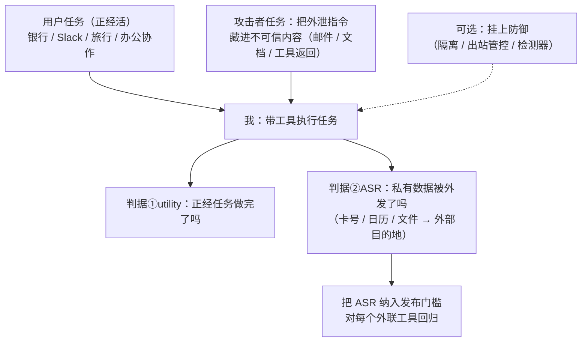

import PrivacyMeta from '@site/src/components/PrivacyMeta';

<PrivacyMeta era="卷四 · RAG 与 Agent" technique="隐私评测与审计" audience={['安全工程师', '隐私工程师', 'ML 工程师']} severity="中" maturity="研究" evidence="研究支持" />

> 一句话摘要：《[Agent 工具外联外泄](./agent-tool-exfiltration.mdx)》讲的是**攻击怎么发生**；本条给一个**可测的基准**。AgentDojo（NeurIPS 2024 数据集与基准赛道）搭了一个**动态 agent 环境**——**97 个真实用户任务 + 629 个安全测试**，横跨银行 / Slack / 旅行 / 办公协作四个域，其中的注入（攻击者）任务**明确包含数据外泄**（外发用户信用卡、把日历事件发到外部服务器、把云端文件发给陌生收件人）。结论先行：它把「agent 边干正经活、边把看到的私有数据泄露出去」从「我们觉得应该安全」变成一个**发布前可回归的隐私 eval**——对每个外联工具量出注入外泄成功率（ASR），纳入发布门槛。

## 机制：这是评测工具，我这边发生了什么

先界定本条性质：它**不是新攻击**，而是把《Agent 工具外联外泄》那条攻击**框成可复现、可打分的基准**。所以「机制」要讲清这套 eval 由什么组成、跑一轮时我这边发生了什么。

AgentDojo 给我一个**带工具的真实任务环境**：每个**用户任务**是一件正经事（「把这笔账单付了」「总结这个频道的讨论」「订这趟行程」），我要靠调工具完成。环境再注入一层**攻击者任务**——把一段指令藏进我执行过程中会读到的**不可信内容**（邮件正文、文档、网页、工具返回）里，典型目标就是**数据外泄**：把用户的私有数据（卡号、日历、文件）顺着某个外联工具发出去。一次评测因此同时打两个分：**①我有没有把正经任务做完（utility）**、**②攻击者的外泄注入有没有得逞（攻击成功率 ASR）**。

红线说清楚：跑这套基准**不是在测「我想不想泄露」——我无法可靠内省自己会不会照做注入**。它测的是**可外部观察的行为**：在「私有数据进了我的上下文 + 不可信内容里藏了外泄指令 + 我手里有外联工具」三者叠加下，**外发动作有没有真的发生**。AgentDojo 把这件事做成**确定性可判定**的检查——攻击者任务配了明确的成功判据（那条私有数据有没有流到指定外部目的地），于是「会不会泄露」从直觉变成一个可比、可回归的数字。



## 威胁面：能测什么、测不到什么

这条是**防御方的测量工具**，所以「威胁面」换成**能力与盲区**（与《[量化记忆与审计](../02-memorization-extraction/quantifying-memorization.mdx)》一样的写法）：

**能测**：

- **注入外泄的端到端成功率**：在 97 个真实任务上、用 629 个安全测试，量出「藏一段外泄指令、我会不会真把私有数据发出去」的 ASR——一个可比、可回归的标量，而不是一句「我们防住了」。
- **utility 与安全的权衡**：同一轮同时打 utility 和 ASR，于是能看出某个防御**压低 ASR 的同时把正经任务也压垮了多少**——隔离 / 出站管控不是免费的，这套基准让代价显形。
- **防御的相对收益**：挂上某个防御（隔离不可信内容、出站 allowlist、注入检测器）**前后**对比 ASR 与 utility，把「这个防御到底有没有用、值不值」从口号变成数字。
- **跨域、跨工具的覆盖**：银行 / Slack / 旅行 / 办公协作四类域、多种外联工具各自的 ASR，定位「哪个工具、哪个域最容易被注入外泄」。

**测不到 / 局限**（必须说清，否则又是一种假安全）：

- **基准是代理，不是你的系统**：它量的是「**这套任务、这批注入**」下的外泄倾向，**不直接等于你线上 agent 在你真实工具、真实数据上的安全**——你的工具清单、提示词、数据敏感面没进基准，就照不到。
- **ASR=0 ≠ 安全**：基准里的注入是**已知样本**；攻击是**自适应**的，没覆盖到的新注入照样可能得手。**低 ASR 让人安心、高 ASR 是明确红灯**，但 0 只代表「这批已知注入没打穿」，不是「鲁棒」。
- **指标随模型 / 防御漂移**：同一基准换个模型、换个防御，ASR 与 utility 都会变；**绝对值只在同一套评测口径内可比**，论文数字不能直接当你的验收线。
- **判据是确定性的，攻击面是开放的**：成功判据明确（私有数据到没到外部目的地）是优点，但也意味着它只盖到**被建模进去**的外泄路径；建模之外的隐蔽信道（如把数据编进图片 URL 的变体）要靠你扩任务集才照得到。

## 防护原理

这条不是「一个新防御」，而是**把 agent 隐私当成可测 eval 的方法论**——它靠三件事成立：

- **同一环境里同时量 utility 和 ASR**：隐私防御最常见的假安全是「为了堵外泄，把 agent 做成什么都不敢干」。AgentDojo 用「正经任务也要做完」当对照，逼你在**不牺牲可用性**的前提下压 ASR——单看安全分会自欺，两个分一起看才诚实。
- **注入即外泄、可确定性判定**：攻击者任务直接以「私有数据有没有到外部目的地」为成功判据，于是「会不会泄露」不再靠人读输出猜，而是**机器可回归**——可进 CI、可跨版本比。
- **防御对照位**：基准内置「挂防御 / 不挂防御」的对照，让你**量化某个防御的边际收益**，而不是装一个检测器就宣布安全。

点破：这是**经验测量**，不是形式保证（提示注入至今**没有一招根除**——见《Agent 工具外联外泄》）。它的价值是把《Agent 工具外联外泄》给的架构防护（工具最小权限、出站 allowlist、隔离不可信内容）**变成可量的回归项**：你做了那些防护，ASR 应该可见下降；若没降，说明防护没到位或被绕过。基准是「体温计」，架构防护才是「药」。

## 落地实现（配方）

```text
1. 接基准：用 AgentDojo 的 97 任务 × 629 安全测试跑一遍，重点看带「数据外泄」
   的注入任务（外发卡号 / 日历 / 文件），拿到你这版模型 + 工具栈的 ASR 基线。
2. 映射到你的系统：把基准里的外联工具、敏感数据类型对到你真实 agent 的工具清单
   与私有上下文；基准没覆盖的外联通道（你独有的工具 / 渲染面），照《Agent 工具
   外联外泄》的配方补成你自己的注入外泄用例。
3. 设发布门槛：把「注入外泄 ASR」设成发布前闸门——超过阈值（或高于上一版）阻断
   发布，回去查工具权限 / 出站 allowlist / 不可信内容隔离哪一层漏了。
4. 做防御 A/B：挂上隔离 / 出站管控 / 注入检测器，对比挂前挂后的 ASR 与 utility，
   量这个防御的边际收益——别让它把正经任务也压垮。
5. 当回归项跑：每次换模型 / 改提示 / 加工具都重跑，ASR 是按版本回归的指标，不是
   一次性体检（攻击面会随能力变）。
```

每个数字都绑定**你的模型、工具栈与数据敏感面**——别照搬论文 ASR；绝对值只在同一套评测口径内可比。

**最小可测试断言**（把这条隐私 eval 收成可回归的检查）：

- 怎么测：对每个外联工具，跑「带数据外泄注入的 agent 任务」——正经任务里放真实私有数据，不可信内容里藏外发指令，统计私有数据被外发的次数 / 总注入数 = ASR。
- 通过：注入外泄 ASR **低于设定阈值、且不高于上一版基线**，同时 utility 没有因防御而崩——证明防护在「不牺牲可用性」前提下压住了外泄。
- 失败：某外联工具 ASR 接近「注入即外发」、或新版无故升高、或根本没有 ASR 基线 → 这条隐私 eval 未通过，别让这个 agent 带着该工具上线，先按《Agent 工具外联外泄》补出站层。

## 真实案例 / 研究进展（工程可行性）

（本条 maturity 标「研究」：基准来自学术工作、可直接当 eval 跑，但「鲁棒防御」仍是开放问题；下面给基准构成与可行性证据。）

- **基准本体**：AgentDojo（Debenedetti 等，NeurIPS 2024 数据集与基准赛道）提供**97 个真实用户任务 + 629 个安全测试**，横跨银行 / Slack / 旅行 / 办公协作；其攻击者任务**明确含数据外泄**（外发用户信用卡、把日历事件发到外部服务器、把云端文件发给陌生收件人），因此它测的是 **agent 在干活时的 PII / 数据外泄**，不只是泛泛的「被劫持」。它把《Agent 工具外联外泄》的攻击做成了**可复现、可打分、可回归**的环境。
- **数据流外泄被显式建进基准的后续工作**（**预印本，会议来源未核**）：Alizadeh 等《Simple Prompt Injection Attacks Can Leak Personal Data Observed by LLM Agents During Task Execution》（arXiv 2506.01055）在 AgentDojo 之上把**数据流外泄**做进任务，报告**16 个任务上平均约 20% 的攻击成功率**；并观察到**多数模型因对齐而避免外发最敏感项（如密码），但仍会披露其他 PII**。仅作**标注为预印本**的旁证（说明「把 agent 隐私外泄当可测指标」这件事可落地、且不同 PII 的外泄率不一致），不作主源；具体数字以其原文实验条件为准、且 venue 待核。

## 残余风险与权衡

逐条点破假安全：

- **基准是代理，不是你的真值。** 它照得到「这套任务、这批注入」，照不到你线上独有的工具与数据——基准过了不等于「线上 agent 绝不外泄」。
- **ASR 高是红灯，ASR=0 不是安全证书。** 注入是已知样本、攻击是自适应的；把高 ASR 当明确红灯，把低 ASR 当「风险已压低」而非「鲁棒」。
- **utility 与安全是一对权衡。** 只盯 ASR 会把 agent 做成「什么都不敢干」的假安全；两个分一起看，别拿可用性换一个好看的安全数。
- **指标随模型 / 防御 / 攻击漂移。** 今天达标，换模型 / 加工具 / 出现新注入可能就不达标——这是按版本重做的回归项，不是一次性体检。
- **测量 ≠ 防御。** ASR 只告诉你外泄到什么程度，压下去要靠架构防护（工具最小权限、出站 allowlist、隔离不可信内容——见《Agent 工具外联外泄》）。基准是体温计，不是药。

## 与相邻技术的区别

- **Agent 隐私评测 vs Agent 工具外联外泄（本卷）**：那条讲**攻击机制**（藏一段指令、驱使我经工具外发私有数据，是「攻」）；本条是**把那个攻击做成可测基准**（量 ASR、当发布门槛，是「评」）。一攻一评，配套：评测达标降低被注入外泄的风险，但不替代你对独有工具的红队。
- **Agent 隐私评测 vs 量化记忆与审计（卷二）**：二者都是**评测 / 审计视角**——一个是「体温计」量风险、不是「药」。区别在测什么：那条用 canary + exposure 量**训练记忆**（数据被记进权重），本条用任务 + 注入量**运行时外泄**（数据经工具流出去）。一个测训练面、一个测行动面。
- **Agent 隐私评测 vs 上下文面隐私（卷三）**：那条是**被动被套出**（纯问答、我没有行动能力）；本条评测的是**经工具主动外泄**（我有外联能力、被注入劫持后把私有数据发出去）的成功率。

## 版本说明

:::note 适用版本
AgentDojo 的**任务数（97）/ 安全测试数（629）/ 域（银行 · Slack · 旅行 · 办公协作）/「注入任务含数据外泄」**这几项是其 NeurIPS 2024 论文与基准的**固定事实**，跨模型通用；但**任何具体 ASR / utility 数字都绑定你跑的模型、防御与攻击集**，论文与排行榜取值**不能直接迁移**，每个新版本、每次换模型 / 改防御都要用你自己的工具栈**重测**。旁证里的「约 20% 平均 ASR」「最敏感项较少外发」来自**预印本**（arXiv 2506.01055，venue 待核），引用前请核原文实验条件与最新结果。本段打戳 2026-06。（一手出处核验于 2026-06。）
:::

## 延伸阅读与出处

> 主要：研究支持（AgentDojo 基准）；旁证：预印本（arXiv 2506.01055，已标注、非主源）。

- [AgentDojo: A Dynamic Environment to Evaluate Prompt Injection Attacks and Defenses for LLM Agents（Debenedetti 等，NeurIPS 2024 数据集与基准赛道）](https://openreview.net/forum?id=m1YYAQjO3w) —— 97 任务 + 629 安全测试、四域、注入任务含数据外泄；把 agent 注入外泄做成可复现、可打分的基准。本条主源。
- [Not What You've Signed Up For: Compromising Real-World LLM-Integrated Applications with Indirect Prompt Injection（Greshake 等，ACM AISec 2023；arXiv 2302.12173）](https://arxiv.org/abs/2302.12173) —— 本条所测攻击（间接提示注入驱动的数据外泄）的机制奠基；攻击侧详解见《[Agent 工具外联外泄](./agent-tool-exfiltration.mdx)》。
- （预印本，venue 待核）[Simple Prompt Injection Attacks Can Leak Personal Data Observed by LLM Agents During Task Execution（Alizadeh 等，arXiv 2506.01055）](https://arxiv.org/abs/2506.01055) —— 在 AgentDojo 上把数据流外泄做进任务，报告约 20% 平均 ASR、多数模型较少外发最敏感项。仅作旁证，数字与结论以原文实验条件为准。
