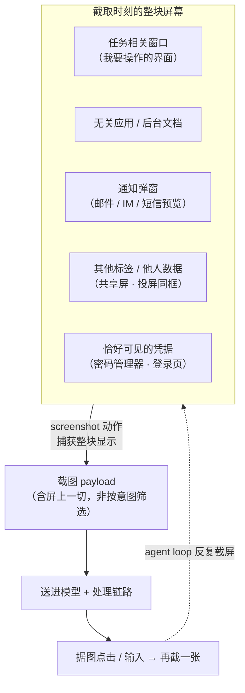

import PrivacyMeta from '@site/src/components/PrivacyMeta';

<PrivacyMeta era="卷四 · RAG 与 Agent" technique="RAG 与 Agent 隐私" audience={['安全工程师', '隐私工程师']} severity="高" maturity="生产" evidence="官方文档" />

> 一句话摘要：GUI / computer-use agent 的工作方式，就是**反复截屏**——先看清屏幕、再点鼠标敲键盘。它看的不是「任务相关的那一块」，而是**当前屏幕上显示的一切**：其他打开的应用、弹出的通知、后台的文档、别的浏览器标签、共享屏 / 投屏时同框的他人数据、乃至恰好可见的密码管理器。这些都随截图一起被送进模型——**远超任务所需的环境私有数据**。这不是注入（注入归《[Agent 工具外联外泄](./agent-tool-exfiltration.mdx)》），也不是 MCP 数据流（归《[MCP 数据流与最小采集](./mcp-data-flow-privacy.mdx)》），而是**输入面本身的过采集**：截屏是一条环境隐私的消防水管。结论先行：Anthropic 的 computer use 工具与 OpenAI 的 Operator 都已发货、也都在官方文档里点破了这一面（把敏感数据挪出屏幕、专用 VM 隔离、敏感输入交人接管、sensitive site 要人监督）。真正的边界不在「模型自觉少看」，而在**捕获面**：截屏前先把无关的、敏感的东西请出这块屏幕。

## 机制：我这边发生了什么

computer-use 的核心是一个 agent loop：我请求一次 `screenshot`、你的环境把**当前显示的整块屏幕**渲染成图片回给我，我据此判断点哪里、敲什么，然后再截一张看结果——如此往复直到任务完成。Anthropic 官方文档把这个动作写得很直白：截屏就是「看到屏幕上当前显示的内容（See what's currently displayed on screen）」；较新的 `zoom` 动作甚至能把某个区域按**全分辨率**再看一遍，好认清小字。OpenAI 的 CUA 同理——靠解读**截屏**来操作 GUI 的按钮、菜单、文本框。

关键在于：**截屏捕获的是整块显示，而不是「与任务相关的那一小块」**。屏幕上此刻还开着什么——邮件客户端的收件箱预览、右下角弹出的 Slack / 短信通知、后台没关的一份合同 PDF、另一个浏览器标签里的病历——只要它可见，就在这张图里，就随这次工具调用被送进模型。

红线说清楚：这里不该写「我会挑任务相关的内容看、自动过滤掉无关的隐私」——**我看什么、送什么，不是我在推理时凭意图挑选的**，而是「你的环境把哪块屏幕截给我」决定的一次数据传输。可外部观测、可复算的是那张**截图 payload 本身**：它包含了截取时刻屏幕上的一切，落进这次 API 请求、以及处理它的那条链路——这可以逐帧审计、逐区域比对，与我「想不想只看相关内容」无关。判据一句话：谓语必须是别人能从外部看到的（截图里到底有什么），而不是我自己「知道该看哪里」。



## 威胁面：一张截图里到底截进来什么

不需要攻击者，**捕获这个动作本身**就把远超任务所需的环境私有数据带进了模型上下文：

- **无关的其他应用 / 后台文档。** 我要操作的只是一个浏览器窗口，但截图把同屏的邮件客户端、IDE 里打开的源码、后台那份没关的合同 / 病历 PDF 一并收进。它们与任务无关，却和任务窗口在同一张图里。
- **通知弹窗。** 截取的那一瞬，右下角 / 顶部弹出的邮件预览、IM 消息、短信验证码、日历提醒——这些「一闪而过」的内容会被定格进截图，连同发件人、正文片段一起送出。
- **共享屏 / 投屏时同框的他人数据。** 在会议投屏、屏幕共享、或多人共用的显示器上跑 computer-use，截屏会把**别人的**窗口、聊天、文档一并截走——泄露的不是操作者自己的隐私，而是同框第三方的。
- **恰好可见的凭据。** 屏幕上开着的密码管理器、自动填充下拉、明文 token、`.env` 编辑器、登录页已填的密码框——只要在截取时刻可见，就进了截图。Anthropic 官方安全须知正是冲这个来的：**别给模型访问敏感数据（如账户登录信息），以防信息被窃取。**
- **屏幕内容还是注入入口——但注入本身另算。** 屏幕上（网页、图片里）藏的指令可能被我当命令执行，Anthropic 也为此在**截屏侧**加了注入分类器。但「被注入→驱使外泄」这条链归《[Agent 工具外联外泄](./agent-tool-exfiltration.mdx)》；本条只讲**捕获过采**这一面，不覆盖注入。

**攻击者模型 / 泄露单位**：本条主线是**无攻击者的常态过采**——泄露单位是「一次截屏里被捕获的、超出任务所需的屏幕区域」，可在 host↔模型边界抓 payload 逐区域核。它不要求对手知道你的屏幕布局；一旦叠加投屏 / 共享显示，受害者还可能是**同框的第三方**，而非操作者本人。

**边界**（和相邻两条划清界线）：

- **本条 vs《[Agent 工具外联外泄](./agent-tool-exfiltration.mdx)》**：那条是**有攻击者**的注入→经工具外联把私有数据**发出去**（行动 / 输出侧）；本条是**无攻击者**的**输入面过采**——为了操作界面，把整屏（含无关 / 敏感内容）**看进来**（输入侧）。方向相反。
- **本条 vs《[MCP 数据流与最小采集](./mcp-data-flow-privacy.mdx)》**：那条讲 host 按协议与同意把**上下文字段切片**交给各 MCP server（结构化数据流）；本条讲**屏幕像素**这一路输入——采集单位是「屏上可见区域」而非「上下文字段」，最小化手段也不同（清桌面 / 隔离 VM，而非按 server 收窄字段）。

## 防护原理

过采要成立，前提是「无关 / 敏感内容**恰好可见**、于是被截进来」。所以防护落在**捕获面**——收窄「截屏时刻屏幕上有什么」，而不是指望模型自觉少看：

- **最小屏幕面（专用 profile / 干净桌面 / 隔离 VM）。** 让 computer-use 跑在一个**专用、干净**的环境里：独立虚拟机 / 容器、独立用户 profile、桌面上只留任务所需的窗口，别在同一块屏上同时开着私人邮件、病历、源码。Anthropic 官方安全须知的第一条正是**用最小权限的专用 VM / 容器**，OpenAI 的 CUA 也跑在受控的虚拟浏览器 / 环境里。这样即便整屏被截，屏上也没有多余隐私可截。
- **敏感输入走人接管（takeover）。** 需要输入密码 / 支付信息 / 验证码这类高敏内容时，**交给人来敲**、别让它经模型。OpenAI 的 Operator 把这条产品化为 **takeover mode**：遇到需登录 / 付款的步骤，Operator 会请用户接管，且**在接管期间不采集、不截屏用户输入的内容**——敏感数据因此不进模型。
- **隐藏通知与后台。** 截屏前进「勿扰 / 演示」模式，关掉弹窗预览、收起或最小化无关窗口，别让「一闪而过」的通知被定格进图。
- **别把凭据放在捕获面上。** 密码管理器、明文 token、`.env`、已填的登录框——凡不想被截的，就别在 computer-use 会话期间开在这块屏上（对应 Anthropic「别给模型访问账户登录信息」）。
- **敏感站点要人监督（watch mode）。** 在邮件 / 金融这类高敏站点上，让人**盯着**每一步、随时能叫停。OpenAI 对 sensitive site 要求 **watch mode**——用户离开或不活跃时自动暂停，正是这条的产品形态。

点破边界：**这些是「收窄捕获面 + 高敏交人」的访问控制，不是加密，也不是让模型「学会只看相关处」。** 屏上一旦有多余隐私、又被截进图，它就已经进了这次请求；防护能做的是**让屏上先没有那些东西**（清场 / 隔离 / 人接管），而不是事后指望模型不看。

## 落地实现（配方）

```text
1. 专用隔离环境：computer-use 跑在独立 VM / 容器 + 独立用户 profile，最小权限；
   桌面只留任务窗口，不与私人邮件 / 病历 / 源码同屏。（对应 Anthropic 安全须知第 1 条）
2. 高敏输入交人接管：登录 / 支付 / 验证码等步骤切到「人接管」，由人直接敲、不经模型；
   接管期间不截屏、不采集用户输入。（对应 Operator takeover mode）
3. 清场再截屏：进入会话前开「勿扰 / 演示」模式，关通知预览、收起无关窗口、退出
   密码管理器 / 明文凭据界面。
4. 敏感站点人监督：邮件 / 金融等 sensitive site 上启用「有人盯 + 可叫停」，人不活跃即暂停。
   （对应 Operator watch mode）
5. 域名 allowlist + 高危动作人确认：把可访问站点限到白名单以减少接触恶意内容；
   accept cookie / 交易 / 同意条款等有现实后果的动作要人确认。（对应 Anthropic 安全须知第 3、4 条）
6. 捕获面审计（见下「最小可测试断言」）：定期核「一次截屏里实际含哪些屏幕区域 /
   敏感面」，把过采变成可回归的检查。
```

每一步都要绑定**你自己的敏感面清单**——「哪些窗口 / 站点 / 字段算敏感、哪些必须人接管」不画清，清场与 allowlist 都无从设计。

**最小可测试断言**（把「截进来多少」收成可回归的审计，别停在「我们隔离了环境」）：

- 怎么测：在**受控**桌面上跑一段代表性 computer-use 任务，落盘它实际发出的每张截图 payload；对截图做**区域 / 面识别**——是否出现任务窗口之外的应用、通知弹窗、凭据界面、或（投屏场景下）他人窗口；同时构造一次「登录 / 支付」步骤，验证它是否切到人接管、且接管期间**没有**产生截图。
- 通过：每张截图里的可见内容 ⊆ 任务所必需的窗口 / 区域（无越界应用、无通知、无凭据、无他人数据）；高敏输入步骤走人接管且接管期零截图。两条断言全绿。
- 失败：截图里出现任务外的应用 / 通知 / 凭据 / 他人窗口，或高敏输入被直接截进图 → 收窄桌面（清场 / 隔离 profile / 专用 VM）、把该步骤改成人接管、把该站点降级到 watch mode。

## 真实案例 / 厂商现状（生产：已发货的 computer-use / Operator + 其官方隐私·安全警示）

诚实先讲清楚（这是本条的准确门槛）：**「纯捕获过采」这一角度，截至本段打戳（2026-06）尚无一起公开、已证实的真实受害泄露复盘**——已见诸报道的 computer-use / GUI-agent 事故，多是「有攻击者」的屏幕内容注入路径，那属于《[Agent 工具外联外泄](./agent-tool-exfiltration.mdx)》。所以本条 `maturity=生产`，**不是**由某次泄露支撑，而是由「能力已发货 + 广泛可用 + 厂商官方文档把这些捕获面风险写成明文警示与产品机制」支撑：

- **Anthropic —— Computer use 工具（官方文档，beta，随模型持续更新）。** 官方把截屏定义为「看到屏幕上当前显示的内容」，并给出四条**安全须知**：① 用最小权限的**专用 VM / 容器**；② **别给模型访问敏感数据**（如账户登录信息）以防信息被窃取；③ 把上网限到**域名 allowlist** 以减少接触恶意内容；④ 对有**现实后果**的决定与需明确同意的动作要**人确认**。文档还说明：截屏 / 鼠标 / 键盘输入**由你的环境捕获与存储**（不由 Anthropic 保存），并在**截屏侧**跑注入分类器——命中疑似注入时会**要求用户确认**再继续。这些正是官方对「捕获面过采 + 屏幕内容风险」的明文承认。
- **Anthropic Privacy Center —— Computer use 会处理哪些个人数据（官方）。** 专页说明 computer use 会捕获 / 处理**截屏与鼠标、键盘输入**，并交代其处理与后端保留安排——把「这条输入面会采集什么」写成了面向用户的隐私说明。
- **OpenAI —— Operator / CUA（Operator System Card，2025-01-23；research preview）。** CUA 靠**解读截屏**操作 GUI；OpenAI 为敏感面配了多层机制：**takeover mode**——遇登录 / 支付等敏感输入请用户接管，且**接管期间不采集、不截屏用户输入的内容**；**watch mode**——邮件 / 金融等 sensitive site 要求用户监督、离开即暂停；外加 **monitor model**、对高风险任务的**主动拒绝**、以及针对屏幕内容的**注入分类器**。这几条恰是本条「敏感输入交人、敏感站点人监督、清场捕获面」的产品化背书。

共同的落点：**两家都已把 computer-use 发货，也都在官方材料里把「截屏会把屏上一切看进去」当成要主动管的隐私 / 安全面——用隔离环境、人接管、人监督来收窄捕获面，而不是假设模型只看相关处。** 这条输入面可逐帧审计、由环境与产品设计决定。

## 残余风险与权衡

逐条点破假安全：

- **「我只做了任务相关的操作，所以只看了相关内容」是错的。** 截屏捕获的是**整块显示**，不是「我操作的那一块」。只要无关 / 敏感内容当时可见，它就在图里、就被送出——与我执行了哪些动作无关。这是本条最核心的误判。
- **隔离 VM / 清场有代价，且不是零成本。** 专用虚拟机 / 干净 profile 增加搭建与运维摩擦；很多真实任务恰恰**需要**访问用户自己的登录态、文件、邮箱，把这些从屏上彻底清走就做不成任务——于是要在「可用」与「少截」之间权衡，用 takeover / watch mode 兜住最敏感的那部分，而非一刀切清空。
- **人接管 / 人监督会疲劳、也可能被绕。** takeover / watch mode 靠人在关键处介入；确认疲劳、监督走神、或任务被设计得频繁弹接管，都会让人草草放行。它们降风险、不给绝对边界。
- **通知是「一闪而过」的高危面。** 弹窗只在截取的那一瞬可见就足以被定格；没进「勿扰」模式，验证码 / 私信 / 邮件预览随时可能恰好入镜——这类泄露最难事后察觉。
- **投屏 / 共享屏泄露的是第三方。** 在会议投屏或共用显示器上跑 computer-use，截走的是**别人的**窗口 / 数据，受害者不是操作者本人，事后归因与告知都更难。
- **注入面另算、且未解。** 屏幕内容还是注入入口（Anthropic 为此加了截屏侧分类器），但「被注入→外泄」归《[Agent 工具外联外泄](./agent-tool-exfiltration.mdx)》；把本条的捕获面收窄做全，也**不等于**防住了注入，那需要注入红队 + 出站管控另行兜底。
- **厂商保留 / 处理仍要看条款。** 截屏由谁捕获、存多久、是否用于其他用途，取决于该厂商的具体条款与你的配置（如 Anthropic 说明截屏由你的环境存储、并有后端保留 / ZDR 安排）——「本地隔离」缩小了屏上有什么，管不到截图离开后被谁怎么处置。

## 合规映射

- **GDPR 数据最小化（Art. 5(1)(c)）与最小捕获面。** 「只把任务所必需的东西看进来」正是数据最小化在屏幕输入面的投影；把整屏（含无关 / 敏感内容）截进模型，与该原则相悖。若截屏含**他人**个人数据（投屏 / 共享屏场景），还涉及对第三方数据主体的合法性基础问题。
- **OWASP LLM02:2025（敏感信息披露）与 LLM01:2025（提示注入）。** 过采把敏感信息经屏幕输入面带入上下文，属 LLM02 的形态之一；屏幕内容作为注入入口对应 LLM01（但注入链本身见《[Agent 工具外联外泄](./agent-tool-exfiltration.mdx)》）。

（合规随法条 / 框架版本演进，本段打戳 2026-06，引用前核对最新生效文本。）

## 版本说明

:::note 适用版本
「computer-use 靠反复截屏工作 → 屏上一切（含无关 / 敏感内容）随之被捕获送进模型」是**与具体厂商无关**的范式级结论（根因在于「以屏幕像素为输入」这一交互方式）。但其中的**具体机制**——Anthropic computer use 的安全须知与截屏侧注入分类器、后端保留 / ZDR 安排，OpenAI Operator 的 takeover / watch mode 与 monitor model——**按版本演进，厂商实现变化很快**：本条依 Anthropic computer use 工具文档与其隐私专页、OpenAI Operator System Card（**2025-01-23**）与 Introducing Operator、OWASP LLM Top 10 2025 核验，打戳 **2026-06**；computer-use 功能仍多处于 beta / research preview，任何落地决策请以你查到的**当下**厂商文档、其默认设置与你自己的捕获面审计为准。（出处核验于 2026-06；WebFetch 对 OpenAI 官方页返回 403，Operator 的 takeover / watch mode 描述经其官方页与多方转述交叉核验。）
:::

## 延伸阅读与出处

> 主要：官方文档（Anthropic computer use 工具的截屏定义与安全须知、OpenAI Operator 的 takeover / watch mode）；补充：厂商隐私说明（Anthropic Privacy Center）与框架（OWASP LLM01/LLM02）。**本条为「捕获面过采」的治理 / 厂商现状角度，非某次已证实的过采泄露复盘**（见「真实案例 / 厂商现状」的诚实说明）。

- [Anthropic — Computer use tool（官方文档）](https://platform.claude.com/docs/en/agents-and-tools/tool-use/computer-use-tool) —— 截屏 = 「看到屏幕上当前显示的内容」的 agent loop；四条安全须知（专用 VM / 最小权限、别给敏感数据、域名 allowlist、高危动作人确认）与截屏侧注入分类器。本条「机制」「防护原理」「厂商现状」的一手出处。
- [Anthropic Privacy Center — What personal data will be processed by Computer use (beta)](https://privacy.anthropic.com/en/articles/10030352-what-personal-data-will-be-processed-by-computer-use-beta) —— computer use 捕获 / 处理截屏与鼠标、键盘输入及其保留安排。本条「这条输入面采集什么」的厂商隐私说明。
- [OpenAI — Operator System Card（2025-01-23）](https://openai.com/index/operator-system-card/) —— CUA 靠解读截屏操作 GUI；takeover mode（交人输入敏感信息、期间不采集 / 不截屏）、watch mode（sensitive site 人监督）、monitor model、截屏注入分类器。本条「敏感输入交人 / 敏感站点人监督」的一手背书。（⚠️ WebFetch 返回 403，内容经 OpenAI 官方页与多方转述交叉核验。）
- [OpenAI — Introducing Operator](https://openai.com/index/introducing-operator/) —— research preview 说明：takeover mode 下不采集 / 不截屏用户输入的敏感信息、sensitive site 需 watch mode 监督。本条 takeover / watch mode 描述的补充一手出处。（⚠️ 同上，403，经交叉核验。）
- [OWASP Top 10 for LLM Applications 2025 — LLM02 敏感信息披露 + LLM01 提示注入](https://owasp.org/www-project-top-10-for-large-language-model-applications/assets/PDF/OWASP-Top-10-for-LLMs-v2025.pdf) —— 过采把敏感信息经输入面带入上下文属 LLM02；屏幕内容作注入入口对应 LLM01。本条合规映射的框架依据。
