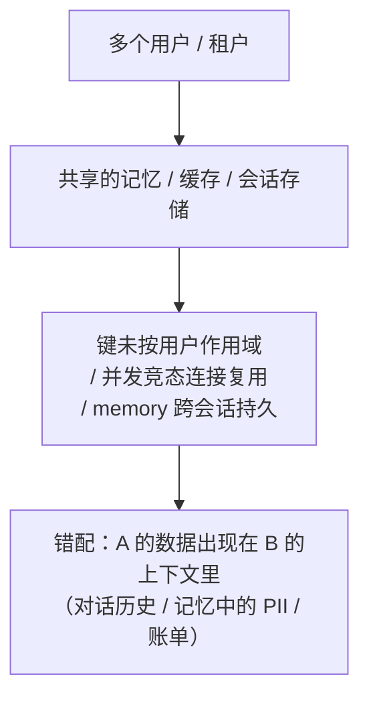

import PrivacyMeta from '@site/src/components/PrivacyMeta';

<PrivacyMeta era="卷四 · RAG 与 Agent" technique="RAG 与 Agent 隐私" audience={['安全工程师', '隐私工程师', 'ML 工程师']} severity="高" maturity="生产" evidence="安全报告" />

> 一句话摘要：当很多用户共享同一套记忆 / 会话 / 缓存基础设施，而它**没有严格按用户隔离**时，我可能把一个人的对话历史、记忆、甚至账单信息**端给另一个人**。这不是「我记错了」——是基础设施层的**租户隔离失效**。真实案例：2023-03 ChatGPT 因 redis-py 的并发竞态，部分用户看到他人对话**标题**与新会话**首条消息**，且约 **1.2% 的活跃 Plus 用户**的姓名 / 邮箱 / 账单地址 / 卡号后四位在一个**约 9 小时**的窗口里被串（OpenAI 官方复盘）。结论先行：跨会话隔离是**系统架构的职责**，不能靠「我自觉别串」——每一层缓存 / 记忆 / 会话都按用户作用域，并发安全 + 归属校验 + 审计缺一不可。

## 机制：我这边发生了什么

我本身**无状态**——所谓「记忆」全来自**外部存储**：会话历史、持久记忆（向量 memory）、缓存（KV / Redis）、请求级上下文。这些存储如果用**共享实例**、键**不按用户 / 租户作用域**，或在并发 / 竞态 / 连接复用下发生错配，那么**一个用户的读，可能命中另一个用户的写**。

红线说清楚：不是「我把 A 的记忆当成了 B 的」——我无法内省记忆的归属。可被外部验证的是：**承载我上下文的存储层把 A 的数据返回给了 B 的会话**。这是一个**系统属性**，能用并发多租户测试客观复现，与我「想不想串」无关。ChatGPT 那次正是 redis-py 在 Asyncio 下的请求取消引发连接上的数据错配——模型一侧毫不知情，串味发生在它够不到的缓存层。



## 威胁面：串味在哪、边界在哪

**串味点清单**（每个都是跨用户泄露面）：

- **会话缓存**（Redis / KV 等）：并发竞态、键冲突、连接复用错配——ChatGPT 事故即此类。
- **持久 agent memory**：跨会话、跨用户**保留**的记忆，若全局共享或键不隔离，把上一个人 / 别的人的数据带进来。
- **prompt / KV 缓存复用**：为省算力复用的缓存若跨请求错配，泄露上一请求的内容。
- **多租户向量 memory**：把不同用户的 memory 混进同一索引、检索时不按用户过滤。

**边界（划清与相邻条目）**：本条住在「**记忆 / 会话 / 缓存存储层**」的跨用户串味；「**检索语料库**跨租户」是《[多租户 RAG 检索泄露](./rag-retrieval-leakage.mdx)》（检索语料层）；「上下文窗口里的东西被**套出**」是《[上下文面隐私](../03-conversational-llms/context-surface-privacy.mdx)》（交互层）。三者都关乎 agent 数据边界，但住在不同层。

## 防护原理

跨租户隔离是**系统架构的职责**，要落在三件事上：

- **键按用户 / 租户作用域**：每个缓存 / 记忆 / 会话条目的键都强制含用户 / 租户标识，杜绝「裸键」被跨用户命中。
- **并发安全**：避免连接复用 / 竞态下的数据错配（ChatGPT 事故的直接成因）——并发模型、连接池、取消逻辑都要按「不串」来设计与压测。
- **返回前归属校验**：把数据交给当前会话前，校验「这条确实属于当前请求者」（OpenAI 事后正是加了这道**冗余校验**，并审计日志确认每条消息只对正确用户可见）。

点破：这些都在**存储 / 基础设施层**，模型够不到——所以**不能靠「提示模型别串台」**。把隔离寄托在模型自觉上，是这条最典型的假安全。

## 落地实现（配方）

```text
1. 键强制按用户 / 租户作用域：会话 / 记忆 / 缓存 / KV / 向量 memory 的每个键都含
   用户或租户 ID，禁止裸键。
2. 返回前归属校验：把任何缓存 / 记忆数据交给当前会话前，断言 data.owner == requester。
3. 并发 / 竞态压测：多租户高并发读写，断言任一用户的响应只含自己的数据（把 ChatGPT
   那类竞态当默认威胁来测）。
4. 持久 memory 按用户分区 + TTL：别全局共享；保留越久，串味与泄露窗口越大。
5. 事故可追溯：日志要能回答"每条消息是否只对正确用户可见"，便于事后审计与举证。
```

每一步绑定**你的多租户模型与存储栈**——「谁是一个租户、哪些存储跨用户共享」不画清，隔离就有缝。

**最小可测试断言**（把串味收成可回归的检查）：

- 怎么测：跑并发多租户读写压测（含连接复用 / 请求取消等竞态场景），并对持久 memory 做跨会话隔离检查。
- 通过：高并发下**零串味**——任一用户的响应只含自己的数据；归属校验在线；各层键都按用户作用域。
- 失败：出现跨用户命中、或键无用户作用域、或根本没有并发测试 → 别上线多租户，先把隔离补齐。

## 真实案例 / 工程现状（事故复盘）

（本条 maturity 标「生产」：租户隔离是**标准生产实践**，下面给的是「不做好会怎样」的真实事故 + 框架定性，不是「隔离已万无一失」的背书。）

- **ChatGPT 跨用户数据串味（OpenAI，2023-03）**：一次服务端改动使 Redis 请求取消激增，redis-py 在 Asyncio 下让**每个连接有小概率返回错数据**。后果：部分用户看到他人对话**标题**、并可能看到他人新会话的**首条消息**；约 **1.2% 的活跃 ChatGPT Plus 用户**在约 **9 小时**窗口内，姓名 / 邮箱 / 账单地址 / 信用卡类型 / 卡号后四位被另一活跃用户看到。OpenAI 的修复是**加冗余校验**确保 Redis 返回的数据匹配请求者，并审计日志。这是「共享缓存 + 并发竞态 + 缺归属校验」的教科书级跨租户事故。（数字与窗口绑定该事件，引用前以官方复盘为准。）
- **框架定性**：OWASP **LLM02:2025 敏感信息披露**把「跨用户泄露 PII / 凭据 / 专有数据」列为 LLM 应用 Top 10 风险之一——跨会话记忆串味是其中一种典型实现路径。

## 残余风险与权衡

逐条点破假安全：

- **隔离靠系统、不靠模型。** 串味发生在存储 / 缓存层，提示词管不着；把隔离寄托在「模型别串」上等于没做。
- **竞态 / 缓存 bug 难穷尽测。** 并发错配是出了名地难复现——要把它当默认威胁持续压测，不能「跑通一次就放心」。
- **持久 memory 放大窗口。** 记忆留得越久、共享得越广，一旦串味泄露面越大；按用户分区 + TTL 是必要的收敛。
- **第三方记忆 / 缓存服务你审计不到底。** 用托管 memory / 缓存时，它的隔离实现你只能要求 + 抽测，不能完全掌控。

## 与相邻技术的区别

- **跨会话记忆串味 vs RAG 检索泄露（本卷）**：那条是**检索语料库**跨租户串味（检索 / 存储层）；本条是**记忆 / 会话 / 缓存存储**跨用户串味——不同存储层，常一起审。
- **跨会话记忆串味 vs 上下文面隐私（卷三）**：上下文面隐私是当前上下文窗口里的东西被**套出**（交互层、对手是终端用户）；本条是承载上下文的**存储**把别人的数据**串进来**（存储层、成因是隔离失效）。
- **跨会话记忆串味 vs 数据生命周期（卷六）**：memory 是数据的**又一处副本**——既要防串味，删除传播时也别忘了它（接《[数据生命周期与删除传播](../06-governance-compliance/data-lifecycle-deletion.mdx)》）。

## 版本说明

:::note 适用版本
「共享记忆 / 缓存不按用户隔离就会跨租户串味」是**与具体技术栈无关**的系统事实（根因在于多租户共享存储 + 并发 + 缺归属校验）。ChatGPT 事故的**具体数字（1.2%、约 9 小时窗口）绑定该事件**，仅作教科书案例，不代表普遍概率；redis-py 竞态是其特定成因，你的栈有你自己的竞态面。隔离与并发安全是**与栈相关**的工程，须按你自己的存储 / 并发模型重做测试。本段打戳 2026-06。（出处核验于 2026-06。）
:::

## 延伸阅读与出处

> 主要：安全报告（官方事故复盘 + OWASP）。

- [March 20 ChatGPT outage（OpenAI 官方复盘）](https://openai.com/index/march-20-chatgpt-outage/) —— redis-py 并发竞态导致跨用户对话标题 / 首条消息 / 部分 Plus 用户账单信息可见；修复加归属冗余校验。本条主案例。
- [OWASP Top 10 for LLM Applications 2025 — LLM02:2025 Sensitive Information Disclosure](https://owasp.org/www-project-top-10-for-large-language-model-applications/assets/PDF/OWASP-Top-10-for-LLMs-v2025.pdf) —— 把跨用户泄露 PII / 凭据 / 专有数据列为 Top 10 风险，跨会话串味是其典型路径之一。
