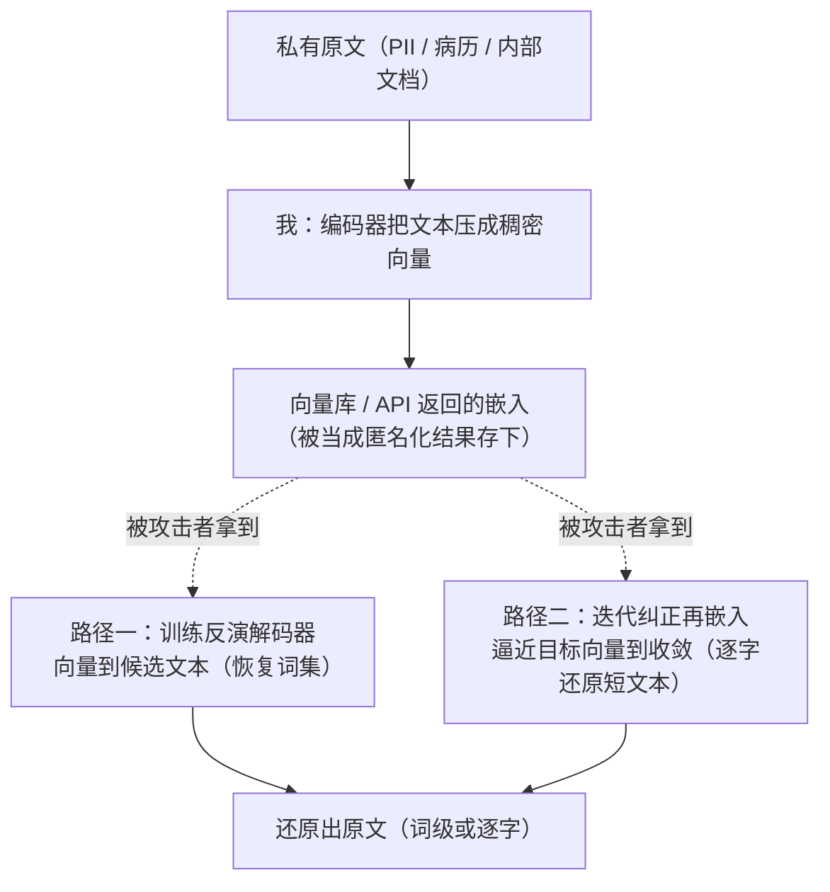

import PrivacyMeta from '@site/src/components/PrivacyMeta';

<PrivacyMeta era="卷四 · RAG 与 Agent" technique="RAG 与 Agent 隐私" audience={['隐私工程师', '安全工程师', 'ML 工程师']} severity="高" maturity="研究" evidence="研究支持" />

> 一句话摘要：把私有文本嵌入成向量、存进向量库，**不等于匿名化**——嵌入可被**反演回原文**。Song & Raghunathan（CCS 2020）在其设置下从句嵌入恢复出输入约 **50–70% 的词**（词集，无序）；Morris 等的 vec2text（EMNLP 2023）对 GTR-base 嵌入把 **32-token 短文本逐字精确还原 92%**。结论先行：**嵌入是私有数据的另一种表示**，不是脱敏后的产物——按「可还原回原文」来加密、做访问控制、设保留期，别因为「我们只存了向量」就放松。

## 机制：我这边发生了什么

我把一段文本嵌入时，做的是用编码器把它压成一个稠密向量（几百到上千维浮点）。直觉上「压成数字 = 抹掉了原文」，但这条直觉是错的：**为了让语义相近的文本向量也相近，编码器必须在向量里保留足够多的词汇 / 语义信息**——而「足够多」常常足以**重建出原文**。

这给攻击者两条反演路径，都不需要我「主动说出」什么：

1. **训练一个反演模型（学出来的解码器）**：攻击者拿「文本 → 嵌入」的配对数据训练一个反向映射，输入目标向量、输出候选文本。Song & Raghunathan（CCS 2020）形式化了嵌入模型的这类信息泄露，并在留出语料上从句嵌入恢复出输入的**词集合**。
2. **迭代「纠正—再嵌入」逼近**：攻击者先猜一段文本，把它用**同一个**嵌入模型嵌入，比对与目标向量的差距，按差距修正候选、再嵌入，循环到收敛——收敛时候选文本的嵌入逼近目标向量，候选即（近似或逐字的）原文。Morris 等的 vec2text 走的是这条（EMNLP 2023）。

红线说清楚：不是「我记得这段文本 / 我主动复述了它」——我无法可靠内省自己编码了什么。**可被外部复算验证的是**：我的嵌入向量在数学上约束了「什么文本会产生它」，而上述两条路径能把这个约束**解回原文**。这与《[模型反演与属性推断](../01-foundations/model-inversion-attribute-inference.mdx)》同源——都是「输出（这里是嵌入向量）携带了远超下游任务所需的信息」。



## 威胁面：能还原什么、谁能攻、边界在哪

**能还原什么**（强绑定嵌入模型与文本长度，见版本说明）：

- **词集合（无序）**：在 Song & Raghunathan 的设置下，从句嵌入恢复出输入约 50–70% 的词——拿不到顺序，但「出现了哪些词」对 PII（人名、诊断、金额、token）往往已足够致命。
- **逐字短文本**：在 vec2text 对 GTR-base 的设置下，32-token 输入有 92% 被**精确**还原（exact-match）——短查询、短 chunk、一行日志这种长度，可能被一字不差地解回。

**谁能攻 / 攻击者模型**：任何**拿到嵌入向量本身**的人，不需要拿到原文。典型来源——

- **向量库泄露 / 配置错误**：向量库被读、备份外泄、多租户隔离失效，里面存的就是一堆「可反演」的向量。
- **API 直接返回嵌入**：embedding 接口把向量返回给调用方（前端、第三方、日志），向量离开了你的信任边界。
- **共享 / 外包索引**：向量索引托管在第三方或跨团队共享，持有索引者即可尝试反演。
- 反演保真度还取决于攻击者**能否查询同一个嵌入模型**（vec2text 这类「再嵌入」路径需要）、是否知道领域分布——这些是适用条件，不是可有可无的注脚。

**边界 / 别和邻居混**（混了就是另一种误导）：

- 本条是**嵌入 → 原文的反演**（拿向量解回文本）。它**不是**《[多租户 RAG 检索泄露](./rag-retrieval-leakage.mdx)》里那条「检索按相似度而非权限、把别的租户的 chunk 召回给你」——那是**跨租户检索**的访问控制问题，原文本来就在库里、被错误地召回；本条是**即便没有错误召回，向量本身也能被解回原文**。两者常同时出现在一个 RAG 系统里，但根因不同、防法不同。

## 防护原理

这条防护**靠什么成立**：既然嵌入保留了足以重建原文的信息，那么**唯一稳妥的前提**就是把嵌入**当作私有数据的一种表示**来对待——它享受的保护下限，应等于原文。具体保护什么、不保护什么：

- **「当私有数据保护」保护的是**：通过同等的加密、访问控制、保留 / 删除策略，把「拿到向量」的门槛抬到和「拿到原文」一样高——攻击者拿不到向量，就无从反演。
- **它不保护的是**：一旦向量已经离开边界（API 返回、库泄露、索引外包），加密 / ACL 就管不着了；此时只剩「让向量本身更难反演」这条**经验性**防线（对嵌入加扰动、降维、量化），而**加扰会同时损伤检索 / 下游效用**，且**降扰多少才挡得住反演没有普适保证**——必须对**你自己的**嵌入实测反演，而不是假设「降了维就安全」。

**业界怎么做：把嵌入当敏感数据。** 上面的「当私有数据保护」不是只停留在原则——它正是各托管向量库把「保护存储的嵌入」落成的生产原语：**静态加密 + 访问控制**。Pinecone 文档写明对存储数据用 AES-256 静态加密、连接走 TLS 1.2，并在组织与项目两级提供 RBAC、可配置 API key 角色（控制面 / 数据面分离），企业档另有客户自管密钥（CMEK，经 AWS KMS）。Azure AI Search 默认用微软托管密钥做 AES-256 静态加密、可叠加客户自管密钥（CMK），可加密对象明确含索引与向量化器（vectorizer），并把 RBAC 列为优先于访问策略的推荐模型。Weaviate、Qdrant 同样把 RBAC（Qdrant 经 JWT 做到集合级粒度）列为生产环境的推荐授权方式。这些都印证同一条工程结论：**向量化不是匿名化，所以业界对嵌入施加的保护下限，等于对原文**——加密存、按权限取，别把原始向量裸交给不受信方。监管侧也朝同一方向：欧盟 EDPB 第 28/2024 号意见（2024-12-17 通过）判定，用个人数据训练的 AI 模型并非天然「匿名」，只有当「以一切合理可用手段」直接或经查询提取出个人数据的可能性微不足道时才算匿名——这正是「派生产物默认不算匿名，要看能否被反演 / 提取」的原则，而本条的 vec2text / Song & Raghunathan 恰好给出了一条对嵌入的可提取路径。（注：EDPB 该意见针对模型本身、非专指向量库；此处取其「派生物是否匿名取决于可提取性」的判据，而非把它当对嵌入向量的直接裁定。出处核验于 2026-06。）

点破：**「我们只存了向量、没存原文」不是匿名化**。把它当匿名化、据此降低对向量库的加密 / 访问控制等级，就是这条的假安全——攻击者拿到的「匿名向量」可能被解回带姓名的原文。

## 落地实现（配方）

回归中性技术笔：

```text
1. 把嵌入归类为私有数据：向量库 / 嵌入缓存与原文同密级——同等静态加密、同等
   访问控制 (ACL / 多租户隔离)、同等保留与删除策略。别给向量库开「反正是匿名向量」
   的后门权限。
2. 收紧嵌入的外流面：embedding API 默认不把原始向量返回给不受信调用方 / 前端 / 第三方；
   确需返回时，知道这等于把可反演载荷交出去，按资产敏感度决策并记录。
3. 嵌入前先做 PII 处理：对要嵌入的文本先脱敏 / 占位（见 PII 检测与脱敏），从源头减少
   「即便被反演也只能解回已脱敏文本」——这比事后给向量加扰更可靠。
4. 必要时对嵌入加扰 / 降维 / 量化，但必须实测：任何「让向量更难反演」的处理都要
   ①测反演成功率降了多少 ②测检索 / 下游效用掉了多少，两条一起报，别只报一条。
5. 最小化存储：只嵌入 / 索引真正需要检索的内容，缩短保留期；不在日志里留原始向量。
6. 红队反演审计:对你的向量库 / 嵌入接口实跑反演 (训练解码器 + 迭代再嵌入)，量化
   "在你的嵌入模型、文本长度、是否可查询同模型下能还原到什么程度"，纳入发布前 eval。
```

第 1 步不是抽象口号：主流托管向量库已把它做成可勾选的产品能力——按厂商文档开启静态加密（Pinecone / Azure AI Search 默认 AES-256，需要更强控制时上 CMEK / CMK）、配 RBAC 与最小权限的 API key 角色（Pinecone 控制面 / 数据面分离；Qdrant 经 JWT 限到集合级；Weaviate / Azure 把 RBAC 列为生产推荐），别给向量库留「反正是匿名向量」的宽权限。第 2 步的外流面也包括嵌入 API 提供方怎么留数据：例如 OpenAI 平台文档说明 API 的输入 / 输出默认最多留 30 天用于滥用监控、之后删除，默认不拿去训练，合规客户可申请零数据保留（ZDR）——把原文发去算嵌入时，这条留存与训练策略同样要纳入「向量 / 原文是否离开边界」的评估。

每个结论都绑定**你的嵌入模型、文本长度分布与攻击者是否能查询同模型**——论文里的 50–70% / 92% 是各自实验设置下的数字，**不能直接迁移**到你的系统，必须自测。

**最小可测试断言**（把反演风险收成可回归的检查）：

- 怎么测：用你**自己**的嵌入模型，对一批含已知 PII 的代表性文本嵌入成向量，再对这批向量跑反演（训练一个反向解码器 + 迭代「纠正—再嵌入」逼近），统计词级召回率与逐字精确还原率，并复核还原出的文本里有没有命中那些已知 PII。
- 通过：在你部署的嵌入处理（脱敏 + 加扰 / 降维等）下，反演还原的文本**命中已知 PII 的比例接近零**、逐字精确还原率显著低于无防护基线；且向量库 / 嵌入接口对外的访问控制与加密等级**等于原文**。
- 失败：反演能从向量中解回带 PII 的原文（词级或逐字），而向量库被当成「匿名数据」放宽了加密 / ACL、或 embedding API 把原始向量裸返给不受信方 → 按配方逐层收紧。

## 研究进展（工程可行性）

（本条 maturity 标「研究」：以下是**学术实证**的反演结果，强绑定各自实验设置，不是「任何向量库随手就能解回逐字原文」的背书。）

- **从句嵌入恢复输入词集**：Song & Raghunathan（ACM CCS 2020）形式化了嵌入模型的信息泄露，提出反演 / 推断攻击，在留出的 BookCorpus 上从句嵌入恢复出输入约 **50–70% 的词**（恢复的是词集合，不含顺序）。这奠定了「嵌入不是单向不可逆」的结论。
- **逐字还原短文本（vec2text）**：Morris、Kuleshov、Shmatikov、Rush（EMNLP 2023，Outstanding Paper）提出 vec2text——通过**迭代地纠正候选文本并用同一模型再嵌入**来逼近目标向量，对 **GTR-base** 嵌入把 **32-token 文本输入精确还原（exact-match）92%**。这把「嵌入泄露」从「恢复一袋词」推进到「短文本逐字重建」。
- （后续研究在跨嵌入模型迁移、更长文本、防御鲁棒性上持续推进；本条聚焦奠基机制与边界，引用前核最新文献——反演质量随模型与文本长度变化很大，别把某一篇的最优数字当通用上限。）

## 残余风险与权衡

逐条点破假安全：

- **「只存了向量」不是匿名化。** 嵌入保留了重建原文所需的信息；把向量库当匿名数据降级保护，是头号误区。
- **反演保真度随设置剧烈变化。** 50–70% 词级、92% 逐字——分别绑定 Song & Raghunathan / vec2text 的嵌入模型、文本长度、是否可查询同模型。**短文本更危险**（vec2text 的强结果在 32-token 量级），长文本反演更难但不等于安全；你的真实数字必须自测。
- **加扰 / 降维是经验性防线，不是证明。** 对嵌入加噪声 / 降维可能抬高反演成本，但「降多少才安全」没有像 DP 那样的形式化保证，且必然损伤检索效用——必须把「反演下降」和「效用下降」一起量化，别只报有利的一边。
- **删了原文，向量可能还在。** 在主库删掉一条记录，不等于它的嵌入从向量库 / 缓存 / 备份里消失——残留的向量仍可被反演回那条「已删」原文。这条要和《[数据生命周期与删除传播](../06-governance-compliance/data-lifecycle-deletion.mdx)》一起处理：删除请求必须扇出到向量库。
- **嵌入一旦离开边界就收不回。** API 返回过、日志记过、第三方索引存过的向量，事后再收紧 ACL 也挡不住已经拿到向量的人去反演——所以「不外流」比「外流后补救」重要。

## 与相邻技术的区别

- **嵌入反演 vs.《[多租户 RAG 检索泄露](./rag-retrieval-leakage.mdx)》（本卷）**：检索泄露是**访问控制**问题——原文本就在库里，因「按相似度而非权限召回」被送给了不该看的租户；本条是**表示层反演**——即使没有错误召回，向量本身也能被解回原文。前者修检索侧的 ACL / 隔离，后者修「别把向量当匿名、并收紧向量外流」。同一 RAG 系统里两者常并存。
- **嵌入反演 vs.《[模型反演与属性推断](../01-foundations/model-inversion-attribute-inference.mdx)》（卷一）**：那条反演的是**分类模型的置信度输出**，重建的是**类别代表 / 敏感属性**；本条反演的是**嵌入向量**，重建的是**具体那段被嵌入的文本**（词集或逐字）。同属「输出携带超额信息」的大家族，但反演对象与保真度不同——一个给类别的「样子」，一个给原文。
- **嵌入反演 vs.《[数据生命周期与删除传播](../06-governance-compliance/data-lifecycle-deletion.mdx)》（卷六）**：那条讲删除请求要扇出到所有副本；本条给出了「为什么向量库必须在扇出清单里」的具体理由——残留向量可被反演回已删原文，删原文而留向量等于没删干净。

## 版本说明

:::note 适用版本
「文本嵌入可被反演回原文（词级乃至逐字短文本）」是**与具体嵌入模型无关**的范式级事实——只要编码器为相似度而保留了词汇 / 语义信息，反演就有抓手。但**能还原到多高保真**强绑定嵌入模型（Song & Raghunathan 的句嵌入 / vec2text 的 GTR-base）、文本长度（vec2text 的 92% 在 32-token 量级）、攻击者是否能查询同一模型、领域分布——论文里的 **50–70% 词级、92% 逐字数字绑定其原始模型 / 数据，不可直接迁移**到你的系统，须用**你自己的**嵌入实测反演。后续跨模型迁移与更长文本的反演方法在演进，本段打戳 2026-06。（出处核验于 2026-06。）
:::

## 延伸阅读与出处

- [Information Leakage in Embedding Models（Song & Raghunathan，ACM CCS 2020）](https://dl.acm.org/doi/10.1145/3372297.3417270) —— 嵌入泄露奠基：形式化嵌入模型的信息泄露，在留出 BookCorpus 上从句嵌入恢复输入约 50–70% 的词（词集，无序）。本条「词级反演」依据。
- [Text Embeddings Reveal (Almost) As Much As Text（Morris、Kuleshov、Shmatikov、Rush，EMNLP 2023，Outstanding Paper）](https://aclanthology.org/2023.emnlp-main.765/) —— vec2text 方法：迭代「纠正—再嵌入」逼近目标向量，对 GTR-base 嵌入把 32-token 文本逐字精确还原 92%。本条「逐字反演」依据。

**业界实践（补充：把嵌入当敏感数据怎么落地）**——本条核心证据（嵌入可反演）是上述研究；以下为生产侧的操作性印证，说明「向量化不是匿名化，所以加密存、按权限取」在主流托管向量库已是默认能力，非头条证据：

- [Pinecone 安全总览](https://docs.pinecone.io/guides/production/security-overview) —— 对存储数据 AES-256 静态加密、TLS 1.2 传输加密，组织 / 项目两级 RBAC + 可配置 API key 角色（控制面 / 数据面分离），企业档支持客户自管密钥（CMEK，经 AWS KMS）；SOC2 Type II / HIPAA / GDPR。把「嵌入按敏感数据保护」做成产品能力的一例。
- [Azure AI Search：配置客户自管密钥](https://learn.microsoft.com/en-us/azure/search/search-security-manage-encryption-keys) —— 默认以微软托管密钥做 AES-256 静态加密，可叠加客户自管密钥（CMK）；可加密对象含索引与向量化器（vectorizer），并明确「RBAC 优先于访问策略」。
- [Weaviate：配置 RBAC](https://docs.weaviate.io/deploy/configuration/configuring-rbac) 与 [Qdrant 安全指南](https://qdrant.tech/documentation/guides/security/) —— 两家均把 RBAC 列为生产环境推荐授权方式（Qdrant 经 JWT 做到集合级粒度，配合 API key 认证），佐证「向量库的访问控制对齐原文」是业界通行做法。
- [EDPB 第 28/2024 号意见（AI 模型与个人数据，2024-12-17 通过）](https://www.edpb.europa.eu/system/files/2024-12/edpb_opinion_202428_ai-models_en.pdf) —— 监管侧的判据：用个人数据训练的 AI 模型并非天然匿名，仅当「以一切合理可用手段」直接或经查询提取出个人数据的可能性微不足道时才算匿名。本条取其「派生物是否匿名取决于可提取性」的原则（针对模型本身、非专指向量库）。
- [OpenAI 平台数据控制](https://developers.openai.com/api/docs/guides/your-data) —— 嵌入 API 提供方的数据处理一例：API 输入 / 输出默认最多留 30 天用于滥用监控、之后删除，默认不用于训练，合规客户可申请零数据保留（ZDR）。评估「原文 / 向量是否离开边界」时一并看提供方留存策略。
