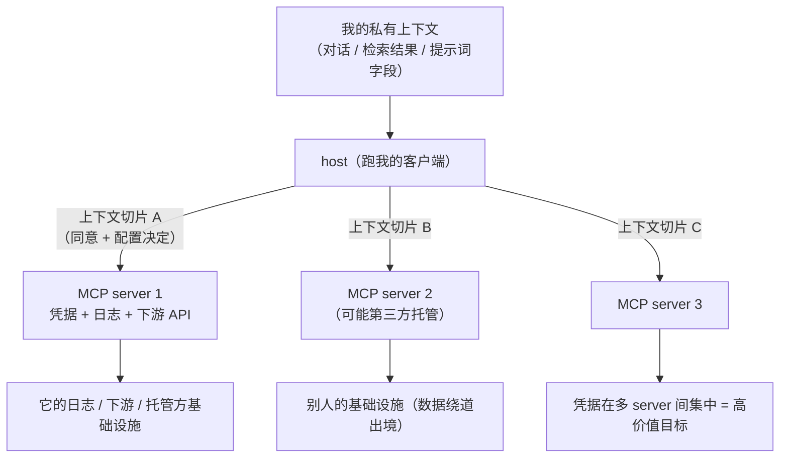

import PrivacyMeta from '@site/src/components/PrivacyMeta';

<PrivacyMeta era="卷四 · RAG 与 Agent" technique="RAG 与 Agent 隐私" audience={['安全工程师', '隐私工程师', '合规工程师']} severity="中" maturity="生产" evidence="官方文档" />

> 一句话摘要：接上一个 MCP server，host 会把我上下文的某个**切片**交给它——问题是交了哪些字段、这个 server 采集了多少、以及当你接了七八个 server 时凭据在它们之间怎么集中。这是**数据流与治理**问题，不是攻击：MCP 规范白纸黑字要求「host 必须先取得用户明确同意，才能把用户数据暴露给 server」，Anthropic 的软件目录政策更要求「软件只采集执行其功能所必需的上下文数据，即便为了日志也不得采集多余的对话数据」——现实里却常见一个 server 被授予远超所需的范围（为读一个文件夹却拿到整个 home 目录）、凭据在多个 server 间堆成一个高价值目标、数据经第三方托管的 server 绕道别人的基础设施。结论先行：**先画清「每个 server 到底收到我哪些上下文字段、这些字段是不是它所必需」，再谈接不接**；把「只连官方 server 就安全」「同意弹一次就够」当成整条边界，是这一层最常见的运营期假安全。

## 机制：我这边发生了什么

MCP 把「host（跑我的客户端，如 Claude Desktop / IDE）」和「server（提供工具 / 资源的进程，本地或远程）」拆开。当 host 接上一个 server、我要调它的某个工具时，host 会把我当前上下文里的一个**切片**打包发给这个 server：这次调用的参数、通常还有相关的对话片段、检索结果、乃至提示词里的某些字段。哪一片被交出去，由 host 的实现、这个 server 声明要的输入、以及你点过的那次「同意」共同决定——**不由我在生成时临时挑选**。

红线说清楚：这里不该写「我会守住你的隐私、只交必要的」——**交哪些字段不是「我」在推理时的选择**，而是 host↔server 之间的一次数据传输，由协议、配置与你的授权决定。可外部观测、可复算的是：**一个上下文切片离开 host、进入这个 server 的进程（本地或它的远端），落在它的日志、它的下游 API、它托管方的基础设施里**——这条数据流可以逐字段审计，与我「想不想交」无关。

一个 host 常同时接多个 server。于是同一份私有上下文可能被分发给多方，而每个 server 各自握着一把凭据（OAuth token、API key、数据库口令）。CoSAI/OASIS 的 MCP 安全文档点破了这里的结构性风险：把多个服务的凭据集中到单一协议层，会**违反隔离（segregation）原则**，让这些 server 变成「高价值目标」——一个被攻破或被过度授权的 server，爆炸半径就覆盖它触达的全部服务。



## 威胁面：过度采集、凭据集中、第三方绕道、影子服务

不需要攻击者，这条数据流本身就有四个**治理级**的泄露 / 扩面点：

- **server 过度采集（over-collection）。** server 收到的上下文切片超出它完成任务所需——最典型的是**范围过宽**：一个文件系统 server 为服务某一个文件夹，却被授予整个 home 目录的读权限；或一个 server 顺手把整段对话 transcript 收进日志。Anthropic 软件目录政策的红线正是冲这个来的：「只采集必需、即便为日志也不得采集多余对话数据」。过度采集把「一次性、为这个任务」的数据，变成了 server 侧的长期留存。
- **凭据 / token 集中。** 你接的 server 越多，凭据在它们之间越集中；一个被攻破或被过度授权的 server 就是一个宽面暴露口。CoSAI/OASIS 把它列为 MCP 头号风险类目之一（凭据可能「未经加密保护、无安全存储标准、无轮换策略」地在 server 侧堆积），并提醒可借此做**跨服务关联**、拼出完整用户画像。
- **第三方托管的 server 绕道。** 一个远程、由第三方托管的 server，会把你的上下文切片路由经**别人的基础设施**——你信任的是「接了这个能力」，但数据实际落在它托管方那里。NSA/CISA 的 MCP 安全 CSI 因此建议**优先选服务方自己直接托管的 server**、而非第三方中介，以缩小暴露面。
- **影子 / 未纳管的 server。** 没走审批、不在清单、没做安全评审就被接上的 server——OWASP 把它单列为 **MCP09:2025 影子 MCP server**。你连自己把上下文交给了谁都不清楚，也就无从谈最小采集或删除。

**边界**（和相邻两条划清界线，别混）：

- **本条 vs《[Agent 工具外联外泄](./agent-tool-exfiltration.mdx)》**：那条讲**有攻击者**的注入→外泄链（攻击者把指令藏进我会读到的内容里，私有数据经工具被送出）；本条讲**无攻击者**的常态数据流——host 按协议与你的同意，把哪些上下文切片正常交给每个 server、谁在过度采集。（MCP 特有的**工具投毒 / 借工具描述做提示注入**属于「有攻击者」那一类，归《Agent 工具外联外泄》，本条不覆盖。）
- **本条 vs《[推理服务数据边界](../06-governance-compliance/inference-service-data-boundary.mdx)》**：那条讲**推理服务方**的数据边界（你的 API 输入被保留多久、是否用于训练）；本条讲**客户端 host↔server 之间、由 MCP 协议本身定义的同意与采集范围边界**——是「我的上下文切片交给哪个 server、交了多少」，不是「服务方留不留」。

## 防护原理

四条治理级风险，对应四条协议 / 工程侧的硬约束——都落在**架构与配置层**，不靠「我自觉少交」：

- **明确同意，且按 server / 按能力。** MCP 规范把它列为首要原则：**host 必须先取得用户明确同意，才能把用户数据暴露给 server；未经用户同意不得把资源数据传往别处**。同意不是「弹一次全盘授权」，而应说清「这个 server 能读 / 写哪些数据、持续多久」。
- **最小上下文（least-context）。** 交给每个 server 的，只应是它完成任务所必需的字段——对应 Anthropic 政策的「只采集必需、即便为日志也不得采集多余对话数据」。把「这个 server 需要哪些字段」显式建模，而不是默认把整段上下文端过去。
- **按 server 独立、受众绑定的 token（RFC 8707）。** MCP 授权规范要求**客户端 MUST 实现 RFC 8707 资源指示符**、在授权与 token 请求里带上 `resource` 参数，让 token **绑定到目标 server、不能被拿去别处冒用**；且 **server MUST NOT 透传它从客户端收到的 token** 去调上游——这正是防 confused deputy（受骗代理）与 token 复用的核心手段。它把「一个 server 被攻破」的爆炸半径，从「所有服务」收窄回「这一个受众」。
- **server 白名单 + 清单（inventory）。** 只允许审批过、在册的 server 接入；把「有哪些 server、各自拿了什么范围、握着哪些凭据」维护成可审计的清单，堵住影子 server。

点破边界：**这些是访问控制与数据流治理，不是加密**——同意弹窗、范围收窄、token 绑定都降低「谁能拿到我哪片上下文」，但一旦某个 server 合法拿到某字段，它在自己进程 / 日志 / 下游里怎么处置，就回到「你信不信这个 server 及其托管方」的问题，得靠它的条款、你的清单与审计继续兜。

## 落地实现（配方）

```text
1. 先画数据流，再接 server：对每个待接 MCP server，列出「它声明要哪些输入 /
   资源范围」→「host 实际会交给它哪些上下文字段」→「这些字段是不是它任务所必需」。
   超出所需的范围（如为一个文件夹要整个 home 目录）当红旗，收窄或不接。
2. 同意按 server / 按能力，不一揽子：授权界面说清该 server 能读 / 写什么、持续多久；
   高敏字段（凭据、整段 transcript）默认不进 server 输入，需要才显式放行。
3. token 按 server 隔离（RFC 8707）：客户端在授权 / token 请求带 resource 参数，
   把 token 绑定到目标 server；server 不透传收到的 token 去调上游（防 confused deputy）。
   凭据分散存、能轮换，别让多 server 共用一把大 token。
4. server 白名单 + 清单：只接在册、审批过的 server；维护「server → 范围 → 凭据 →
   托管方」清单，定期核；对未在册的接入告警（防影子 server）。
5. 远程 / 第三方托管从严：优先服务方自托管的 server；第三方托管的按「数据会经它的
   基础设施」评估，签数据条款、限定字段。
```

每一步都要绑定**你自己的上下文敏感面与 server 清单**——「哪些字段算私有、哪个 server 该拿哪些」不画清，最小采集与白名单都无从落地。

**最小可测试断言**（把「谁过度采集」收成可回归的审计，别停在「我们做了最小化」）：

- 怎么测：对每个 MCP server 起一次代表性调用，在 host↔server 边界抓实际发出的 payload（不是它*声明*要的，是它*实际收到*的字段），逐字段比对该 server 任务所需的最小集；同时核对该 server 的 token 是否按 RFC 8707 绑定到其自身受众、是否出现在别的 server 的调用里。
- 通过：每个 server 收到的字段 ⊆ 其任务所必需（无多余 transcript / 无越范围资源）；token 绑定到该 server、不跨 server 复用；接入的 server 全部在册。三条断言全绿。
- 失败：某 server 收到超出所需的字段（如整段对话进了它的日志）、token 可跨 server 复用、或出现未在册的 server → 收窄该 server 的输入 / 范围、按 server 重发 token、把影子 server 纳管或断开。

## 真实案例 / 生产现状（治理实践，非某次已证实的过度采集泄露）

诚实先讲清楚（这是本条的准确门槛）：**截至本段打戳（2026-06），「纯过度采集 / 最小采集这一角度」尚无一起公开、已证实的真实受害泄露事故**——已见诸报道的 MCP 事故，几乎都是「有攻击者」的投毒 / 注入路径（如借工具描述做提示注入），而那属于《[Agent 工具外联外泄](./agent-tool-exfiltration.mdx)》。所以本条的成熟度=生产，**不是**由某次泄露支撑，而是由「协议已发货 + 广泛部署 + 厂商 / 政府治理文档已把这些数据流风险写成明文要求」支撑：

- **协议本身把边界写成明文（官方规范，2025-06-18）。** MCP 规范的安全与信任原则里，「host 必须先取得用户明确同意，才能把用户数据暴露给 server」「未经同意不得把资源数据传往别处」是白纸黑字的**必须项**；授权规范进一步把「客户端 MUST 实现 RFC 8707」「server MUST NOT 透传 token」定为强制。这说明「哪些上下文交给谁、token 怎么绑定」被协议设计者当成头等边界——生产级的治理要求，而非可选建议。
- **数据最小化被写进厂商政策（Anthropic 软件目录政策）。** 「软件只采集执行其功能所必需的上下文数据、即便为了日志也不得采集多余对话数据」是接入生态的硬门槛之一——过度采集是被明令禁止、要被审核的行为，不是灰色地带。
- **过度授权是被反复点名的部署现实（CoSAI/OASIS、社区实践）。** 「一个 server 被授予远超所需的范围」「多 server 凭据集中成高价值目标、可做跨服务关联」是治理文档反复警示的常见部署反面——CoSAI/OASIS 明确建议做 token exchange 而非透传、用短时效 token 来化解这种集中。
- **政府侧治理建议（NSA/CISA MCP 安全 CSI，May 2026 v1.0）。** CSI 建议按数据分级把工具与模型对齐（敏感工具须显式受控、隔离），并**优先选服务方自托管的 server**、而非第三方中介——正是本条「第三方托管绕道」与「最小采集 / 分级」两条的官方背书。
- **影子 server 已被单列为风险类目（OWASP MCP Top 10，beta 2026）。** MCP09:2025「影子 MCP server」把「未登记 / 未纳管的 server」正式列为一类风险——你连把上下文交给了谁都不清楚，最小采集无从谈起。

共同的落点：**MCP 的隐私边界不止于「模型不主动泄露」，而在于「host 按协议与同意，把哪片上下文交给哪个 server、谁在过度采集、凭据如何集中」——这条数据流可逐字段审计、由治理决定。**

## 残余风险与权衡

逐条点破假安全：

- **「只连官方 / 知名 server 就安全」是错的。** 官方与否只降低「server 本身是恶意的」这一维；过度采集、范围过宽、凭据集中、数据经其托管方基础设施，官方 server 一样可能踩——真正要看的是「它实际收到我哪些字段、这些字段是否必需」。
- **「同意弹一次就够」是错的。** 一次性全盘授权把「按 server / 按能力的最小同意」退化成「一把大权限」；同意应说清范围与时长、可随能力细分，而不是点一次就永久放行。
- **最小采集 ≠ server 侧不留存。** 就算只交了必需字段，这些字段进了 server 的进程 / 日志 / 下游后怎么处置，仍取决于该 server 及其托管方的条款——最小采集缩小了交出去的量，管不到交出去之后。
- **token 集中的爆炸半径。** 一个 host 接了 N 个 server、凭据在它们间集中，任一 server 被攻破或被过度授权，暴露面就是它触达的全部服务；RFC 8707 的受众绑定把半径收窄回单个受众，但前提是客户端与授权方都正确实现了它，且你没有让多 server 共用一把大 token。
- **清单会过时、影子 server 会长出来。** 静态清单跟不上运行时新接的 server；没有持续发现 / 纳管，白名单只是一次性快照。
- **本条不覆盖投毒 / 注入。** 「有攻击者借工具描述注入、驱使外泄」是另一条边界（《[Agent 工具外联外泄](./agent-tool-exfiltration.mdx)》）——把本条的治理措施做全，也不等于防住了注入，那需要注入红队 + 出站管控另行兜底。

## 合规映射

- **GDPR 数据最小化（Art. 5(1)(c)）与最小采集。** 「只采集必需」正是数据最小化原则的工程投影；把整段 transcript 交给一个只需单个字段的 server，与该原则相悖。第三方托管的 server 若处理个人数据，可能构成**处理者 / 子处理者**，需 DPA、子处理方披露与跨境传输安排（与《[推理服务数据边界](../06-governance-compliance/inference-service-data-boundary.mdx)》同源）。
- **OWASP LLM02:2025（敏感信息披露）与 MCP Top 10（beta）。** 过度采集 / 影子 server 属敏感信息经工具面外扩的形态；OWASP 已在 MCP Top 10（beta 2026）里单列 MCP09 影子 server。

（合规随法条 / 框架版本演进，本段打戳 2026-06，引用前核对最新生效文本。）

## 版本说明

:::note 适用版本
「host↔server 的上下文切片、最小采集、按 server 的同意与 token 绑定」是 **MCP 协议层面**的数据流与治理问题，跨具体 host / server 实现通用。但其中的**具体条款**——规范的强制项（如 RFC 8707 的 MUST）、Anthropic 软件目录政策的采集红线、各 host 的同意粒度与默认——按版本演进，**MCP 规范与生态默认变动很快**：本条依 MCP 规范 **2025-06-18** 版、Anthropic 软件目录政策、CoSAI/OASIS 文档、NSA/CISA MCP CSI（**May 2026 v1.0**）与 OWASP MCP Top 10（**beta 2026**）核验，打戳 **2026-06**；任何落地决策请以你查到的**当下**规范、厂商政策与你自己的数据流审计为准。（出处核验于 2026-06。）
:::

## 延伸阅读与出处

主要：官方文档（MCP 规范的同意 / 授权强制项、Anthropic 软件目录政策的采集红线）；补充：治理文档（CoSAI/OASIS 的凭据集中、NSA/CISA CSI）与框架（OWASP MCP Top 10 beta）。**本条为治理 / 部署实践角度，非某次已证实的过度采集泄露复盘**（见「真实案例 / 生产现状」的诚实说明）。

- [Model Context Protocol — Security Best Practices（官方规范）](https://modelcontextprotocol.io/docs/tutorials/security/security_best_practices) —— confused deputy、token passthrough 禁止、RFC 8707 资源指示符；本条「明确同意」「按 server token 绑定」的规范依据。
- [Model Context Protocol — Authorization（官方规范 2025-06-18）](https://modelcontextprotocol.io/specification/2025-06-18/basic/authorization) —— 客户端 MUST 实现 RFC 8707、带 `resource` 参数把 token 绑定到目标 server；server MUST NOT 透传收到的 token。本条 RFC 8707 与 confused deputy 部分的一手出处。
- [Anthropic — Software Directory Policy（官方政策）](https://support.claude.com/en/articles/13145358-anthropic-software-directory-policy) —— 「软件只采集执行其功能所必需的上下文数据、即便为日志也不得采集多余对话数据」；本条最小采集红线的一手出处。
- [CoSAI / OASIS WS4 — Model Context Protocol Security](https://github.com/cosai-oasis/ws4-secure-design-agentic-systems/blob/main/model-context-protocol-security.md) —— 凭据集中使 server 成高价值目标、跨服务关联违反隔离原则；建议 token exchange 而非透传、用短时效 token。本条「凭据集中」的治理背书。
- [NSA / CISA — Model Context Protocol (MCP): Security Design Considerations（CSI，May 2026 v1.0）](https://media.defense.gov/2026/Jun/02/2003943289/-1/-1/0/CSI_MCP_SECURITY.PDF) —— 按数据分级对齐工具 / 模型、优先选服务方自托管的 server。本条「第三方托管绕道」「分级最小采集」的政府侧背书。
- [OWASP MCP Top 10 — MCP09:2025 Shadow MCP Servers（beta 2026）](https://owasp.org/www-project-mcp-top-10/2025/MCP09-2025%E2%80%93Shadow-MCP-Servers) —— 未登记 / 未纳管的影子 MCP server 作为一类风险。本条「影子 server」的框架依据。
