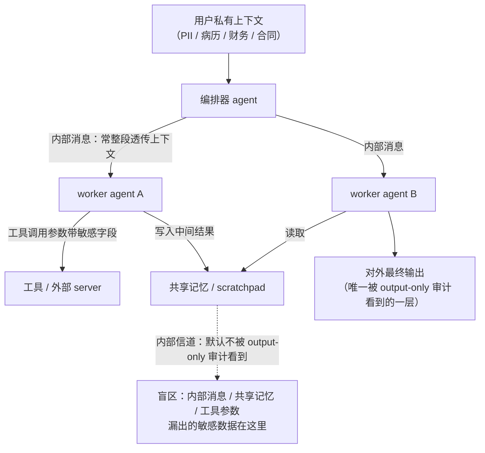

import PrivacyMeta from '@site/src/components/PrivacyMeta';

<PrivacyMeta era="卷四 · RAG 与 Agent" technique="RAG 与 Agent 隐私" audience={['安全工程师', '隐私工程师', 'ML 工程师']} severity="中" maturity="研究" evidence="研究支持" />

> 一句话摘要：当一件事拆给多个 agent 协作（编排器 + 若干 worker），私有数据不只走「对外最终回答」这一条路——它还沿 **agent 之间的消息、共享记忆、工具调用参数**这些**内部信道**流动。多个 2025–2026 的基准（**全部预印本 / workshop 级，见下逐条 ⚠️ 标注**）一致观察到：**内部信道漏出的敏感数据明显多于对外输出**，而**只看最终输出的审计会漏掉其中很大一部分**。结论先行：审计口径若停在「模型对用户说了什么」，就照不到多 agent 系统里最主要的泄露面——**内部信道也要审、也要脱敏、也要按需最小共享**。

## 机制：我这边发生了什么

先界定本条性质：这里说的**不是**某个被注入劫持的单 agent 把数据外发（那是《[Agent 工具外联外泄](./agent-tool-exfiltration.mdx)》与《[Agent 隐私评测](./agent-privacy-benchmark.mdx)》的题目），**也不是**共享缓存 / 记忆没按用户隔离导致的跨租户串味（那是《[跨会话记忆串味](./cross-session-memory-bleed.mdx)》的基础设施 bug）。本条讲的是：在**正常、非对抗**的多 agent 协作里，为了把活干完，敏感字段**按设计**在 agent 之间流转——编排器把用户上下文切给 worker、worker 把中间结果写进共享记忆、一个 agent 把参数塞进另一个工具调用——**这些内部传递本身就是泄露面**，而且它们**默认不在「对外输出审计」的视野里**。

红线说清楚：这**不是**「我决定要多分享一点」——我无法可靠内省自己会在内部消息里带出哪些字段。可被外部验证的是：**在多 agent 协作的执行轨迹里，敏感字段可观察地出现在 agent 间消息 / 共享记忆 / 工具参数中**，这一点通过**检视这些内部轨迹**就能测量，与我「想不想多说」无关。换句话说——把泄露判定从「读最终回答」挪到「读内部轨迹」，量出来的违规就多一截。

为什么内部比对外更容易漏：**对外输出**往往经过对齐后的「说给用户听」的自我约束（模型被训练成对最终答复更谨慎），而 **agent 间的内部消息 / 工具参数**更像「干活时的草稿与内部备忘」，模型在这一面把完整上下文原样透传的倾向更强——于是同一份私有数据，走内部信道被带出的概率高于走对外回答。



## 威胁面：内部信道 vs 对外输出，以及 output-only 审计的盲区

谁、在什么前提下、把这条机制变成一次真实泄露——本条的「对手」有两种读法，要分开：

- **无对手的过度共享（本条主线）**：没有攻击者，纯粹是**协作设计**让敏感字段在内部多跑了几段。危害对象是任何能读到内部轨迹的一方：日志系统、可观测性平台、第三方工具 / MCP server、共享记忆的其他读者、以及事后拿到 trace 的人。**这类泄露 output-only 审计天然照不到**——它只读最终回答。
- **有对手时被放大**：一旦某个环节被间接提示注入劫持，内部信道又成了外发通道（接回《[Agent 工具外联外泄](./agent-tool-exfiltration.mdx)》）；ConVerse 那类 agent-to-agent 攻击正是把恶意请求藏进「看起来正常」的对话里，逼另一 agent 交出上下文。

**攻击者 / 观测者模型（对应各基准，条件必须带上）**：这些结论来自**运行时行为测量**，被测系统一般是**黑盒 API 模型 + 多 agent 编排框架**（CrewAI / AutoGen / LangGraph 之类），判定口径是**检视内部执行轨迹**里敏感字段的出现，而非只读最终输出。以下每个数字都**绑定其原文的场景集、模型与判定口径**，并且**来源全部是预印本 / workshop 级**——不可当作已定论的事实迁移：

- ⚠️ **AgentLeak（arXiv 2602.11510，预印本；据其页面「拟发 IEEE Access 2026」，尚非最终定稿的同行评审版；核验 2026-07）**：在编排器–worker 拓扑下同时插桩多条信道（对外输出、agent 间消息、工具输入 / 输出、共享记忆、日志、产物等），在 **1,000 个场景**、**5 个生产级 LLM**、约 **4,979 条执行轨迹**上报告：**内部信道的泄露率约为对外输出的 2.5–2.6 倍**，且**只审计对外输出会漏掉四成以上的违规**（独立核验时，不同预印本版本 / 信道口径给出的绝对值有出入——内部约 69%–74% vs 对外约 27%–28%、漏审约 42%–46%）。这批数字**绑定其场景集、模型与三级检测流水线、且随预印本版本浮动**，非普遍概率。
- ⚠️ **MAGPIE（NeurIPS 2025 ResponsibleFM Workshop——注意是 workshop，非 NeurIPS 主会场；arXiv 2510.15186 / OpenReview vZgdho8Vx0）**：约 **200 个高风险、非对抗的协作任务**，把私有信息设计成「解题所必需」，逼 agent 在协作与信息管控之间权衡。报告**即便被明确要求不要泄露**，前沿模型仍显著漏出——例如 **Gemini-2.5-Pro 漏出高达约 50.7%、GPT-5 高达约 35.1%**（原文口径下的上界）。数值**绑定其任务集与提示条件**。
- ⚠️ **ConVerse（arXiv 2511.05359，已录用 Findings of EACL 2026；核验 2026-07）**：跨旅行 / 房产 / 保险三域、12 个用户画像、共约 **864 次上下文攻击（约 611 隐私 + 约 253 安全）**，建模**自主多轮 agent-to-agent 对话**、把恶意请求嵌进貌似正常的话术。报告**隐私攻击成功率高达约 88%**，并观察到**「越强的模型漏得越多」**。数值**绑定其攻击集与判定标准**。

三者场景、口径、venue 各不同，但**同向**：**多 agent 内部信道是被 output-only 审计系统性低估的主泄露面**，且能力更强不必然更安全。**因为全部是预印本 / workshop 级，这里只作「多个近期基准趋同」的定性判断，任何单一百分比都不足以当验收线。**

## 防护原理

这条防护靠一件事成立：**把审计与管控的边界从「模型对外说了什么」扩到「数据在系统内部怎么流」**。它保护的是「内部信道漏出」这一面，不替代对注入 / 外联的既有防护。四个支点：

- **审计内部信道，不止对外输出**：给 agent 间消息、共享记忆写入、工具调用参数都上插桩与检测——凡敏感字段出现即计一次违规。只测最终输出，等于把上面那一大截泄露判成 0。
- **agent 间最小共享（数据最小化下沉到编排层）**：编排器交给 worker 的，只应是**该 worker 完成子任务所必需**的字段，而非「把整份用户上下文原样转发」。这是 GDPR 数据最小化原则在多 agent 内部的落地（也呼应《[MCP 数据流与最小采集](./mcp-data-flow-privacy.mdx)》把最小采集放到 host↔server 边界）。
- **按需传递，而非全量透传**：默认行为往往是「整段上下文照抄给下一跳」；防护是改成**按字段的显式白名单 / 引用传递**（传句柄 / ID，让下游只在需要时按权取回），把「顺手带出去」的面收窄。
- **内部信道也要脱敏 / 管控**：对外输出会做的 PII 脱敏、字段级掩码、出站校验，**内部消息与工具参数同样要做**——不能假设「反正是内部就安全」。内部 ≠ 可信：日志、第三方工具、共享记忆的其他读者都在这条内部信道的下游。

点破：这是**测量 + 数据流治理**，不是形式保证。它把「内漏」从盲区变成可见、可回归的项，但压不压得下去，仍要靠编排层真的做最小共享与脱敏——审计是体温计，最小共享才是药。

## 落地实现（配方）

```text
1. 给内部信道插桩：在编排框架（CrewAI / AutoGen / LangGraph 等）里，对
   ①agent 间消息 ②共享记忆 / scratchpad 写入 ③工具调用参数 三条内部信道
   落 trace，记录每一跳传了哪些字段（而不是只记最终回答）。
2. 上敏感字段检测：对上面三条内部信道跑 PII / 敏感字段检测（NER + 正则 +
   你自己的敏感类目表），命中即计一次「内部信道违规」。
3. 编排层做最小共享：编排器→worker 的载荷改成按字段白名单，只放该子任务
   必需的字段；能传引用 / ID 就别传原文（下游按权取回）。
4. 内部信道也脱敏：对外输出做的掩码 / 脱敏，同样加到内部消息与工具参数上，
   别假设「内部所以安全」。
5. 双口径对比审计：同一轮同时统计「只看对外输出的违规数」与「看全部内部信道
   的违规数」，把两者的差（output-only 漏掉的部分）当成本系统的内漏盲区指标，
   按版本回归——差越大，说明你越依赖一个照不全的审计口径。
```

每个数字都绑定**你的编排拓扑、字段敏感面与检测器**——别照搬任何论文的百分比；那些绝对值只在其原文口径内可比。

**最小可测试断言**（把「内漏」收成可回归的检查，别只审对外输出）：

- 怎么测：跑一批多 agent 协作任务，任务里放真实敏感字段；**同时**审两个口径——(a) 只扫最终对外输出里的敏感字段；(b) 扫全部内部信道（agent 间消息 + 共享记忆写入 + 工具调用参数）里的敏感字段。统计各自的违规数。
- 通过：内部信道违规数**低于设定阈值、且不高于上一版基线**；(b) 相对 (a) 多出来的「output-only 漏掉的违规」收敛到可接受范围；编排层最小共享与内部脱敏在线。证明你没有把主泄露面留在审计盲区里。
- 失败：(b) 远高于 (a)（大量违规只在内部信道可见、对外审计看不到）、或根本没有内部信道审计口径、或编排器整段透传用户上下文 → 这条内漏检查未通过，先按上面第 3、4 步把最小共享与内部脱敏补上，再上线多 agent 编排。

## 真实案例 / 研究进展（工程可行性）

（本条 maturity 标「研究」：结论来自**近期基准**，**全部预印本 / workshop 级、待复核**；这些工作证明「把多 agent 内部信道泄露做成可测指标」在工程上可落地、且与 output-only 审计的差距可量化，但不构成已定论的普适概率。**下面每条都保留其原文条件与 ⚠️ 标注。**）

- ⚠️ **AgentLeak（arXiv 2602.11510，预印本 / 据页面拟发 IEEE Access 2026）**：把多 agent 系统的**内部信道泄露**做成端到端可测基准——编排器–worker 拓扑、多信道同时插桩、1,000 场景 × 5 生产级 LLM（含 GPT-4o、GPT-4o-mini、Claude 3.5 Sonnet、Mistral Large、Llama 3.3 70B）× 约 4,979 条轨迹。核心观察：**内部信道漏出约为对外输出的 2.5–2.6 倍、output-only 审计漏掉四成以上的违规**（绝对值随预印本版本 / 信道口径浮动：内部约 69%–74% vs 对外约 27%–28%、漏审约 42%–46%）。它把本条的抽象命题（「内漏比外漏多、且被漏审」）变成了**可复现、可打分**的东西。数字**绑定其场景 / 模型 / 检测口径、且预印本版本间有出入**，venue 待复核。
- ⚠️ **MAGPIE（NeurIPS 2025 ResponsibleFM Workshop，非主会场；arXiv 2510.15186）**：约 200 个**非对抗**的高风险协作任务，证明「即便明令不要泄露，前沿模型在协作里仍显著漏出」——**Gemini-2.5-Pro 高达约 50.7%、GPT-5 高达约 35.1%**（原文上界）。它印证「过度共享是协作里的默认倾向，而非只有对抗才出问题」。数字绑定其任务 / 提示条件；**是 workshop 论文**。
- ⚠️ **ConVerse（arXiv 2511.05359，Findings of EACL 2026）**：约 864 次 agent-to-agent 攻击，报告**隐私攻击成功率高达约 88%**、且**越强模型漏得越多**。它印证「有对手时，agent 间对话信道被逼交出上下文的成功率很高」。数字绑定其攻击集 / 判定；虽已录用 Findings，但结论仍属**近期、待更广复现**。

三者**同向**：**内部信道是多 agent 系统被系统性低估的主泄露面**，且模型更强不等于更安全。因均为预印本 / workshop 级，只作趋同性佐证，**不把任何单一百分比当结论迁移到你的系统**。

## 残余风险与权衡

逐条点破假安全：

- **「只审计对外输出就够」是错的。** 本条的整个要点就是：多 agent 系统里，最主要的泄露面在**内部信道**（agent 间消息 / 共享记忆 / 工具参数），而它默认不在 output-only 审计视野内——只看最终回答，会把一大截违规判成 0（多个基准趋同，⚠️ 均预印本 / workshop 级）。
- **越强的模型不必然越安全，可能越漏。** ConVerse 直接观察到「stronger models leak more」；能力上去了，被逼交出上下文、或在内部信道带出更多字段的倾向也可能上去——别拿「用了更强的模型」当隐私保证。
- **内部脱敏 / 最小共享有效用代价。** 编排器只传必需字段、内部消息也掩码，会让某些子任务因缺字段而失败或要多绕一跳——和《Agent 隐私评测》里 utility↔安全的权衡一样，别只压违规数而把协作压垮，两个口径一起看。
- **测量 ≠ 防御。** 双口径审计只告诉你「内漏被漏审了多少」，压下去要靠编排层真的最小共享 + 内部脱敏。审计是体温计，不是药。
- **数字全部待复核。** 本条三源**全是预印本 / workshop 级**（AgentLeak 拟发 IEEE Access、MAGPIE 是 NeurIPS workshop、ConVerse 是 Findings of EACL 2026）；结论是「多个近期基准趋同」，**不是**任何单一百分比已被广泛复现。引用前请核原文最新版实验条件。

## 与相邻技术的区别（可选）

- **本条 vs Agent 隐私评测（AgentDojo，本卷）**：那条量的是**单 agent**在**注入**下经**外联工具**把私有数据发到**外部目的地**的成功率（ASR），口径是「私有数据有没有到外部」；本条量的是**多 agent 协作**中敏感字段沿**内部信道**（agent 间消息 / 共享记忆 / 工具参数）流动、且**被 output-only 审计漏掉**的部分，口径是「内部轨迹里出现了多少敏感字段」。一个测**对外**、一个测**对内**，正好互补。
- **本条 vs 跨会话记忆串味（本卷）**：那条是**基础设施隔离 bug**——共享缓存 / 记忆没按用户作用域，把 A 的数据错配给 B（是「串错人」，多租户竞态）；本条是**同一个工作流里、正常的一批 agent 按设计彼此过度共享**（没有串错人、没有竞态，纯粹是内部传得太全）。一个是隔离失效，一个是最小化缺位。
- **本条 vs Agent 工具外联外泄（本卷）**：那条是**被注入劫持后**把数据经工具**外发**（攻击 + 对外通道）；本条主线是**无对手**的内部过度共享，只在被劫持时才与那条汇合（内部信道成为外发通道）。

## 版本说明

:::note 适用版本
「多 agent 协作里敏感数据会沿 agent 间消息 / 共享记忆 / 工具参数等**内部信道**流动、且比对外输出更易被漏审」是一个**与具体框架无关**的机制判断（根因在于：任务被拆给多个 agent、内部传递默认整段透传、审计口径又常只覆盖最终输出）。但**所有具体百分比**——AgentLeak 的内部 vs 对外约 2.5–2.6 倍（绝对值随版本 / 口径在约 69%–74% vs 约 27%–28% 间浮动、漏审约 42%–46%）、MAGPIE 的约 50.7% / 约 35.1%、ConVerse 的约 88%——都**绑定各自原文的场景集、模型与判定口径，且来源全部是预印本 / workshop 级（AgentLeak 拟发 IEEE Access 2026、MAGPIE 为 NeurIPS 2025 ResponsibleFM Workshop、ConVerse 已录用 Findings of EACL 2026）**，**不能直接迁移到你的系统**，也**不宜当作已被广泛复现的定论**。编排拓扑、字段敏感面、检测器都是**与栈相关**的工程，须按你自己的多 agent 系统重测。本段打戳 2026-07。（三源均核验于 2026-07；venue 与数字以各原文最新版为准。）
:::

## 延伸阅读与出处

> 主要：研究支持（三个多 agent 隐私基准，**全部预印本 / workshop 级、待复核**——见各条 ⚠️ 标注）。结论取「多个近期基准趋同」的定性判断，任何单一百分比都不作独立结论。

- ⚠️（预印本 / 据页面拟发 IEEE Access 2026，venue 待复核）[AgentLeak: A Benchmark for Internal-Channel Privacy Leakage in Multi-Agent LLM Systems（arXiv 2602.11510）](https://arxiv.org/abs/2602.11510) —— 编排器–worker 多信道插桩，1,000 场景 / 5 生产级 LLM / 约 4,979 轨迹；报告内部信道漏出约为对外输出 2.5–2.6 倍、output-only 审计漏掉四成以上违规（绝对值随版本 / 信道口径浮动：内部约 69%–74% vs 对外约 27%–28%、漏审约 42%–46%）。本条主源（内部 vs 对外的量化）。数字绑定其原文口径、且预印本版本间有出入。
- ⚠️（NeurIPS 2025 ResponsibleFM **Workshop**，非主会场）[MAGPIE: A benchmark for Multi-AGent contextual PrIvacy Evaluation（arXiv 2510.15186 / OpenReview vZgdho8Vx0）](https://openreview.net/forum?id=vZgdho8Vx0) —— 约 200 个非对抗协作任务；报告即便明令不泄露，Gemini-2.5-Pro 高达约 50.7%、GPT-5 高达约 35.1%。印证「过度共享是协作默认倾向」。数字绑定其任务 / 提示条件。
- ⚠️（已录用 **Findings of EACL 2026**，仍属近期、待更广复现）[ConVerse: Benchmarking Contextual Safety in Agent-to-Agent Conversations（arXiv 2511.05359）](https://arxiv.org/abs/2511.05359) —— 约 864 次 agent-to-agent 攻击；隐私攻击成功率高达约 88%，观察到「越强模型漏得越多」。印证有对手时内部对话信道被逼交出上下文的成功率。数字绑定其攻击集 / 判定。
- ⚠️（单篇预印本，作方向性佐证）[Improving Google A2A Protocol: Protecting Sensitive Data and Mitigating Unintended Harms in Multi-Agent Systems（arXiv 2505.12490）](https://arxiv.org/abs/2505.12490) —— **协议层的相邻缺口**：分析 Google A2A（跨厂商 agent↔agent 协议）在处理支付凭据 / 身份文件等高敏数据时的短板——令牌生命周期控制不足、访问 scope 过宽、缺同意流，并提出 consent orchestration + 短时效 scoped token 缓解。与本条互补——本条测「模型在内部信道漏多少」，它补「**协议层缺什么控制**」；协议层同意 / 令牌的 MCP 版见《[MCP 数据流与最小采集](./mcp-data-flow-privacy.mdx)》。⚠️ 单篇预印本、其泄露率数字绑定受测设置，不作独立结论。
- 攻击侧与对外通道详解见《[Agent 工具外联外泄](./agent-tool-exfiltration.mdx)》；对外维度的可测基准见《[Agent 隐私评测（AgentDojo）](./agent-privacy-benchmark.mdx)》；基础设施隔离 bug 见《[跨会话记忆串味](./cross-session-memory-bleed.mdx)》；host↔server 边界的最小采集见《[MCP 数据流与最小采集](./mcp-data-flow-privacy.mdx)》。
