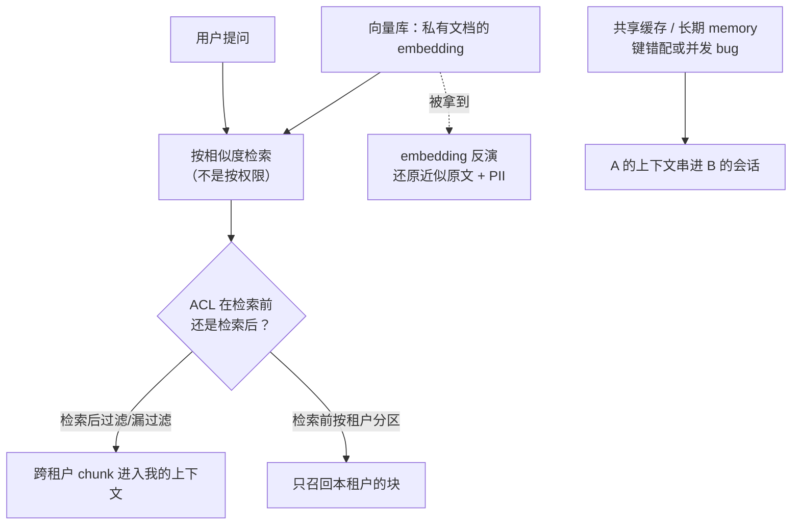

import PrivacyMeta from '@site/src/components/PrivacyMeta';

<PrivacyMeta era="卷四 · RAG 与 Agent" technique="RAG 与 Agent 隐私" audience={['隐私工程师', '安全工程师', 'ML 工程师']} severity="高" maturity="试验" evidence="安全报告" />

> 一句话摘要：在多租户 RAG 里，两个直觉都靠不住——「向量化了就匿名了」和「按用户过滤了就隔离了」。embedding **能被反演回近似原文**（含 PII）；检索是按**相似度**排序、不是按权限，ACL 若配在检索之后而非之前，最相关的那块私有 chunk 可能来自**别的租户**；而共享缓存 / 长期 memory 的一个边界 bug，就能把一个用户的私有上下文带进另一个会话。

## 机制：我这边发生了什么

RAG 里我做的事是：把你的私有文档切块、嵌入成向量存进库，提问时按相似度把最相关的块检索回来、塞进我的上下文再作答。这条链上有三个独立的泄露点：

1. **embedding 不是单向哈希。** 它保留了足够多的词汇与语义信息，可以被一个学出来的解码器**反演回近似原文**——Morris 等的 vec2text 通过迭代逼近目标向量，能较高保真地还原句子，并在临床记录的嵌入上还原出**真实姓名**（Morris et al., EMNLP 2023）。所以「我们只存了向量、没存原文」**不等于**做了匿名化。
2. **检索按相似度，不按权限。** 我召回的是「最像问题的块」，不是「你有权看的块」。如果租户 / 用户的访问控制是**检索之后**再过滤（甚至忘了过滤），那么在排序阶段，别的租户的私有 chunk 已经可能进入候选、甚至进入我的上下文。
3. **共享状态会串味。** 缓存、会话状态、长期 memory 若按错误的键共享或在并发下错配，A 的私有上下文可能出现在 B 的会话里。

红线：这里不该写「我会保密」——我做不了这个承诺。可被外部观测的是：**在上述机制下，私有数据可被复算地、跨边界地出现在不该出现的地方**。



## 威胁面：如何被利用 / 你如何被泄露

- **跨租户检索**：ACL 在检索后过滤、或按「应用层信任」而非「索引层隔离」，攻击者用精心构造的查询，把别的租户的相关内容捞进回答。
- **embedding 反演**：攻击者拿到向量库的导出、备份、或某个端点返回的 embedding，就能反推近似原文——向量库的访问控制若按「反正是向量、不敏感」来放宽，等于把原文放宽。
- **跨会话 / 跨用户串味**：缓存 / memory 的边界 bug——不需要高级攻击，一个并发竞态就够（见下「真实案例」）。
- **tool / 检索结果进长期 memory**：把检索到的私有片段写进会被跨会话召回的长期 memory，等于把一次性授权变成长期驻留。

## 防护原理

核心：**隔离要做在数据层、在检索之前；embedding 要当敏感数据对待。**

- **检索前按租户 / 用户分区**：每租户独立索引，或在向量检索的查询里强制带上租户过滤条件（pre-filter），让「越权的块根本不进候选」，而不是检索完再删。
- **把 embedding 纳入访问控制与加密**：它可被反演，就按原文的密级保护——向量库的读权限、导出、备份都要管。
- **强会话 / 租户键 + 隔离测试**：缓存与 memory 用不可混淆的键；上线前注入跨租户探针主动测漏。
- **最小化进入 memory 的私有数据**：tool / 检索结果默认**不**进长期 memory，需要驻留的显式授权 + 打范围。

## 落地实现（配方）

```text
1. 索引层隔离：每租户独立 collection/namespace，或检索查询强制 pre-filter
   带 tenant_id；ACL 在「检索前」生效，别在应用层检索后再过滤。
2. 把向量库当敏感存储：读/导出/备份都加访问控制 + 静态加密；别假设
   「只是向量、不敏感」。
3. 入库前最小化：chunk 写入前做 PII 扫描/脱敏，按数据密级决定能不能进可检索库。
4. 隔离回归测试：注入跨租户/跨用户探针文档，自动化测「A 的查询能否召回 B 的块」；
   把它当 CI 闸门，而不是一次性人工抽查。
5. memory 收口：检索结果/tool 输出默认不进长期 memory；要进就显式授权 + 限定范围 + 可清除。
```

每个边界（哪一层做 ACL、向量库谁能读、memory 召回范围）都要写成可测的断言，别停在「我们有按用户过滤」这种口头保证。

## 真实案例 / 生产部署

2023 年 3 月 20 日，OpenAI 因其使用的 Redis 客户端库 redis-py 的一个缺陷，出现请求取消激增、连接有小概率返回**他人的数据**：部分用户在侧边栏看到了**其他活跃用户的对话标题**；若两人同时活跃，新建对话的首条消息也可能对他人可见；同一缺陷还让约 **1.2% 的 ChatGPT Plus 用户**在一个约九小时的窗口内，支付相关信息（姓名、邮箱、支付地址、信用卡后四位与有效期，**完整卡号未泄露**）对他人可见。这是 OpenAI 自己的事故复盘（OpenAI, *March 20 ChatGPT outage*, 2023）。它印证的不是某种高级攻击，而是同一类机制风险：**在生产 LLM 服务里，缓存 / 并发这种「边界层」的一个 bug，就足以让私有数据跨用户串味**——隔离必须在数据层做实，不能只靠应用层的「应该不会」。

## 残余风险与权衡

逐条点破假安全：

- **「向量化 = 匿名化」是错的。** embedding 可被反演回近似原文与 PII（Morris 2023），存了向量等于存了一份可还原的敏感数据。
- **「按用户过滤了 = 隔离了」要看在哪一层。** 检索后过滤 / 应用层过滤，留了「越权块先进候选」的窗口；只有检索前的索引层隔离才算隔离。
- **「只存 embedding 不存原文」不安全。** 见第一条，embedding 本身就泄。
- **检索质量 vs 隔离严格是真实权衡。** 跨租户共享一个大索引召回更好，但把边界也搅在一起；按租户分区更安全、但可能牺牲一点召回与成本。
- **长期 memory 召回 vs 串味风险。** 让我「记住」更多能提升体验，但每多一处跨会话驻留，就多一处串味面。

## 合规映射

- **OWASP LLM02:2025（敏感信息泄露）**：本条正是其典型形态——通过检索 / 输出把 PII、他人数据暴露出来；缓解建议含数据脱敏与访问控制。
- **GDPR**：跨租户 / 跨用户泄露属个人数据泄露，触发通知义务；向量库作为个人数据的存储，同样受最小化、访问控制、跨境传输等约束。

（合规随法条 / 框架版本演进，本段打戳 2026-06，引用前核对最新文本。）

## 与相邻技术的区别

- **RAG 检索泄露 vs 训练数据抽取**：本条的私有数据在**向量库 / 检索期**，靠配置与隔离防；《[训练数据抽取](../02-memorization-extraction/training-data-extraction.mdx)》的数据在**权重 / 训练期**，靠去重 / DP 防。同是「私有数据漏出」，但住在系统的不同层。
- **RAG 检索泄露 vs 上下文面隐私**：上下文面隐私讲系统提示词 / 会话上下文这些「我当前上下文里的东西」被套出来（卷三）；本条讲「检索系统把不该取的私有数据**取进来**」，方向相反、住在检索与存储层。

## 版本说明

:::note 适用版本
embedding 可反演是**嵌入表示的性质**，不限某一家向量库或模型（Morris 等在多个主流嵌入模型上演示，EMNLP 2023）；多租户检索的 ACL 层级、缓存 / memory 的隔离，则是**系统设计问题**，跨厂商通用。具体的反演保真度、缓解效果随模型与实现变化，落地以你自己的隔离测试为准。（出处核验于 2026-06。）
:::

## 延伸阅读与出处

- [Text Embeddings Reveal (Almost) As Much As Text（Morris 等，EMNLP 2023；arXiv 2310.06816）](https://arxiv.org/abs/2310.06816) —— vec2text 把文本 embedding 反演回近似原文，并从临床记录嵌入还原出真实姓名。
- [March 20 ChatGPT outage（OpenAI 官方事故复盘，2023）](https://openai.com/index/march-20-chatgpt-outage/) —— redis-py 缺陷致跨用户对话标题与部分支付信息可见。
- [OWASP LLM02:2025 Sensitive Information Disclosure](https://genai.owasp.org/llmrisk/llm022025-sensitive-information-disclosure/) —— LLM 应用敏感信息泄露的风险类目与缓解。
