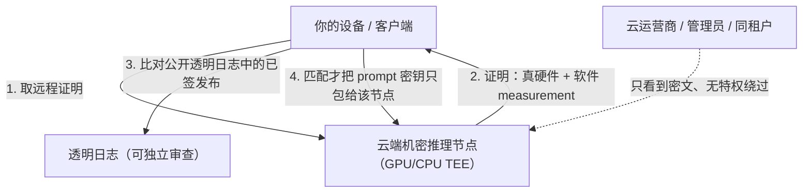

import PrivacyMeta from '@site/src/components/PrivacyMeta';

<PrivacyMeta era="卷五 · 前沿与落地" technique="隐私保护计算" audience={['隐私工程师', '安全工程师', 'ML 工程师']} severity="中" maturity="生产" evidence="官方文档" />

> 一句话摘要：你想用云上的大模型、又不想让云厂商看到 prompt（或你想供模型、又不想让客户端拿到权重）。机密推理就是这个目标的**落地**：今天**真能用**的主要是 **TEE 路线**——模型跑在 GPU TEE 里 + 远程证明 + 可验证透明（如 Apple Private Cloud Compute、NVIDIA 机密 AI）；密码学路线（HE / MPC）在 LLM 规模仍太贵。但「机密」是个营销词——真正的边界不在「厂商说机密」，而在**你（或你的设备）有没有验证证明、威胁模型覆盖谁、以及它仍没解决什么**（侧信道、信任芯片厂商、法律令）。本条把卷一的 [TEE](../01-foundations/trusted-execution-environment.mdx) 与 [HE·MPC](../01-foundations/he-mpc.mdx) 地基，落到「能不能真把私有推理跑起来」。

## 机制：我这边发生了什么

当我作为云端模型在机密推理栈里跑，这边发生三步：

1. **我的执行环境对云运营商不可见。** 我处理你 prompt 的 GPU / CPU 飞地由硬件加密隔离，云管理员、同租户即便有更高权限也只看到密文（机制见卷一 [TEE](../01-foundations/trusted-execution-environment.mdx)）。
2. **你先验证、再发数据。** 你的设备 / 客户端先取远程证明，确认「是真硬件、跑的是可核查的软件」，**验证通过才**把 prompt（用只解给该节点的密钥包裹）发来。
3. **（更进一步）可验证透明。** Apple Private Cloud Compute 把每个生产软件镜像**公开上日志供独立审查**，并让设备**只把请求密钥包给那些「证明 measurement 匹配公开透明日志里某个已签发布」的节点**；PCC 还设计成**无特权运行角色**——连云管理员也绕不过去（Apple Security Research, *Private Cloud Compute*）。

红线：机密推理给的是「**可验证地**让云看不到 + 身份可证」，**不是**「信我就好」。可被外部核查的是证明与透明日志，不是厂商的一句承诺。



## 威胁面：机密推理防什么、不防什么

- **防**：云运营商 / 管理员窥视、同租户、（PCC 这类设计下）厂商自身的特权访问——核心是「把推理交给云，但云**可验证地**看不到明文」。
- **不防 ① 不验证明 = 没用**：最大的假安全——客户端只建 TLS、不验远程证明、不比透明日志，等于把明文发给一个「自称机密」的黑盒。
- **不防 ② 信任根仍是芯片厂商 + 侧信道**：TEE 的机密性会被微架构侧信道周期性攻破，信任根落在 CPU / GPU 厂商（见卷一 [TEE](../01-foundations/trusted-execution-environment.mdx)）。
- **不防 ③ 密码学路线的开销**：HE / MPC 能做到「零硬件信任」，但 LLM 规模仍太贵（见卷一 [HE·MPC](../01-foundations/he-mpc.mdx)），今天多限小模型 / 部分环节。
- **不防 ④ 法律令**：「云看不到」≠「法律拿不到」——保全令、监管要求仍可压在保留 / 删除安排之上（见卷六 [推理服务数据边界](../06-governance-compliance/inference-service-data-boundary.mdx)）。
- **不防 ⑤ 你授权导出的数据**：一旦结果离开飞地、或你把数据写进非机密的日志 / 存储，保护即终止。

## 防护原理

机密推理把卷一的三件套落到部署，并多加一层：**硬件 TEE 隔离 + 远程证明 + 可验证透明**。承重点是**可验证透明**——它把「信厂商不作恶」降级成「**核查厂商到底跑了什么代码**」：软件镜像公开上链、不可悄悄改，研究者能独立比对，设备只与「证明匹配公开发布」的节点通信。这是机密推理比裸 TEE 更进一步的地方：不仅证明「真硬件」，还把「真这份可审软件」也变得可核。

## 落地实现（配方）

```text
1. 选路线：
   - TEE 路线（今天能落地）：自建 PCC 式栈，或在 NVIDIA H100/H200 机密计算上
     自部署——标准模型基本不改即可在 GPU TEE 里跑。
   - 密码学路线（HE/MPC）：仅窄场景 / 小模型 / 部分环节，按卷一 HE·MPC 评估开销。
2. 客户端强制验证（关键）：发数据前——验远程证明、比对公开透明日志中的已签发布、
   检查厂商证书链；任一不符就拒发。把「验证」设成发送前置闸门，别只建 TLS。
3. 端到端加密 + 密钥绑定：请求密钥只包给已验证节点的公钥；CPU-GPU、客户端 - 节点
   全程加密。
4. 最小化导出：结果离开飞地前做最小化；别把私有上下文写进非机密日志 / trace。
5. 写清威胁模型：你防的是运营商？同租户？还是法律令？——最后一项 TEE 不解决，
   要靠合同与数据边界（卷六）。
```

每个选择都带上**你的威胁模型与负载**：自建机密推理栈的工程量、GPU TEE 的开销、密码学路线的可行性，都强依赖你的规模与目标。

**最小可测试断言**（把「验证」收成可回归的检查，别停在「我们用了机密推理」）：

- 怎么测：伪造一个节点、或改动软件镜像（measurement 变化），跑客户端验证流程。
- 通过：证明无效、measurement 不在公开透明日志中、或证书链失败时，客户端**一律拒绝发送 prompt**；只有匹配「日志中已签发布」才发。
- 失败：客户端不验证明 / 不比透明日志（只建了 TLS）→ 等于没用机密推理，把验证设成发送前置闸门。

## 真实案例 / 落地实现

### 业界怎么做：真实机密推理部署 + 证明实践

先看「各家线上实际怎么跑机密推理、客户端到底验什么」，再回到机制分类。今天有据可查的生产 / 在售部署都走 **TEE 路线**，差别在「谁来取证明、对谁公开可核」——但**共同点**是：厂商交付的不是「信我」，而是一份**可被你（或你的设备 / relying party）独立核验的远程证明**。漏掉这步验证，等于把明文发给一个自称机密的黑盒（呼应红线）。

| 部署 | 跑的是什么 | 客户端 / relying party 必须验的那一步（机制名） |
|---|---|---|
| **Apple Private Cloud Compute（PCC）** | 为 Apple Intelligence 云端请求设计：**无状态计算**（请求只在内存里处理、不落盘、不留日志）、**无特权运行访问**、生产软件镜像公开上**透明日志** | 设备取节点的**密码学证明**，把软件 measurement 比对**公开透明日志**里的已签发布，**匹配才**把请求密钥包给该节点；Apple 另发 `apple/security-pcc` 源码（含负责构造 / 校验证明的 CloudAttestation、设备侧 `privatecloudcomputed` 的 Thimble）与**虚拟研究环境（VRE）**，供研究者独立核验透明日志一致性（Apple Security Research） |
| **NVIDIA Hopper H100 机密计算** | **GPU TEE**：标准 PyTorch / TensorFlow / ONNX 模型基本不改即可在飞地里跑；GPU 与 CPU TEE（Intel TDX / AMD SEV-SNP / Arm CCA）配合，CPU↔GPU 链路加密 | 验 GPU 的**远程证明**：每颗 H100 出厂烧入私钥，GPU 启动时度量并签名固件 measurement；可离线验，或经 **NVIDIA 远程证明服务（NRAS）**验，通过后才与 GPU 建会话密钥（NVIDIA 官方） |
| **Azure 机密计算** | **机密 VM**（AMD SEV-SNP，如 DCasv5 / ECasv5；Intel TDX，如 DCesv6 / ECesv6）+ **机密 GPU**（NCCads_H100_v5 系列，搭 H100 GPU TEE） | 走 **vTPM 的 guest attestation**：SEV-SNP 启动生成硬件报告（由芯片 VCEK 证书签名），交 **Microsoft Azure Attestation（MAA）**验证链，再比对你的策略（Microsoft Learn 官方文档） |
| **Google Cloud 机密计算** | **Confidential VM**（AMD SEV / SEV-SNP、Intel TDX）；Confidential Space 在其上跑可证明工作负载 | 取实例 vTPM 的 attestation quote，送 **Google Cloud Attestation** 验证后返回 attestation token（Confidential Space 下为 OIDC token），**relying party 拿 token 比对自家策略**才放行（Google Cloud 官方文档） |

把这四家放一起，本条的红线就具体了：**厂商说「机密」≠ 你验证了远程证明**——PCC 把验证做进设备、还开源 + VRE 让你能核「跑的到底是哪份代码」；NVIDIA / Azure / GCP 则把证明暴露成可验的报告 / token，但**取证明、比 measurement / 验签名链、对策略**这步**得你的客户端或 relying party 主动做**，云不替你做。

### 路线分类：TEE vs 密码学（HE / MPC）

上表全是 **TEE 路线**（今天生产可用）。另一条是**密码学路线**（HE / MPC，零硬件信任），但在大规模 LLM 推理上仍受开销所限，今天多见于窄场景 / 小模型 / 部分环节（机制与取舍见卷一 [HE·MPC](../01-foundations/he-mpc.mdx)）。两条路线的根本差异在**信任根**：TEE 把信任压在芯片厂商 + 远程证明上，密码学路线不信任执行环境、却付出算力代价。

:::caution 待核验
密码学路线（HE / MPC）的**大规模私有 LLM 推理开销**尚无统一的一手基准，本条不裸写倍数；具体待一手核（已记入 `BACKLOG-privacy.md`「写作前必核」）。
:::

## 残余风险与权衡

逐条点破假安全：

- **「机密」≠ 安全，关键在你有没有验证。** PCC 把验证交给设备自动做；自建栈得自己实现证明验证 + 透明日志比对，漏了这步就名存实亡。
- **信任只是转移、没消除。** 你把信任从云运营商转给了芯片厂商（+ 仍有侧信道），见卷一 [TEE](../01-foundations/trusted-execution-environment.mdx)。
- **「云看不到」≠「法律拿不到」。** 保全令、监管要求仍可压在保留 / 删除之上——技术机密性不替代法律边界（卷六 [数据边界](../06-governance-compliance/inference-service-data-boundary.mdx)）。
- **零硬件信任的密码学路线，LLM 规模不实用。** HE / MPC 听着更纯粹，但开销把它挡在大模型全程私有推理之外。
- **透明日志证「跑的是这份软件」，不证「这份软件没后门」。** 可审 ≠ 已审——仍需要独立安全研究去看那份公开的代码。

## 合规映射

- **GDPR Art.32 / 跨境**：机密推理把「使用中数据」也纳入可验证保护，是「适当技术措施」的强证据，并有助于「数据仅在受控 enclave 内处理」的跨境论证。
- **责任不被技术免除**：即便云**可验证地**看不到明文，处理者 / 子处理者关系、保留与删除安排、法律令应对仍在——技术保证与法律责任是两件事（卷六 [数据边界](../06-governance-compliance/inference-service-data-boundary.mdx)）。

（合规随法条版本演进，本段打戳 2026-06，引用前核对最新生效文本。）

## 与相邻技术的区别

- **机密推理（卷五·落地）vs TEE / HE·MPC（卷一·机制）**：卷一讲「机制保证什么、不保证什么」；本条讲「**怎么把它部署成能用的私有推理、谁已落地、仍缺什么**」。同一套地基，一个在机制层、一个在部署层。
- **机密推理 vs 推理服务数据边界（卷六）**：机密推理用**技术**让云看不到明文；数据边界用**条款**核服务方留不留、用不用、转给谁。技术让「看不到」，条款管「拿不拿得到、归谁管」——两者互补，缺一不可（见卷六 [数据边界](../06-governance-compliance/inference-service-data-boundary.mdx)）。

## 版本说明

:::note 适用版本
机密推理的**架构思路**（TEE + 远程证明 + 可验证透明）相对稳定，但**具体产品与硬件**演进很快：PCC、NVIDIA 机密计算、Azure / Google Cloud 的机密 VM / GPU 都在迭代（机型代号、证明服务、可用区随时变），密码学路线的可行性也随硬件加速变化。本条按 2026-06 的产品现状表述（Apple PCC、NVIDIA Hopper H100、Azure SEV-SNP / TDX 机密 VM 与 NCCads_H100_v5 机密 GPU、Google Cloud Confidential VM）；具体能力、开销与威胁模型以厂商当下文档和你的实测为准。（出处核验于 2026-06。）
:::

## 延伸阅读与出处

证据为混合——**主要：官方文档**（Apple、NVIDIA、Azure、Google Cloud 的真实部署 + 证明实践）；**补充：标准**（CCC）+ 机制见卷一两条地基。

- [Private Cloud Compute: A new frontier for AI privacy in the cloud（Apple Security Research）](https://security.apple.com/blog/private-cloud-compute/) —— 官方：无状态计算 + 设备级远程证明 + 可验证透明日志 + 无特权访问。
- [Security research on Private Cloud Compute（Apple Security Research）](https://security.apple.com/blog/pcc-security-research/) —— 官方：开源 `apple/security-pcc`（含 CloudAttestation、设备侧 Thimble）+ 虚拟研究环境（VRE），供研究者独立核验透明日志一致性。
- [Confidential Computing on H100 GPUs（NVIDIA 官方）](https://developer.nvidia.com/blog/confidential-computing-on-h100-gpus-for-secure-and-trustworthy-ai/) —— 官方：GPU TEE，标准模型不改即可在飞地里跑 + 客户端验远程证明（NRAS）。
- [Azure confidential computing product overview（Microsoft Learn）](https://learn.microsoft.com/en-us/azure/confidential-computing/overview-azure-products) —— 官方：AMD SEV-SNP / Intel TDX 机密 VM + NCCads_H100_v5 机密 GPU；vTPM guest attestation 经 Microsoft Azure Attestation 验证。
- [Confidential VM remote attestation overview（Google Cloud）](https://docs.cloud.google.com/confidential-computing/confidential-vm/docs/attestation-overview) —— 官方：SEV / SEV-SNP / TDX + vTPM 启动证明；relying party 拿 Google Cloud Attestation token 比对自家策略。
- [A Technical Analysis of Confidential Computing（CCC，v1.3）](https://confidentialcomputing.io/wp-content/uploads/sites/10/2023/03/CCC-A-Technical-Analysis-of-Confidential-Computing-v1.3_unlocked.pdf) —— 标准：机密计算的 TEE / 证明 / 信任模型框架。
