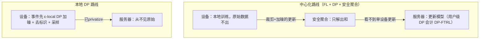

import PrivacyMeta from '@site/src/components/PrivacyMeta';

<PrivacyMeta era="卷五 · 前沿与落地" technique="联邦学习与安全聚合" audience={['隐私工程师', 'ML 工程师']} severity="中" maturity="生产" evidence="研究支持" />

> 一句话摘要：联邦学习（FL）让模型在大量设备上训练、**原始数据不离设备**，只上传模型更新。但「数据不出设备」只是起点——**更新本身会泄露**（能反推训练数据）。所以生产级要叠：**DP**（限制单设备 / 用户对模型的影响）+ **安全聚合**（服务器只看到多设备更新之和、看不到单个）。真实落地：Gboard 用 FL + DP-FTRL 训了**二十多个**带 DP 保证的语言模型；Apple 用**本地 DP** 收 emoji / 输入法等遥测。要点：**FL ≠ 私有**、本地 DP 的 ε 要看清、用户级 vs 样本级别错配。这是卷三《[DP 微调](../03-conversational-llms/dp-fine-tuning.mdx)》在「联邦 + 大规模生产」上的落地面。

## 机制：我这边发生了什么

- **联邦学习（FL）**：我（模型）的训练在设备上做，设备只回传**梯度 / 模型更新**，服务器聚合更新来改进我，**原始数据不集中**（McMahan 等的 FedAvg，2017）。
- **但更新会泄露**，所以叠两层：
  1. **DP**：对更新**裁剪 + 加噪**，限制单设备 / 用户对我的影响。FL 天然按客户端分组，契合**用户级 DP**；Gboard 用的 **DP-FTRL** 是一种不依赖采样 / 打乱的 DP 会计，适配联邦的流式更新。
  2. **安全聚合**：用密码学让服务器只能解出**多设备更新之和**、看不到任何单个设备的更新。
- **另一条路：本地 DP（local DP）**——数据在**设备上**就先加噪 privatize，再上传，连服务器都不信。Apple 的做法：emoji 等事件在设备上经 **ε-local DP** privatize、去掉设备标识与时间戳、随机采样后才发，服务器从不见原始数据（Apple, *Learning with Privacy at Scale*）。

红线：我不写「我不看你的数据」——准确说法是：**机制上服务器只拿到加噪 / 聚合后的量**，原始数据要么没离开设备、要么离开前已 privatize。



## 威胁面：为什么 FL 单独不够

- **更新泄露**：原始梯度 / 更新可被反推出训练数据（gradient leakage），FL **单独不防**——必须叠 DP。
- **服务器可信假设**：不加安全聚合，服务器看得到**单个设备**的更新，「不集中原始数据」的意义打折。
- **本地 DP 的 ε**：本地 DP 噪声大，常要把 ε 放得偏大才有效用——**保护强度要核 ε**，不是「用了本地 DP 就私密」。
- **隐私单位错配**：要保护「一个用户的全部数据」得做**用户级** DP；FL 天然按客户端 = 用户分组，契合用户级，别退化成样本级。

## 防护原理

两条路线，承重点都是「**数据不离设备**」必须配「**更新也不泄露**」：

- **中心化路线**：FL（数据不出设备）+ DP-FTRL（适配联邦流式的 DP 会计，给用户级 (ε, δ) 上界）+ 安全聚合（服务器只见和）。**对要同时声称「服务器看不到单点 + 单用户影响有界」的目标**，三者缺一：没 DP 则更新泄露、没安全聚合则服务器看单更新——目标不同（如下面的本地路线）则组合另算。
- **本地路线**：本地 DP（设备端就加噪，连服务器都不信），代价是噪声大、效用损失明显，ε 要核清。

## 落地实现（配方）

```text
1. 选路线：中心可信度高 → FL + DP-FTRL + 安全聚合；不信服务器 → 本地 DP（接受效用损失）。
2. 定隐私单位：用户级（按客户端分组裁剪 / 加噪），别默认样本级。
3. 中心化：用 DP-FTRL 做隐私会计、报 (ε, δ)；启用安全聚合并设最小聚合人数阈值。
4. 本地 DP：报 ε，并说明去标识 / 采样策略；评估噪声对效用的影响。
5. 全字段报告：路线 / 隐私单位 / (ε, δ) 或 local-ε / 是否安全聚合——别只写「用了联邦学习」。
```

每个数字（ε、聚合阈值、采样率）都要带上**你的部署条件**；Gboard / Apple 的取值绑定其规模与任务，不能直接迁。

**最小可测试断言**（把上面的配方收成可回归的检查）：

- 怎么测：① DP 会计能否独立复算 (ε, δ)；② 安全聚合下服务器能否解出单设备更新（应不能，且有最小聚合人数）；③ 本地 DP 的 ε 是否可核且与噪声机制一致。
- 通过：(ε, δ) 复算一致、隐私单位 = 用户级、安全聚合阈值明确（或本地 ε 已核）。
- 失败：只做 FL 不加 DP / 安全聚合，或 ε 大到上界形同虚设 → 不算达到声称的隐私保证。

## 真实案例 / 厂商现状

DP·FL 已是**生产**技术：

- **Gboard（Google）**：用 FL + **DP-FTRL** 训练并部署了**二十多个**带差分隐私保证的语言模型；并且**所有**下一词预测的神经语言模型现都带 DP 保证、未来发布也**要求** DP（Xu et al., ACL 2023 Industry）。这是「生产级 DP-FL」最硬的公开案例。
- **Apple**：用**本地 DP** 在 iOS / macOS 大规模收集 emoji、QuickType 等使用遥测——事件在设备上经 ε-local DP privatize、去标识、采样后才上传，服务器从不见原始数据（Apple, *Learning with Privacy at Scale*, 2017）。

## 残余风险与权衡

逐条点破假安全：

- **「数据不出设备 = 私有」是错的。** 更新会泄露，必须叠 DP + 安全聚合；只做 FL 不叫私有。
- **「联邦」≠「DP」。** 很多打「联邦」旗号的方案根本没有 DP 保证——要看有没有裁剪 / 加噪 / 会计。
- **本地 DP 的 ε 常偏大。** 噪声 / 效用权衡下，保护可能比想象弱——核 ε，别停在「用了本地 DP」。
- **隐私单位错配。** 保护「用户」却只做样本级，用户有多条数据时保证被稀释。
- **安全聚合防「看单更新」，不防「聚合结果泄露」。** 聚合和本身仍可能泄露信息，所以还要叠 DP。

## 合规映射

- **GDPR / 数据最小化**：FL（不集中原始数据）+ DP（可量化保证）是「数据最小化 + 适当技术措施」的强论据；本地 DP 让「采集即 privatize」。
- **但参数决定是否合规**：得说明隐私单位、(ε, δ) 或 local-ε、是否安全聚合——「用了联邦 / DP」不等于合规，监管与 DPIA 看的是这些参数（与卷三 [DP 微调](../03-conversational-llms/dp-fine-tuning.mdx) 同一纪律）。

（合规随法条版本演进，本段打戳 2026-06，引用前核对最新生效文本。）

## 与相邻技术的区别

- **DP·FL（卷五·生产部署）vs DP 微调（卷三·训练机制）**：卷三讲 DP-SGD 在**单点微调**的机制（裁剪 + 加噪 + 会计）；本条讲 DP 在**联邦 + 大规模生产**的落地——DP-FTRL、安全聚合、本地 DP、真实部署（Gboard / Apple）。同一套 DP 纪律，一个在机制层、一个在生产部署层。
- **DP·FL vs 机密推理（本卷）**：DP·FL 护**训练**（数据不集中 + 更新不泄露）；机密推理护**推理**（云看不到 prompt）。一个管「模型怎么学」，一个管「模型怎么用」。

## 框架差异（FL 框架；打版本戳 2026-06，以各框架当前文档为准）

FL + DP 的机制跨框架一致，但**对安全聚合 / DP 的内置支持、部署形态**有别：

- **TensorFlow Federated（TFF）**：研究 / 仿真为主，内置安全聚合与 DP 聚合原语，贴 Google 的生产路线。
- **Flower**：框架无关（可接 PyTorch / TF / JAX），靠策略插件接 DP / 安全聚合，偏灵活与跨栈。
- **NVFlare / FedML 等**：偏企业 / 跨机构部署，安全聚合与隐私组件按发行版而异。

要点：**别假设「用了某 FL 框架」就自动有安全聚合 + DP**——这两样常是要**显式开、显式配**的组件（见本卷《[安全聚合](./secure-aggregation.mdx)》《[梯度泄露](./gradient-leakage.mdx)》）。换框架务必核它**默认开没开、用哪种会计、安全聚合的门限假设**。（本小节很快过时，以各框架 release 文档为准。）

## 版本说明

:::note 适用版本
FL + DP 的**机制**（FedAvg、DP-FTRL、安全聚合、本地 DP）相对稳定，但**具体部署的参数与规模**随产品演进：Gboard 的模型数、各家的 ε 取值都会变。本条按 2026-06 的公开部署表述（Gboard DP-FTRL、Apple 本地 DP）；具体隐私参数以厂商当下文档为准，落地用你自己的隐私会计重算。（出处核验于 2026-06。）
:::

## 延伸阅读与出处

> 主要：**生产部署论文**（Gboard DP-FL——已上线系统的官方描述，也是本条 maturity=生产 的直接依据）；补充：研究支持（FedAvg 机制奠基）与厂商实践（Apple 本地 DP）。

- [Federated Learning of Gboard Language Models with Differential Privacy（Xu 等，ACL 2023；arXiv 2305.18465）](https://arxiv.org/abs/2305.18465) —— 生产级 DP-FL：用 FL + DP-FTRL 部署二十多个带 DP 保证的 Gboard 语言模型，所有下一词预测模型均要求 DP。
- [Learning with Privacy at Scale（Apple，2017）](https://machinelearning.apple.com/research/learning-with-privacy-at-scale) —— 生产级本地 DP：设备端 ε-local DP privatize + 去标识 + 采样，收集 emoji / QuickType 等遥测。
- [Communication-Efficient Learning of Deep Networks from Decentralized Data / FedAvg（McMahan 等，AISTATS 2017；arXiv 1602.05629）](https://arxiv.org/abs/1602.05629) —— 联邦学习奠基：原始数据不出设备、只聚合更新。
