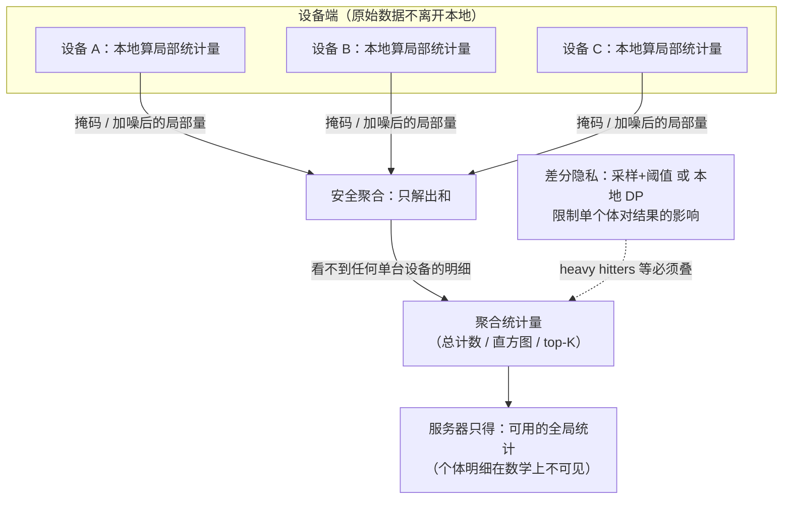

import PrivacyMeta from '@site/src/components/PrivacyMeta';

<PrivacyMeta era="卷五 · 前沿与落地" technique="联邦学习与安全聚合" audience={['隐私工程师', 'ML 工程师', '合规工程师']} severity="中" maturity="生产" evidence="研究支持" />

> 一句话摘要：联邦分析（federated analytics）是「**不集中原始数据、只把统计量带出设备**」的一类数据科学方法——设备各自在本地数据上算局部量，靠**安全聚合**让服务器只看到合并后的总数、看不到任何单台设备的明细（Ramage & Mazzocchi, Google Research, 2020）；要发现「最频繁项」（heavy hitters）这类统计还要叠**差分隐私**（Zhu, Kairouz 等, AISTATS 2020；Bassily 等, NeurIPS 2017）。它和**联邦学习**是兄弟：那是训**模型**，这是算**统计量**。已落地：Google Pixel 的「Now Playing」歌曲流行度计数、Apple 的热门 emoji / 域名遥测都是生产用例。结论先行：**「联邦」二字不自动等于私有**——数据留本地只是起点，**真正的隐私保证系于 DP 与安全聚合是否真做对**；少了任一层，聚合结果与多轮查询仍会把个体抖出来。

## 机制：我这边发生了什么

第一人称收成一句机制陈述，无虚假内省：**在外部看来，我这台设备只对外吐出「经掩码 / 加噪后的局部统计量」（一个计数、一个直方图桶、一个候选串的命中信号），原始记录从不离开本地，服务器侧只能从大量设备的上传里复算出聚合总量、复算不出任何单台设备的明细。**

把它拆成两层原语（都来自本卷既有条目）：

- **算什么不集中什么**：每台设备在本地数据上算一个**局部量**（如「这首歌今天被识别了几次」），而不是上传原始播放历史。服务器要的是**跨设备的聚合**（全网总计数 / 全局直方图 / 全局 top-K），不需要任何单台设备的明细。
- **怎么把局部量合并而不暴露单点**：用《[安全聚合](./secure-aggregation.mdx)》当原语——服务器只能解出**所有设备局部量之和**，看不到任何单台设备的贡献（Google Now Playing 的歌曲流行度计数正是这么算的：服务器只见合并计数，从不见任何一台手机的收听历史）。
- **发现「最频繁项」时还得加噪**：要从用户数据流里找 heavy hitters（最常出现的词 / 串 / 域名），即便服务器只见聚合，**聚合本身仍可能泄露个体**。所以叠**差分隐私**：或在分布式协议里靠**采样 + 阈值**获得固有 DP（Zhu, Kairouz 等, AISTATS 2020），或在设备上就先用**本地 DP** privatize 再上传（Bassily 等的 TreeHist / Bitstogram, NeurIPS 2017；Apple 的 ε-local DP 遥测）。

红线说清：这里的「私有」**不是「我承诺不看你的数据」**——是**机制上**原始数据没离开设备、服务器拿到的是加噪 / 聚合后的量；保证强弱**完全取决于安全聚合的门限假设是否成立、DP 的 ε 是否真加且加够**。



## 威胁面：不防什么

联邦分析是**正向 / 已部署的隐私技术**，但「联邦」二字给的安全是有边界的；下面逐条点破它**不防什么**，否则就是假安全。

- **聚合结果本身仍可能泄露 → 需 DP。** 安全聚合藏「单点」，**不限单样本对聚合和的影响**。参与设备太少、某统计量本就稀有（只有一台设备命中过某串）、或**跨多轮做差分**（这轮的全局计数减上轮，差出某台设备的变化），都能把个体抖出来。这正是 heavy hitters 必须叠 DP 的原因——**只算统计量 ≠ 私有**。
- **安全聚合的门限假设可能不成立。** 它的安全性绑定「**诚实方门限**」与「单服务器 / 诚实多数」假设：足够多参与方串通、或恶意服务器用 Sybil 伪造大量假客户端把目标孤立出来，单点就可能被恢复。门限设错（少数串通即破）= 保护形同虚设。详见《[安全聚合](./secure-aggregation.mdx)》。
- **DP 的 ε 不为零意味着仍有泄露。** 本地 DP 的 ε 常**偏大**（为保效用），ε 越大保护越弱；不把 ε 报清、或把「加了 DP」当「零泄露」，是这条最常见的假安全。量化代价必带条件（见版本说明）。
- **统计查询的「目的」可被滥用。** 联邦分析限的是「原始数据不集中」，**不限「问什么统计」**——一个设计不当或被串通的查询序列，本身就是侧信道（多轮差分、定向小群体计数）。它是机制层防护，不替代**查询治理 / 隐私会计**。

攻击者模型（用于复核）：诚实但好奇的聚合服务器（默认威胁）/ 可发起多轮查询并跨轮做差分 / 在门限内串通的部分参与方 / 主动恶意服务器（Sybil、孤立目标，超出默认模型、需额外假设）。

## 防护原理

联邦分析的私有性**不靠任何单一银弹，而靠两条正交性质叠加**：

- **安全聚合（藏单点）**：用安全多方计算的加性掩码，让「所有设备局部量之和」可算、「任何单台设备的局部量」不可见。它把信任假设从「**服务器不看明细**」（靠自觉）升级为「**服务器看不到明细**」（靠密码学，在门限内强制）。
- **差分隐私（限影响）**：对每个体的贡献加噪 / 加约束，使「**换掉 / 去掉任意单个体**」对最终统计量的分布只有受 ε 约束的可观测改变——于是即便看到聚合结果、即便跨多轮差分，单个体也只能被以受控概率推断。heavy hitters 还额外靠**阈值**（只报跨足够多用户出现的项，罕见项天然不输出）获得固有 DP（Zhu, Kairouz 等）。

点破边界：**二者必须同在。** 只有安全聚合没有 DP → 聚合和与多轮差分泄露个体；只有 DP 没有安全聚合 → 服务器先看到了未保护的单台设备明细（本地 DP 是例外：它把加噪挪到设备上，连服务器都不信，但代价是 ε 偏大、效用更紧）。把「数据没离开设备」单独拿来当隐私结论，是这条要破的核心假安全。

## 落地实现（配方）

```text
1. 先分清你要的是"统计量"还是"模型"：要全局计数 / 直方图 / top-K → 联邦分析；
   要训一个模型 → 走 DP·FL（见《生产级 DP·FL 部署》）。别用训模型的管线去算简单统计。
2. 用安全聚合当合并原语，别让服务器见单台设备明细：用成熟实现，门限 t 按你的
   参与规模与掉线率设（决定"几方串通才破""掉多少线仍可恢复"），别用默认。
3. 算 heavy hitters / 任何"发现最频繁项"务必叠 DP：
   - 分布式 DP：采样 + 阈值获得固有 DP（只报跨足够多用户出现的项；Zhu, Kairouz 等）。
   - 本地 DP：设备上先用 ε-local DP privatize 再上传（TreeHist / Bitstogram；
     去设备标识与时间戳、随机采样后才发）。
   两条都把 ε（和 δ）当一等参数报清，并跑隐私会计。
4. 治理"问什么统计"，不只治"数据在哪":对查询做隐私会计（跨轮预算累计）、
   限制小群体 / 高基数维度的细分查询——多轮差分是侧信道。
5. 审计三件事：① 服务器侧确实只拿到聚合量、拿不到单台设备明细；② 对你的设置跑
   小群体 / 多轮差分攻击，确认 ε 与门限内单个体不可被可靠推断；③ ε / 门限 / 参与规模
   三者匹配（参与太少 / 采样太小 → 聚合信息量大，单点更易被推）。
```

每个参数都绑定**你的参与规模、查询频率与威胁模型**——ε、门限、采样照搬论文会错配。

**最小可测试断言**（把保证收成可回归 / 可审计的检查；须自测，不要停在「我们做了联邦分析」）：

- 怎么测：在你的真实参与规模上，验证服务器侧落地的是**聚合统计量**而非单台设备明细；并对该统计跑**小群体计数 + 跨轮差分**攻击，附带串通 / 反演分析。
- 通过：单台设备的局部量对服务器**密码学不可见**（门限假设内）；heavy hitters / 任意频次统计**叠了 DP** 且 **ε（δ）报清**、隐私会计可复算；跨轮预算有累计且不超标。
- 失败：服务器能拿到单台设备明细、门限设置使**少数串通即破**、**算频次统计却没加 DP**（不加噪却声称「只算统计量所以私有」）、或**多轮差分能稳定差出某个体的变化** → 按配方对应补。

## 真实案例 / 生产部署

（本条 maturity 标「生产」：联邦分析有**真实生产部署**证据，下面给部署与算法两面。）

- **生产部署 · Google Pixel「Now Playing」**：Ramage & Mazzocchi（Google Research, 2020-05）在提出「联邦分析」这一名词的同篇里给出真实用例——Pixel 的「Now Playing」用**联邦分析 + 安全聚合**统计**歌曲流行度**：每台手机在本地记录识别到的歌曲，服务器经安全聚合只看到**合并后的全网计数**、从不见任何一台手机的收听历史。这是「只把统计量带出设备」的范式落地。
- **生产部署 · Apple 本地 DP 遥测**：Apple（*Learning with Privacy at Scale*, 2017）用**本地差分隐私**在设备上 privatize 后收集**热门 emoji / 域名**等遥测——事件在设备上经 ε-local DP 加噪、去标识、随机采样后才上传，服务器从不见原始事件。这是「设备端先加噪再聚合」的生产形态（厂商文档；ε 等量化以原文为准）。
- **算法支撑 · 带 DP 的联邦 heavy hitters**：Zhu, Kairouz 等（AISTATS 2020, PMLR v108）给出**带差分隐私的分布式最频繁项发现**——在用户数据流上靠**采样 + 阈值**获得固有 DP；Bassily 等（NeurIPS 2017）的 **TreeHist / Bitstogram** 是**本地 DP heavy hitters** 的奠基算法，误差近最优。这两篇是「为什么联邦分析里发现最频繁项必须叠 DP、以及怎么叠」的研究支撑。

## 残余风险与权衡

逐条点破假安全：

- **「数据没离开设备」≠ 私有。** 这只是起点。聚合结果与多轮差分仍泄露个体——少了 DP，「只算统计量」给不出隐私保证。
- **聚合和 / 小群体 / 多轮仍可能泄露 → 需 DP。** 安全聚合藏单点、不限单样本对和的影响；参与太少、统计稀有、跨轮差分都能推个体。
- **串通 ≥ 门限即破，主动恶意服务器需额外防。** 安全性绑定诚实方门限与单服务器 / 诚实多数假设；Sybil、孤立目标等主动攻击超出默认模型。
- **DP 的 ε 不为零意味着仍有泄露，且本地 DP 的 ε 常偏大。** ε 越大保护越弱；为保效用而放大 ε，是用隐私换可用——必须把 ε 报清、按场景定。
- **它只管「聚合 / 统计」这一面。** 不管设备本地存储安全、不管最终若拿去训模型时模型会不会记忆 / 被反演（那要记忆审计 + DP·FL）。别因为「跑的是联邦分析」就以为全链路私有。

## 与相邻技术的区别

- **联邦分析 vs 安全聚合（本卷）**：《[安全聚合](./secure-aggregation.mdx)》是**原语**（让服务器只见更新 / 局部量之和）；联邦分析是**用它来算统计量的应用**——安全聚合是「怎么合并而不暴露单点」，联邦分析是「合并什么、为什么还要叠 DP」。
- **联邦分析 vs 生产级 DP·FL（本卷）**：《[生产级 DP·FL 部署](./dp-federated-learning.mdx)》训的是**模型**（设备回传梯度 / 模型更新，叠 DP + 安全聚合）；本条算的是**统计量**（计数 / 直方图 / heavy hitters）。两者共用安全聚合 + DP 这套原语，但**产物不同**：一个是模型参数，一个是聚合统计。别用训模型的管线去算简单统计，也别拿统计管线去训模型。
- **联邦分析 vs 梯度泄露（本卷）**：《[梯度泄露](./gradient-leakage.mdx)》是**攻击**——证明「只共享单个更新」会被反演，正是 FL / 联邦分析必须用安全聚合藏单点的理由；本条是**正向部署**，把安全聚合 + DP 当成既定原语来落地统计。一攻一防（防的同一前提：单点一旦可见就危险）。

## 版本说明

:::note 适用版本
「联邦分析」作为名词与 Pixel Now Playing 用例由 Ramage & Mazzocchi（Google Research）于 2020-05 提出；其私有性**绑定安全聚合的门限 / 诚实多数 / 单服务器假设，以及所叠 DP 的 ε / δ 与会计方式**——本段对密码学与 DP 细节按各原文转述，落地以**成熟实现与原协议 / 原算法**为准，ε 等量化数字一律回一手核（不同 workload 常差一个数量级，不裸写单一乐观值）。带 DP 的联邦 heavy hitters 算法骨架见 Zhu, Kairouz 等（AISTATS 2020）与 Bassily 等（NeurIPS 2017）；Apple 本地 DP 遥测的 ε 以其厂商文档为准。本段打戳 2026-06。（出处核验于 2026-06。）
:::

## 延伸阅读与出处

主要：研究支持（带 DP 的联邦 heavy hitters，AISTATS 2020 / NeurIPS 2017）；补充：厂商部署文档（Google Now Playing、Apple 本地 DP 遥测）。

- [Federated Analytics: Collaborative Data Science without Data Collection（Ramage & Mazzocchi, Google Research, 2020-05）](https://research.google/blog/federated-analytics-collaborative-data-science-without-data-collection/) —— 提出「联邦分析 = 在本地存储的数据上做数据科学」这一名词，并给出 Pixel Now Playing 用安全聚合算歌曲流行度的真实用例。本条生产部署证据（厂商文档，DP 部分配下面两篇同行评审来源）。
- [Federated Heavy Hitters Discovery with Differential Privacy（Zhu, Kairouz, McMahan, Sun, Li, AISTATS 2020；PMLR v108）](https://proceedings.mlr.press/v108/zhu20a.html) —— 分布式、保护隐私的最频繁项发现，靠采样 + 阈值获得固有 DP。本条「heavy hitters 必须叠 DP」的主源。
- [Practical Locally Private Heavy Hitters（Bassily, Nissim, Stemmer, Thakurta, NeurIPS 2017；arXiv 1707.04982）](https://arxiv.org/abs/1707.04982) —— TreeHist / Bitstogram 两个本地 DP heavy hitters 算法，误差近最优；本地私有最频繁项发现的奠基来源。
- [Learning with Privacy at Scale（Apple Differential Privacy Team, Apple ML Research, 2017）](https://machinelearning.apple.com/research/learning-with-privacy-at-scale) —— 生产用本地 DP 收热门 emoji / 域名等遥测；本条本地 DP 遥测的厂商现状（ε 等以原文为准）。
