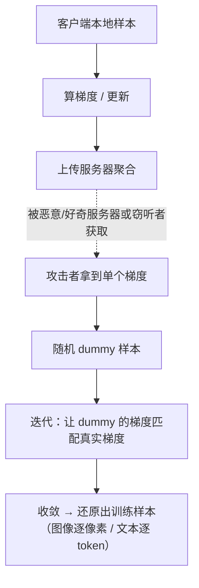

import PrivacyMeta from '@site/src/components/PrivacyMeta';

<PrivacyMeta era="卷五 · 前沿与落地" technique="联邦学习与安全聚合" audience={['隐私工程师', 'ML 工程师', '安全工程师']} severity="高" maturity="研究" evidence="研究支持" />

> 一句话摘要：联邦学习常被说成「只共享**梯度 / 更新**、不共享原始数据，所以隐私」。但 Deep Leakage from Gradients（Zhu 等，NeurIPS 2019）证明：从共享的梯度可以**反演出原始训练样本**——图像逐像素、文本逐 token 匹配，核心算法不到 20 行。Geiping 等（NeurIPS 2020）进一步在**高分辨率、已训练好的网络**上做到，且对**多步 / 多样本平均**的梯度也能破。结论先行：「共享梯度」**不等于**「私有」；FL 要靠**安全聚合 + DP** 才有实质保证，别把「没传原始数据」当隐私。

## 机制：我这边发生了什么

在 FL 里，客户端把本地算出的**梯度 / 更新**发给服务器去聚合。梯度是损失对参数的导数，它**编码**了产生它的那条样本的信息。攻击者（恶意 / 好奇的服务器，或能看到单个更新的窃听者）拿到某客户端的梯度后，可以**反向求解**：

1. 随机初始化一个 **dummy 样本**（和一个 dummy 标签）。
2. 让 dummy 走一遍前向 + 反向，得到它的梯度。
3. **迭代优化 dummy**，使它的梯度**逼近观测到的真实梯度**。
4. 收敛后，dummy 就逼近了那条**真实训练样本**。

红线说清楚：这不是模型「主动泄露」——是**梯度这个数学对象本身约束了产生它的输入**，足够的优化能把输入**解出来**（与模型抽取「输出约束参数」同理，这里是「梯度约束输入」）。可外部验证、可复现，与谁「想不想泄露」无关。



## 威胁面：谁能攻、能还原什么、边界在哪

**谁能攻**：能看到**单个客户端梯度 / 更新**的一方——恶意或「诚实但好奇」的聚合服务器、链路上的窃听者。

**能还原**：单条或小 batch 训练样本——图像可逐像素、文本可逐 token 还原；小 batch 尤其脆弱。

**放大 / 限制因素**：

- **batch 越大**越难还原，但 Geiping 等表明**并非不可能**，到一定程度的平均仍可被破。
- **训练后期 / 已训练好的网络**也能反演（Geiping），不是只在随机初始化时才脆。

**边界**：本条是「**共享更新**」的泄露面，前提是攻击者能拿到**单个**客户端的梯度。一旦更新被**安全聚合**（服务器只见聚合和、不见单个）或被加了 **DP 噪声**，反演难度陡升——那正是它的缓解（见本卷《安全聚合》与《[生产级 DP·FL 部署](./dp-federated-learning.mdx)》）。

## 防护原理

两条互补的实质防护：

- **安全聚合**：让服务器**只看到聚合和、看不到单个梯度**——反演失去「单点」这个支点（见本卷《安全聚合》）。
- **差分隐私**：给梯度**裁剪 + 加噪**，把单样本影响框进 (ε, δ)——在正确裁剪、足够噪声与可复算会计下，反演还原质量显著下降；保护强度取决于 ε/δ、隐私单位与训练设置（见《[DP 微调](../03-conversational-llms/dp-fine-tuning.mdx)》《生产级 DP·FL 部署》）。

经验性手段（**增大 batch、降低更新频率、梯度压缩 / 稀疏化**）能**抬高**反演难度，但**不是形式保证**——Geiping 的标题本身就是反问「在 FL 里破隐私有多容易」，答案是「太容易」，所以这些经验手段**不能单独当隐私保证**。点破：「只传梯度」本身**零保证**；实质隐私要靠安全聚合 / DP。

## 落地实现（配方）

```text
1. 默认假设"单个梯度 = 可反演"：按这个威胁设计，别把"没传原始数据"当隐私。
2. 上安全聚合：让服务器只见聚合和、不见单个更新（接本卷《安全聚合》）。
3. 敏感场景叠 DP-FL：梯度裁剪 + 加噪，报清 (ε, δ)（接《生产级 DP·FL 部署》）。
4. 别把经验手段当保证：大 batch / 压缩 / 降频只抬难度，不替代安全聚合 / DP。
5. 实跑反演审计：对你的 FL 配置跑梯度反演攻击（DLG / Inverting Gradients 类），
   作隐私回归，量化"在你的 batch / 聚合 / DP 下能还原到什么程度"。
```

每个结论绑定**你的模型、batch、聚合与 DP 配置**——论文里「多大 batch 才安全」不能直接迁移，必须用你自己的反演审计实测。

**最小可测试断言**（把反演风险收成可回归的检查）：

- 怎么测：对你的 FL 更新跑梯度反演（DLG / Inverting Gradients 类），在你的 batch / 安全聚合 / DP 配置下评估还原质量。
- 通过：有**安全聚合**（服务器拿不到单个更新）或 **DP**（ε 报清），且反演还原质量被压到**不可辨认 / 不可用**。
- 失败：单个更新可被取到、反演能还原出**可辨认**样本、或根本没有聚合 / DP → 别声称「FL 所以隐私」，先把安全聚合 / DP 补上。

## 真实案例 / 研究进展（工程可行性）

（本条 maturity 标「研究」：以下是**实证攻击**证据，证明「共享梯度 ≠ 私有」，不是「FL 不可用」——它指向的是「必须叠安全聚合 / DP」。）

- **从梯度还原训练数据**：Zhu 等的 **Deep Leakage from Gradients**（NeurIPS 2019）证明，仅凭共享梯度即可**逐像素还原图像、逐 token 匹配文本**，核心匹配算法用 PyTorch 不到 20 行即可实现——把「只传梯度很安全」直接证伪。
- **破到高分辨率、已训练网络**：Geiping 等的 **Inverting Gradients**（NeurIPS 2020）用**余弦相似度损失 + 对抗攻击的优化技巧**，在**高分辨率**图像、**已训练好的深层网络**上忠实还原，并指出**对多次迭代 / 多样本平均的梯度，隐私也未被保护**——直接反驳「平均一下就安全」。论文标题的反问「破隐私有多容易」，结论是「容易」。

## 残余风险与权衡

逐条点破假安全：

- **「只传梯度」零保证。** 梯度编码了输入，足够优化即可还原；FL 的隐私要靠安全聚合 / DP，不靠「没传原始数据」。
- **大 batch / 压缩只是抬难度。** 它们提高反演成本，但 Geiping 表明不是不可破——不能当形式保证。
- **安全聚合防单点，但有前提。** 若参与方串通、或诚实方不足门限，聚合的保护会被削弱（见本卷《安全聚合》的威胁模型）。
- **DP 有效用代价、ε 要报。** 加噪压反演的同时掉点；ε 不报清，「加了 DP」等于没说。
- **反演攻击持续变强。** 今天「够大的 batch」明天可能被新攻击破——审计要随攻击进展重做。

## 与相邻技术的区别

- **梯度泄露 vs 安全聚合（本卷）**：本条是**攻击**（为什么必须防）；《安全聚合》是**防御**（让服务器看不到单个更新）。一攻一防，配套读。
- **梯度泄露 vs 生产级 DP·FL（本卷）**：DP 是**另一道**防御（裁剪 + 加噪限单样本影响），与安全聚合**互补**——一个**藏单点**、一个**限影响**；二者常叠用。
- **梯度泄露 vs 成员推断（卷一）**：MIA 判「某样本**在不在**」；梯度反演直接**还原内容**，是更强的泄露。
- **梯度泄露 vs 模型抽取（卷一）**：模型抽取偷的是**模型**（参数 / 功能）；本条从梯度偷的是**训练数据**——对象相反。

## 版本说明

:::note 适用版本
「共享梯度可被反演成训练样本」是**与具体模型无关**的数学事实（梯度约束输入）。但**多大 batch / 何种聚合 / 多少 DP 噪声才够**强绑定模型结构、数据与攻击方法——Zhu（2019，小 batch 起家）与 Geiping（2020，高分辨率 / 已训网络 / 破平均）的结论**都不能直接迁移**到你的设置；落地必须按你自己的 FL 配置跑反演审计。反演攻击仍在进步，本段打戳 2026-06。（出处核验于 2026-06。）
:::

## 延伸阅读与出处

- [Deep Leakage from Gradients（Zhu 等，NeurIPS 2019；arXiv 1906.08935）](https://arxiv.org/abs/1906.08935) —— 从共享梯度逐像素还原图像、逐 token 还原文本，核心算法不到 20 行。本条主源（「共享梯度 ≠ 私有」的奠基证伪）。
- [Inverting Gradients — How easy is it to break privacy in federated learning?（Geiping 等，NeurIPS 2020；arXiv 2003.14053）](https://arxiv.org/abs/2003.14053) —— 余弦相似度损失 + 对抗优化，在高分辨率、已训练网络上忠实还原，且多次平均也未保护隐私。
