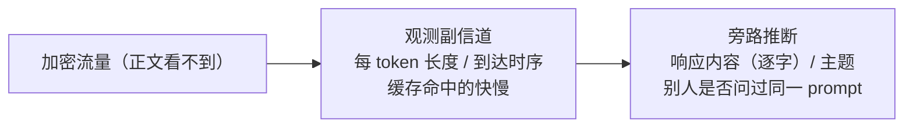

import PrivacyMeta from '@site/src/components/PrivacyMeta';

<PrivacyMeta era="卷五 · 前沿与落地" technique="推理服务期隐私" audience={['安全工程师', '隐私工程师', 'ML 工程师']} severity="高" maturity="研究" evidence="研究支持" />

> 一句话摘要：即使流量全程加密、模型一个字都不多吐，**把我部署起来的那套系统**——逐 token 流式、按 token 长度分包、跨用户共享缓存——本身就是一条泄露通道。Weiss 等（USENIX Security 2024）**只观测每个加密流式 token 的长度**，就把一个 AI 助手响应的约 **29% 逐字还原、对约 55% 推断出主题**（在 OpenAI ChatGPT-4 与 Microsoft Copilot 的浏览器 + API 流量上演示；披露后厂商已打补丁）。Gu 等（ICML 2025）审计 **17 家真实 LLM API 提供方**，发现 **8 家有 prompt 缓存、其中 7 家是跨用户全局共享（含 OpenAI）**——攻击者看到一个异常快的响应，就能推断「**别人刚刚提交过同一个 prompt**」。结论先行：隐私边界要算到**部署层 / 网络层 / 缓存层**，不只是模型层；否则你以为加密就安全，其实时序和长度在替你说话。

## 机制：我这边发生了什么

红线先说清：**不是「我说漏了嘴」**——我无法内省「自己刚才有没有泄露」。可被外部观测、可复算的是：**我被怎么部署，决定了旁观者能从哪些副信道反推内容**。两条都不碰模型权重、也不需要解密正文：

- **逐 token 流式 + 按长度分包**：为了让你尽快看到字，我的响应往往一个 token 一个 token 地推送。即便走 TLS，**每个加密分组的长度**仍近似暴露对应 token 的字符长度；把一串「token 长度序列」交给一个语言模型去猜，就能还原出大量原文——这正是 Weiss 等的攻击。
- **跨用户共享 prompt 缓存**：为省算力，服务方会缓存 prompt 前缀的计算结果。若缓存**跨用户全局共享**，那么「这个 prompt 之前有没有人算过」会体现在**响应延迟**上：命中缓存就明显更快。旁观者（甚至另一个用户）用计时就能推断「别人刚问过这个」——这正是 Gu 等的审计发现。

主语可以是「我」，但谓语都是别人能从外部测到的东西：分组长度、到达时序、首 token 延迟。



## 威胁面：如何被利用 / 你如何被泄露

攻击者模型（按出处的实测条件，**保留条件**别外推）：

- **token 长度到内容（Weiss 等，USENIX'24）**：攻击者是**被动网络旁观者**，只看加密流量、不解密、不碰模型。前提是响应**逐 token 流式**、且**分组长度泄露 token 长度**。成功判定：用约 29% 逐字还原率、约 55% 主题推断率衡量；在 ChatGPT-4 与 Copilot 的浏览器 + API 流量上演示成立。这些数字**绑定其受测系统与设置**，不是普适常数。
- **prompt 缓存计时到跨用户（Gu 等，ICML'25）**：攻击者**只需黑盒 API 访问 + 计时**，无需 logprobs、无需特权。通过响应延迟分布区分缓存命中 / 未命中：审计 17 家，**8 家检出缓存、7 家全局跨用户共享（含 OpenAI）**。后果有二——其一，看到异常快的响应可推断「**另一用户近期提交过这个 prompt**」（prompt 本身常含敏感意图）；其二，缓存时序还可能**泄露架构细节**（如某些提供方的实现差异）。
- **从「探测」升级到「重建」（PromptPeek，NDSS 2025）**：共享缓存不止能推断「别人问过没」，还能被用来**逐 token 重建他人 prompt 的内容**。PromptPeek 在 **SGLang** 这类多租户推理框架（radix-tree KV-cache + 最长前缀匹配调度）上，用缓存命中 / 未命中的时序**逐 token 还原**别的用户的 prompt：在已知 prompt 模板时最高约 **99%**、无背景知识时约 **95%**（⚠️ 数字绑定其受测框架与设置，不可外推）。它把 prompt 缓存侧信道从「泄露元数据（有没有人问过）」推到「**泄露正文（问了什么）**」——跨用户共享 KV-cache 的代价因此更重。
- **同族但本条不展开**：投机解码（speculative decoding）的接受 / 拒绝节奏、GPU/CPU 硬件缓存争用，原理上同属推理期侧信道；本条只聚焦**时序与 prompt 缓存**这两条已被一手研究实测的通道，其余按延伸阅读对待，不替它们背书。

## 防护原理

防护靠**抹掉副信道与正文之间的相关性**，分两条线，各自只保护一段：

- **掩盖 token 长度**（对应长度攻击）：在流式层做**填充 / 批量化**——把分组补到固定长度、或把多个 token 凑成一批再发，让分组长度不再一一对应 token 长度。代价是**延迟或带宽**：填得越齐、批得越大，越安全也越慢 / 越费流量。厂商在 Weiss 披露后正是从这条线打的补丁。
- **隔离 prompt 缓存**（对应缓存计时）：**按用户隔离缓存**、或**禁用跨用户共享**，让「别人算没算过」无法通过你的延迟体现；要不就接受跨用户共享、但**固定 / 拉平时序**（命中与未命中都走相同延迟）以消除可区分性。代价是缓存收益下降。

点破边界：这两条**都在部署 / 网络层，模型够不到**——所以**提示词里写「别泄露时序」毫无意义**。而且它是**此消彼长的拉锯**：填充和拉平时序换来的是性能，厂商打的补丁绑定其当时实现，新的流式优化又可能引入新通道。别把「某家已修」当成「这类问题已终结」。

## 落地实现（配方）

```text
1. 长度侧（流式输出）：在响应流上做填充或批量化，使加密分组长度不再泄露单 token 长度
   ——可固定分组大小，或按 N 个 token 一批刷新。压测延迟 / 带宽回归，定一个可接受档。
2. 缓存侧（prompt 缓存）：按用户 / 租户隔离缓存键（参见《跨会话记忆串味》的键作用域），
   或显式禁用跨用户共享；若必须共享，则对命中 / 未命中拉平时序。
3. 时序基线：对自家推理服务做与 Gu 等同款的计时审计——比较"已缓存 vs 冷"prompt 的
   首 token 延迟分布，量出可区分性有多大。
4. 威胁登记：把"逐 token 流式 + 全局缓存"显式登记为侧信道面，纳入威胁建模与变更评审；
   每次改流式 / 缓存实现都重测，别假设上次的补丁仍然成立。
```

每一步都绑你自己的部署：**你是否逐 token 流式、缓存是否跨用户共享、能容忍多少额外延迟**没量清，防护就只是口号。

**最小可测试断言**（把侧信道收成可回归的检查）：

- 怎么测：① 长度——录制自家流式响应的加密分组长度序列，断言它与底层 token 长度的相关性已被填充 / 批量化压到阈值以下；② 缓存——对同一 prompt 跑「冷 / 热」两轮，统计首 token 延迟分布，断言两者不可区分（或缓存已按用户隔离）。
- 通过：分组长度序列对 token 长度无显著相关、或缓存命中与未命中的延迟分布重叠到设定阈值内——副信道不可用。
- 失败：分组长度仍逐 token 可读、或冷热延迟显著可分 → 别声称「加密所以安全」，回到流式 / 缓存层补填充或隔离。

## 真实案例 / 工程现状（研究演示）

（本条 maturity 标「研究」：两项都是**一手学术研究的实测演示**，不是「某产品已彻底免疫」的背书；厂商已就**已披露的具体通道**打补丁，但攻防仍在动。）

- **远程键盘记录式攻击（Weiss 等，USENIX Security 2024）**：**只观测每个流式加密 token 的长度**，就能逐字还原一个 AI 助手响应的约 **29%**、并对约 **55%** 推断出主题。在 **OpenAI ChatGPT-4 与 Microsoft Copilot** 的浏览器与 API 流量上演示成立；披露后相关厂商已打补丁。还原率绑定其受测系统与流式设置，**不可迁移**地套到别的部署。
- **审计 prompt 缓存（Gu 等，ICML 2025, PMLR v267）**：对 **17 家真实 LLM API 提供方**做计时审计，**8 家检出缓存、其中 7 家为跨用户全局共享（含 OpenAI）**。意味着攻击者凭异常快的响应可推断「另一用户近期提交过同一 prompt」；论文亦指出时序可泄露架构层面的实现细节。是「为性能引入的共享缓存 = 跨用户时序侧信道」的实证。
- **重建他人 prompt（PromptPeek，NDSS 2025）**：*I Know What You Asked* 在 **SGLang** 多租户服务（radix-tree KV-cache + 最长前缀匹配）上，用缓存命中 / 未命中的时序**逐 token 反推别的用户的 prompt**，在三种不同先验知识的场景下均成立——已知模板时最高约 **99%**、无背景知识约 **95%** 还原（⚠️ 绑定其受测框架 / 设置）。它把 Gu 等的「探测复用」升级为「**重建正文**」，是共享 KV-cache 侧信道更重后果的一手实证。
- **同族佐证**：本主题已有《[机密推理与可信执行环境](./confidential-inference.mdx)》讨论 TEE 下推理仍受**侧信道**威胁——加密 / 飞地保护的是正文与权重，**时序 / 长度 / 缓存这类元数据通道仍需单独防**，与本条互为印证。

## 残余风险与权衡

逐条点破假安全：

- **加密 ≠ 防侧信道。** TLS 保的是正文不可读；分组**长度与到达时序**仍在外面。以为「上了 HTTPS 就安全」，正是这条最典型的假安全。
- **数字绑定受测设置、不可迁移。** 约 29% / 55% 是 Weiss 等在其特定系统、特定流式实现下测得；你的部署 token 化、分包、批策略不同，可还原率可能更高也可能更低——**必须按你自己的栈自测**，别直接引用乐观或悲观的单一数字。
- **缓存的隐私 / 性能是真权衡。** 跨用户共享缓存省钱省算力，但天然制造跨用户时序信道；隔离或拉平时序更私密，却牺牲缓存收益。这是工程取舍，不是免费午餐。
- **「已打补丁」是时间点快照。** 厂商补的是**已披露的具体通道**；新的流式 / 解码 / 缓存优化可能引入新通道。这是持续的猫鼠博弈，把它当一次性问题解决就会再次踩坑。
- **第三方推理你测不到底。** 用托管 API 时，对方的填充 / 缓存隔离实现你只能要求 + 抽测（如 Gu 等那样做外部计时审计），无法完全掌控。

## 与相邻技术的区别

- **推理期侧信道 vs [推理服务数据边界](../06-governance-compliance/inference-service-data-boundary.mdx)（卷六）**：那条是你**信任服务方、关心它把数据留存 / 用于训练到什么程度**（信任与合规层）；本条**不假设服务方作恶**，泄露来自部署形态本身的时序 / 长度副信道（部署 / 网络层）——是被动旁观者就能用的。
- **推理期侧信道 vs [跨会话记忆串味](../04-rag-agents/cross-session-memory-bleed.mdx)（卷四）**：那条是缓存 / 记忆**数据错配**把别人的内容**直接串进**你的上下文（数据被错发）；本条是从**时序**旁路反推、并不直接拿到正文。两者在 **prompt 缓存跨用户共享**这一点上相关——同一个共享缓存，错配会串数据、计时会泄时序，常一起审。
- **推理期侧信道 vs [上下文面隐私](../03-conversational-llms/context-surface-privacy.mdx)（卷三）**：那条是上下文窗口里的东西被**提示套出**（交互层、对手是会对话的终端用户）；本条对手**连对话都不需要**，只在网络旁观或计时（部署层）。

## 版本说明

:::note 适用版本
「加密之外，流式 token 长度与 prompt 缓存时序仍是侧信道」是与具体厂商无关的**部署期事实**（根因在逐 token 流式 + 按长度分包 + 跨用户缓存复用）。但**两点会随版本变**：① Weiss 等披露后，相关厂商已对 token 长度通道打补丁，**约 29% / 55% 的可还原率绑定其当时的受测系统**，不代表今天任一部署的现状；② Gu 等的「8/17 有缓存、7 家跨用户共享」是 **2025 年的快照**，提供方的缓存策略随时可调整。攻防是动态拉锯——填充 / 隔离会被新的流式 / 解码优化重新打开缺口，须按你自己的部署持续重测。本段打戳 2026-06。（出处核验于 2026-06。）
:::

## 延伸阅读与出处

> 主要：研究支持（两篇一手学术论文）。

- [What Was Your Prompt? A Remote Keylogging Attack on AI Assistants（Weiss 等，USENIX Security 2024）](https://www.usenix.org/conference/usenixsecurity24/presentation/weiss) —— 仅凭加密流式 token 的长度序列，逐字还原约 29% 响应、推断约 55% 主题（ChatGPT-4 / Copilot）；本条长度侧主证据。
- [Auditing Prompt Caching in Language Model APIs（Gu 等，ICML 2025, PMLR v267）](https://proceedings.mlr.press/v267/gu25b.html) —— 计时审计 17 家提供方，8 家有缓存、7 家全局跨用户共享（含 OpenAI），快响应暴露「别人问过同一 prompt」；本条缓存侧主证据。
- [I Know What You Asked: Prompt Leakage via KV-Cache Sharing in Multi-Tenant LLM Serving（PromptPeek，NDSS 2025）](https://www.ndss-symposium.org/ndss-paper/i-know-what-you-asked-prompt-leakage-via-kv-cache-sharing-in-multi-tenant-llm-serving/) —— 把缓存侧信道从「探测复用」推到「逐 token 重建正文」：在 SGLang 多租户框架上还原他人 prompt，已知模板约 99%、无背景约 95%（绑定其设置）。本条 KV-cache 重建的一手证据。
