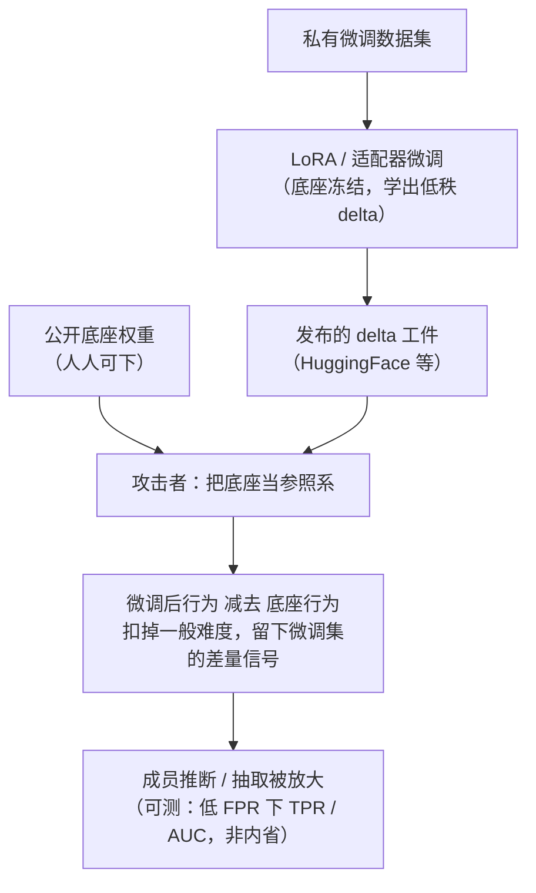

import PrivacyMeta from '@site/src/components/PrivacyMeta';

<PrivacyMeta era="卷五 · 前沿与落地" technique="推断类攻击" audience={['隐私工程师', 'ML 工程师', '安全工程师']} severity="中" maturity="研究" evidence="研究支持" />

> 一句话摘要：你在**私有数据**上做 LoRA / 适配器微调，然后把这份 delta 发到 HuggingFace，心想「底座是公开的，我只发了一小块差量，我的数据藏得住」。这份心安是假的——**发布的 delta 恰恰把微调信号浓缩在了一处**：底座与微调后模型之间的差，本身就是**微调数据的指纹**。攻击者只要同时握有你的适配器**和**那个公开底座，就能把公开底座当**参照系**，跑一次被 delta 放大的**成员推断 / 抽取**。LoRA-Leak（arXiv 2507.18302，⚠️预印本）实测：即便在保守微调设置下，成员推断仍能到 **0.775 AUC**，且「拿公开预训练模型当参照」正是被以往 MIA 忽略、却能放大泄露的那一手。结论先行：**「delta 小 / 底座公开」不是隐私——公开底座是攻击者手里的免费参照，把你的成员可区分度抬高了。**

## 机制：我这边发生了什么

参数高效微调（LoRA / adapter）只训练一小撮新增参数：底座冻结，你学出的是一个低秩 delta，叠加上去就得到微调后的我。发布时你通常只发这份 delta（几十 MB），底座指向某个公开权重。直觉上「小 delta = 小暴露」。

但从隐私角度看，这份 delta **不是**「无关紧要的小改动」——它是**为拟合你的微调集而生的那部分参数变化**，把训练数据的痕迹**集中**在了一处。更关键的是攻击者手里多了一个东西：**公开底座**。有了底座做**参照系**，攻击者能把「微调后模型在某条样本上的行为」和「底座在同一条样本上的行为」**相减**——底座对所有文本的「一般难度」被扣掉，剩下的差量里，**你的微调集成员**会露出更陡的信号。这正是 LoRA-Leak 指出、以往 MIA 忽略的一手：**用预训练模型当参照，能诱发出比只看微调模型更多的信息泄露**（Ran et al., 2025，⚠️预印本）。

红线说清楚（把机制写成可外部观测、而非自我内省）：我不写「我把微调数据记在了适配器里 / 我知道哪些样本在我的微调集」——那是我无法可靠内省的自述。可被外部观测、可复算的是：**发布的 delta 是一件外部可拿到的工件；攻击者能否用「底座 + delta」区分出微调集成员，是一个在给定条件（底座、适配器秩、数据集、是否持有参照底座）下可测量的成员推断成功率（如低 FPR 下的 TPR、AUC）**——这是对一件工件跑攻击的度量，**不是**我对「自己记得什么」的任何自述。



## 威胁面：攻击者模型与可区分度

写清攻击者模型（对应本主题「分类必核清单」）：

- **攻击者持有什么**：你发布的**适配器 / LoRA delta**，**加上**那个公开**底座**（LoRA 适配器本就必须配它的底座才能用，所以「攻击者有底座」是这类工件的**内建前提**，不是额外假设）。参照式 MIA 通常要能对模型算逐样本损失 / 似然（白盒或可取 logprobs）。
- **攻击者想要什么**：判定「某条样本**在不在**你的私有微调集里」（成员推断，一个比特——见《[成员推断攻击](../01-foundations/membership-inference.mdx)》），进一步在高重复 / 罕见片段上尝试**逐字抽取**。
- **公开底座的作用（本条命门）**：底座是**免费参照**。LoRA-Leak 的核心增量就是那**五种利用预训练模型作参照的改进版 MIA**——在其十种既有 MIA 之外，用「底座 vs 微调后」的差把成员信号抬出来；实测即便在**保守微调设置**下，成员推断仍达 **0.775 AUC**（Ran et al., 2025，⚠️预印本；跨三个语言模型、三项 NLP 任务，数字随底座 / 秩 / 数据集 / 微调步数变，别搬成你的数）。

**判定口径（别被平均数骗）**：和一般 MIA 一样，用**低误报率（如 0.1% / 1% FPR）下的命中率（TPR）**看「能不能有把握地揪出个别成员」，别只报平均准确率或单一 AUC——平均数会把「尾部样本被高置信认出」这种真风险抹平（口径依据见《[成员推断攻击](../01-foundations/membership-inference.mdx)》里 LiRA 的论证）。

**一条更狠的变体（供应链侧，须与被动参照分开）**：如果攻击者不是被动拿公开底座，而是**主动发布一个被做过手脚的底座**、诱你在其上微调，泄露会被进一步放大——PreCurious（CCS 2024）证明：攻击者**发布预训练模型、只需对微调后模型黑盒访问**，即可**同时放大**微调集上的**成员推断与数据抽取**（Liu et al., 2024）。注意边界：**LoRA-Leak 用的是诚实的公开底座作被动参照；PreCurious 是攻击者精心构造底座的主动供应链变体**——两者机制不同、威胁前提不同，别混为一谈（下面「防护」「案例」会分别对待）。

## 防护原理

这条威胁的根是「**delta 集中了微调信号 + 公开底座给了参照**」，所以防护要么**削弱 delta 里的成员信号**，要么**别把这个参照 / 工件交出去**：

- **发布前评估适配器的可泄露性**：把「发布 delta」当成一次隐私事件，**发布前**就对「底座 + delta」跑参照式 MIA 审计，量出成员可区分度、设门槛（配方见下）。这不改机制，但让你**带着数字**决定发不发、发哪个 checkpoint。
- **DP 微调给形式上界**：用差分隐私微调（DP-SGD：逐样本裁剪 + 加噪）把**任一样本对参数的影响**框进 (ε, δ) 上界，从而**上界化**「区分某条样本在不在微调集」的优势——这是对本条 MIA 的**形式化**缓解（见《[DP 微调](../03-conversational-llms/dp-fine-tuning.mdx)》）。点破边界：ε 不为零、有效用代价；参数高效（LoRA）本身**不等于**隐私，只有裁剪 + 加噪 + 隐私会计 + 隐私单位齐全才构成 DP。
- **限制发布 / 私有托管**：可泄露度过高、又必须用敏感数据微调时，**别公开发 delta**——私有托管、只出推理端点、按需授权。攻击者拿不到工件，这条参照式放大就无从谈起（但推理端点仍有黑盒 MIA 面，见《成员推断攻击》）。
- **微调侧的缓解（LoRA-Leak 实测有效的两种）**：LoRA-Leak 评了四种防御，发现**只有 dropout 与「微调时排除特定 LM 层」**能在**保住效用**的同时压低 MIA 风险（Ran et al., 2025，⚠️预印本）；其余手段要么效用掉太多、要么防不住。这类经验手段**削弱信号但无形式保证**，要与 DP 分开看：**dropout / 排层是「让信号变弱」，DP 是「给信号封顶」**。
- **别指望「合并进底座」抹除指纹**：把 LoRA 合并（merge）进底座得到一个完整权重，只是改变了工件形态——**微调数据的参数印记仍在**，攻击者仍可用**独立获取的原始公开底座**当参照来做差。合并 ≠ 抹除（详见「残余风险」）。

## 落地实现（配方：发布 LoRA 前的成员可区分度审计）

把「发布适配器」从「上传就完事」升级成「带审计门槛的发布决策」：

```text
1. 备齐三件套：你的适配器 delta、对应公开底座、以及一组"确定在微调集"(members)
   与"确定不在"(non-members) 的留出样本（非成员要同分布、同预处理，别引入分布捷径）。
2. 组装两个模型：底座单独一个（参照）、底座+delta 合出微调后一个（目标）。
3. 跑参照式逐样本 MIA：对每条样本，在目标与参照上各算损失/似然，取差值（或似然比）
   作为成员分数——这就是"用公开底座当参照"的核心；有条件就上多种打分器对比。
4. 按对的口径报结果：画 ROC，读低 FPR（0.1% / 1%）下的 TPR，别只报平均 AUC；
   高重复/罕见片段另跑一次逐字抽取试探（成员集里能被逼出多少原文）。
5. 设门槛 + 决策：可区分度超过你设定的阈值 → 不直接公开发。可选缓解按代价排序：
   先试 dropout / 排除特定层（LoRA-Leak 实测保效用），敏感数据上 DP 微调（报清 ε、δ、隐私单位），
   仍超阈就私有托管/只出推理端点。每次决策连同数字留档。
```

每个数字（AUC、低 FPR 档、阈值）都要带上**你自己的底座、适配器秩、数据集与微调步数**——LoRA-Leak 的 0.775 AUC 绑定它的实验设置，不能直接搬成你的门槛。

**最小可测试断言**（把「发布适配器」收成 CI / 发布流水线里可回归的检查）：

- 怎么测：发布流水线里对「底座 + 待发 delta」跑参照式 MIA 审计，report 低 FPR（0.1% / 1%）下的 TPR 与整体 AUC，并对成员集跑一次逐字抽取试探。
- 通过：低 FPR 下 TPR 接近随机基线（约等于 FPR）、AUC 接近 0.5，且逐字抽取试探取不出可辨认原文；上了 DP 则 (ε, δ) 可被独立复算、隐私单位与要保护对象一致。
- 失败：低 FPR 下 TPR 显著高于基线、或 AUC 明显大于 0.5、或原文可被抽出 → 判「适配器可泄露微调集」，回去上 dropout / 排层 / DP，或改私有托管，别直接公开发。

## 研究进展与工程可行性（LoRA / 适配器发布的现实）

（本条 maturity 标「研究」：以下是**研究进展与工程可行性**证据，指向「发布私有微调的 delta 前必须审计」，**不是**「已有大规模野外泄露事件」的背书。所有预印本结论逐条 ⚠️ 标注、带条件。）

**部署现实（为什么这条重要）**：HuggingFace 等模型仓库里**塞满了共享的 LoRA / 适配器**——大量团队把在私有数据上微调出的 delta 例行公开，默认「只是公开底座上的一小块差量，我的数据是安全的」。本条要破的正是这份默认心安。

**LoRA-Leak（Ran et al., arXiv 2507.18302，2025-07；⚠️预印本，本条主源）**：一个针对语言模型微调集的 MIA 整体评估框架，含**十五种 MIA（十种既有 + 五种改进）**，改进版的关键就是**把公开预训练模型当参照**——而这正是以往 MIA 忽略、却能放大泄露的一手。核心结论：**LoRA 只调一小撮参数，并不意味着微调数据对 MIA 免疫**；即便在**保守微调设置**下，成员推断仍达 **0.775 AUC**（跨三个语言模型、三项 NLP 任务）。防御侧：评了四种，**只有 dropout 与排除特定 LM 层**能在保住效用的同时压低风险。⚠️ 预印本、未见正式发表，数字绑定其实验设置，落地须自测。

**PreCurious（Liu et al., CCS 2024；同行评审，供应链变体）**：把「公开底座」从**被动参照**升级为**主动攻击面**——攻击者**发布一个预训练模型、只对微调后模型黑盒访问**，即可**同时放大**微调集上的**成员推断与数据抽取**；其手法是操纵预训练阶段的记忆倾向、再用一份看似正常的配置引导微调。这条来自**顶会一手实证**（ACM CCS 2024），是「发布 / 采用底座这一环本身就是隐私攻击面」的强证据。用法边界（重申）：它是**攻击者构造底座**的主动路径，**不能**外推成「诚实公开底座 + 诚实微调也会被这样抽取」——那部分归 LoRA-Leak 的被动参照结论。

**相邻对照（Wen et al., arXiv 2310.11397，2023；⚠️预印本）**：对比 LoRA / 软提示 / 上下文学习在 MIA、后门、模型窃取下的稳健性，采**黑盒**威胁模型、用基于损失的 MIA。它的相对结论（不同微调范式脆弱程度有别）说明「LoRA 的泄露面要与它的具体设置绑定看」，可作机制参照；⚠️ 预印本、口径与 LoRA-Leak 不同（黑盒 vs 参照式），不与主源数字互换。

三者合起来说明同一件事：**「发布私有微调的 delta」是一次需要审计的隐私事件——公开底座既可被攻击者当被动参照放大成员推断（LoRA-Leak），也可能本身就是被构造的攻击面（PreCurious）；「delta 小 / 底座公开」从来不是隐私保证。**

## 残余风险与权衡

逐条点破假安全：

- **「delta 小 / 底座公开，所以我的数据藏得住」是错的。** delta 恰恰**集中**了微调信号，公开底座是攻击者手里的**免费参照**——两者叠加是**放大器**不是屏障。LoRA-Leak 在保守设置下仍到 0.775 AUC（⚠️预印本、绑定其设置）。
- **「参数高效 = 隐私」是混淆。** LoRA / adapter 只是**省算力的载体**，不是隐私技术。只有裁剪 + 加噪 + 隐私会计 + 隐私单位齐全才构成 DP（见《DP 微调》）；不做这些，「用了 LoRA」和隐私无关。
- **DP 有效、但有代价。** DP 微调给「区分成员」的优势一个 (ε, δ) 上界，**但 ε 不为零**（是「限制泄露」不是「零泄露」），且收紧 ε 会掉效用——明账算的取舍，不是免费安全。
- **合并进底座 ≠ 抹除指纹。** 把 LoRA 合并成完整权重只换了工件形态；微调数据的参数印记仍在，攻击者仍能用**独立获取的原始公开底座**当参照做差。想真正消除单样本影响要走机器遗忘 / 重训（见《[机器遗忘](./machine-unlearning.mdx)》），且遗忘本身要可验证（见《[遗忘验证](./unlearning-verification.mdx)》）。
- **dropout / 排层是「弱化」不是「封顶」。** LoRA-Leak 里这两种保效用地降了风险，但它们是**经验手段、无形式保证**；高敏数据别拿它们替代 DP 的形式上界。
- **私有托管挪走了工件面，没挪走黑盒面。** 不公开发 delta，能挡住「拿工件当参照」这一路；但只要还开推理端点，一般的黑盒 MIA 仍成立（见《成员推断攻击》）。
- **量级绑定实验设置。** 「0.775 AUC / 保守设置 / 三模型三任务」「dropout·排层有效」来自 LoRA-Leak 的设置（⚠️预印本），PreCurious 的放大幅度来自其 CCS'24 设置——都**不可直接迁移**到你的底座、秩与数据，落地必自测。

## 合规映射

- **GDPR**：「某人是否在某微调集中」可识别到个人、属个人数据；把能被高置信反推成员的适配器**公开发布**，等于经由发布物泄露个人数据，触及最小化、目的限制与安全义务。发布前的成员可区分度审计，是「已尽技术措施」论证的一环。
- **匿名化门槛**：若能从你发布的 delta 高置信反推微调集成员，所谓「已脱敏 / 匿名」就不成立（与 GDPR 对「真正匿名数据」的高门槛一致）——MIA 是检验它的试金石。
- **OWASP LLM02:2025**：敏感信息泄露包含「模型 / 发布物让外部推断出训练成员」这一面；公开适配器是其中一个具体载体。

（合规随法条 / 框架版本演进，本段打戳 2026-07，引用前核对最新生效文本。）

## 与相邻技术的区别

- **本条 vs《[DP 微调](../03-conversational-llms/dp-fine-tuning.mdx)》（卷三）**：那条是**防御**（DP 训练给单样本影响上界）；本条是**攻击**——攻击者拿你**发布的适配器**做参照式成员推断 / 抽取。DP 微调正是本条的**主要缓解**（把 MIA 优势封顶），故互链。
- **本条 vs《[成员推断攻击](../01-foundations/membership-inference.mdx)》（卷一）**：那条是 MIA 的**通用地基**（成员 / 非成员行为差异）；本条是它在 LoRA 场景下、经由**共享工件（delta + 公开底座）的特定放大**——增量在「公开底座当参照」这一手，以及「你亲手把 delta 发出去」这个供应链前提。
- **本条 vs《[微调即服务隐私](../06-governance-compliance/ftaas-privacy.mdx)》（卷六）**：那条是**厂商 API 侧**的数据边界与对齐侵蚀（你把数据交给厂商、数据在厂商侧的去向）；本条是**开放权重供应链**侧——**你自己把 delta 公开发布**，工件落在攻击者手里。一个是「数据交出去后厂商怎么处置」，一个是「派生工件被你主动公开」。

## 版本说明

:::note 适用版本
「公开底座当参照可放大 LoRA / 适配器微调集的成员推断」目前主要证据是 **LoRA-Leak（arXiv 2507.18302，2025-07，⚠️预印本，未见正式发表）**——其「0.775 AUC / 保守设置」「dropout 与排除特定 LM 层有效」绑定其三模型三任务实验设置，**不可直接迁移**，落地须以你自己的底座、适配器秩、数据集与微调步数重测。供应链变体（攻击者主动构造底座放大 MIA + 抽取）有 **PreCurious（CCS 2024，同行评审）** 一手实证，但那是**攻击者构造底座**的主动路径，别与「诚实公开底座 + 被动参照」混用。相邻对照 **Wen et al.（arXiv 2310.11397，⚠️预印本）** 采黑盒口径，不与主源数字互换。此类攻防随参数高效微调与 MIA 方法迭代演进，本段打戳 2026-07。（出处核验于 2026-07。）
:::

## 延伸阅读与出处

证据为混合——**主要：研究支持**（LoRA-Leak，⚠️预印本，本条被动参照放大的主源）；**补充：同行评审一手实证**（PreCurious，CCS 2024，供应链主动变体）。所有量化数字均绑定各自实验设置，落地须自测。

- [LoRA-Leak: Membership Inference Attacks Against LoRA Fine-tuned Language Models（Ran 等，arXiv 2507.18302，2025-07；⚠️预印本）](https://arxiv.org/abs/2507.18302) —— 本条主源：含十五种 MIA（十既有 + 五种以**公开预训练模型作参照**的改进版），揭示「LoRA 只调少量参数 ≠ 微调数据对 MIA 免疫」；保守设置下成员推断达 **0.775 AUC**（三模型三任务）；四种防御中仅 **dropout 与排除特定 LM 层**保效用地降风险。⚠️ 预印本，数字绑定其实验设置。
- [PreCurious: How Innocent Pre-Trained Language Models Turn into Privacy Traps（Liu 等，ACM CCS 2024；DOI 10.1145/3658644.3690279）](https://dl.acm.org/doi/10.1145/3658644.3690279) —— 同行评审一手实证（供应链变体）：攻击者**发布预训练模型、仅黑盒访问微调后模型**，即可**同时放大**微调集的**成员推断与数据抽取**。用作「发布 / 采用底座这一环本身是隐私攻击面」的强证据；**不**外推为「诚实底座 + 诚实微调也被此抽取」。
- [Last One Standing: A Comparative Analysis of Security and Privacy of Soft Prompt Tuning, LoRA, and In-Context Learning（Wen 等，arXiv 2310.11397，2023；⚠️预印本）](https://arxiv.org/abs/2310.11397) —— 相邻对照：黑盒、基于损失的 MIA 下对比 LoRA / 软提示 / 上下文学习的稳健性，说明「LoRA 泄露面须绑定其具体设置看」。⚠️ 预印本，口径（黑盒）与主源（参照式）不同，不互换数字。
