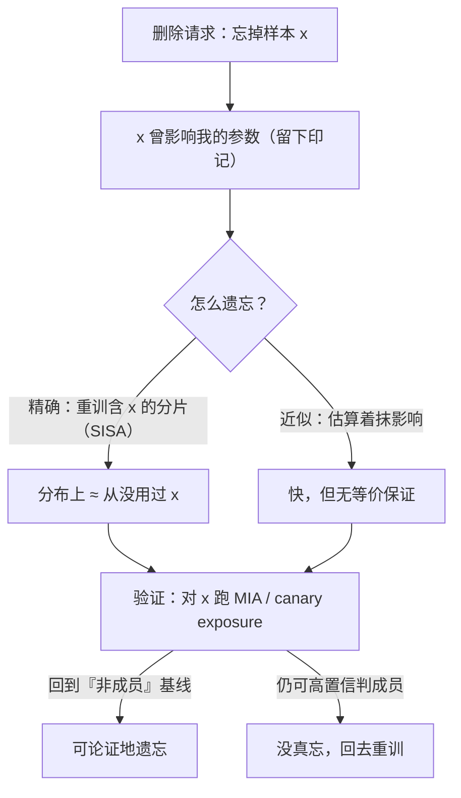

import PrivacyMeta from '@site/src/components/PrivacyMeta';

<PrivacyMeta era="卷五 · 前沿与落地" technique="机器遗忘与被遗忘权" audience={['隐私工程师', 'ML 工程师', '合规工程师']} severity="中" maturity="试验" evidence="研究支持" />

> 一句话摘要：用户行使被遗忘权（GDPR Art.17），你从训练集删了他的记录——但**模型可能还记得**（见卷二《[训练数据抽取](../02-memorization-extraction/training-data-extraction.mdx)》：进了权重的记忆，删源数据不会自动消失）。机器遗忘要的是「让模型表现得像从没见过这条」。难点有二：① 怎么**真**遗忘（精确遗忘 ≈ 等价重训，贵；近似遗忘快但无保证）；② 怎么**证明**真忘了（可验证删除）——这才是工程上最缺的一环。

## 机制：我这边发生了什么

一条样本影响过我的参数：训练时它的梯度更新在我身上留下了印记（这正是记忆、抽取、成员推断的来源）。要「遗忘」它，就得抹掉它对参数的影响。

- **精确遗忘（exact）**：让遗忘后的我，在分布上**等同于「从没用过这条数据重训出来的我」**。黄金标准是真重训，但对大模型成本不可接受。Cao & Yang（2015，首倡机器遗忘）把学习算法转成**求和形式**，删一条样本只需更新少量求和、比重训快得多；Bourtoule 等（**SISA**，2021）把训练**分片**（Sharded / Isolated / Sliced / Aggregated），遗忘只需重训**含该样本的那个分片**、而非整模型。
- **近似遗忘（approximate）**：用梯度反向、影响函数估计等手段「估算着抹掉」，快，但**不保证**真等价于重训。

红线：我不写「我忘了它」——我无法内省「是否真忘」。可被外部论证的是：**遗忘后，我在该样本上的行为与可区分性，是否回到了「没见过」的水平**（用成员推断之类的度量来验，见卷一《[成员推断](../01-foundations/membership-inference.mdx)》）。



## 威胁面：为什么「删了」常是假的

- **输出抑制 ≠ 真删除**：让模型「拒绝输出」某内容，权重里它**还在**——换个提示、绕过对齐，仍可能套出（与训练数据抽取同理）。
- **近似遗忘无形式保证**：跑了个遗忘算法，不等于数学上等价重训；残余影响可能仍被攻击测出。
- **删一条 ≠ 删其影响**：相似 / 相关样本可能把被删样本的信息「学」了回去；下游蒸馏模型、缓存、日志、备份里的副本也得一起处理。
- **验证缺位**：最缺的一环——大多数方案**给不出「真忘了」的证据**，只能说「我们跑了遗忘」。

## 防护原理

两条腿：**精确遗忘给「等价重训」的保证**（SISA 让它对分片可负担），**验证靠攻击式审计**。承重点在后者——**「可验证」= 用攻击来证伪「已遗忘」**：删除后对目标样本跑成员推断（卷一 [MIA](../01-foundations/membership-inference.mdx)）或看注入 canary 的 exposure，若攻击仍能高置信判定它是成员 / 仍被偏好复现，就**没真忘**。可验证删除，是把「我们删了」升级成「可被外部证伪地删了」。

## 落地实现（配方）

```text
1. 选路线：
   - 能重训的小模型 / 分片：用精确遗忘（SISA 式分片，遗忘只重训受影响分片）。
   - 大模型：先评估「源删除 + 重训触发阈值 + 输出过滤」的组合，别假装单点删除=遗忘。
2. 删除请求要追到全链：训练集、相关/派生数据、下游蒸馏模型、缓存、日志、备份
   （跨存储传播，见数据生命周期）。
3. 删除后必须跑遗忘验证：对目标样本跑 MIA / 看 canary exposure，是否回到基线。
4. 留删除证据：把「删了什么 + 何时 + 验证结果」记成可审计工件（对应 Art.17 论证）。
```

每个判定（重训触发阈值、验证的 FPR 档、可接受残余信号）都要带上**你的模型与威胁模型**；论文设置未必迁到你的场景。

**最小可测试断言**（把「遗忘」收成可回归的检查，别停在「我们跑了遗忘算法」）：

- 怎么测：删除后对目标样本跑成员推断（低 FPR 下的 TPR）/ 看注入 canary 的 exposure。
- 通过：目标样本的成员信号 / exposure 回落到「非成员 / 未注入」基线，且与「从没用过该样本重训」的模型在该样本上**不可区分**。
- 失败：仍能高置信判成员 / exposure 仍高 → 没真忘，回去重训或换精确遗忘，别只做输出抑制。

## 真实案例 / 研究进展

（本条 maturity 标「试验」：以下是研究进展与工程可行性，不是「LLM 可验证遗忘已生产」的背书。）

机器遗忘由 Cao & Yang（2015）首倡——把学习转成求和形式，删样本只更新少量求和、比重训快得多（IEEE S&P 2015）。Bourtoule 等（2021）的 **SISA** 把精确遗忘做到**可负担**：分片训练 + 缓存中间状态，遗忘只重训含该样本的分片，并在 MNIST / CIFAR / ImageNet 等多个数据集与模型上实现（IEEE S&P 2021）。但**大语言模型规模的可验证遗忘仍是开放问题**——近似方法多、强保证少，评测口径也未统一（见综述，2024）。

## 残余风险与权衡

逐条点破假安全：

- **输出抑制 ≠ 遗忘。** 拒绝输出只是盖住，权重里还在，可被绕过套出。
- **近似遗忘无保证。** 别把「跑了个遗忘算法」当「证明忘了」——残余影响可能仍可测。
- **删一条 ≠ 删其影响。** 相关数据、下游模型、缓存 / 日志 / 备份副本不一起处理，等于没删干净。
- **验证本身难，且只是「至少这个攻击查不出」。** MIA 验证通过不等于绝对遗忘，只是当前攻击测不出；换更强攻击可能又测出。
- **精确遗忘对大模型仍贵。** SISA 让分片重训可负担，但大模型全量精确遗忘的成本仍是真实工程权衡。

## 合规映射

- **GDPR Art.17（被遗忘权）**：法律要求「删除个人数据」，但「删训练记录」**不等于**「模型遗忘」——技术删除义务与重训 / 遗忘的成本之间有真实落差。可验证遗忘是把「我们删了」变成「**可证我们删了**」的关键，也是应对监管问询的证据。
- **EU AI Act**：训练数据透明度义务，会让「用了谁的数据、能否删除其影响」更需写明。

（合规随法条版本演进，本段打戳 2026-06，引用前核对最新生效文本。）

## 与相邻技术的区别

- **机器遗忘 vs DP 微调（卷三）**：DP 是**事前预防**（训练时就限制单样本影响，见《[DP 微调](../03-conversational-llms/dp-fine-tuning.mdx)》）；遗忘是**事后删除**（训完再设法抹掉某条的影响）。都关乎「单样本」，一个在前、一个在后；DP 训练过的模型，单样本影响本就有界，遗忘也更容易论证。
- **机器遗忘 vs 成员推断（卷一）**：MIA 是遗忘的**验证工具**——删完用它证伪「已遗忘」。两者是「攻击 ↔ 用攻击来验防御」的关系（见 [MIA](../01-foundations/membership-inference.mdx)）。

## 版本说明

:::note 适用版本
机器遗忘是**与模型无关**的问题框架，但**方法与可行性随模型规模快速变化**：判别式 / 中小模型上精确遗忘（求和形式、SISA）较成熟；大语言模型上的可验证遗忘仍以研究 / 近似方法为主，强保证与统一评测尚在推进。本条按 2026-06 的研究现状表述，落地以你的模型、验证口径与重训成本为准。（出处核验于 2026-06。）
:::

## 延伸阅读与出处

- [Towards Making Systems Forget with Machine Unlearning（Cao & Yang，IEEE S&P 2015）](https://dl.acm.org/doi/10.1109/SP.2015.35) —— 首倡机器遗忘：把学习转成求和形式，删样本只更新少量求和、快于重训。
- [Machine Unlearning / SISA（Bourtoule 等，IEEE S&P 2021；arXiv 1912.03817）](https://arxiv.org/abs/1912.03817) —— 分片训练让精确遗忘可负担：遗忘只重训含该样本的分片。
- [Machine Unlearning: A Comprehensive Survey（2024；arXiv 2405.07406）](https://arxiv.org/abs/2405.07406) —— 精确 vs 近似遗忘、验证挑战与开放问题的综述。
