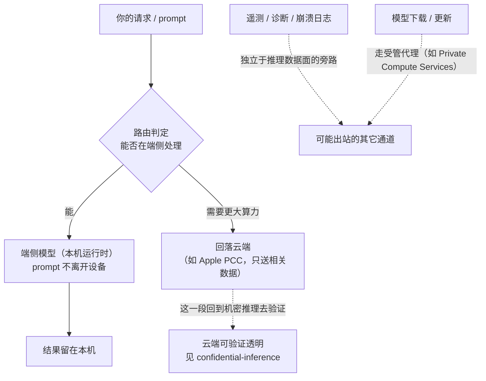

import PrivacyMeta from '@site/src/components/PrivacyMeta';

<PrivacyMeta era="卷五 · 前沿与落地" technique="隐私保护计算" audience={['隐私工程师', '安全工程师', 'ML 工程师']} severity="中" maturity="生产" evidence="官方文档" />

> 一句话摘要：把模型跑在你自己的设备上，prompt 就不必离开设备——这条路线**真能落地**（Apple Intelligence 的端侧 ~30 亿参数模型、Google Gemini Nano 经 Android AICore 端侧运行都已发货），也是 [机密推理](./confidential-inference.mdx)「云看不到」之外的**互补路线**：端侧是「设备不发出去」。但「端侧」是个容易被过度解读的词——真正的边界不在「厂商说端侧」，而在**哪些请求仍会回落到云、端侧模型因为更小付了多少能力代价、以及遥测 / 诊断 / 模型下载这些通道**。结论先行：「端侧」≠「零外传」；能验证的是「这一路请求确实在本机跑完、prompt 没为这条路径离开设备」，而**哪些请求端侧、哪些回落云是一个要去核的部署事实，不是模型的一句承诺**。回落云那部分，得回到机密推理去验证。

## 机制：我这边发生了什么

当我作为一个**端侧模型**在你设备上跑，这边发生的是：你的 prompt 在**本机的推理运行时**里被处理、产出结果，这一路**不需要把 prompt 发到服务端**。厂商把这条路线做成了「端侧优先、必要时回落云」：

- **Apple Intelligence**：官方称「许多驱动它的模型完全在设备上运行」，端侧是一个 **~30 亿参数**的语言模型，另有一个**更大的、经 Private Cloud Compute（PCC）运行的服务端模型**。路由是**先判能否端侧**——「当用户发起请求，Apple Intelligence 分析它能否在设备上处理；如果需要更大算力，它可以调用 Private Cloud Compute，只把与该任务相关的数据送去处理」（Apple Machine Learning Research）。
- **Gemini Nano（Android AICore）**：官方称「端侧生成式 AI 在本地执行 prompt，消除服务端调用」「无需网络连接、也不把数据发往云」；承载它的 **AICore** 系统服务「被设计成隔离每次请求、处理后不留存任何输入数据或产出记录」（Android Developers）。

红线说清楚：我**不写**「我保证把你的数据留在本地 / 我不会把它外传」——这类是我无法可靠自证的承诺。可外部核查、可复算的只有：**在端侧路径上，推理在本机完成、prompt 没为这条路径离开设备**；而「这次请求到底走端侧还是回落云」是一个**要按部署去核的事实**（看推理期间有没有发生网络出站、送去哪、送了什么），不是我能替你保证的。下面每句主语可以是「我」，但谓语都是别人能从设备的网络行为侧测到的东西。



## 威胁面：端侧防什么、不防什么

端侧路线**防的是**：把 prompt 交给远端服务方看——推理在本机跑完，这一路 prompt 不必发出去，云运营商 / 服务方**看不到这条路径上的明文**。但它**不防**下面这些，逐条点破：

- **不防 ① 本机被攻陷。** 端侧把明文放在了**你自己的设备**上。设备被恶意 App、越狱 / root、取证提取或恶意软件拿下，本地明文就暴露——威胁从「远端服务方」搬到了「本机安全」。端侧不等于把这份数据保护起来，只是**换了信任边界**。
- **不防 ② 回落到云的那部分。** 端侧优先不代表全部端侧：需要更大算力的请求会**回落云**（Apple 明确「需要更大算力时调用 PCC」）。这一部分**离开了设备**，它的隐私要靠云端那条路线来兜——见 [机密推理](./confidential-inference.mdx)（云可验证地看不到，但要你 / 你的设备真的验了远程证明）。「端侧」这块牌子**盖不住**回落云的请求。
- **不防 ③ 遥测 / 诊断 / 模型下载通道。** 推理数据面之外还有别的出站通道：崩溃日志、使用统计、A/B 指标、以及**模型本身的下载 / 更新**。Android 侧 AICore「没有直连外网，包括模型下载在内的所有网络请求都经开源的 Private Compute Services companion APK 路由」——这恰恰说明**存在**一条受管的出站通道，而不是「设备零外联」。这些通道即便不含 prompt 正文，也可能携带元数据。
- **不防 ④ 端侧模型更小 = 能力代价（这是真权衡，不是免费隐私）。** 端侧模型「明显更小、也不如云端等价模型那样通用」，Gemini Nano「最适合请求能被清楚界定的任务，而非聊天这类开放式场景」，官方直言「不如云端对应模型强」。所以「留在端侧」常常要么**牺牲能力**，要么**触发回落云**——把请求推回到上一条威胁面。

> 攻击者 / 泄露路径写清楚：端侧的对手主要是**能触到本机的一方**（本地恶意软件、取证、越狱），以及**观测出站通道的一方**（谁能看到回落云的请求、遥测、下载流量）。端侧把「远端服务方看明文」这条路堵上了，但没堵上这两类。

## 防护原理

这条路线**靠什么成立**：把推理搬到**你控制的执行环境（本机）**，prompt 不必进入远端服务方的信任边界——因此「服务方看不到这一路明文」是**部署形态**带来的，而不是一句承诺。它的承重点，是把**「哪些请求端侧、哪些回落云」从模糊印象变成可核查的部署事实**：

- **端侧这段**：可核查的是「有没有为这次请求发生网络出站」。真正在本机跑完的请求，其 prompt 没有离开设备这件事，**能从设备的网络行为侧被观测**（见落地实现的最小可测试断言），而不是只能相信。
- **回落云这段**：一旦请求离开设备，保护就**不再由「端侧」提供**，而要接到云端那条路线——[机密推理](./confidential-inference.mdx) 的**远程证明 + 可验证透明**（如 PCC 把软件镜像公开上透明日志、设备验证匹配才发）。两条路线在这里**接缝**：端侧管「不发出去」，机密推理管「发出去的那部分云也看不到、且可验证」。

点破边界：端侧**保护的是「没离开设备的那条路径」**，它**不保护**离开设备的部分、不保护本机被攻陷、也不保护推理之外的旁路通道。把它当成「装了端侧就零外传」，正是这条最典型的假安全。

## 落地实现（配方）

回归中性技术笔。目标不是「相信端侧」，而是**把「哪些端侧、哪些回落云、还有什么在出站」变成可核查、可回归的事实**：

```text
1. 划清路由边界（先搞清事实，别猜）：
   - 查厂商文档 / API：哪些请求在端侧、哪些回落云。例如 Apple Intelligence 端侧优先、
     算力不够才调 PCC；Gemini Nano 经 AICore 端侧执行、能力受限的任务本就不该丢给它。
   - 明确回落触发条件：请求复杂度 / 输入长度 / 数据类型 / 设备算力——记录成表，别当黑盒。
2. 核实端侧路径确实不出站：
   - 在受控设备上，对一次「应当端侧」的请求做网络侧观测（抓包 / 出站连接监控），
     断言推理期间没有把 prompt 载荷发往服务端。注意区分推理数据面与遥测 / 下载通道。
3. 审计回落云的触发与去向（这段接机密推理）：
   - 记录哪些请求触发了回落、送去哪个端点、送了什么（Apple 称"只送与任务相关的数据"——
     核实范围）。对回落云那段，按 confidential-inference 验证远程证明 / 可验证透明。
4. 盘点推理之外的出站通道：
   - 遥测 / 诊断 / 崩溃日志 / 使用统计、以及模型下载 / 更新（如 AICore 经
     Private Compute Services）。逐条问：含不含 prompt 派生的元数据？可否关闭 / 最小化？
5. 写清威胁模型：你防的是"远端服务方看明文"（端侧能帮上），还是"本机被攻陷 / 取证"
   （端侧不解决，要靠设备安全）？两者别混为一谈。
```

每一步都绑你自己的部署：**哪些请求真走端侧、回落阈值在哪、出站通道有哪些**没核清，「端侧所以私密」就只是口号。

**最小可测试断言**（把「端侧」收成可回归的检查，别停在「我们用了端侧模型」）：

- 怎么测：① 端侧路径——对一批「应当端侧」的请求，在受控设备上监控网络出站，断言推理期间**无 prompt 载荷发往服务端**；② 回落审计——构造「应触发回落云」的请求，断言它被**如实记录**（触发条件、目标端点、送出的数据范围），且对该段跑机密推理的证明验证；③ 旁路盘点——枚举遥测 / 诊断 / 模型下载通道，断言它们**不夹带 prompt 正文**、且去向可解释。
- 通过：端侧请求的推理期无 prompt 出站；回落请求全部被记录且其云段证明可验；旁路通道不含 prompt 正文——「端侧」这块牌子名副其实、边界可核。
- 失败：某个「本应端侧」的请求把 prompt 发了出去（或悄悄回落云而未记录），或遥测里夹带了 prompt 派生内容 → 别声称「端侧所以不外传」，回到路由 / 出站层查是哪一路漏了。

## 真实案例 / 厂商现状

（本条 maturity 标「生产」：Apple Intelligence 与 Gemini Nano 都是**已发货**的端侧推理部署，下面是厂商现状与它们如何划「端侧 vs 云」这条线，非某产品「已彻底零外传」的背书。）

- **Apple Intelligence（端侧 ~3B 模型 + PCC 回落）**：官方称「许多模型完全在设备上运行」，端侧是 **~30 亿参数**语言模型，更大的服务端模型经 **Private Cloud Compute** 运行；2026 年 6 月第三代 Apple 基础模型（AFM 3）延续这一架构——端侧 **AFM 3 Core** 为 **30 亿参数**稠密模型、另有端侧 **AFM 3 Core Advanced**，服务端 **AFM 3 Cloud** 经 PCC 运行（共五个模型横跨端侧与服务端）。路由是「先判能否端侧，需要更大算力才回落 PCC，且只送与任务相关的数据」。**回落云那部分的隐私由 PCC 承担，其可验证机制见 [机密推理](./confidential-inference.mdx)**——本条只把 PCC 当作「端侧的回落边界」指过去，不重复其证明细节。
- **Gemini Nano / Android AICore（端侧执行）**：官方称「端侧生成式 AI 在本地执行 prompt、消除服务端调用」「不把数据发往云」；**AICore**「隔离每次请求、处理后不留存输入 / 输出」，且「**没有直连外网**，包括模型下载在内的所有网络请求都经开源的 **Private Compute Services** companion APK 路由」，其可绑定的包被**受限**（改动白名单只能经整机 OTA）。能力上，官方明确端侧模型「明显更小、不如云端等价模型通用」，Nano「最适合请求能清楚界定的任务，而非聊天这类开放式场景」——即**端侧是有能力上限的选择，不是白拿的隐私**。
- **同族对照**：卷五已有 [机密推理](./confidential-inference.mdx) 讨论**云端**路线（TEE + 远程证明 + 可验证透明，「云看不到」），与本条**端侧**路线（「设备不发出去」）互补：一个管发出去的那部分云也看不到，一个管压根不发出去。回落云的请求正是从后者交接到前者。

## 残余风险与权衡

逐条点破假安全：

- **「端侧」≠「零外传」。** 端侧只覆盖「没离开设备的那条路径」；回落云的请求、遥测 / 诊断、模型下载都可能出站。把「装了端侧模型」等同于「什么都不外传」，就是这条最大的假安全。
- **回落云那部分，端侧管不了，要走机密推理验证。** 需要更大算力的请求会离开设备；这一段的隐私不由「端侧」提供，而要按 [机密推理](./confidential-inference.mdx) 验远程证明 / 可验证透明。别让「端侧优先」这四个字盖住回落的请求。
- **信任边界只是转移，没消除。** 端侧把「信任远端服务方」换成了「信任本机安全」——本地恶意软件、越狱 / root、取证提取会让本地明文暴露。端侧对**能触到设备的对手**并不提供保护。
- **端侧能力代价是真权衡。** 更小的端侧模型不如云端强；「留在端侧」常要么牺牲能力，要么触发回落云。这是工程取舍，不是免费午餐——把复杂任务硬塞给端侧，往往被悄悄路由回云。
- **厂商的端侧 / 云分界是它的实现、且会变。** 哪些请求端侧、回落阈值、送去云的数据范围，都是厂商当下实现，随版本可调整；把某个版本的分界当成永久事实，下次更新就可能踩空。以你自己对**出站行为的实测**为准。

## 版本说明

:::note 适用版本
「端侧推理让 prompt 不必离开设备，但『端侧』不覆盖回落云 / 遥测 / 模型下载、也不防本机被攻陷」是与具体厂商无关的**部署期事实**。但**厂商的具体实现与端侧 / 云分界演进很快**：Apple Intelligence 的端侧模型规模、PCC 回落触发与送云数据范围、Gemini Nano / AICore 的端侧能力与出站通道都在迭代（模型代号、路由策略、可用设备随时变）。本条按 2026-07 的厂商现状表述（Apple Intelligence 端侧 ~3B + PCC、2026-06 第三代 AFM 家族；Gemini Nano 经 Android AICore + Private Compute Services）；具体能力、分界与出站行为以厂商当下文档和你的实测为准。（出处核验于 2026-07。）
:::

## 延伸阅读与出处

> 主要：官方文档（Apple、Google 的真实端侧部署 + 端侧 / 云分界）；回落云那段的可验证机制见卷五 [机密推理](./confidential-inference.mdx)。

- [Introducing Apple's On-Device and Server Foundation Models（Apple Machine Learning Research）](https://machinelearning.apple.com/research/introducing-apple-foundation-models) —— 官方：~30 亿参数端侧模型 + 经 PCC 的更大服务端模型；请求先判能否端侧、需要更大算力才回落 PCC 且只送相关数据。支撑本条「端侧优先 + 云回落」的路由事实。
- [Introducing the Third Generation of Apple's Foundation Models（Apple Machine Learning Research）](https://machinelearning.apple.com/research/introducing-third-generation-of-apple-foundation-models) —— 官方：AFM 3 Core（端侧 3B 稠密）/ AFM 3 Core Advanced / AFM 3 Cloud（经 PCC）；五模型家族横跨端侧到服务端（2026-06 第三代）。支撑端侧模型规模与代际现状。
- [Private Cloud Compute: A new frontier for AI privacy in the cloud（Apple Security Research）](https://security.apple.com/blog/private-cloud-compute/) —— 官方：回落云那部分的可验证边界。本条只引作**回落边界**，其证明 / 透明日志机制见 [机密推理](./confidential-inference.mdx)。
- [Gemini Nano（Android Developers）](https://developer.android.com/ai/gemini-nano) —— 官方：AICore 端侧执行、prompt 本地运行不发云、AICore 无直连外网、模型下载走 Private Compute Services；并说明端侧模型更小、适合可清楚界定的任务。支撑「设备不发出去」与端侧能力代价。
- [An introduction to privacy and safety for Gemini Nano（Android Developers Blog）](https://android-developers.googleblog.com/2024/10/introduction-to-privacy-and-safety-gemini-nano.html) —— 官方：AICore 隔离每次请求、不留存输入 / 输出；受限包绑定（改白名单须整机 OTA）；模型下载 / 更新经 Private Compute Services companion APK。支撑「存在受管出站通道，而非零外联」。
