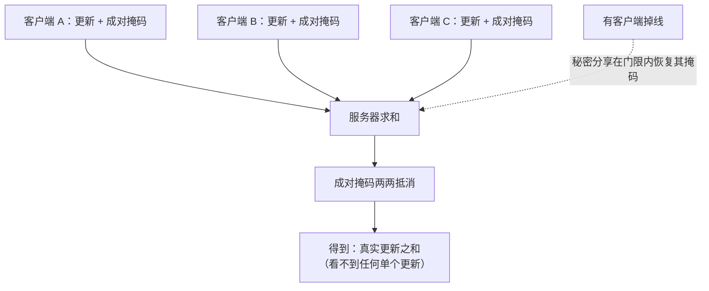

import PrivacyMeta from '@site/src/components/PrivacyMeta';

<PrivacyMeta era="卷五 · 前沿与落地" technique="联邦学习与安全聚合" audience={['隐私工程师', 'ML 工程师', '安全工程师']} severity="中" maturity="生产" evidence="研究支持" />

> 一句话摘要：《[梯度泄露](./gradient-leakage.mdx)》证明「只共享单个更新」会被反演。安全聚合（Bonawitz 等，ACM CCS 2017）是直接的防御：用安全多方计算让服务器**只能算出「所有客户端更新的和」、看不到任何单个更新**——单点被藏起来，反演就失去了支点。它**通信高效、对客户端掉线鲁棒**，并已用于 Google 的生产 FL（Bonawitz 等，MLSys 2019：让单设备更新即便在数据中心内存里也保持加密）。结论先行：安全聚合把「服务器=可信」降级成「服务器只见聚合和」；但它**不是万能**——防的是「看到单个更新」，不防「聚合和本身泄露」或「参与方串通」，仍要配 DP。

## 机制：我这边发生了什么

:::caution 密码学细节按原论文转述
下面的掩码 / 秘密分享 / 门限是按 Bonawitz 等（CCS 2017）的协议转述；**具体安全性绑定其威胁模型与门限假设**，落地以**原协议与你的实现**为准，别据本段自行实现密码学。
:::

直觉：让每个客户端在自己的更新上**加一层会两两抵消的随机掩码**。

- 每**一对**客户端协商一个**共享随机掩码**，一方加、另一方减。
- 每个客户端把自己的更新，**加上它与所有其他客户端的成对掩码之和**，再上传。
- 服务器把所有上传**求和**时，成对掩码**两两抵消**，得到的正好是**真实更新之和**；而任何**单个**上传都被掩码遮成「看起来随机」，服务器无从单看。

为应对客户端**掉线**（掉线方的掩码没人帮它抵消，和就错了），协议用**秘密分享**让在线方在门限内**恢复**掉线方的掩码项。红线说清楚：这是**密码学协议**在其威胁模型内给的保证，**不是「模型保证」**——和「我承诺不看」无关，是服务器在数学上**拿不到**单个更新。



## 威胁面：防什么、不防什么

**防**：

- **诚实但好奇的服务器**看到**单个**更新——梯度反演的前提（拿到单点）被掐掉。
- **数据中心内部威胁**：单设备更新即便在内存中也保持加密（MLSys 2019 把它作为对数据中心内额外威胁的隐私增强）。

**不防**（必须说清，否则是假安全）：

- **聚合和本身**可能泄露信息：参与方太少、或跨多轮做差分，仍可能推出个体——安全聚合**藏单点、不限单样本对和的影响**（那要 DP）。
- **足够多参与方串通**可恢复目标的更新——安全性绑定**门限假设**。
- **恶意服务器的主动攻击**（如孤立目标、Sybil 伪造大量假客户端）需要**额外假设 / 防护**。

**边界**：安全聚合藏「单点」，不替代 DP 的「限影响」；二者正交，生产常**叠用**。

## 防护原理

核心是**安全多方计算的加性掩码**：成对掩码在求和时抵消，单个上传被随机化，于是「和」可算、「单个」不可见；**秘密分享**保证在掉线门限内仍能正确求和（失效则要么和算错、要么安全性下降）。它把信任假设从「**服务器不看**」（靠自觉）升级为「**服务器看不到单个**」（靠密码学强制）——这是质的不同。

点破：**安全聚合 ≠ DP**。它**藏单点、不加噪**；聚合和仍可能随轮次或在小群体里泄露，所以生产里常**安全聚合 + DP** 叠用（接《[生产级 DP·FL 部署](./dp-federated-learning.mdx)》）。把安全聚合当成「有了它就私有」，是这条要破的假安全。

## 落地实现（配方）

```text
1. 用成熟实现，别自己搓密码学：掩码 / 秘密分享 / 门限的实现细节极易出错。
2. 设对门限与掉线容忍：门限 t 决定"几方串通才破"与"掉多少线仍能恢复"——按你的
   参与规模与掉线率调，别用默认。
3. 叠 DP：安全聚合藏单点 + DP 限单样本影响 = 互补；敏感场景两者都要（报清 ε）。
4. 注意参与方数与每轮采样：参与方太少 / 采样太小 → 聚合和信息量大，单点更易被推。
5. 审计两件事：① 服务器实现确实拿不到单个更新；② 对你的设置跑梯度反演 + 串通分析，
   确认在门限假设内单更新不可恢复。
```

每个参数绑定**你的参与规模、掉线率与威胁模型**——门限与采样照搬论文会错配。

**最小可测试断言**（把保证收成可回归 / 可审计的检查）：

- 怎么测：验证服务器侧实际拿到的是**聚合和**而非单个更新；并在门限假设内做串通 / 反演分析。
- 通过：单个更新对服务器**密码学不可见**；门限 / 掉线参数与你的规模匹配；敏感场景**叠了 DP**（ε 报清）。
- 失败：服务器能拿到单个更新、门限设置使**少数串通即破**、或**把安全聚合当 DP 用**（不加噪却声称"限了影响"）→ 按配方补。

## 真实案例 / 生产部署

（本条 maturity 标「生产」：安全聚合有**真实生产部署**证据，下面给协议与部署两面。）

- **协议奠基**：Bonawitz 等（ACM CCS 2017）给出**通信高效、对掉线鲁棒**的安全聚合协议——服务器能算出高维向量之和，却**学不到任何单个用户的贡献**，正为联邦学习聚合模型更新而设计。
- **生产部署**：Bonawitz 等（MLSys 2019）把安全聚合纳入 **Google 的规模化生产 FL 系统设计**，作为隐私增强，使**单设备更新即便在数据中心内存中也保持加密**（防数据中心内的额外威胁），并在 Gboard 等移动场景落地。生产 FL 常将**安全聚合与 DP 同用**（DP 部分见《生产级 DP·FL 部署》）。

## 残余风险与权衡

逐条点破假安全：

- **聚合和 / 多轮仍可能泄露 → 需 DP。** 安全聚合藏单点，不限单样本对和的影响；小群体、多轮差分仍可推个体。
- **串通 ≥ 门限即破。** 安全性绑定诚实方门限假设；参与方大量串通或被攻陷，保护下降。
- **主动恶意服务器需额外防。** 孤立目标、Sybil 伪造客户端等主动攻击超出「诚实但好奇」模型，要额外假设。
- **密码学 / 掉线处理出错即降级。** 掩码、秘密分享、门限的实现 bug 会让保证失效——用成熟实现 + 审计。
- **它只管聚合期这一面。** 最终模型仍可能记忆 / 被反演，那要记忆审计 + DP，别以为有了安全聚合全链路就私有。

## 与相邻技术的区别

- **安全聚合 vs 梯度泄露（本卷）**：《梯度泄露》是**攻击**（为什么必须防）；本条是**防御**（让服务器看不到单个更新，掐掉反演前提）。一攻一防。
- **安全聚合 vs 生产级 DP·FL（本卷）**：DP **加噪限单样本影响**、安全聚合**藏单点**——**正交互补**，生产常叠用：安全聚合防「服务器看单更新」，DP 防「聚合结果 / 多轮仍泄露」。
- **安全聚合 vs HE·MPC（卷一）**：安全聚合是 **MPC 的一个专用、高效实例**（专为「求和」优化）；《[同态加密 / 安全多方计算](../01-foundations/he-mpc.mdx)》讲更通用的 HE / MPC 机制与其开销代价。

## 版本说明

:::note 适用版本
安全聚合的协议骨架（成对掩码 + 秘密分享掉线恢复）自 2017 年（Bonawitz, CCS）确立，并随后续工作在通信 / 计算开销上持续优化（如对数级开销变体）。**其安全性绑定门限、诚实多数 / 单服务器假设与具体变体**，本段按原论文转述；落地以**原协议与成熟实现**为准，密码学细节请回一手核。生产部署证据为 MLSys 2019（Google FL 系统）。本段打戳 2026-06。（出处核验于 2026-06。）
:::

## 延伸阅读与出处

- [Practical Secure Aggregation for Privacy-Preserving Machine Learning（Bonawitz 等，ACM CCS 2017；arXiv 1611.04482）](https://arxiv.org/abs/1611.04482) —— 通信高效、掉线鲁棒的安全聚合协议：服务器只得更新之和、学不到任何单个贡献。本条主源。
- [Towards Federated Learning at Scale: System Design（Bonawitz 等，MLSys 2019；arXiv 1902.01046）](https://arxiv.org/abs/1902.01046) —— Google 规模化生产 FL 系统设计，把安全聚合作为隐私增强让单设备更新在数据中心内也加密。本条生产部署证据。
