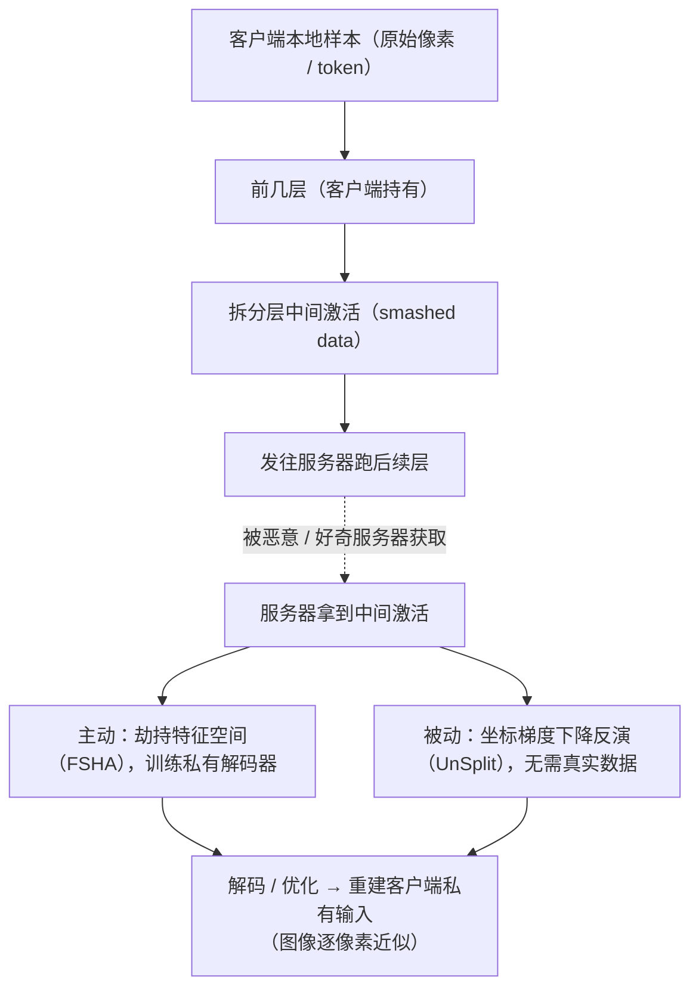

import PrivacyMeta from '@site/src/components/PrivacyMeta';

<PrivacyMeta era="卷五 · 前沿与落地" technique="联邦学习与安全聚合" audience={['隐私工程师', 'ML 工程师', '安全工程师']} severity="高" maturity="研究" evidence="研究支持" />

> 一句话摘要：拆分学习把模型从某层切成两半——客户端跑前几层、把**中间激活**（smashed data）发给服务器跑剩下的——常被说成「**原始数据不出本地，所以隐私**」。结论先行：这**不等于**私有。Feature-Space Hijacking Attack（Pasquini 等，CCS 2021）证明，**恶意服务器**能主动把拆分模型引导进不安全状态，从中间激活**重建出客户端的私有训练输入**（在 MNIST / Omniglot / CelebA 上重建图像）；UnSplit（Erdoğan 等，WPES@CCS 2022）更表明**连诚实但好奇的服务器**——只知客户端结构、不需主动干预——也能反演（MNIST / Fashion-MNIST / CIFAR-10 上重建 MSE ≈ 0.08–0.15）。别把「没传原始像素」当隐私。

## 机制：我这边发生了什么

拆分学习里，客户端只持有模型的**前几层**：本地样本走前向，算到**拆分层**得到一份**中间激活**（intermediate / smashed activations），把这份激活发给服务器，由服务器跑后续层、回传梯度做联合训练。「原始数据」（像素、token）确实没离开客户端，但**离开客户端的中间激活，是输入经前几层确定性映射后的产物**——它把输入的信息**编码**了进去。

红线一句话点破：这不是模型在「主动交代」自己的输入，而是**中间激活作为前向映射的产物、在数学上约束了产生它的那条输入**，足够的优化 / 主动引导能把输入从激活里**解出来**（与梯度泄露同族：那里是「梯度约束输入」，这里是「激活约束输入」）；整个过程可外部复现、与谁「想不想泄露」无关。两种攻击者各走一条路：

- **主动（FSHA，恶意服务器）**：服务器在训练中**偷偷替换自己的训练目标**，用一个它私有的「影子」自编码器，逐步把客户端那半网络的输出特征空间**劫持**成「可被它的解码器反演」的形状；训练若干步后，它就能把任意收到的中间激活**解码回近似原图**——客户端只看到 loss 在正常下降，察觉不到目标被改了。
- **被动（UnSplit，诚实但好奇）**：服务器**不改协议**，只凭已知的客户端结构，对中间激活做**坐标梯度下降**——同时优化「猜测的客户端模型」和「猜测的输入」，使其前向产物逼近观测到的激活，从而**data-oblivious**（无需任何真实数据）地反演输入。



## 威胁面：谁能攻、能还原什么、边界在哪

**谁能攻**：**运行拆分模型服务器侧那一半的一方**——

- **恶意服务器**（FSHA）：能主动改自己的训练目标。这是 split learning 的默认信任假设里最脆的一环——客户端通常无法验证服务器在优化什么。
- **诚实但好奇的服务器**（UnSplit）：**不偏离协议**，只需知道客户端的网络结构（一个不强的假设），就能被动反演——这也是它比 FSHA 更刺的地方：**不需要主动作恶就能还原**。

**能还原**：客户端的**私有训练输入**。FSHA 在 MNIST / Omniglot / CelebA 上重建图像；UnSplit 在 MNIST / Fashion-MNIST / CIFAR-10 上对**已训练的客户端模型**做到重建 MSE ≈ 0.08–0.15（注：该 MSE 强绑定数据集 / 客户端结构 / 拆分点 / 是否已训练，**不是与设置无关的常数**，迁移前须自测）。UnSplit 还能在标签朴素留在客户端时做到**完美标签推断**，并兼做模型窃取。

**放大 / 限制因素**：

- **拆分点越浅**（客户端只跑很少几层）→ 中间激活越「接近原图」→ 越易反演；拆分点越深、客户端那半越非线性 / 越有信息瓶颈，反演越难（但 FSHA 用主动劫持削弱了「加深就安全」这一直觉）。
- **客户端结构是否对服务器已知**：UnSplit 的被动反演前提是「知结构」；结构保密会抬高被动攻击成本，但对能主动改目标的 FSHA 帮助有限。

**边界**：本条是「**共享中间激活**」的泄露面，前提是攻击者持有服务器侧、能拿到 / 引导这份激活。它与梯度泄露（共享梯度）**同族但对象不同**：那边反演的是**梯度**，这边反演的是**前向中间激活**。

## 防护原理

和梯度泄露同族，缓解方向也同源——但要先认清一个**结构性事实**：在 split learning 里，**信任边界落在服务器**。客户端把激活交出去的那一刻，保护就取决于「服务器能否被信任 / 能否被约束」，而**默认协议对此零保证**（FSHA 正是钻这个空子）。

- **加扰 / 混淆中间激活**（加噪、NoPeek 类减少激活与输入的互信息、对抗式正则）：能**抬高**反演难度，属**经验性**手段——它们没有形式化隐私保证，且常被更强的主动攻击（FSHA 这类把特征空间整体劫持的）绕过。
- **差分隐私式扰动**（对激活 / 训练过程加 DP 噪声）：能把单样本影响框进 (ε, δ)，但**在 split learning 的激活层做形式化 DP 保证很难**——噪声要足够大才压得住反演，效用代价随之上升；这与梯度泄露一节里「DP / 加扰是经验性、形式保证难」是同一处难点。
- **真正改信任假设**：把服务器放进**可信执行环境 + 远程证明**（见《[机密推理](./confidential-inference.mdx)》），或用安全计算让服务器**算不到明文激活**——只有动到「信任边界」这一层，才从根上拆掉 FSHA 的前提。

点破边界：**「原始数据留在本地」本身零隐私保证**；中间激活把输入信息带出了信任边界，实质隐私要靠「约束 / 不信任服务器」这一层，不靠「没传原始像素」。

## 落地实现（配方）

```text
1. 默认假设"中间激活 = 可反演、服务器不可信"：按 FSHA（主动）+ UnSplit（被动）两种
   威胁设计，别把"数据没出本地"当隐私。
2. 别浅拆：拆分点尽量深、客户端那半带足非线性 / 信息瓶颈，抬高反演难度——但记住这是
   经验手段、被 FSHA 类主动攻击削弱，不能单独当保证。
3. 标签别裸留客户端：UnSplit 在朴素本地标签下可完美推断标签——按"标签也会泄露"处理。
4. 动信任边界才是根治：把服务器侧放进 TEE + 远程证明（接《机密推理》），或上安全计算，
   让服务器拿不到 / 引导不了明文激活——这才拆掉 FSHA 的前提。
5. 实跑反演审计：对你的拆分点 / 客户端结构 / 是否已训练，跑 FSHA 与 UnSplit 类反演，
   作隐私回归，量化"在你的配置下能把输入重建到多清晰"。
```

每个结论都绑定**你的拆分点、客户端结构、数据集与是否已训练**——论文里的「MNIST 上 MSE ≈ 0.08–0.15」不能直接迁移到你的设置，必须用你自己的反演审计实测。

**最小可测试断言**（把反演风险收成可回归的检查）：

- 怎么测：对你的拆分配置，跑被动反演（UnSplit 类坐标梯度下降）+ 主动劫持（FSHA 类影子自编码器）两套攻击，在你的拆分点 / 客户端结构下评估重建质量（如重建 MSE / 人眼可辨认度）与标签可推断性。
- 通过：服务器侧被**可信约束**（TEE + 远程证明，或安全计算使其拿不到明文激活），且两套反演把重建质量压到**不可辨认 / 不可用**、标签不可推断。
- 失败：服务器能取到 / 引导中间激活、被动或主动反演能还原出**可辨认**输入、或标签被完美推断 → 别声称「拆分学习所以数据留本地就隐私」，先把信任边界这一层补上。

## 真实案例 / 研究进展（工程可行性）

（本条 maturity 标「研究」：以下是**实证攻击**证据，证明「拆分学习共享中间激活 ≠ 私有」，不是「拆分学习不可用」——它指向的是「必须约束 / 不信任服务器」。）

- **主动劫持反演（恶意服务器）**：Pasquini 等的 **Unleashing the Tiger: Inference Attacks on Split Learning**（ACM CCS 2021）提出 **Feature-Space Hijacking Attack（FSHA）**：恶意服务器在训练中用私有「影子」自编码器把客户端那半网络的特征空间**劫持**进可反演状态，从而从中间激活**重建客户端的私有训练输入**，在 **MNIST / Omniglot / CelebA** 上演示重建图像——且客户端只见 loss 正常下降、难以察觉训练目标被改。直接证伪「原始数据留本地所以隐私」。
- **数据无关的被动反演（诚实但好奇）**：Erdoğan 等的 **UnSplit**（WPES @ CCS 2022——与 CCS 同期的隐私电子社会研讨会，**非主会 CCS**）给出 **data-oblivious** 的模型反演：诚实但好奇的服务器**仅知客户端结构**，用坐标梯度下降同时解出客户端模型与输入，对**已训练的客户端模型**做到重建 **MSE ≈ 0.08–0.15**（MNIST / Fashion-MNIST / CIFAR-10），并在标签朴素留客户端时**完美推断标签**、兼做模型窃取——证明**不需主动作恶**也能反演。

## 残余风险与权衡

逐条点破假安全：

- **「原始数据留本地」零保证。** 中间激活把输入信息带出了信任边界，足够优化 / 主动引导即可还原；拆分学习的隐私靠「约束 / 不信任服务器」，不靠「没传原始像素」。
- **加深拆分点 / 加扰激活只是抬难度。** NoPeek / 加噪 / 对抗正则提高反演成本，但没有形式保证，且会被 FSHA 这类主动劫持削弱——不能单独当隐私保证。
- **诚实但好奇也能反演。** UnSplit 表明无需主动作恶、仅知结构即可被动还原——「服务器没作恶」不是安全理由。
- **DP 式扰动有效用代价、ε 要报。** 在激活层做形式化 DP 很难，噪声够大才压得住反演的同时掉点；ε 不报清，「加了噪」等于没说。
- **MSE / 重建质量强绑定设置。** 论文的 0.08–0.15 是其数据集 / 拆分点 / 已训练模型下的值，换设置可能更好或更差——必须自测，别把单一数字当通用结论。
- **反演攻击持续变强。** 今天「够深的拆分点」明天可能被新攻击破——审计要随攻击进展重做。

## 与相邻技术的区别

- **拆分学习泄露 vs 梯度泄露（本卷《[梯度泄露](./gradient-leakage.mdx)》）**：**同族不同对象**。梯度泄露反演的是**共享梯度**；本条反演的是**共享的前向中间激活**。两者机制同源（中间产物约束输入）、缓解同向（约束服务器 / DP），但泄露载体不同——配套读。
- **拆分学习泄露 vs 安全聚合（本卷《[安全聚合](./secure-aggregation.mdx)》）**：安全聚合让服务器只见**多方更新之和**、看不到单个更新；但 split learning 里服务器需要**逐客户端的明文中间激活**来跑后续层，安全聚合那套「只见和」的范式**并不直接适配**——这正是 split learning 需要 TEE / 安全计算另走一路的原因。
- **拆分学习泄露 vs 生产级 DP·FL（本卷《[生产级 DP·FL 部署](./dp-federated-learning.mdx)》）**：DP·FL 用裁剪 + 加噪限**梯度 / 更新**的单样本影响；本条的泄露载体是**前向激活**，DP 要作用在激活 / 训练过程上、且形式保证更难——同为「数据不出本地 ≠ 私有」的注脚，但作用对象与难点不同。

## 版本说明

:::note 适用版本
「拆分学习共享的中间激活可被反演成输入」是**与具体模型无关**的结构性事实（前向激活约束输入，信任边界在服务器）。但**多深的拆分点 / 何种客户端结构 / 加多少扰动才够**强绑定模型结构、数据与攻击方法——FSHA（CCS 2021，主动劫持）与 UnSplit（WPES@CCS 2022，data-oblivious 被动反演）的结论、以及那条「MSE ≈ 0.08–0.15」**都不能直接迁移**到你的设置；落地必须按你自己的拆分配置跑反演审计。反演攻击仍在进步，本段打戳 2026-06。（出处核验于 2026-06。）
:::

## 延伸阅读与出处

- [Unleashing the Tiger: Inference Attacks on Split Learning（Pasquini 等，ACM CCS 2021）](https://dl.acm.org/doi/10.1145/3460120.3485259) —— 提出 Feature-Space Hijacking Attack（FSHA）：恶意服务器主动把拆分模型引导进不安全状态，从中间激活重建客户端私有训练输入（MNIST / Omniglot / CelebA）。本条主源（「原始数据留本地 ≠ 私有」的主动攻击证伪）。
- [UnSplit: Data-Oblivious Model Inversion, Model Stealing, and Label Inference Attacks Against Split Learning（Erdoğan 等，WPES @ CCS 2022）](https://dl.acm.org/doi/10.1145/3559613.3563201) —— data-oblivious（诚实但好奇、仅知客户端结构）的坐标梯度下降模型反演，对已训练客户端模型重建 MSE ≈ 0.08–0.15（MNIST / Fashion-MNIST / CIFAR-10），标签朴素留客户端时完美推断。证明无需主动作恶也能反演。
