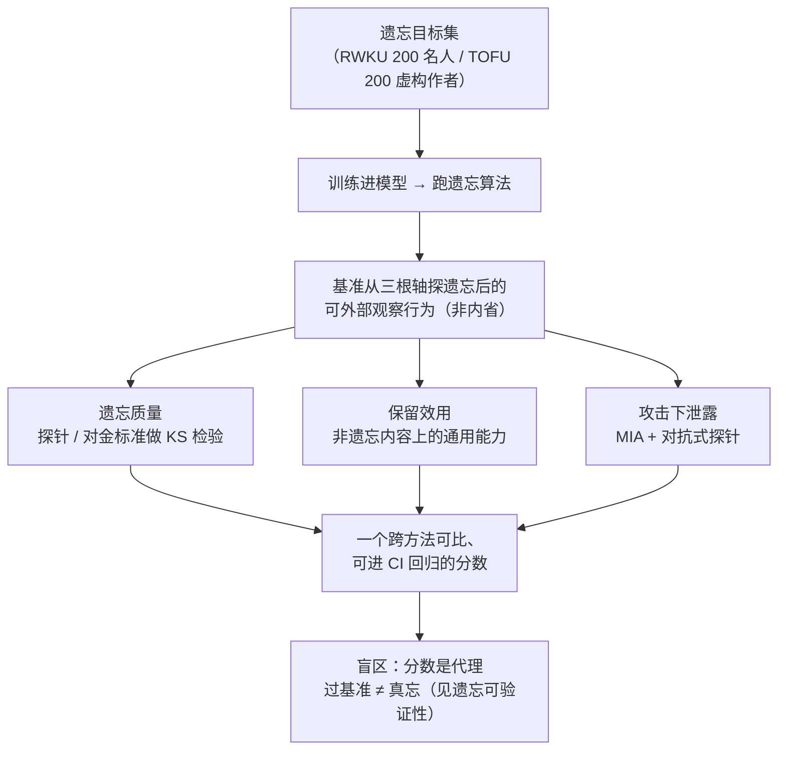

import PrivacyMeta from '@site/src/components/PrivacyMeta';

<PrivacyMeta era="卷五 · 前沿与落地" technique="隐私评测与审计" audience={['隐私工程师', 'ML 工程师', '合规工程师']} severity="中" maturity="研究" evidence="研究支持" />

> 一句话摘要：你跑完一个遗忘算法——现在得**证明它有用**。标准化基准（RWKU、MUSE、TOFU 家族）把「我们忘了」变成一个**可比、可回归的分数**：不是单看「还背不背得出」，而是同时量**遗忘质量 × 保留效用 × 攻击下的隐私泄露**三根轴。这些基准收敛到一个令人不安的共识——**很少有方法能同时过「效用」和「泄露」两关**（MUSE 报告：八个算法里只有一个不导致严重隐私泄露 ⚠️ 预印本）。但基准本身也有盲区：**基准是代理，过基准 ≠ 真忘**（接本卷《[遗忘可验证性](./unlearning-verification.mdx)》），覆盖之外是照不到的角落。

## 机制：我这边发生了什么

先划清这条和两个近邻的分工：本卷《[可验证删除与机器遗忘](./machine-unlearning.mdx)》讲**怎么忘**（精确 / 近似方法）；《[遗忘可验证性](./unlearning-verification.mdx)》讲**模型级证不了、还能伪造证明**这一不可能性论证；**本条是评测层**——当你已经选好方法、想拿一个**跨方法可比、能进 CI 回归的分数**回答「它到底忘得怎么样」时，用的就是遗忘基准。

一个遗忘基准做的是**外部行为测量**，不是让我内省「我是不是真忘了」。它固定一批**遗忘目标**（RWKU 用 200 个真实名人、TOFU 用 200 个虚构作者画像），训练 / 微调进模型，跑遗忘，然后从三个方向探我遗忘后的**可外部观察行为**：

- **遗忘质量（forget quality）**：在遗忘目标上，我还答不答得出、还背不背得出。RWKU 用**填空 / 问答探针**外加**对抗式探针**来逼；TOFU 更严——把「遗忘质量」定义为**遗忘后模型 vs「不含目标数据重训」的金标准模型**做 Kolmogorov–Smirnov 检验的 **p 值**（只有输出分布与金标准**不可区分**才算过）。
- **保留效用（utility）**：遗忘不该把模型其余能力一起削没。基准测我在**非遗忘内容**上的通用能力 / 推理 / 事实性是否还在。
- **攻击下的隐私泄露（privacy leakage）**：这是关键的一根轴——**遗忘目标是否还能被攻击套回来**。RWKU 配了**成员推断（MIA）**方法与**对抗式探针**；MUSE 直接把「隐私泄露」列为六性质之一。

红线说清楚：分数量的是**在这一批探针、这一种攻击、这一档判定口径下**我的输出行为，不是我对「是否真忘」的自述——我无法可靠地内省训练数据的影响（同《[量化记忆与审计](../02-memorization-extraction/quantifying-memorization.mdx)》：canary 的 exposure 也是把「可外部观察的偏好」量成一个标量，而非「我承认我记得」）。基准把「遗忘」这件事变成一个可比、可回归的**代理指标**——代理是它的力量，也是它的边界。



## 威胁面：基准能测什么 / 测不到什么

这条是**防御方的测量工具**，所以「威胁面」换成**能力与盲区**——照《量化记忆与审计》的写法。

**能测（基准的力量）**：

- **给一个跨方法可比的分数**：把「我们忘了」从口号变成**同一口径下能横比**的数——A 方法和 B 方法谁忘得更干净、削掉多少效用，一眼可比。
- **量三根轴的权衡**：遗忘质量 ↔ 保留效用 ↔ 攻击下泄露，不是只看一根。基准的价值恰恰在于**逼出取舍**——很多方法能把「背不背得出」压下去，代价却是效用塌了、或换个攻击又漏了。
- **回归**：换新方法 / 新版模型后，用同一套目标与探针重测，能回答「这版比上版忘得更干净还是更差」。

**测不到 / 局限（必须说清，否则又是一种假安全）**：

- **基准是代理，过基准 ≠ 真忘**。它量的是「**在这批探针 / 这种攻击下**目标压住了没」，不等于「这条数据的影响从权重里真消失了」——这正接上《[遗忘可验证性](./unlearning-verification.mdx)》：模型级遗忘本就无法验证、其「证明」可被伪造。基准分数**测的是行为、不是删除的事实**。
- **对抗式探针没穷尽攻击空间**。RWKU 用九类对抗探针、四种 MIA，但「**这些探针没套出来**」≠「**没有别的探针能套出来**」——换更强的攻击、或覆盖之外的问法，残余信息可能又冒出来（同 MIA 作审计的「必要不充分」局限）。
- **覆盖之外是盲区**。基准只在**它选的目标 / 探针分布**上有效：RWKU 挑名人、TOFU 造虚构作者，都是为了把「遗忘目标」与「模型本该有的通用能力」干净分开——但你真实要删的那条 PII，格式 / 分布未必落在基准覆盖内。
- **指标可被 gaming**。若把某个基准分当唯一发布门槛，就有动机**朝着这批探针过拟合地「压分」**（比如专门压那几类问法的输出），而非真降低影响——分数好看、真忘没有。

## 防护原理

这条防护的逻辑，是把**「我们跑了遗忘」升级成「在标准基准上多维打分 + 回归」**：不接受「跑了个遗忘算法」作证据，而要求交出**遗忘质量 / 保留效用 / 攻击下泄露**三根轴上的分，且能随版本回归。

承重的两点：

- **多维、而非单维**。单看「遗忘目标背不背得出」会给假安全——MUSE 的六性质（无逐字记忆、无知识记忆、无隐私泄露、保留效用、可扩展性、可持续性）之所以有用，正因为它逼你**同时**看泄露与效用，而不是压住一个当过关。
- **金标准重训作锚**。TOFU 的做法是拿「**不含目标数据重训**」的模型当参照系，遗忘后模型要与它**不可区分**（KS 检验 p 值）才算过。这个锚点回答了「真忘长什么样」——近似方法对着它报差距，而不是自证（与《遗忘可验证性》同一支点：证据落到「对金标准的差距」上）。

点破边界：基准打的分是**经验测量、不是形式保证**（形式保证要 DP，见《[DP 微调](../03-conversational-llms/dp-fine-tuning.mdx)》）；它能**经验印证**某个遗忘方法在这批目标上把泄露压下去了没，但**不能替代**《遗忘可验证性》要的可审计过程——分数是「体温计」，可审计日志 + 金标准重训才是「病历」。

## 落地实现（配方）

回归中性技术笔：把遗忘评测做成可抄、可回归的发布门槛。

```text
1. 选基准，对上你的威胁：
   - 要「真实世界知识 + 强对抗探针 + MIA」→ RWKU（NeurIPS'24 D&B，200 名人目标）。
   - 要「多维度覆盖（含隐私泄露 / 可扩展 / 可持续）」→ MUSE 六性质（⚠️ 预印本）。
   - 要「与金标准重训做可区分性检验」→ TOFU（虚构作者，KS 检验 p 值）。
   别只挑对自己方法有利的那一个基准报分。
2. 三维都报，别只报遗忘质量：
   - 遗忘质量（目标上还答不答得出 / 对金标准的可区分性）；
   - 保留效用（非遗忘内容上的通用能力有没有塌）；
   - 攻击下泄露（跑基准自带的 MIA + 对抗式探针，看目标能不能被套回来）。
3. 与 retrain-from-scratch 比：能负担时，把「不含目标数据重训」的模型当锚，
   报「遗忘后模型 vs 金标准」的差距，而不是自证（接《遗忘可验证性》）。
4. 设发布门槛（多维联合，别单轴）：
   任一轴不达标就阻断发布——遗忘质量过但效用塌 / 或换个探针又漏，都算没过。
5. 防 gaming：探针集要定期轮换 / 扩充，别让方法朝固定探针过拟合地「压分」；
   基准分是「至少这批探针 / 这种攻击测不出」，不是「已合规删除」的结论。
```

每个判定（选哪个基准、金标准是否可负担、各轴阈值、MIA 的 FPR 档、可接受的残余泄露）都要带上**你的模型与威胁模型**；论文报的分只在**它自己的目标 / 探针 / 判定口径**内可比，绝对值不能直接迁到你的场景。

**最小可测试断言**（把遗忘评测收成可回归的检查，别停在「我们跑了遗忘算法」）：

- 怎么测：每次遗忘后，在固定的一个（或多个）标准基准上，用同一口径算**遗忘质量 / 保留效用 / 攻击下泄露**三根轴的分，并与上一版基线对比；能负担时对目标跑基准自带的 MIA + 对抗探针，并拿金标准重训模型做可区分性参照（TOFU 式）。
- 通过：三根轴**联合达标**——遗忘目标在探针 / MIA 下压到基线且与金标准**不可区分**，同时保留效用**不低于**阈值、不劣于上一版；有金标准时差距在可接受档内。
- 失败：遗忘质量过但效用塌、或换探针 / 换更强 MIA 又能套出目标、或根本没有多维基线、或只朝固定探针「压分」→ 别声称「已忘 / 已合规删除」，回去查是不是只做了输出抑制、或该换精确遗忘（见《[可验证删除与机器遗忘](./machine-unlearning.mdx)》）。

## 真实案例 / 研究进展（工程可行性）

（本条 maturity 标「研究」：以下是**基准与研究结论**，证明「遗忘评测能做成可比分数」「多数方法过不了『效用 × 泄露』的联合关」，不是「LLM 可验证遗忘已生产」的背书。）

- **RWKU：真实世界知识遗忘基准（同行评审的脊梁）**。Jin 等的 **RWKU: Benchmarking Real-World Knowledge Unlearning for Large Language Models**（**NeurIPS 2024 Datasets & Benchmarks Track**；arXiv 2406.10890）建了个贴近真实、更难的遗忘基准：**200 个真实名人作遗忘目标**，配 **13,131 条多层级 forget 探针**（含 **3,268 条填空 + 2,879 条问答 + 6,984 条对抗式**）。评测口径同时压三块——**四种成员推断（MIA）方法** + **九类对抗式探针**测遗忘目标能不能被套回来，另测遗忘的**局部性（locality）与模型效用**（通用能力 / 推理 / 真实性 / 事实性 / 流畅度）。其刻意设定**遗忘语料与保留语料都不可得**（类似 zero-shot 知识遗忘），以避免 forget 语料带来的二次信息泄露与 retain 语料的分布偏差——把评测做得更接近真实删除处境。
- **MUSE：六维评测，多数方法过不了 ⚠️ 预印本**。Shi 等的 **MUSE: Machine Unlearning Six-Way Evaluation for Language Models**（2024；arXiv 2407.06460）把遗忘评测拆成**六个理想性质**：① 无逐字记忆、② 无知识记忆、③ 无隐私泄露、④ 保留效用（非删除数据上）、⑤ 可扩展性（随删除请求规模）、⑥ 可持续性（连续多次遗忘请求下）。在 **7B 参数模型**上评了**八个流行遗忘算法**遗忘 **Harry Potter 系列书 + 新闻文章**，报告的结论是：**多数算法能不同程度地阻止逐字记忆与知识记忆，但只有一个算法不导致严重隐私泄露**；且现有算法**常削弱模型通用效用**、也**扛不住连续遗忘请求或大规模内容删除**——即多数方法过不了「效用 × 泄露 × 可持续」的联合关。（预印本，结论以其自身设置为准，⚠️ 标注。）
- **TOFU：更早的虚构遗忘基准（一句血缘）**。Maini 等的 **TOFU**（COLM 2024）是更早把「遗忘质量」做成可测基准的工作——**200 个虚构作者画像 × 每个 20 条问答**，遗忘质量 = 对金标准重训模型做 **KS 检验的 p 值**（p 大于 0.05 才算与金标准不可区分），并发现没有基线能在「遗忘质量 vs 效用」上真正过关（该条的可验证性 / 伪造论证已在《[遗忘可验证性](./unlearning-verification.mdx)》展开，这里只作血缘指针，不重述）。

## 残余风险与权衡

逐条点破假安全：

- **「过了某基准」≠「合规删除」。** 基准分是**行为代理**——它说明「在这批探针 / 这种攻击下目标压住了」，不等于「这条数据的影响从权重里真消失、法律意义上已删除」。模型级遗忘本就无法验证、证明可被伪造（见《[遗忘可验证性](./unlearning-verification.mdx)》）；把基准通过读成「Art.17 删除已完成」，是典型假安全。
- **基准盖不住覆盖外。** 分数只在它选的目标 / 探针分布上有效；你真实要删的 PII 若格式 / 分布落在覆盖之外，基准照不到——过基准不代表那条被照到了。
- **多数方法过不了权衡。** MUSE 报告八个算法里只有一个不导致严重隐私泄露、且普遍削效用 / 扛不住连续删除（⚠️ 预印本）；TOFU 也显示没有基线在「遗忘质量 vs 效用」上都过关。**把效用压没去换「过关的遗忘质量」不是真解**——落地要按你自己的多轴预算权衡，而不是挑一根轴报好看。
- **指标可被 gaming。** 若把单一基准分当唯一门槛，就有动机朝那批探针**过拟合地「压分」**（专压那几类问法），分数好看、真忘没有。探针要轮换 / 扩充，别让门槛退化成「背题」。
- **对抗探针 / MIA 是「至少这个测不出」。** 基准自带的攻击通过，只说明当前这批攻击在这一档口径下没出信号；换更强攻击可能又现——别把它当结案证据（同 MIA 作审计的必要不充分）。
- **金标准重训贵、且未必可得。** TOFU 式「对金标准报差距」的强度依赖能跑「不含目标数据重训」；对大模型这成本高、难以对每个删除请求都跑，缺了锚点论证强度就打折。

## 合规映射

- **GDPR Art.17（被遗忘权）**：法律要「删除个人数据」，监管 / 数据主体会要「**证明**你删了」。遗忘基准能提供「遗忘后在标准口径下的多维分数」作**证据之一**，但**基准通过 ≠ 法律删除完成**——技术措施（把泄露 / 效用量成分数）与法律满足（可证的删除）之间有真实落差；可证的那一步靠可审计过程 + 金标准，见《[遗忘可验证性](./unlearning-verification.mdx)》。
- **EU AI Act**：训练数据透明度与记录义务，会让「用了谁的数据、遗忘后效果如何、如何度量」更需写明可复核的评测口径，而非仅给一句「已遗忘」。

（合规随法条版本演进，本段打戳 2026-07，引用前核对最新生效文本。）

## 与相邻技术的区别

- **遗忘基准与评测 vs 可验证删除与机器遗忘（本卷）**：《[可验证删除与机器遗忘](./machine-unlearning.mdx)》讲**遗忘方法**（精确 / 近似怎么忘、SISA 怎么把精确遗忘做可负担）；**本条讲怎么给方法打分**——把「忘得怎么样」做成跨方法可比、能进 CI 回归的多维分数。一个「怎么忘」、一个「忘得怎么样，量给我看」。
- **遗忘基准与评测 vs 遗忘可验证性（本卷）**：《[遗忘可验证性](./unlearning-verification.mdx)》是**不可能性 / 伪造论证**——模型级遗忘证不了、其「证明」可被伪造，证据要搬到算法 / 过程层。**本条不重述那个论证**，而是接它的告诫：基准分是**行为代理**，过基准 ≠ 真忘，覆盖外是盲区。一个划「证不了」的边界，一个在边界内把「测得到的部分」量成可回归分数——配套读。
- **遗忘基准与评测 vs 量化记忆与审计（卷二）**：《[量化记忆与审计](../02-memorization-extraction/quantifying-memorization.mdx)》用 **canary + exposure** 在**发布前**量「我记住了多少」（面向记忆强度）；本条面向**遗忘之后**量「忘得怎么样、还漏不漏」（面向遗忘效果）。都是「把风险量成可回归标量」的测量学，一个测记忆、一个测遗忘，写法同源（能测什么 / 测不到什么、代理的边界）。

## 版本说明

:::note 适用版本
遗忘评测「把遗忘做成多维可比分数」的方法学与具体 LLM 无关，但**各基准报的分强绑定其目标 / 探针 / 判定口径与模型规模**：RWKU（NeurIPS 2024 D&B，200 名人、13,131 探针、4 种 MIA + 9 类对抗探针）、MUSE（⚠️ 预印本，六性质、7B、8 算法、Harry Potter + 新闻，「只有一个不致严重泄露」）、TOFU（COLM 2024，200 虚构作者、KS 检验 p 值）的结论都是**当时基准上的结论**，新基准 / 新方法持续涌现，绝对分不能直接迁移。落地以你自己的模型、基准选择、探针分布与金标准重训成本为准。可验证遗忘整体仍是开放问题。本段打戳 2026-07。（出处核验于 2026-07。）
:::

## 延伸阅读与出处

主要：RWKU（同行评审基准）+ MUSE（⚠️ 预印本，多维评测与「多数方法过不了」的结论）；补充：TOFU（更早的虚构遗忘基准血缘）。

- [RWKU: Benchmarking Real-World Knowledge Unlearning for Large Language Models（Jin 等，NeurIPS 2024 Datasets & Benchmarks；arXiv 2406.10890）](https://openreview.net/forum?id=wOmtZ5FgMH) —— 本条脊梁：200 真实名人目标 + 13,131 探针（3,268 填空 / 2,879 问答 / 6,984 对抗），四种 MIA + 九类对抗探针测泄露，另测局部性与效用；遗忘 / 保留语料均不可得的更真实设定。
- [MUSE: Machine Unlearning Six-Way Evaluation for Language Models（Shi 等，2024；arXiv 2407.06460）](https://arxiv.org/abs/2407.06460) —— ⚠️ 预印本：六性质（含隐私泄露 / 可扩展 / 可持续）；7B 上评八算法遗忘 Harry Potter + 新闻，报告「只有一个不导致严重隐私泄露」且普遍削效用 / 扛不住连续删除，即多数方法过不了联合关。
- [TOFU: A Task of Fictitious Unlearning for LLMs（Maini 等，COLM 2024）](https://openreview.net/forum?id=P8seBluN3c) —— 更早的虚构遗忘基准（200 虚构作者 × 20 问答，遗忘质量 = 对金标准重训做 KS 检验 p 值）作血缘指针；其可验证性 / 伪造论证见《遗忘可验证性》，本条不重述。
