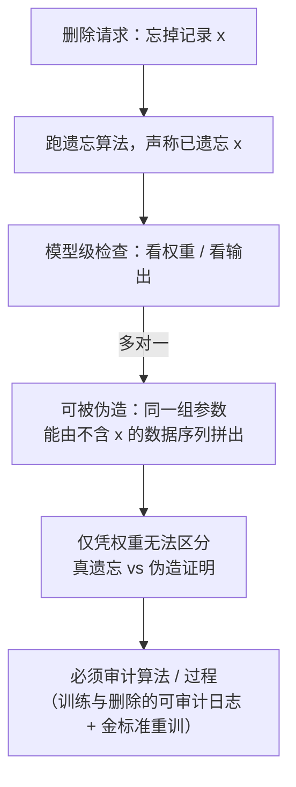

import PrivacyMeta from '@site/src/components/PrivacyMeta';

<PrivacyMeta era="卷五 · 前沿与落地" technique="机器遗忘与被遗忘权" audience={['隐私工程师', '合规工程师', 'ML 工程师']} severity="中" maturity="研究" evidence="研究支持" />

> 一句话摘要：跑完遗忘算法、声称某条数据「忘了」，但**在单个训练好的模型级别，这件事没法被验证**——Thudi 等（USENIX Security 2022）给出**伪造（forging）**构造：同一组模型参数可以由**另一个数据集 / 另一条梯度序列**训出，于是模型方能拿一份「我遗忘了」的假证明充数，而实际上那条记录还留着。配套地，TOFU（Maini 等，COLM 2024）把「遗忘质量」做成可测基准，发现**没有现成方法能在「遗忘质量 vs 效用」间真正过关**。结论先行：遗忘要审计**算法 / 过程**，不能只盯最终权重；「删了」必须可证，否则是合规假象。

## 机制：我这边发生了什么

一条样本影响过我的参数，遗忘的目标是抹掉这份影响（这条的来龙去脉见本卷《[可验证删除与机器遗忘](./machine-unlearning.mdx)》——那条讲「怎么忘」，本条讲「怎么证你忘了」）。问题出在**证明**这一端。

「权重」是个**多对一**的对象：很多条不同的训练轨迹（不同数据、不同梯度顺序、不同随机种子）可以收敛到**几乎相同**的参数。Thudi 等正是利用这一点构造了**伪造**——给定一个目标模型，攻击者能拼出一条「看起来像是从不含某记录的数据集训出来的」梯度序列，却得到与「实际含该记录训出来的模型」相同的参数。于是「这组权重证明我没用过 / 已删除了那条数据」这种**模型级**论证从根上站不住：同一组权重既可由「真删了」产生，也可由「没删 + 伪造」产生，单看权重无从区分。

红线说清楚：我不写「我保证我忘了它 / 我确认这条数据已不在我体内」——**我无法可靠地内省「是否真忘」**，把内省写成事实就是在制造假安全。可被外部论证的，只有：在**预先定义的遗忘算法**与**审计假设**下，遗忘过程是否被正确执行（有日志、可复算、可抽查）。仅凭最终权重，外部既无法区分「真遗忘」与「伪造的遗忘证明」，也无法替我背书「忘干净了」。



## 威胁面：谁能攻、能伪造什么、边界在哪

**谁能攻 / 谁能造假**：威胁方是**模型方 / 数据控制者自己**——面对监管或数据主体的「证明你删了」诉求，有动机产出一份「已遗忘」的证明，而把记录偷偷留着继续用。这与「外部攻击者偷数据」相反，是**内部对审计的对抗**。

**能伪造什么**：Thudi 等的伪造针对的是**模型级遗忘的「证明」本身**——通过构造一条替代的数据 / 梯度序列，让最终参数与某个目标模型一致，从而声称「这组权重对应的训练里没有 x / x 已被遗忘」。因此任何「拿最终模型当遗忘证据」的近似遗忘定义在模型级都**不健全（unsound）**。

**MIA-as-audit 的局限**：常见的验证思路是「删完对 x 跑成员推断（见卷一《[成员推断](../01-foundations/membership-inference.mdx)》），查不出成员就算忘了」。但「**当前这个 MIA 没检出**」**不等于**「真忘了」——它只说明在这一种攻击、这一档 FPR 下信号被压住了；换更强的攻击、或换审计口径，残余影响可能又冒出来。把「MIA 没命中」直接读成「合规删除完成」，是又一种假安全。

**边界**：本条针对的是**单个训练好的模型**这一验证层级；它**不否定**「在定义清楚的算法层面、配上可审计日志」去论证遗忘——恰恰相反，Thudi 等的结论正是「遗忘只能在**算法 / 过程**层面被良定义与审计」。本条也不替任何具体遗忘方法的有效性背书（那是《可验证删除与机器遗忘》的范围）。

## 防护原理

把「证明」从权重搬回算法与过程，是这条唯一能站住的支点：

- **算法级、可审计的遗忘定义**：不去断言「这组权重忘了 x」（可被伪造），而是断言「**这套确定的遗忘算法在这份输入上被正确执行了**」，并让该执行**可复算、可抽查**。Thudi 等的核心主张即此：approximate-unlearning 的模型级定义不健全，遗忘要绑到**算法**上才良定义。
- **保留训练 / 删除的可审计日志**：记下「用过哪些数据、做过哪次删除、删除触发了哪段重训 / 哪个分片、产物哈希是什么」，让审计方能**重放**而非只能「相信」。日志缺位，伪造就无从被反驳。
- **retrain-from-scratch 作金标准**：「不含 x 重训出来的模型」是遗忘的参照系——TOFU 正是拿「与该金标准模型**不可区分**」来度量遗忘质量。它贵，但提供了「真遗忘长什么样」的锚点；近似方法要对着它报差距，而不是自证。
- **把「可证遗忘」写进流程**：删除不止「跑个遗忘算法」，而要产出**可被外部证伪的证据链**（删了什么 + 何时 + 触发的重训 / 分片 + 验证口径 + 与金标准的差距），作为应对 GDPR Art.17 问询的工件。

点破边界：这套防护保护的是「**过程可审计**」，**不**保护「权重层面可证明的遗忘」——后者按 Thudi 等的伪造结论，在单模型级别本就拿不到。审计假设（日志没被篡改、算法实现忠实、金标准重训可信）一旦不成立，论证同样塌。

## 落地实现（配方）

```text
1. 别把"最终权重"当遗忘证据：模型级证明可被伪造（Thudi'22），
   只看权重无法区分"真删"与"没删 + 伪造"。
2. 把遗忘绑到确定的算法上：定义清楚"删一条 → 触发什么"（重训 / 重训分片 / 近似步），
   让这套过程可复算、可抽查（接《可验证删除与机器遗忘》的精确 / 近似路线）。
3. 留可审计日志：用过哪些数据、做过哪次删除、触发了哪段重训 / 哪个分片、
   产物哈希——审计方能"重放"，而不是"相信"。
4. 设金标准重训作参照：能负担时，跑"不含目标数据重训"的模型作锚点，
   报"遗忘后模型与金标准的差距"（别自证，对着金标准报）。
5. MIA 只当"必要不充分"的旁证：删后对目标跑成员推断（卷一 MIA），
   但"这个 MIA 没检出"≠"真忘了"——别把它当结案证据。
6. 把证据链写进合规工件：删了什么 + 何时 + 触发的重训 / 分片 + 验证口径 + 与金标准差距，
   作为 Art.17 问询的可证伪证据，而非"我们删了"一句话。
```

每个判定（触发重训的阈值、金标准是否可负担、MIA 的 FPR 档、可接受的残余差距）都要带上**你的模型与威胁模型**；论文设置未必迁到你的场景。

**最小可测试断言**（把「可证遗忘」收成可回归的检查，别停在「我们跑了遗忘算法」）：

- 怎么测：对一条删除请求，检查能否**端到端重放**它的遗忘过程（取出日志 → 复算遗忘算法 / 重训受影响分片 → 比对产物哈希），并在能负担时拿「不含该记录重训」的金标准模型做参照（TOFU 式：看遗忘后模型与金标准在目标上的可区分性）。
- 通过：遗忘过程**可被外部复算**且产物一致，删除证据链齐全（删了什么 / 何时 / 触发了哪段重训 / 与金标准的差距），且在目标上与金标准模型**不可区分**——这是「过程可证」，不是「权重可证」。
- 失败：拿不出可复算的日志、只能给「最终权重」当证据（可被伪造）、或仅凭「MIA 没命中」结案 → 别声称「合规删除完成」，先把可审计过程与证据链补上。

## 真实案例 / 研究进展（工程可行性）

（本条 maturity 标「研究」：以下是**研究结论与基准**，证明「模型级遗忘无法验证、甚至能伪造证明」「遗忘质量与效用难两全」，不是「LLM 可验证遗忘已生产」的背书。）

- **伪造：模型级遗忘证明站不住**：Thudi 等的 **On the Necessity of Auditable Algorithmic Definitions for Machine Unlearning**（USENIX Security 2022）通过**伪造**构造说明——对手能用**不同的数据集 / 梯度序列**产出与目标模型**相同的参数**，于是模型方可为「实际保留的记录」伪造一份「已遗忘」证明。结论：approximate-unlearning 的**模型级定义不健全**，遗忘只有在**算法层面**才被良定义、才能审计（审计算法 / 过程，而非最终权重）。
- **TOFU：遗忘质量 vs 效用，没人真过关**：Maini 等的 **TOFU: A Task of Fictitious Unlearning for LLMs**（COLM 2024）建了个 LLM 遗忘基准——**200 个虚构作者画像 × 每个 20 条问答**；「遗忘质量（forget quality）」定义为**对照金标准重训模型**做 **Kolmogorov–Smirnov 检验**得到的 **p 值**（仅当遗忘后模型输出分布与金标准**不可区分**、即 p>0.05 时才算「遗忘通过」），再配一条**模型效用**轴。其报告的结论是：**没有基线方法能令人信服地解决 TOFU**——在「遗忘质量 vs 效用」之间总有取舍。用虚构作者，正是为了把「遗忘目标」与「模型本来就该具备的通用能力」干净分开。

## 残余风险与权衡

逐条点破假安全：

- **「跑了遗忘算法」≠「可证遗忘」。** 最终权重可被伪造（Thudi'22），单看权重无法区分真删与「没删 + 伪造」——证据要落在可审计的算法 / 过程上。
- **「MIA 没检出」≠「真忘了」。** 成员推断只是必要不充分的旁证；它只说明这一种攻击在这一档 FPR 下没出信号，换更强攻击残余影响可能又现，别当结案证据。
- **审计假设是承重墙，一塌全塌。** 可证遗忘依赖「日志没被篡改、算法实现忠实、金标准重训可信」——这些前提不成立，过程论证同样失效。
- **金标准重训贵、且未必可得。** 对大模型，「不含目标数据重训」成本高，难以对每个删除请求都跑；不跑就缺了「真遗忘长什么样」的锚点，论证强度随之打折。
- **遗忘质量与效用难两全。** TOFU 显示没有方法在两轴上都过关——把效用压没去换「过关的遗忘质量」不是真解，落地要按你的两轴预算权衡。
- **可验证遗忘整体仍是开放问题。** 本条是「为什么难证 / 怎么把证明搬到过程层」，不是「问题已解」——别把任何单一方法包装成「已可证地遗忘」。

## 合规映射

- **GDPR Art.17（被遗忘权）**：法律要求「删除个人数据」，监管与数据主体会要「**证明**你删了」。但模型级的「证明」可被伪造（Thudi'22）——把「我们删了」升级成「**可被外部证伪地删了**」，靠的是可审计的算法 / 过程 + 证据链，不是出示最终权重。技术删除义务与「可证删除」之间，有一道真实的工程落差。
- **EU AI Act**：训练数据透明度与记录义务，会让「用了谁的数据、能否删除其影响、如何证明」更需写明可审计的过程，而非仅给结果。

（合规随法条版本演进，本段打戳 2026-06，引用前核对最新生效文本。）

## 与相邻技术的区别

- **遗忘可验证性 vs 可验证删除与机器遗忘（本卷）**：《[可验证删除与机器遗忘](./machine-unlearning.mdx)》讲**遗忘方法**（精确 / 近似怎么忘、SISA 怎么把精确遗忘做到可负担）；**本条讲怎么证**——证明端的核心难点是「模型级不可验证、可被伪造」，把验证搬到算法 / 过程层。一个「怎么忘」、一个「怎么证你忘了」，配套读。
- **遗忘可验证性 vs 数据生命周期与删除传播（卷六）**：《[数据生命周期与删除传播](../06-governance-compliance/data-lifecycle-deletion.mdx)》要把删除请求扇出到备份 / 日志 / 向量库 / 派生模型等**所有副本**；其中「**进了权重的那一份**」是最难的一格——本条正是这一格的「可验证性」问题。删传播解决「副本删全」，本条解决「权重那份怎么证」。
- **遗忘可验证性 vs 成员推断（卷一）**：《[成员推断](../01-foundations/membership-inference.mdx)》既是 MIA 这一**攻击**，也常被当遗忘的**验证工具**——但本条要点破其局限：**「MIA 没检出」≠「真忘了」**，它是必要不充分的旁证，不能当可证遗忘的结案证据。

## 版本说明

:::note 适用版本
「单个训练好的模型级别无法验证遗忘、且模型级证明可被伪造」是 Thudi 等（USENIX Security 2022）在**算法定义**层面的结论，与具体 LLM 无关；但**具体方法的遗忘质量 vs 效用**强绑定模型与数据——TOFU（COLM 2024，200 个虚构作者画像、KS 检验 p 值作遗忘质量）的「没有方法真过关」是当时基准上的结论，新方法持续涌现，落地以你自己的模型、验证口径与金标准重训成本为准。可验证遗忘整体仍是开放问题，本段打戳 2026-06。（出处核验于 2026-06。）
:::

## 延伸阅读与出处

- [On the Necessity of Auditable Algorithmic Definitions for Machine Unlearning（Thudi 等，USENIX Security 2022）](https://www.usenix.org/conference/usenixsecurity22/presentation/thudi) —— 本条主源：用伪造构造证明模型级遗忘不可验证（同参数可由不同数据序列产出），approximate-unlearning 的模型级定义不健全，遗忘须在算法 / 过程层审计。
- [TOFU: A Task of Fictitious Unlearning for LLMs（Maini 等，COLM 2024）](https://openreview.net/forum?id=P8seBluN3c) —— LLM 遗忘基准（200 虚构作者 × 20 问答）；遗忘质量 = 对金标准重训做 KS 检验的 p 值（p>0.05 才算不可区分），并发现没有基线能在「遗忘质量 vs 效用」上真正过关。
