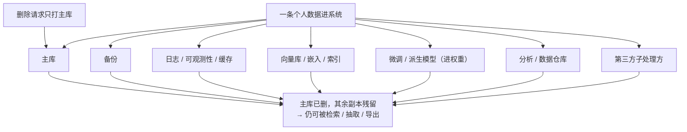

import PrivacyMeta from '@site/src/components/PrivacyMeta';

<PrivacyMeta era="卷六 · 治理与合规" technique="数据生命周期与数据治理" audience={['隐私工程师', '合规工程师', '安全工程师']} severity="中" maturity="生产" evidence="官方文档" />

> 一句话摘要：「我删了那条记录」≠「数据没了」。一条个人数据进系统后，会复制到一大堆地方——主库、备份、日志、缓存、向量库 / 嵌入、微调 / 派生模型、分析仓库、第三方子处理方。被遗忘权（GDPR Art. 17）要把删除**传播到所有副本**才算数；而**我这边**——训练进权重、嵌入进向量库——恰恰是最难删的一格。NIST 隐私框架把这看成贯穿**数据生命周期**（采集 → 处理 → 存储 → 处置 / 删除）的治理问题。结论先行：按「**数据血缘 + 删除传播**」做治理，别把「删了主库」当「已删除」——那是这条最常见的假安全。

## 机制：我这边发生了什么

一条个人数据流到「我」这边，有多条**会留下副本**的路径：

- **训练 / 微调** → 进**权重**（最难删的一格，接机器遗忘）。
- **嵌入** → 进**向量库 / 索引**（删了原文档，嵌入和索引可能还在）。
- **进上下文** → 落**日志 / 可观测性 / prompt 缓存**。

每条路径都是一份**独立副本**。删除请求如果只打主库，我身上的这些副本照旧存在、照旧可能被检索或抽取出来。

红线说清楚：我不能写「收到删除请求我就会忘了它」——我无法内省地保证。可被**外部验证**的是：**被删数据还能不能从我身上被抽取 / 从向量库被检索出来，取决于它有没有从训练记忆、向量库、日志、缓存里一并清掉**——这能用抽取 / 检索探针客观测出来，不靠我「保证」。



## 威胁面：副本残留在哪、边界在哪

**残留点清单**（每一个都是删除没传到时的泄露面）：

- **备份**：在保留窗口内，被删数据仍在备份里。
- **日志 / 可观测性 / prompt 缓存**：上下文常被二次留存（接《[上下文面隐私](../03-conversational-llms/context-surface-privacy.mdx)》的二次泄露面）。
- **向量库 / 嵌入 / 索引**：删了原文档，**嵌入向量和索引项**可能没删——仍可被检索、甚至被向量反演（接《[多租户 RAG 检索泄露](../04-rag-agents/rag-retrieval-leakage.mdx)》）。
- **微调 / 派生模型**：数据进了权重，删源数据**不会**让模型忘记——这格要靠机器遗忘 / 重训。
- **分析 / 数据仓库 / 特征库**：ETL 复制出去的那些份。
- **第三方子处理方**：传播靠合同，不靠你单方技术强制（接《[推理服务数据边界](./inference-service-data-boundary.mdx)》）。

**边界（本条管什么、不管什么）**：本条管「**副本在哪、删除有没有传到**」这本**生命周期账**；「**权重里那份怎么真删**」是机器遗忘的专题（卷五）、「**第三方留不留**」是推理服务边界的专题（本卷）——本条把它们**串成一条删除传播链**，不重复其细节。

## 防护原理

**NIST 隐私框架**（v1.0）把隐私风险按**数据生命周期**（采集 / 收集 → 处理 → 传播 → 使用 → 存储 → 处置含销毁删除）来治理，并给出 Identify-P / Govern-P / **Control-P** 等功能族。落到工程，核心是两件事：

- **数据血缘（lineage）**：知道每类个人数据**流到哪、复制到哪**——没有血缘，删除传播就是盲删。
- **删除传播（fan-out）**：一个删除请求要**扇出**到所有**已知副本**，而不是只删主库。

**GDPR Art. 17/19** 是法律驱动：控制者须采取「**合理措施（含技术措施）**」通知其他处理者删除（Art. 17(2)），并向接收方通知更正 / 删除（Art. 19）；但标准是「**合理 / 不超过比例的努力**」，明确**承认**备份等场景的技术难度。点破：法律给的「reasonableness」弹性，是给「**确实做不到**」兜底的，**不是**「懒得建血缘、懒得删」的借口——你仍要能证明已尽合理技术措施。

## 落地实现（配方）

```text
1. 建数据血缘 / 清单：列出每类个人数据会落到哪些存储——主库 / 备份 / 日志 /
   缓存 / 向量库 / 派生模型 / 仓库 / 子处理方。没有这张图，删除传播无从谈起。
2. 删除请求做成扇出工作流：一个请求触发对所有已知副本的删除 / 调度删除，全程留审计。
3. 备份：用"定期整体过期"策略（GDPR 认可），并明确记录"删除请求会在下个备份
   轮替周期生效"，把生效窗口写进答复。
4. 向量库：删原文档时同步删嵌入与索引项，别只删元数据。
5. 派生模型：进了权重的那份，标记为"需机器遗忘 / 重训"（接卷五），别拿"输出过滤"
   冒充"已删除"。
6. 第三方：把删除传播义务写进 DPA / 子处理方协议（接《推理服务数据边界》）。
```

每一步都绑定**你自己的数据地图与法域**——「哪些算个人数据、保留多久、谁是子处理方」不画清，配方就落不了地。

**最小可测试断言**（把删除传播收成可审计的检查）：

- 怎么测：抽样一个**已请求删除**的主体，跨**所有已知存储**核查残留；并用抽取 / 检索探针测模型与向量库还能否取到它。
- 通过：各存储**无残留**（或在**记录在案**的备份过期窗口内）、探针取不到、且有**端到端审计链**证明请求扇出到了每个副本。
- 失败：某副本仍在且**无过期计划**、或探针仍能从模型 / 向量库取到、或拿不出审计链 → 删除传播未闭环，别对外宣称「已删除」。

## 真实案例 / 治理现状（工程实践）

（本条 maturity 标「生产」：数据生命周期治理是**被 GDPR 驱动、被 NIST 隐私框架结构化**的成熟工程实践；但「完整传播」在工程上**始终不完美**——备份与派生模型尤难。下面给治理结构与现状，不点名未核案例。）

- **标准把生命周期做成可治理的功能族**：NIST 隐私框架（CSWP，2020-01-16）将隐私风险按数据生命周期（含 storage 与 disposition / deletion）拆成 Identify-P / Govern-P / Control-P 等，给「在哪治理删除」一个标准化骨架；其「数据处理生态」视角正对应「副本会扩散到多方」的现实。
- **法律承认传播之难、但要求尽合理努力**：GDPR Art. 17 确立被遗忘权，Art. 17(2) 要求采取「合理措施（含技术措施）」通知他方删除、Art. 19 要求通知接收方；「合理 / 不超过比例」标准明确承认备份等的技术约束——这恰恰说明「删除传播」是个**公认未被自动解决**的工程难题，要靠血缘 + 扇出工作流逼近，而非假设「删一处即清」。

## 残余风险与权衡

逐条点破假安全：

- **删除传播永远不完美。** 你血缘图上没有的副本（影子拷贝、临时导出、个人下载）就是盲区——传播只能覆盖**已知**副本。
- **备份过期窗口内，数据仍在。** 「下个轮替周期生效」是合规可接受的做法，但要**如实告知**生效窗口，别说成「已即时删除」。
- **派生模型里那份没真删。** 删源数据 ≠ 模型忘记；真删要机器遗忘 / 重训，且其本身未被很好解决（见《[可验证删除与机器遗忘](../05-frontier-deployment/machine-unlearning.mdx)》，卷五）。
- **第三方传播靠合同、不靠技术强制。** 你能要求、能审计，但不能单方在对方机器上按删除键。
- **「合理努力」可能被当借口。** reasonableness 是给真做不到的兜底；用它掩盖「没建血缘」会在审计 / 诉讼里站不住。

## 合规映射

- **GDPR**：Art. 17（被遗忘权 / 删除权）+ Art. 19（向接收方通知删除）+ Art. 5(1)(e)（存储限制：不超过必要时长）。删除传播与备份策略要能对应这三条做举证。
- **EU AI Act**：训练数据透明度义务与「数据进了模型后如何治理」间接相关——派生模型里的个人数据如何处置，是合规与机器遗忘的交叉点。
- **NIST**：隐私框架 Govern-P / Control-P 提供数据生命周期治理的术语与功能族，可作为「血缘 + 删除传播是否到位」的对照系。

（合规随法条 / 标准版本演进，本段打戳 2026-06，引用前核对最新文本。）

## 与相邻技术的区别

- **数据生命周期 vs 机器遗忘（卷五）**：遗忘解决「**权重里那份**怎么删」；本条是「**所有副本在哪、删除有没有传到**」的生命周期账——遗忘是这本账里**最难的一格**，不是全部。
- **数据生命周期 vs 推理服务数据边界（本卷）**：边界讲「**第三方服务方**留不留你发出的数据」；本条把第三方当生命周期里的**一个副本节点**纳入删除传播链，视角更全。
- **数据生命周期 vs 上下文面隐私（卷三）**：那条讲上下文窗口里的东西被**套出**；本条讲上下文**落了日志 / 缓存之后**的留存与删除——一个在交互期、一个在留存期。

## 版本说明

:::note 适用版本
「个人数据会在系统里扩散成多份副本、删除必须传播到每一份才算数」是**与具体技术栈无关**的治理事实（根因在于数据被复制到主库 / 备份 / 日志 / 向量库 / 派生模型 / 第三方等多处）。NIST 隐私框架为 **v1.0（2020-01-16）**（注意 1.1 在演进中）；GDPR 条文与各地法规、各国监管指引会更新，**本段打戳 2026-06**，落地前请核对**最新法条与你所在法域的指引**。（出处核验于 2026-06。）
:::

## 延伸阅读与出处

> 主要：官方文档（GDPR 法条 + NIST 标准）。

- [GDPR Art. 17 — Right to erasure（'right to be forgotten'）](https://gdpr-info.eu/art-17-gdpr/) —— 被遗忘权法条：删除义务、Art. 17(2) 通知他方、Art. 19 通知接收方，以及「合理 / 不超过比例努力」标准。本条法律驱动。
- [NIST Privacy Framework v1.0（NIST CSWP，2020-01-16）](https://nvlpubs.nist.gov/nistpubs/CSWP/NIST.CSWP.01162020.pdf) —— 按数据生命周期（含存储与处置 / 删除）治理隐私风险的标准骨架（Identify-P / Govern-P / Control-P），与「数据处理生态」视角。本条治理结构依据。
