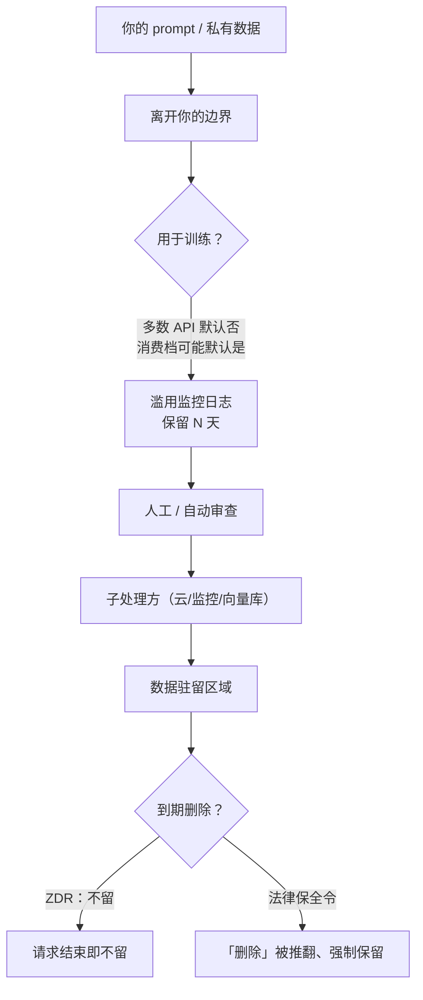

import PrivacyMeta from '@site/src/components/PrivacyMeta';

<PrivacyMeta era="卷六 · 治理与合规" technique="推理服务期隐私" audience={['隐私工程师', '合规工程师', '安全工程师']} severity="中" maturity="生产" evidence="官方文档" />

> 一句话摘要：把私有数据发给第三方推理 API，「他们不拿去训练」往往是真的——但那只是数据边界的**一格**。还要逐项核：保留多久、滥用监控日志留多久、企业档和消费档差在哪、有没有零数据保留（ZDR）、子处理方是谁、数据落在哪个区域、有没有 DPA/BAA。更要记住：**这些条款会变，还可能被法律令推翻**。把一句「我们不训练」当成整条边界，是最常见的运营期假安全。

## 机制：我这边发生了什么（视角）

你的 prompt 发到我这，是一次**数据出境**——它离开你的信任边界，进入服务方的系统。在那里它会经过一串跳转，每一跳都是一个可能的保留或泄露点：

是否用于改进 / 训练模型 → 是否写进**滥用监控日志**、留多久 → 是否经过**人工审查** → 是否经过**子处理方**（云、向量库、监控）→ 落在哪个**区域** → 是否进**缓存 / 评估集**。

红线：我不该写「我保证不留你的数据」——留不留不由「我」决定，由服务方的条款 + 你的配置决定。可核查的是：**这条数据边界由书面条款与实际配置定义，它可被逐项核实，也会随版本变化。**



## 威胁面：边界在哪一跳破

把「数据边界」当成一句话，是因为只盯住了「训练」这一跳。真实的泄露 / 保留风险散落在整条链上：

- **训练使用**：API 多数默认不训练；消费 / 团队 / 企业 / API 各档的默认数据使用可能不同，别用一个档的认知套另一个档。
- **保留期**：默认保留多少天？滥用监控的副本算不算？
- **人工审查 / 滥用监控**：被保留的数据有没有人 / 模型看过？
- **子处理方**：服务方把数据转给了谁（云、监控、第三方）？边界随之扩大。
- **数据驻留**：落在哪个法域，决定适用哪套法律。
- **plan 差异**：免费 / 个人 / 团队 / 企业的默认与可选项往往不同。

## 防护原理

不要问「你们会不会拿去训练」这一个问题，要按**数据生命周期**逐跳核，并把答案**落成书面**（DPA / ZDR 协议），而不是停在营销页的一句话。关键变量固定为一组：训练使用 / 保留期 / 滥用监控 / plan 差异 / ZDR / 数据驻留 / 子处理方 / DPA·BAA。每一项都要有「条款出处 + 版本日期 + 是否覆盖日志和缓存」。

## 落地实现（配方：厂商数据边界核查清单）

```text
逐项问，且要书面答案 + 打日期（厂商条款会变）：
1. 训练使用：API 输入/输出是否用于训练？默认还是需 opt-out？消费档与 API 档差异？
2. 保留期：默认保留多少天？滥用监控副本单独算吗？到期是真删还是仅「不可见」？
3. 滥用审查：被留数据是否经人工/自动审查？谁可访问？
4. 零数据保留（ZDR）：是否提供？是自助开关还是要账户团队开通？覆盖哪些端点？
5. 子处理方：清单在哪？是否含云/监控/向量库？变更如何通知？
6. 数据驻留：可否指定区域？默认落哪？
7. 法务文件：能否签 DPA？涉医疗能否签 BAA？SOC2 / ISO 报告？
8. opt-out 覆盖面：opt-out 是否同时覆盖日志、缓存、评估集、人工审查样本？
```

这套清单就是 toolkit「LLM Vendor Data Boundary Checklist」的雏形——**当工件用、按厂商存档、按季度复核**，因为条款会变。

**最小可测试断言**（把这张核查表当可回归的工件）：

- 怎么测：每个厂商存一份填好的核查表，每格带「条款出处 + 版本日期」，按季度复核。
- 通过：每一格都有出处与日期、且与你签的合同 / DPA 一致；无空格、无过期格。
- 失败：某格无出处 / 与合同不符 / 超过复核期 → 标记为「未核」，落地决策前补齐。

## 真实案例 / 厂商现状（打戳 2026-06，落地前核当下条款）

:::caution 以下为特定时点的厂商条款，**按端点 / 功能 / 模型细分、且会变**——引用前务必核对最新官方文档与你的合同
下表打戳 2026-06，仅示例「边界要逐格核」、不构成落地依据：

| 厂商 | 范围 | 默认用于训练 | 默认保留 | ZDR / 例外 |
|---|---|---|---|---|
| OpenAI | API（多数端点） | 否（除非显式 opt-in） | 滥用监控日志常见约 30 天后删（法律 / 防滥用时更久）；**但 application state、保留期与 ZDR 资格按端点 / 功能而异** | 对合格企业提供 ZDR，非自助开关、需账户团队按端点开通 |
| Anthropic | API（商用条款） | 否（未经明确许可不用于训练） | **对话内容（你的输入与 Claude 输出）默认不保留**；需存储的功能按最短 TTL 留；**特定模型（Covered Models）要求 30 天保留** | ZDR 覆盖 Messages 与 Token Counting API；**不**覆盖 Console / Workbench、消费产品、Teams / Enterprise 界面、Managed Agents；违规或法律要求下可留至 2 年 |

- **逐端点核，别拿一格套全平台。** 同一厂商不同 API / 功能 / 模型，保留与 ZDR 资格可天差地别（例：Anthropic 的 Batch 约 29 天、Code execution 容器约 30 天、Files 至显式删除为止）。把「某一格」当整条边界，正是本条要破的假安全。
- **「删除」可被法律推翻。** OpenAI 在与《纽约时报》的诉讼中一度被法院要求**保全**本应删除的数据——法律保全令压在保留承诺之上，「到期即删」非绝对。

（本表打戳 2026-06：Anthropic 行据其官方 *API and data retention* 页核验；OpenAI 行据其 *Data controls in the OpenAI platform* 页，落地前务必核当下官方文档与合同。）
:::

它们印证的是同一件事：**数据边界是一组可核、会变、且受外部法律影响的条款，不是一句「我们很重视隐私」。**

## 残余风险与权衡

逐条点破假安全：

- **「默认不训练」≠「不保留」。** 不拿去训练，不代表不写日志——滥用监控的副本通常还在，留 N 天。
- **「我们删了」可被法律保全令推翻。** 见上 OpenAI / NYT：诉讼或监管可强制保留你以为已删的数据。
- **各产品档默认不同。** 同一家厂商，消费 / 团队 / 企业 / API 的默认数据使用政策可能不同（有的消费产品默认会用于训练、需 opt-out）——别用一个产品面的认知套另一个。
- **ZDR 不是自助开关。** 通常要资格审核 + 账户团队开通 + 限定端点；没签下来就别假设有。
- **opt-out 未必覆盖全链。** opt-out「训练」未必同时覆盖日志、缓存、评估集、人工审查样本——要逐项确认覆盖面。
- **子处理方扩大边界。** 你信任的是厂商，但数据可能流到它的云 / 监控 / 第三方——边界比合同首页大。

## 合规映射

- **GDPR**：第三方推理是把个人数据交给**处理者 / 子处理者**——需要 DPA、明确子处理方、跨境传输机制（如 SCC）、保留期与删除权安排。
- **OWASP LLM02:2025**：敏感信息泄露也包含「输入被服务方留存 / 被用于训练」这一面，缓解含清晰的数据使用条款与 opt-out。
- **EU AI Act**：训练数据透明度义务，会让「谁的数据、怎么用」更需写明。

（合规与厂商条款均随版本演进，本段打戳 2026-06，引用前核对最新生效文本。）

## 与相邻技术的区别

- **数据边界（运营期）vs DP 微调（训练期）**：本条是**责任与条款映射**——数据交出去后由谁、按什么规则处理；《[DP 微调](../03-conversational-llms/dp-fine-tuning.mdx)》是**训练期的技术保证**。一个问「条款怎么写、配置怎么核」，一个问「数学上能否限制单样本影响」。
- **数据边界 vs 上下文面隐私**：上下文面隐私讲「我当前上下文里的东西被套出来」；本条讲「你主动发出去的数据，在服务方那边被怎么处置」。

## 版本说明

:::note 适用版本
数据生命周期这套核查框架是**与厂商无关**的方法论，长期稳定。但框架里填的**具体值**（保留天数、是否默认训练、ZDR 条件、子处理方清单）属厂商条款，**变动频繁**——本条所有厂商数字打戳 2026-06，且仅作示例；任何落地决策都必须以你查到的**当下**官方文档与你签下的合同为准，并按季度复核。（出处核验于 2026-06。）
:::

## 延伸阅读与出处

- [Data controls in the OpenAI platform（OpenAI 官方）](https://platform.openai.com/docs/guides/your-data) —— API 默认不训练、滥用日志保留期、企业零数据保留（ZDR）。
- [API and data retention（Anthropic 官方）](https://platform.claude.com/docs/en/manage-claude/api-and-data-retention) —— 商用条款不用于训练、API 日志保留期、ZDR。
- [OWASP LLM02:2025 Sensitive Information Disclosure](https://genai.owasp.org/llmrisk/llm022025-sensitive-information-disclosure/) —— 含「输入被留存 / 用于训练」一面的敏感信息泄露风险与缓解。
