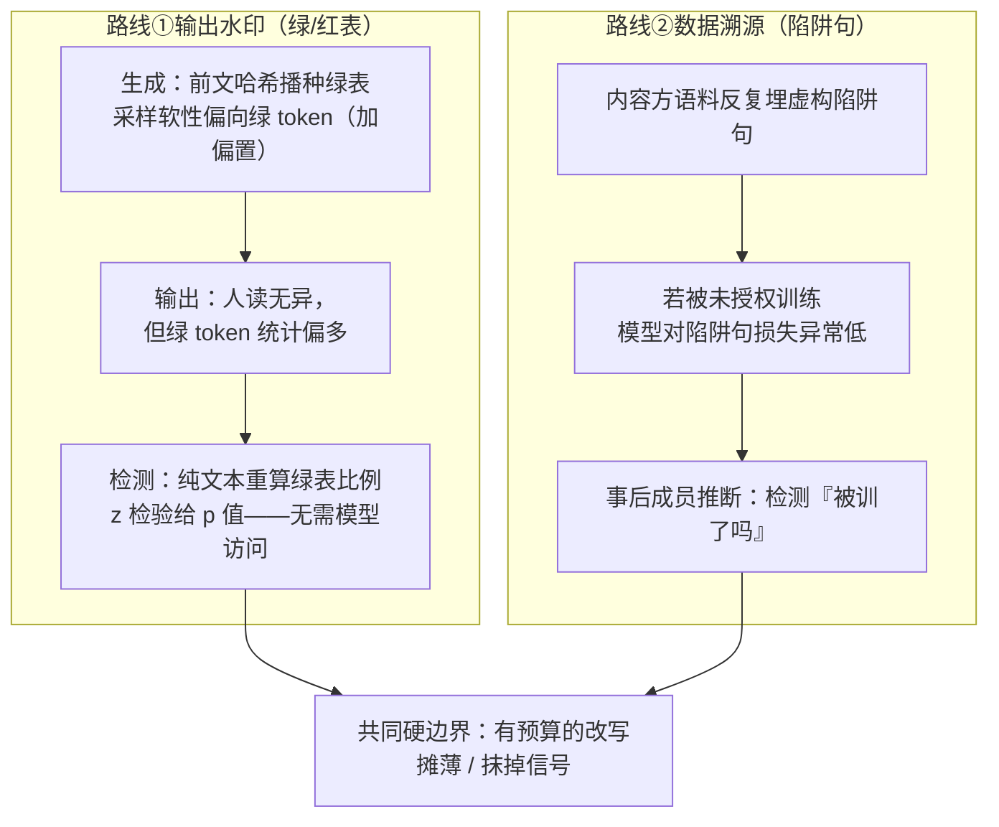

import PrivacyMeta from '@site/src/components/PrivacyMeta';

<PrivacyMeta era="卷六 · 治理与合规" technique="治理与合规" audience={['隐私工程师', '合规工程师', '安全工程师']} severity="中" maturity="研究" evidence="研究支持" />

> 一句话摘要：水印能做两件事——**给我生成的文本打可检测标记**（绿/红表水印，检测端无需访问我的权重）、以及**事后检测「我的数据被训了吗」**（往语料里埋虚构「陷阱句」，再用成员推断把它逼出来）。但二者都有同一条硬边界：**一次有预算的改写就能把信号抹掉**。Kirchenbauer 等（ICML 2023）的绿/红表水印靠 z 检验给出可解释 p 值、检测无需模型访问，但可检测性**随文本熵下降而下降**（低熵 / 短输出难标）；他们后续的可靠性研究（ICLR 2024）实测：**人工、尤其 LLM 改写会显著压低可检测性**，水印被「摊薄」、检测需要更多 token，WinMax + SelfHash 只能**部分**恢复。结论先行：水印是**溯源 / 取证的概率证据**，不是强保证——**别把「有水印」当「抹不掉」**。

## 机制：我这边发生了什么

水印改的是我**采样时的概率分布**，不改我「想说什么」。以 Kirchenbauer 等（ICML 2023）的**绿/红表**方案为例：

1. **生成端打标**：每生成一个 token 前，拿**前若干个 token 的哈希**当随机种子，把整个词表伪随机地分成一份「绿表」和一份「红表」；采样时**软性地偏向绿表**（给绿表 logits 加一个小的偏置 δ）。于是我的输出在统计上**绿 token 偏多**——人读不出差别，但分布里留下了痕迹。
2. **检测端验证**：检测方**只看文本**，用同样的哈希规则重算每个位置的绿表，数「落在绿表里的 token 比例」，做一个 **z 检验**——绿 token 显著多于随机预期（约一半）就判为「带水印」，并给出可解释的 **p 值 / z 值**。**这一步不需要访问我的权重，也不需要原始提示词**。

另一条溯源路线是**数据陷阱（copyright traps，Meeus 等 ICML 2024）**：内容方往自己的语料里**反复注入虚构的「陷阱句」**（fictitious、独一无二、现实中不存在的句子）；若这些句子被**未授权地**训进某个模型，事后就能用**成员推断**（看模型对陷阱句的困惑度 / 损失是否异常低）来检测「**我的数据被训了吗**」。

红线说清楚：不是「我记得我标过这段文本」或「我知道这条数据在我的训练集里」——这两件我都无法可靠内省；**可被外部复算的是**：检测方用公开的哈希规则在**纯文本**上重算绿表比例、跑 z 检验得到 p 值（输出水印），或对**陷阱句**算损失 / 困惑度做成员推断（数据溯源）。判定权在**外部的统计检验**手里，不在我的「记得 / 知道」里。



## 威胁面：谁来抹、抹得掉吗

把「水印 / 溯源」当防御方，**攻击者目标是去除信号**，威胁面按两条路线分。

**输出水印的去除（Kirchenbauer 等 ICLR 2024 的可靠性压测）**：

- **攻击者模型**：拿到我带水印的输出，想去掉标记还保留语义；不需要我的权重，只需要一个**改写器**（人工，或另一个 LLM）。
- **手段与效果**：他们系统压测了绿/红表水印的鲁棒性——**人工改写、尤其 LLM 改写会显著压低可检测性**；机制上水印被「**摊薄（spread）**」到改写后的文本里，于是检测**需要更多 token** 才能重新攒够统计显著性。净结论：水印**扛得住轻度破坏**（少量增删改、复制粘贴片段），但**一次有足够预算的改写能把信号抹掉**。
- **熵这条天然短板**：可检测性**随文本熵交易**——低熵 / 高度受限 / 很短的输出本就难标、难检（这是 ICML 2023 就点明的限制，不是实现 bug）。

**数据溯源（陷阱句）的边界（Meeus 等 ICML 2024）**：

- **成功判定**：仅当陷阱句**足够长 × 重复足够多**时，事后成员推断才稳定可检；短或重复少则信号不足。论文是在**受控的 1.3B、从零预训练**设置里验证的——把它的可检测阈值搬到别人的大模型 / 真实训练管线前，必须回原文核条件。
- **它解决什么、不解决什么**：陷阱句能给「**这家是不是训了我的数据**」提供**统计证据**，但不阻止训练、也不直接证明侵权的法律结论。

## 防护原理

把两条路线靠什么成立、保护什么、不保护什么讲清，别当银弹。

- **输出水印靠的是「分布里的统计偏置 + 可复算的检测」**：绿表由前文哈希确定，故检测方**无需密钥分发给读者、无需模型访问**就能在纯文本上重算、做 z 检验。它给的是**概率证据**（p 值），不是确定性签名——天然有假阳 / 假阴，且**对改写不稳健**。
- **它不保护低熵与短文本**：当我「几乎只有一种合理说法」（代码、固定格式、极短回答）时，可注入的绿表偏置很小，水印**信号本就弱**。
- **数据溯源靠的是「可识别的人工记号 + 成员推断」**：陷阱句是内容方**主动注入**的、现实中不存在的串，因此一旦被训进去，它的异常低损失就**可归因**。它**只回答「被训了吗」**，不回答「训了多少 / 是否合法」。
- **共同的不保护项**：两者都**挡不住有预算的改写 / 转写**——攻击者只要肯花算力把文本重写一遍，输出水印被摊薄、陷阱句原句不再逐字出现，信号就掉到检测阈值以下。

## 落地实现（配方）

回归中性技术笔——可抄、可验证，参数带条件。

```text
1. 输出水印（绿/红表，Kirchenbauer 2023 方案）：
   - 关键超参：绿表比例 γ（如 0.25 / 0.5）、绿表 logits 偏置 δ（越大越易检、文本越「偏」）、
     哈希用的前文窗口 h（h=1 即看前 1 个 token）。三者都在「可检测性 ↔ 文本质量」上权衡。
   - 检测：用同一哈希规则在纯文本上重算绿表命中率，跑 z 检验，按目标假阳率（如 1e-2 / 1e-4）
     定 z 阈值；报 z 值 / p 值，别只报「检出/未检出」。
   - 鲁棒性增强（Kirchenbauer 2024）：上 SelfHash 等方案 + WinMax 检测，对改写「部分」恢复——
     是部分，不是免疫。
2. 数据溯源（陷阱句，Meeus 2024 方案）：
   - 注入足够长 × 足够多次重复的虚构句（独一无二、不会自然出现），记录注入清单。
   - 事后检测：对候选模型算陷阱句的损失 / 困惑度，做成员推断，比对一组未注入的对照句。
   - 阈值绑定「长度 × 重复数」——短或重复少则信号不足，须按你的语料规模重标。
3. 始终把结果当概率证据：报检验统计量 + 假阳率，别把单次「检出」当确证；
   对「未检出」尤其别当「确无水印 / 确未被训」——改写或低熵都会给假阴。
```

每一步都绑定**你的文本熵分布、注入预算与可接受的假阳/假阴档**——同一套超参，换个 workload 检测率能差一截。

**最小可测试断言**（把「水印有效性」收成可回归的 eval，别停在「我们加了水印」；须自测）：

- 怎么测：建一个固定评测集，跑三档——(a) 原始带水印输出、(b) 轻度破坏（少量增删 / 复制粘贴）、(c) **LLM 改写后**——分别测检测端的 z 值 / 检出率；溯源侧则在对照模型（未训陷阱句）与目标模型上各跑一遍成员推断。
- 通过：(a)(b) 在目标假阳率下稳定检出、报得出 p 值；并**如实记录** (c) 改写后检出率的**下降幅度**与「需多少 token 才重新显著」。
- 失败：把 (c) 当成「仍可靠检出」对外宣称、或不报假阳/假阴、或对「未检出」直接断言「无水印 / 未被训」——这是把概率证据冒充强保证，回去补改写档与对照档再测。

## 真实案例 / 研究进展（工程可行性）

（本条 maturity 标「研究」：以下是**论文级**证据，数字 / 阈值绑定各自实验设置，不是「水印已是可依赖的强保证」的背书。）

- **绿/红表水印 + 无模型访问检测（Kirchenbauer 等，ICML 2023，PMLR v202）**：提出用前文哈希播种绿表、采样软偏向绿 token 的水印，检测是**只看文本**的 z 检验、给可解释 p 值、**不需模型访问**；并明确指出**可检测性随文本熵交易**——低熵 / 短输出更难标。这是「输出水印」这条线的奠基与边界双声明。
- **改写会抹掉它（Kirchenbauer 等，ICLR 2024）**：对绿/红表水印做可靠性压测，结论是**人工、尤其 LLM 改写显著降低可检测性**，水印被摊薄、检测需更多 token；WinMax + SelfHash **部分**恢复。净结论一句话：**扛得住轻度破坏，但有预算的改写能去除信号**——这正是本条「别当强保证」的实证来源。
- **数据溯源用陷阱句 + 成员推断（Meeus 等，ICML 2024，PMLR v235）**：把虚构「陷阱句」反复注入语料，使**未授权训练**事后可被成员推断检出；**仅当陷阱句足够长 × 重复足够多**时可检，验证在**受控 1.3B 从零预训练**设置。把它当「能给『被训了吗』提供统计证据、但绑定注入规模」的工具，别当「能确权」的法律结论。

## 残余风险与权衡

逐条点破假安全：

- **有预算的改写抹得掉输出水印。** 这是最该记住的一条：攻击者肯花一次 LLM 改写，绿/红表信号就被摊薄到检测阈值以下；WinMax/SelfHash 是**部分**恢复，不是免疫。**「有水印」≠「抹不掉」**。
- **低熵 / 短文本本就难标难检。** 代码、固定格式、极短回答里能注入的统计偏置很小——这类输出的水印**天生弱**，别假设全场景等效。
- **检测是概率判定，有假阳 / 假阴。** z 检验给 p 值不给铁证；把单次「检出」当法律级确证、或把「未检出」当「确无水印」，都是误用。**「未检出」常常只是被改写或熵太低**。
- **陷阱句溯源绑定注入规模、且只答「被训了吗」。** 短或重复少则信号不足；它给统计证据，不证明侵权法律结论，更不阻止训练。论文阈值来自受控设置，迁移前须按你的语料重标。
- **水印不防其他隐私泄露。** 它做的是**溯源 / 取证**，不降低记忆回吐、不阻止训练数据抽取、不替代 DP——别把它当隐私防护的主力。

## 与相邻技术的区别

- **水印溯源 vs 模型抽取与窃取（卷一）**：模型水印 / 指纹是**模型抽取**的**事后溯源**对策（被偷的替身可被追认），见《[模型抽取与窃取](../01-foundations/model-extraction-stealing.mdx)》「防护原理」里把水印列为「不阻止窃取、便于事后溯源」的一项；本条讲的是**文本输出**水印与**训练数据**溯源——对象是内容与语料，不是模型参数。
- **数据溯源（陷阱句）vs 成员推断攻击（卷一）**：成员推断本是**攻击**——判定「某样本在不在训练集」；陷阱句把它**反过来当防御工具用**：内容方主动注入可识别的句子，再用同一套成员推断检测「被训了吗」。同一技术、攻防两端，见《[成员推断攻击](../01-foundations/membership-inference.mdx)》。
- **水印 vs 训练数据抽取（卷二）**：训练数据抽取是把**已被记住的真实私有数据**逼出来（隐私泄露）；陷阱句溯源是**故意注入**不含真实隐私的虚构句来取证（溯源工具）。两者都涉及「模型记住了什么」，但一个是被攻击者利用的泄露面、一个是内容方主动布的记号，见《[训练数据抽取](../02-memorization-extraction/training-data-extraction.mdx)》。

## 版本说明

:::note 适用版本
「水印能给生成文本打可检测标记、能用陷阱句 + 成员推断检测训练使用，但有预算的改写可抹除」是**与具体模型代际无关**的范式级结论（根因在于水印是分布里的统计偏置 / 可被改写摊薄，溯源依赖逐字记号 / 可被转写绕过）。但**具体的检出率、改写后还能不能检、需要多少 token、陷阱句要多长多重复**强绑定方案超参（γ / δ / 哈希窗口）、文本熵分布与实验设置——Kirchenbauer（2023 绿/红表；2024 可靠性，绿/红表）与 Meeus（2024 陷阱句，受控 1.3B 从零预训练）的数字 / 阈值**都不能直接迁移**到你的模型与语料，落地必须按你自己的 workload 重估、并自测。本段打戳 2026-06。（出处核验于 2026-06。）
:::

## 延伸阅读与出处

- [A Watermark for Large Language Models（Kirchenbauer 等，ICML 2023，PMLR v202）](https://proceedings.mlr.press/v202/kirchenbauer23a.html) —— 绿/红表水印 + 无模型访问的 z 检验检测；可检测性随文本熵交易（低熵 / 短输出难标）。本条「输出水印」奠基与边界。
- [On the Reliability of Watermarks for Large Language Models（Kirchenbauer 等，ICLR 2024）](https://openreview.net/forum?id=DEJIDCmWOz) —— 鲁棒性压测：人工、尤其 LLM 改写显著压低可检测性、水印被摊薄；WinMax + SelfHash 部分恢复。本条「改写可抹除」实证来源。
- [Copyright Traps for Large Language Models（Meeus 等，ICML 2024，PMLR v235）](https://proceedings.mlr.press/v235/meeus24a.html) —— 注入虚构陷阱句、事后用成员推断检测未授权训练；仅当足够长 × 重复够多时可检，受控 1.3B 从零预训练设置。本条「数据溯源」来源。
