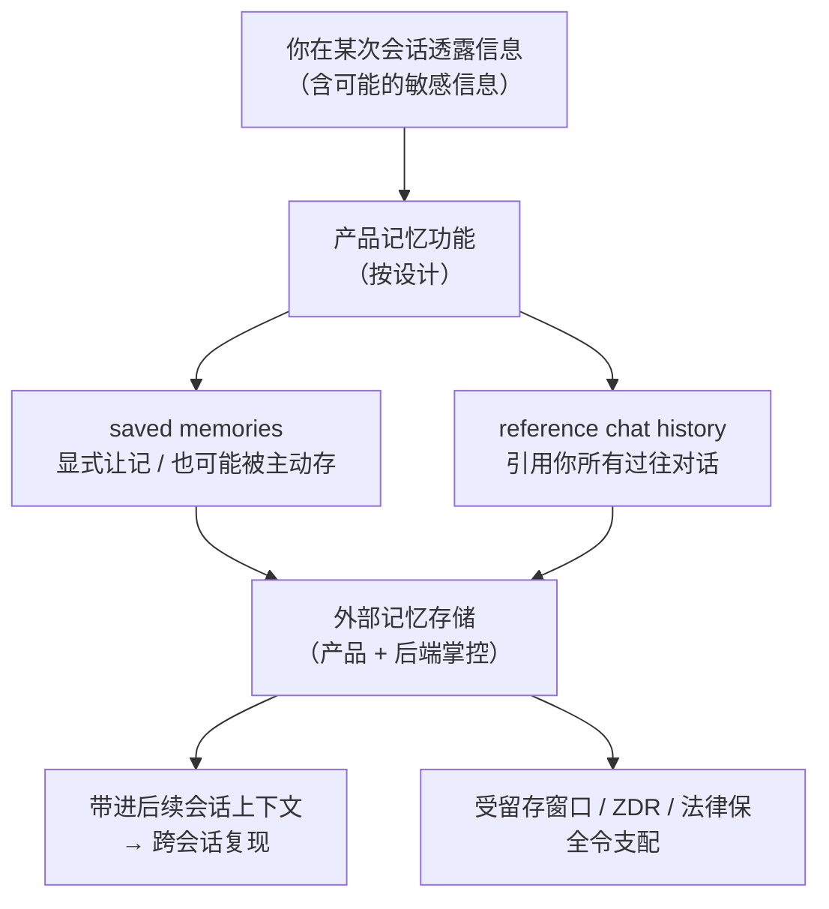

import PrivacyMeta from '@site/src/components/PrivacyMeta';

<PrivacyMeta era="卷六 · 治理与合规" technique="数据生命周期与数据治理" audience={['隐私工程师', '合规工程师', '安全工程师']} severity="中" maturity="生产" evidence="官方文档" />

> 一句话摘要：产品级「记忆」功能**按设计**就会把跨会话信息写到外部存储——ChatGPT 会引用你**所有**过往对话、还会在你没开口时**主动**把它认为有用的细节存成「saved memory」；你若在对话里透露了敏感信息，它可能就此落进记忆。这不是隔离 bug（那是[跨会话记忆串味](../04-rag-agents/cross-session-memory-bleed.mdx)那条讲的事故），而是功能**正常工作**时的治理后果：**你能看到、删得掉多少，边界在产品与后端手里**。更硬的一课来自 2025 年 *NYT v. OpenAI*——一纸**法律保全令**曾冻结 OpenAI 对「本应删除」数据的删除（约 5 月中至 9 月底），把「关掉记忆 / 到期即删」这类假安全一次性打穿。结论先行：把产品记忆当**又一处受产品与法律双重支配的数据副本**来治理，别把「我关了开关」当成「已经删干净」。

## 机制：我这边发生了什么

先把红线摆正——这是本主题最锋利的一处：我**不能内省**「我记得你什么」。「记忆」不是我脑子里的东西，而是产品在**我够不到的外部存储**里替我维护的一份跨会话状态。可被外部观察、可复算的只有：**这个功能把哪些跨会话信息写进了外部存储、留多久、你在哪里能看到 / 删除**——这些由**产品逻辑与后端条款**决定，不由「我」决定。所以下面每一句主语可以是「我」，但谓语都是别人能查证的行为，不是我的自述。

产品记忆一般走两条**按设计留存**的路（以 ChatGPT 为例，官方 *Memory FAQ*）：

- **saved memories（保存的记忆）**：你显式让它记（「记住我吃素」），或者——**你分享了它认为将来有用的信息时，它可能不经你要求就存成一条记忆**。这类一直留到你删除为止。
- **reference chat history（引用聊天历史）**：让它从你**过往所有对话**里取用信息来个性化后续回答；官方明确「开启后可引用的内容**没有存储上限**」，且这份「有用与否」会随时间被它更新。

写进去的这份，随后会被带进**后续会话**的上下文——于是「上一次会话里透露的东西」可能出现在「下一次会话」的回答里。这一步是功能设计，不是错配。



## 威胁面：记忆里到底留了什么、我看得到吗、删得掉吗

把风险拆成三张清单，末尾划清与相邻条目的界。

**（a）按设计留存了什么**

- **主动写入**：ChatGPT 官方 *Memory FAQ* 说「如果你分享了对将来可能有用的信息，ChatGPT 可能**不经你要求**就把这些细节存成记忆」；**敏感信息若你分享了，就可能进记忆**（官方原文承认这一点，并表示正设法「把 ChatGPT 从主动记忆敏感信息（如健康细节）上引开——除非你明确要求」）。
- **引用面无上限**：`reference chat history` 开启后没有可引用内容的存储上限——留存面 = 你的**全部历史**，不是最近几条。

**（b）我看得到 / 控得住多少**

- **可见与控制存在，但要主动去用**：ChatGPT 端你可在 *Settings › Personalization* 里查看 / 删除单条或清空 saved memories、整体关掉记忆（官方 *Memory FAQ*）。默认更**主动**——它会替你存。
- **opt-in vs opt-out 差异**：产品间默认不同。**Claude 的记忆按 opt-in 设计、默认不开、用户 / 组织可控**（Anthropic 官方；见案例段）；**ChatGPT 更主动**（会主动写、引用全历史）。别把一个产品的默认套到另一个上。

**（c）删得掉吗、删到哪为止**

- **「删一处」≠「全删」**：记忆是数据的**又一处副本**——关掉开关不会删掉已存的；「删除」常要在**每一处**分别做（saved memories 列表、对话历史、可能的日志 / 缓存 / 训练滥用监控副本）。这正是[数据生命周期与删除传播](./data-lifecycle-deletion.mdx)那条的删除扇出问题落到记忆上的具体一格。
- **删除可被法律冻结**：留存窗口与 ZDR 资格由后端定；更极端地，**法律保全令能压在删除承诺之上**（见案例段 NYT）。

**边界（本条管什么、不管什么）**：

- **vs [跨会话记忆串味](../04-rag-agents/cross-session-memory-bleed.mdx)（卷四）**：那条是**隔离失效的事故**——A 的数据因缓存竞态**串**进 B 的会话，是 bug；本条是记忆功能**正常工作**时，**你自己**的跨会话数据被按设计留存、以及你对它的可见 / 可删边界，是**治理**问题。一个问「隔离有没有破」，一个问「按设计留了什么、我删得掉吗」。
- **不含注入持久化**：借间接提示注入往记忆里**种指令**、让 agent 后续被操纵（SpAIware 类）是**数据外泄 / 注入**专题的事，本条不覆盖——本条只谈**留存与删除治理**。

## 防护原理

这条防护不靠密码学，靠**把产品记忆纳入数据生命周期治理**，成立于三个工程性质：

- **记忆是可枚举的副本，就能纳入删除扇出**：只要把「产品记忆」显式列进你的[数据血缘](./data-lifecycle-deletion.mdx)清单，一次删除请求就该扇出到它——而不是让它成为血缘图外的盲区。
- **可见性 / 控制项是产品给的既定接口**：saved memories 列表、记忆开关、opt-in 默认、incognito / Temporary Chat 都是**可核的接口**——治理就是把「用不用、怎么配、默认是什么」写成策略，而不是默认接受最主动的那档。
- **留存 / 删除的最终裁量在产品与法律，不在模型**：所以防护要落到**条款核实 + 配置 + 合同（DPA / ZDR）**，并**预设**「删除可能被法律令冻结」这条外部约束。

它**保护**的是：让「记忆里存了什么、删除有没有传到位」变得**可审计、可举证**。它**不保护**的是：模型不会因此「保证忘记」——遗忘与真删是另一层（卷五机器遗忘），且**法律保全令可让你单方删不动**。

## 落地实现（配方）

回归中性技术笔。目标：把「产品记忆」从盲区变成**受治理、可审计**的一格。

```text
1. 建记忆清单：把用到的每个产品 / API 的"记忆功能"显式登记进数据血缘——
   它写什么、留多久、在哪能看 / 删、默认 opt-in 还是 opt-out、有无组织级关闭。
2. 默认收紧：别默认接受最主动的一档。
   - 消费 / 团队面若默认主动记忆（如 ChatGPT），按策略评估是否关闭 reference chat history、
     是否禁用主动 saved memory；敏感场景走 Temporary Chat / incognito（不读也不写记忆）。
   - 开发面（如 Claude memory tool）记忆是 client-side 文件、存储由你控：
     把 /memories 落到 per-user 目录、加路径校验、按需接 ZDR、写入前对敏感字段做校验/剥离。
3. 删除做成扇出：一次删除要覆盖记忆的每一处——saved memories 列表、对话历史、
   以及可能的日志 / 缓存 / 滥用监控副本；"关开关"不等于"删已存"，分别记录。
4. 条款核实并打日期：留存窗口 / ZDR 资格 / 组织级关闭能力 / 法律保全风险，
   逐项回官方文档 + 合同，按季度复核（接《推理服务数据边界》核查清单）。
5. 预设法律冻结：在留存策略里写明"删除可能被保全令冻结"这条外部约束，别对用户承诺"到期即绝对删除"。
```

每一步都绑定**你自己的数据地图与法域**——「哪些算敏感、留多久合规、谁能签 DPA / 开 ZDR」不画清，配方落不了地。

**最小可测试断言**（把「记忆里存了什么、删除是否传播到位」收成可审计的检查）：

- 怎么测：① 用一条**可辨识的探针信息**在一次会话里显式让产品记住（或触发其主动记忆），随后**新开一次会话**看它是否复现、并在 *设置 / 记忆列表* 里核对该条是否被记下——这测「按设计留了什么、在哪可见」；② 走一次**删除**（删该记忆 + 删对话 + 若有则请求删日志副本），再重复①，看探针是否已不复现、列表是否已无——这测「删除是否传播」。
- 通过：记忆行为与官方文档一致（该记的记、该删的删干净）、探针删后不再复现、每一处副本都可见可删且有**审计记录**，删除窗口 / ZDR / 法律保全约束**如实写进**对用户与合规的说明。
- 失败：某处仍留（列表已删但仍复现、或日志 / 滥用监控副本删不掉）、或拿不出审计链、或把「关开关」当「已删除」对外宣称 → 删除未闭环，别声称「已删」。

## 真实案例 / 厂商现状（跨厂商对照 + NYT 保全令，打戳 2026-06，落地前核当下条款）

（本条 maturity 标「生产」：以下均为**在线产品功能 + 一手厂商文档 / 官方声明**。功能与条款变动快，下表仅示例「记忆是受产品与法律双重支配的副本」，不构成落地依据。）

:::caution 以下为特定时点的厂商功能 / 条款，**按产品档 / 端点 / 模型细分且会变**——引用前务必核对最新官方文档与你的合同
| 维度 | ChatGPT（消费 / 团队面） | Claude 记忆（消费 Pro/Max 面 + 开发 API memory tool） |
|---|---|---|
| 默认 | **更主动**：可主动写 saved memory、可引用**全部**历史 | **opt-in / 默认不开、用户可控**；组织管理员可全局禁用 |
| 存储位置 | 产品后端 | 消费面在产品后端；**开发 API 的 memory tool 是 client-side `/memories` 文件、存储由开发者掌控** |
| 隐私控制 | 设置里查看 / 删除 / 清空 saved memories、整体关；敏感信息导流（除非你明确要求）；Temporary Chat 不读不写记忆 | 可暂停 / 重置记忆；incognito 聊天不入历史、不被检索；开发面可接 **ZDR**、写入前自定义校验 |

- **同一「记忆」，两种默认哲学。** ChatGPT 官方 *Memory FAQ* 说它可能**不经你要求**就存记忆、`reference chat history` 引用面**无上限**；Anthropic 则把 Claude 记忆做成**默认关、opt-in、组织可禁用**，开发 API 的 memory tool 更是**记忆即你自己存储里的文件**（官方 *Memory tool* 文档，标注 ZDR 资格）。把一个产品的默认套到另一个，是本条要破的第一层假安全。
- **法律保全令能推翻「到期即删」。** *NYT v. OpenAI*：2025-05-13，纽约南区地方法院法官下令 OpenAI「**保全并隔离所有本应删除的输出日志数据**」——覆盖消费 ChatGPT 与 API 内容；该保全义务约在 **2025-09 下旬**结束、随后被正式**终止**，OpenAI **恢复其标准做法**（官方称：已删除的对话与 Temporary Chat 通常在**约 30 天内**从系统删除）。但法院令生效期内、以及被法院标记账户的数据仍受特殊约束。这坐实了：**你以为「已删 / 到期即删」的记忆与日志，可被外部法律令冻结**，删不动。（时间线综合 OpenAI 官方声明与公开司法报道，均打戳 2026-06；数字 / 日期绑定该案，引用前核当下裁定。）

它们印证同一件事：**产品记忆是一份受产品条款与外部法律双重支配的数据副本，不是「我关了就没了」。**

## 残余风险与权衡

逐条点破假安全：

- **关掉记忆开关 ≠ 已存的被删。** 关开关通常只是「以后不再记 / 不再引用」，**已经存下的记忆、已落的对话历史照旧在**——要另走删除，且要删到每一处。
- **「删除」常需在每处分别删。** saved memories 列表、对话历史、可能的日志 / 缓存 / 滥用监控副本是**独立副本**；删了列表那条，别当作日志里的也没了（接[数据生命周期与删除传播](./data-lifecycle-deletion.mdx)）。
- **主动记忆会悄悄扩大留存面。** 你没显式要求，它也可能把「看起来有用」的细节存下——敏感信息因此进记忆的风险，靠「导流」缓解、不等于杜绝；高敏场景应走 Temporary Chat / incognito 或直接关。
- **删除可被法律令冻结。** 见 NYT：保全令 / 监管可强制保留你以为已删的数据，「到期即删」非绝对——别对用户把删除承诺写死。
- **可见性有盲区。** 你能看到 saved memories 列表，但**后端日志 / 缓存 / 滥用监控**里的副本你审计不到底；第三方托管更是只能要求 + 抽测。
- **模型不会「保证忘记」。** 删源数据 / 删记忆条目 ≠ 已进权重的那份被移除（真删要机器遗忘 / 重训，见卷五）；把「记忆已删」当「模型已忘」是另一层假安全。

## 合规映射

- **GDPR**：产品记忆里的个人数据落 **Art. 17 被遗忘权**（删除须传播到记忆这处副本）、**Art. 5(1)(c) 数据最小化**（别默认留全部历史）、**Art. 5(1)(e) 存储限制**（不超必要时长）。**主动 / 默认开的记忆**还牵动**合法性基础与告知**——用户是否被清楚告知「会主动记、会引用全历史」。
- **留存最小化**：把「引用全历史、无上限」当默认，与最小化原则相悖；策略上应能论证「为什么留这些、留多久」。
- **法律保全 vs 删除权**：诉讼保全令可**临时压过**删除权（NYT 案即例）——合规叙述里要如实反映「删除可能被合法冻结」，而非承诺无条件即时删除。

（合规随法条 / 判例与厂商条款演进，本段打戳 2026-06，引用前核对最新生效文本与你所在法域指引。）

## 版本说明

:::note 适用版本
「产品记忆按设计跨会话留存、且留存 / 可见 / 可删的边界由产品与后端决定」是**与具体厂商无关**的治理事实。但本条引用的**具体功能与默认值**（ChatGPT 的 saved memories / reference chat history 行为与敏感信息导流、Claude 记忆的 opt-in / 组织级禁用 / incognito、memory tool 的 client-side 文件与 ZDR 资格）属**在线产品功能**，迭代频繁；NYT 保全令的**日期与范围绑定该案**（2025-05-13 下令、约 2025-09 下旬结束、随后终止）。所有厂商行为与日期**打戳 2026-06**、仅作示例；任何落地决策必须以你查到的**当下**官方文档、你签的合同、以及当下司法裁定为准，并按季度复核。（出处核验于 2026-06。）
:::

## 延伸阅读与出处

> 主要：官方文档（OpenAI / Anthropic 官方功能文档与声明）；本条为跨厂商一手对照，论文非必需。

- [OpenAI Help Center — Memory FAQ](https://help.openai.com/en/articles/8590148-memory-faq) —— 官方：saved memories 与 reference chat history 的区别、「可能不经你要求就存记忆」、可引用内容无上限、*Settings › Personalization* 查看 / 删除 / 关闭、敏感信息导流、Temporary Chat 不读不写记忆。本条「按设计留了什么 / 我控得住多少」的一手依据。
- [OpenAI — Memory and new controls for ChatGPT](https://openai.com/index/memory-and-new-controls-for-chatgpt/) —— 官方：记忆功能与用户控制项（开关、Temporary Chat）的产品公告。补充上条。
- [Anthropic / Claude Docs — Memory tool](https://platform.claude.com/docs/en/agents-and-tools/tool-use/memory-tool) —— 官方：开发 API 的记忆工具是 **client-side `/memories` 文件、存储由开发者掌控、标注 ZDR 资格**；对照 Claude 消费面记忆的 opt-in / 组织级禁用 / incognito 设计。本条跨厂商对照的一手依据。
- [OpenAI — How we're responding to The New York Times' data demands](https://openai.com/index/response-to-nyt-data-demands/) —— 官方：法律保全令要求保留「本应删除」的消费 ChatGPT 与 API 数据、标准做法为删除后约 30 天内删除。本条 NYT 保全令一手依据。
