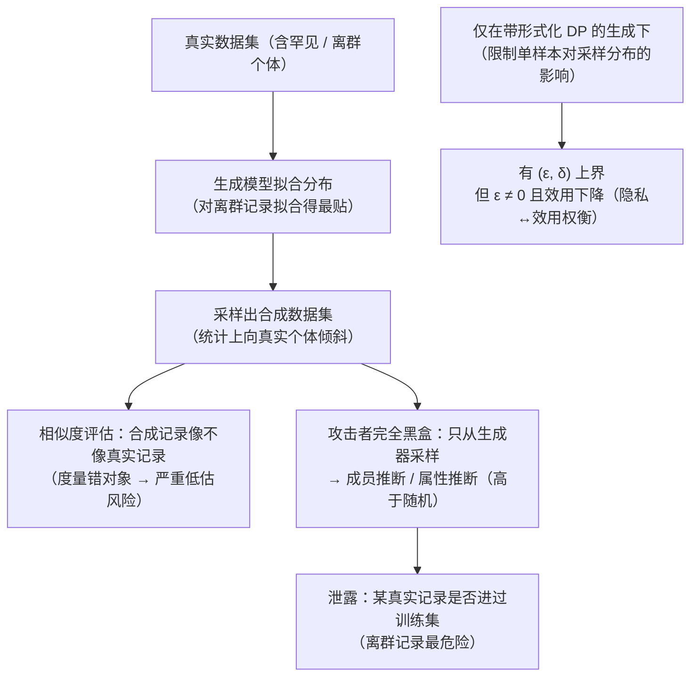

import PrivacyMeta from '@site/src/components/PrivacyMeta';

<PrivacyMeta era="卷六 · 治理与合规" technique="PII 检测与脱敏" audience={['隐私工程师', '合规工程师', 'ML 工程师']} severity="中" maturity="研究" evidence="研究支持" />

> 一句话摘要：「我们用**合成数据**替了真实数据，所以它是匿名的」——这是**假安全**。结论先行：合成数据**默认不提供匿名性**。Stadler 等（USENIX Security 2022）证明，凡基于「真实记录与合成记录有多像」做的隐私评估都会**严重低估**风险，且合成数据**并不比传统匿名化更安全——除非生成过程带形式化的差分隐私（DP）保证**；而即便有 DP，也躲不开硬性的**隐私↔效用权衡**。Chen 等（GAN-Leaks，CCS 2020）进一步显示：哪怕攻击者**只能从生成器采样**（完全黑盒，正是「发布一份合成数据集」的现实场景），成员推断（MIA）仍能以**高于随机**的水平区分某条真实记录是否进过训练集，且随过拟合上升而变准。能给上界的**只有**形式化 DP，且 ε 不为零。

## 机制：我这边发生了什么

我（生成模型）被你的真实数据训练后，去拟合它的分布、再采样出「新」记录。问题是：拟合不是抹除——我对训练分布里**罕见、离群、格式固定**的真实记录拟合得最「贴」，于是采样出的合成记录会在统计上**向这些真实个体倾斜**。攻击者据此能反推：某条真实记录**是否**进过我的训练集（成员推断），或某离群个体的敏感属性。

「相似度评估」之所以低估风险，是它度量错了对象：它问「合成记录长得像不像某条真实记录」，但隐私泄露的真正信号是「**某条真实记录在不在训练集，会不会改变我采样出的分布**」——后者可由对手在**有 / 无该记录**两种训练下分别采样、比较输出分布来复算（这正是 MIA 的判定方式），而前者只看表面像不像，会漏掉这条信号。

红线说清楚：不是「我记得某条真实记录，于是把它吐出来」——我无法内省自己的训练数据影响；可被外部复算 / 观测的是：在「训练集含该记录」与「不含」两种条件下，我采样出的合成分布出现**可测的差异**，对手据此判定成员关系，且该差异在**离群 / 罕见记录**上最大、随**过拟合**上升而上升（GAN-Leaks 黑盒攻击与 Stadler 的脆弱记录实验都复算到了这一信号）。



## 威胁面：如何被利用 / 你如何被泄露

把「发布一份合成数据集」拆成攻击者模型：

- **访问形态**：发布合成数据 = 对手拿到一份采样输出，最弱也能做**完全黑盒**攻击（只从生成器 / 已发布样本采样，不需模型权重、不需 logprobs）。GAN-Leaks 把这一档单列，正因为它对应合成数据发布的现实场景；若对手还拿到生成器权重（白盒），攻击只会更强。
- **背景知识**：对手通常知道数据**模式 / 分布**（哪些列、取值域），甚至持有部分真实记录作参照——这放大成员推断。
- **判定标准**：成员推断的成功 = 对「目标记录在 / 不在训练集」的判定**显著高于随机**（GAN-Leaks 跨 GAN / VAE 多模型测到这一点，且与过拟合正相关）；属性 / 离群推断的成功 = 对离群个体敏感属性的还原优于人群先验。
- **最危险的子集**：Stadler 实测**离群 / 脆弱记录**上的成员推断信号**穿透**多种生成模型、在真实表格数据上持续存在——平均效用看着没问题，恰恰是这些个体被泄露。

## 防护原理

唯一能给**形式上界**的，是让生成过程满足**差分隐私**：训练生成模型时把「单条真实记录对最终采样分布的影响」限制在 (ε, δ) 之内（如 DP-SGD 训练生成器，或 PATE 式教师集成给学生加噪——见下「真实案例」）。这样无论对手怎么从合成数据反推，单个真实记录的成员 / 属性信号都被噪声压在可证明的界内。

点破边界——DP 合成数据**保护什么、不保护什么**：

- **不保护**「合成数据等于无风险」。没有 DP 的合成数据**没有任何上界**；Stadler 的结论是：朴素合成相对传统匿名化**并无系统性增益**，且其隐私收益**因数据集而异、不可预测**。
- **保护的是有界**，不是零：DP 的 ε 不为零意味着仍有残余泄露；ε 越小越私密，但**效用越降**。这条隐私↔效用权衡是硬的——Stadler 明确指出，即便在 DP 下，要把高风险记录的泄露压下去，往往要付出**目标分析任务上可观的效用损失**，没有「既高保真又强匿名」的免费档。
- **相似度评估不是防护**：用「真实 vs 合成的距离 / 重识别测试」当通过条件，本身就是被 Stadler 否掉的方法——它会给出**假阴性**（看着没泄露、实则离群记录可被成员推断）。

## 落地实现（配方）

```text
1. 不靠"合成"二字声称匿名：除非生成过程带形式化 DP，否则合成数据按"未匿名/准标识"对待，
   走与真实数据同级的访问控制与合规评估（别因为是合成就降级处理）。
2. 要可证明的隐私，就用 DP 生成：训练生成模型用 DP-SGD（报清 ε/δ、noise_multiplier、
   clipping norm、采样方式、邻接单位=样本级还是用户级），或 PATE 式 DP 合成（见下"真实案例"）。
   ε 是要逐条审计、会过期的数字，不是一次性勾选。
3. 评估别只用相似度：相似度/重识别测试会假阴性（Stadler）。改用经验成员推断攻击当隐私 eval——
   尤其针对离群/脆弱记录，因为平均效用达标时恰是它们被泄露。
4. 离群记录单独兜底：DP 之外，对极端离群个体考虑剔除/泛化/不纳入生成训练——它们是 MIA 信号最强处。
5. 把隐私与效用一起报，而非二选一替换：同一份合成数据，既报目标任务效用，也报成员推断 AUC；
   调 ε 时两条曲线一起看，明确你在权衡的哪一点（没有免费的"既保真又匿名"）。
```

每个数字（ε、成员推断 AUC、效用损失）都**绑定你的数据集、生成模型与 ε 设置**——论文里「不带 DP 则无增益」「DP 下仍有效用代价」是**定性结论可迁移**，而**具体的攻击成功率 / 效用降幅不可直接迁移、须用你自己的数据自测**。

**最小可测试断言**（把「合成≠匿名」收成可回归的检查）：

- 怎么测：对要发布的合成数据，跑**完全黑盒成员推断攻击**（只从合成样本 / 生成器采样），重点放在离群 / 脆弱记录上；DP 路径下另核 ε/δ 与隐私会计输出。
- 通过：要么走 DP 生成、ε/δ 有记录且在你设定的预算内、并附隐私↔效用两条曲线；要么明确**不声称匿名**、按未匿名数据治理。成员推断在离群记录上**不显著高于随机**，或泄露已被声明的 ε 覆盖。
- 失败：以「相似度 / 重识别测试通过」当匿名证明、或离群记录成员推断**显著高于随机**而**无 DP** 兜底、或只报效用不报泄露 → 不算到位（这正是 Stadler 点破的假阴性模式）。

## 真实案例 / 研究进展（工程可行性）

（本条 maturity 标「研究」：结论与攻击来自同行评审论文与可复现攻击代码，**尚非某厂商生产默认**；以下给研究证据与工程可行性。）

- **相似度评估系统性低估、朴素合成无增益（Stadler 等，USENIX Security 2022）**：在真实表格数据、多种生成模型上，基于真实↔合成相似度的隐私度量会**严重低估**风险；合成数据**并不提供相对传统匿名化的所宣称增益——除非在形式化 DP 下生成**，而即便如此也存在硬性隐私↔效用权衡；成员推断信号在**离群 / 脆弱记录**上持续可测。这把「合成 = 匿名」从直觉降级为**需逐数据集验证、且默认不成立**的主张。
- **完全黑盒下成员推断仍可行（GAN-Leaks，Chen 等，CCS 2020）**：提出对生成模型成员推断的分类法，并证明在**完全黑盒**（仅从生成器采样，正是合成数据发布场景）下，MIA 跨 GAN / VAE 多模型仍能**高于随机**地区分成员，**攻击准确率随过拟合上升**。这给「采样出的合成记录不泄露成员」一个直接反例。
- **DP 合成的工程路径存在、但别当然成立**：PATE-GAN（Jordon 等，ICLR 2019）用 PATE 框架训练带 DP 保证的合成数据生成器，是「要保证就上形式 DP」的代表路线。

:::caution 待核验
PATE-GAN 作为「DP 合成可行」的引证需谨慎：一项 2024 年的复现研究报告其结果**难以复现**。故本条把 DP 合成定位为**有形式化路径、但具体方法的效用 / 隐私数字须以你自己的复算为准**，不把任一论文的乐观数字当定论。
:::

## 残余风险与权衡

逐条点破假安全：

- **「合成」不等于「匿名」。** 没有 DP 的合成数据没有上界；其隐私收益因数据集而异、不可预测（Stadler）。把「跑了生成模型」当「已匿名」，是这条要破的头号假安全。
- **相似度 / 重识别测试会假阴性。** 看着真实与合成不像、就判「安全」，恰恰漏掉离群记录的成员推断信号（Stadler）。通过相似度评估 ≠ 通过隐私。
- **完全黑盒就够。** 不需要权重、不需要 logprobs，只从发布的合成样本采样，MIA 已能高于随机（GAN-Leaks）。「只发数据不发模型」不构成防护。
- **离群个体最危险。** 平均效用达标时，恰是罕见 / 脆弱记录被泄露——总体指标好看会掩盖个体风险。
- **DP 的 ε 不为零。** DP 给的是**有界**不是零泄露；ε 越小越私密但效用越降，隐私↔效用是硬权衡，没有「既高保真又强匿名」的免费档。

## 合规映射（可选）

把「合成数据」当然视作 GDPR 意义上的**匿名数据**（从而落在 GDPR 范围外）是有风险的论断：监管语境下，数据要真正「匿名」须无法（以合理手段）重识别个体，而上文证据表明无 DP 的合成数据**可被成员 / 属性推断**。务实立场：除非有形式化 DP 且经攻击式评估，把合成数据按**仍可能涉个人数据**对待，纳入同级数据治理与 DPIA。法条与监管解读随时间变化，本段打戳 2026-06，具体定性以你所在司法辖区的最新指引与法务判断为准。

## 版本说明

:::note 适用版本
「合成 ≠ 匿名、相似度评估低估风险、只有形式 DP 才有上界且伴效用权衡」是**与具体生成模型无关**的结论（源于生成模型对训练分布、尤其离群记录的拟合）。但**攻击成功率、效用降幅、ε 设置**绑定你的数据集、生成方法与威胁模型——Stadler / GAN-Leaks 的**定性结论可迁移、具体数字不能直接迁移**，落地须用你自己的数据与攻击式评估重测。生成模型与 DP 合成方法在快速演进（PATE-GAN 的可复现性已被 2024 复现研究质疑，见上 `:::caution`），本段打戳 2026-06。（出处核验于 2026-06。）
:::

## 延伸阅读与出处

主要：研究支持（Stadler USENIX'22、GAN-Leaks CCS'20）；补充：DP 合成的工程路线（PATE-GAN，带可复现性存疑）与评估标准（NIST SP 800-226）。

- [Synthetic Data – Anonymisation Groundhog Day（Stadler 等，USENIX Security 2022）](https://www.usenix.org/conference/usenixsecurity22/presentation/stadler) —— 相似度评估严重低估风险；合成数据不提供相对传统匿名化的所宣称增益，除非带形式化 DP，且 DP 下仍有隐私↔效用权衡；离群 / 脆弱记录上成员推断信号持续可测。本条主源。
- [GAN-Leaks: A Taxonomy of Membership Inference Attacks against Generative Models（Chen 等，CCS 2020）](https://dl.acm.org/doi/10.1145/3372297.3417238) —— 完全黑盒（仅采样）下成员推断仍高于随机、随过拟合上升；对应合成数据发布场景的直接反例。本条攻击证据。
- [PATE-GAN: Generating Synthetic Data with Differential Privacy Guarantees（Jordon 等，ICLR 2019）](https://openreview.net/forum?id=S1zk9iRqF7) —— DP 合成数据生成的代表路线（PATE）；**注意**：2024 年一项复现研究报告其结果难以复现，本条仅作「存在形式化路径」的引证，不采纳其具体数字（见上 `:::caution`）。
- [NIST SP 800-226: Guidelines for Evaluating Differential Privacy Guarantees（2025-03）](https://csrc.nist.gov/pubs/sp/800/226/final) —— 评估 DP 保证（含 DP 合成数据）的标准，可作落地评审的参照框架。补充来源。

## 与相邻技术的区别

- **合成数据隐私 vs PII 回吐（卷三）**：[PII 回吐](../03-conversational-llms/pii-regurgitation.mdx) 是**模型在生成中复现训练语料里的个人信息**；本条是更上位的命题——即便你把整份数据「换成合成的」用来发布 / 训练，没有 DP 也不构成匿名，成员 / 属性仍可被推断。脱敏降 PII 回吐，合成换数据，两者都**不等于匿名**，都要 DP 才有上界。
- **合成数据隐私 vs DP 微调（卷三）**：[DP 微调](../03-conversational-llms/dp-fine-tuning.mdx) 把 DP 用在**判别 / 生成模型的训练**上限制单样本影响；本条把同一把 DP 用在**合成数据生成**上——正是「合成数据要带 DP 才有保证」这句的落点。没有 DP 的合成，和没有 DP 的微调一样，只有经验性而无形式上界。
- **合成数据隐私 vs 训练数据去重（卷二）**：[训练数据去重](../02-memorization-extraction/training-data-deduplication.mdx) 通过删重复**经验性**压低记忆 / 抽取，无 (ε, δ) 上界；合成数据若不带 DP 同样只是经验手段、且会被相似度评估高估其安全。两条都印证同一原则：**经验缓解 ≠ 形式保证**，要上界唯有 DP。
