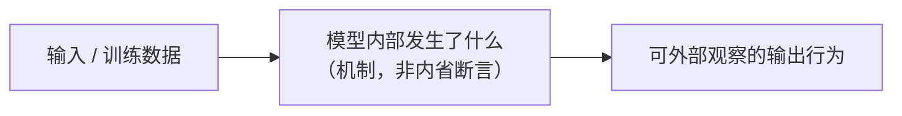

---
# ↓↓↓ 复制本文件来新建一条「LLM 隐私保护」攻防条目。带「# 注释」的地方填完后请删除注释。
# 写之前先过三道硬闸门（见 BACKLOG-privacy.md「硬闸门」）：A 量化声明、B 内省表达、C 成熟度。
title: 条目标题（用一句话点出机制 / 攻防对，不要用问句）
slug: entry-slug             # URL 用的英文短横线 slug，全站唯一
sidebar_label: "短名词短语"   # 侧边栏 / 卡片用短名（叙事长标题必配；名词短语）
audience: [隐私工程师]        # 受众，可多选：隐私工程师 / ML 工程师 / 安全工程师 / 合规工程师
era: "卷二 · 记忆与抽取"      # 所属「卷」（阅读主线，与所在目录一致）：卷一…卷六
technique: 记忆与训练数据抽取  # 技术板块（查询轴，14 选一，见 terminology.md「technique」）
attack_surface: 训练数据       # 攻击面（自由短语：训练数据 / 推理输入 / 检索库 / 日志 / 模型权重…）
severity: 高                  # 隐私风险：高 / 中 / 低
maturity: 研究                # 技术成熟度：研究 / 试验 / 生产（=生产须过硬闸门 C）
evidence: 研究支持            # 证据类型，取 sources 里最强一类（见 terminology.md「evidence」）
tags: [记忆与回吐, 差分隐私]   # 检索用标签
sources:                      # 出处，至少两条可核查链接；ε/δ、开销、部署数等量化声明必回一手出处
  - { title: "来源标题（带年份 / 出处类型）", url: "https://..." }
  - { title: "第二条一手出处", url: "https://..." }
---

import PrivacyMeta from '@site/src/components/PrivacyMeta';

<PrivacyMeta era="卷二 · 记忆与抽取" technique="记忆与训练数据抽取" audience={['隐私工程师']} severity="高" maturity="研究" evidence="研究支持" />

> 一句话摘要：用最短的话说清这是什么机制 / 攻防对、隐私代价是什么。读者扫一眼就该知道要不要往下读。

## 机制：我这边发生了什么

用 AI 第一人称 + 一张机制图，讲清「模型这边到底发生了什么」——这是本主题的灵魂。

:::danger 第一人称红线（强规则）
只描述**可外部观察的输出行为与机制倾向**，**禁止任何自我内省断言**（见 STYLE-GUIDE.md「第一人称纪律对照表」）：

- ❌ 不写：「我记得这条数据」「我知道它在我的训练集里」「我已经真忘了」「DP 让我完全不泄露」。
- ✅ 改写：「在外部攻击者看来，我可能在特定提示下复现训练中高重复、罕见、格式固定的片段」「DP 训练的目标是限制单个样本对参数分布的影响，但不等于零泄露」。
:::



## 威胁面：如何被利用 / 你如何被泄露

谁、在什么前提下、用什么手段把这条机制变成一次真实泄露。写清攻击者模型：是否 open-weight / 黑盒 API、是否知训练分布、查询预算、是否需 logprobs、成功判定标准（对应 BACKLOG-privacy.md「分类必核清单」）。

## 防护原理

这条防护**靠什么数学 / 工程性质成立**，它**保护什么、不保护什么**。点破边界，别让读者以为它是银弹。

## 落地实现（配方）

回归中性技术笔：可抄、可验证的代码 / 配置 / 参数。

```python
# 配方示例：给出框架、关键超参（如 DP 的 noise_multiplier / clipping norm / 采样方式）、
# 以及怎么验证它真的生效（隐私会计输出、审计指标…）。参数要带量纲与适用条件。
```

## 真实案例 / 生产部署

映射到一个真实事故或真实部署（链到案例库）。`maturity=生产` 必须在这里给出真实部署 / 厂商文档 / 标准推荐 / 可核查案例（硬闸门 C）。

## 残余风险与权衡

**专打「假安全」**：ε 不为零意味着什么、性能 / 效用代价、攻击模型是否仍成立、抑制 ≠ 真删除、匿名化可被去匿名化。把「以为安全其实没有」在这里点破。量化代价必带条件（硬闸门 A）。

## 合规映射（可选，无则删）

把这条技术连到对应法条 / 框架（GDPR Art.17 / EU AI Act / NIST / OWASP LLM02），**短、打版本戳**，防法条腐烂。说清「技术措施」与「法律满足」之间的差距。

## 何时这条防护不适用（可选，无则删）

给出真实边界：哪种威胁模型 / 数据规模 / 部署形态下，这条防护失效或不划算。把条目从「配方」升级成「工程判断框架」。

## 框架差异（可选，无则删）

仅当同一机制在不同框架里做法不同时才填（Opacus / TF-Privacy / PySyft / OpenDP…）。短、打版本戳，宁短勿全。

## 版本说明

:::note 适用版本
说明这条机制 / 攻防在哪些模型代际、哪些库版本成立或已变化。隐私攻防按模型迭代演进，这一节随版本更新。
:::

## 延伸阅读与出处

- [来源标题](https://...) —— 一句话点明它支撑了上文哪个论断
